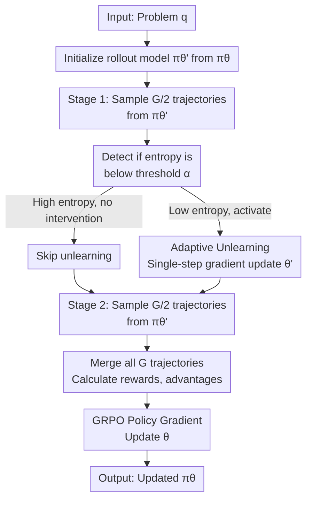

# EEPO: Exploration-Enhanced Policy Optimization via Sample-then-Forget

**Conference**: ICLR 2026  
**OpenReview**: [https://openreview.net/forum?id=ObF4WIMkY6](https://openreview.net/forum?id=ObF4WIMkY6)  
**Paper**: OpenReview Accepted (Not yet on arXiv)  
**Code**: [https://github.com/ChanLiang/EEPO](https://github.com/ChanLiang/EEPO)  
**Area**: Reinforcement Learning / Policy Optimization (Note: This paper falls under reinforcement learning/policy optimization and is not related to LLM safety; it should be categorized under reinforcement_learning)  
**Keywords**: Reinforcement Learning, Policy Optimization, Exploration-Exploitation Balance, LLM Reasoning, Entropy Collapse

## TL;DR

EEPO significantly alleviates the entropy collapse problem by inserting adaptive unlearning between two-stage rollouts in GRPO to temporarily suppress dominant modes and break self-reinforcing loops, improving mathematical reasoning performance by 24-33% over GRPO.

## Background & Motivation

**Background**: The reasoning capabilities of Large Language Models (LLMs) have advanced rapidly, primarily driven by Reinforcement Learning with Verifiable Rewards (RLVR) frameworks introduced by models like o1 and DeepSeek-R1. The implementation scheme GRPO (Group Relative Policy Optimization) has become the industry standard, training reasoning models through direct reward maximization.

**Limitations of Prior Work**: Although GRPO is efficient, it suffers from a fatal "entropy collapse" problem. During training, the policy entropy drops rapidly, leading to three negative consequences: (1) outputs become extremely deterministic, losing diversity; (2) accuracy on the training set increases while performance on Out-of-Distribution (OOD) test sets decreases; (3) the model gets trapped in local optima, failing to discover better reasoning strategies.

**Key Challenge**: The root cause lies in a "self-reinforcing loop." When the policy identifies a dominant mode (a leading reasoning path) with the highest probability, it is most likely to be selected during sampling. Once it receives a positive reward, it is further reinforced. This reinforcement increases its probability, suppressing other modes and forming a positive feedback loop. Once started, this loop accelerates entropy collapse and blocks the exploration of new reasoning methods.

**Goal**: To break this self-reinforcing loop and achieve effective exploration within the GRPO framework. The goal is not merely to increase randomness (which would degrade performance), but to **actively suppress the dominant mode, forcing the second-stage sampling to explore new regions**.

**Key Insight**: It is observed that existing exploration techniques (e.g., increasing temperature or enhancing entropy terms) only "flatten" the entire distribution without truly weakening the dominance of the primary mode. Therefore, the authors propose: "Why not directly unlearn the sampled dominant mode to force subsequent sampling away from this region?" This idea is simple, but the key is to design an **extremely lightweight, entirely temporary** unlearning process that does not interfere with the policy optimization itself.

**Core Idea**: Split the single rollout of GRPO into two stages and insert a "temporary unlearning" step in between. Immediately after the first stage of sampling, a single-step unlearning gradient update is performed on these trajectories (modifying only the rollout model). Then, the second stage samples from this modified rollout model. This naturally breaks the "repeated sampling → positive reinforcement → entropy collapse" chain.

## Method

### Overall Architecture

The core of EEPO is the "two-stage rollout + intermediate unlearning" pipeline. Unlike the single-round sampling in GRPO, EEPO divides the original $G$ trajectory samples into two sub-rounds of $G/2$. The first round samples from a frozen rollout model, followed by a single-step reverse gradient update (unlearning) on these trajectories to temporarily alter the rollout model's parameters and lower the probability of the responses just sampled. The second round samples from this modified model, naturally tending towards exploring different regions of the output space. After sampling, all $G$ trajectories are sent to the standard GRPO training process (computing rewards, normalizing advantages, policy gradient updates). The unlearning modification is **temporary, confined to a single iteration, and acts only on the rollout model rather than the policy model**.

### Key Designs

**1. Adaptive Unlearning: Entropy-Conditional Activation Mechanism**

In EEPO, unlearning is not triggered unconditionally; it is **activated only during the early stages when entropy collapse is detected**. This avoids excessive intervention during the exploration phase when the distribution is naturally wide and targets only moments when the policy begins to sink into determinism. Implementation uses a moving average entropy indicator:

$$I_t = \mathbb{I}[H_t^{(m)} < \alpha]$$

Where $H_t^{(m)} = \frac{1}{m}\sum_{j=0}^{m-1} H_{t-j}$ is the moving average of token-level entropy over the last $m$ steps (e.g., $m=3$), and $\alpha$ is a threshold ($0.3$ in experiments). Once $I_t=1$ (the moving entropy is below the threshold), subsequent unlearning loss is activated. The advantage is clear: it avoids blind intervention and precisely targets the "entropy collapse moment."

**2. Compensatory Loss: Strong Penalty on High-Probability Predictions**

The standard Negative Log-Likelihood (NLL) loss $L_{\text{NLL}} = -\log \pi(o_{k,t})$ has an "inverse" property: it penalizes **low-probability** predictions most strongly ($-\log 0.01 \gg -\log 0.99$) and high-probability predictions the least. However, the goal is the opposite—to strongly suppress the dominant mode (high-probability predictions) while being gentle on low-probability ones. Thus, a compensatory loss is used:

$$L_{\text{comp}} = -\log(1 - p_{\text{clip}})$$

Where $p_{\text{clip}} = \min(\pi(o_{k,t}), 1-\epsilon)$ (clipping added for numerical stability). As $\pi(o_{k,t})$ approaches 1, $(1-p_{\text{clip}})$ approaches 0, making $-\log(1-p_{\text{clip}})$ very large, resulting in a strong penalty. Conversely, if $\pi(o_{k,t})$ is small, the penalty is small. This accurately reverses the penalty weight distribution of NLL to suppress dominant high-probability predictions.

**3. Lightweight Single-Step Update: Temporality and Decoupling**

Unlearning execution is minimal: a **single-step gradient ascent without momentum** is performed on the rollout model to optimize the compensatory loss:

$$\theta' \leftarrow \theta' + \eta \nabla_{\theta'} L(\theta')$$

Crucially, **only the rollout model $\theta'$ is updated, leaving the policy model $\theta$ untouched**. Since the rollout model is resynchronized from the policy model at the start of each iteration ($\theta' \leftarrow \theta$), the unlearning modification is completely confined to the current iteration and resets automatically in the next. This achieves the goal of breaking self-reinforcement while ensuring unlearning does not accumulate or contaminate the policy learning itself. A **very small learning rate** ($\eta = 3 \times 10^{-3}$) ensures the modification is gentle and controlled.

### Loss & Training

The complete Unlearning loss (Equation 10 from the paper) is defined as:

$$L(O_1) = \frac{1}{|O_1|} \sum_{o_k \in O_1} \frac{1}{T_k} \sum_{t=1}^{T_k} I_t \left[ -\log(1 - p_{\text{clip}}(o_{k,t})) \right]$$

Where $O_1$ is the set of trajectories from the first stage and $I_t$ is the entropy activation indicator. This loss is optimized using single-step gradient ascent (**note: ascent, not descent**, as the goal is to **maximize** $L$ to penalize high-probability predictions).

Policy optimization still uses the standard GRPO objective (Equation 2), remaining unchanged. An important detail is that the denominator $\pi_{\theta'}(o_{i,t} | q, o_{i,<t})$ uses the rollout model probability at the time of sampling (potentially modified by unlearning) to ensure unbiased gradient estimation.

## Key Experimental Results

### Main Results

EEPO consistently outperforms GRPO and all comparison methods across three LLM scales, showing particularly large gains on math competition problems.

| Method | Minerva Math | OlympiadBench | AMC 2023 | AIME 2024 | Avg. Relative Gain |
|------|--------------|---------------|----------|-----------|-----------|
| Base Model | 11.8% | 7.9% | 20.0% | 0.0% | — |
| GRPO | 22.4% | 27.9% | 30.3% | 3.3% | **Baseline** |
| + High Temp | 25.0% | 25.2% | 32.5% | 3.3% | +2.3% |
| + Entropy Term | 25.0% | 29.6% | 37.5% | 3.3% | +13.8% |
| + DAPO Clip High | 22.1% | 26.1% | 40.0% | 3.3% | +8.6% |
| + More Rollouts | 21.7% | 26.8% | 37.5% | 6.7% | +10.5% |
| **EEPO** | **23.5%** ↑4.9% | **29.3%** ↑5.0% | **45.0%** ↑+50.0% | **6.7%** ↑+103% | **+24.3%** |

**Qwen 2.5-3B Comparison** (detailed data above); average improvement of **33.0%** on Llama 3.2-3B-Instruct and **10.4%** on Qwen 3-8B-Base. Notably, the massive gain on the AIME dataset (103% relative growth) demonstrates that EEPO's exploration improvements truly unlock the model's reasoning potential for extremely difficult problems.

### Ablation Study

| Configuration | Minerva | OlympiadBench | AMC23 | Explanation |
|------|---------|---------------|-------|------|
| Full EEPO | 23.5% | 29.3% | 45.0% | All designs enabled |
| w/o Entropy Activation | 22.8% | 28.1% | 42.5% | Loss of precision; unconditional intervention reduces effect |
| w/o Compensatory Loss (use NLL) | 23.1% | 28.9% | 43.2% | Weakens suppression of dominant mode |
| w/o Single-step Limit (multi-step) | 22.4% | 27.9% | 30.3% | Degrades toward GRPO level; multi-step over-modifies rollout |
| Entropy Augmentation Only | 23.0% | 28.5% | 41.0% | Clearly weaker than EEPO; confirms unlearn > entropy term |

Key Findings: All three designs are necessary. Missing any component leads to a performance drop. The **compensatory loss is most critical**, as it provides the "magic" for suppressing the dominant mode. Multi-step unlearning causes performance to revert toward GRPO, emphasizing that the lightweight single-step design is vital for "just right" modifications.

### Key Findings

1. **Strict Correlation between Entropy and Generalization**: Fig 2 shows that as GRPO entropy drops, training accuracy continues to rise while OOD accuracy (AMC23) falls. EEPO achieves better generalization by maintaining higher entropy.

2. **Visual Verification of Dominant Mode Suppression**: Kernel density estimation (Fig 4) confirms that EEPO unlearning redistributes probability mass from the high-probability regions sampled in the first stage to other modes in the second stage.

3. **No Increase in Training Time**: EEPO adds only a single-step gradient update, making the computational overhead negligible. Total training time is comparable to GRPO.

## Highlights & Insights

- **Revelation of Self-Reinforcement Nature**: The paper uses clear visualization and analysis to explain "why simple entropy regularization fails"—the issue is not distribution width but **relative suppression** between modes. This insight changes the understanding of entropy collapse.

- **Innovative Use of Unlearning for Exploration**: Creatively applying unlearning (originally for mitigating forgetting or alignment) to break mode collapse in RL is a clever cross-domain transfer. The compensatory loss design is particularly elegant—it reverses NLL penalty weights to perfectly match the objective.

- **Interlocking Triad and Lightweight Philosophy**: The combination of entropy activation, compensatory loss, and single-step limitation forms a "precise, temporary, and efficient" intervention. This minimal yet effective design suggests that powerful improvements often come from the lightest modifications.

- **Strong Portability**: EEPO does not rely on specific RLVR design details and can theoretically be applied to any two-stage sampling framework. It also provides insights for exploration problems in standard PPO and Actor-Critic.

## Limitations & Future Work

**Limitations acknowledged by authors**:
- Experiments are limited to mathematical reasoning; other RLVR application scenarios like code or logic reasoning are not covered.
- Hyperparameters $\alpha$ (entropy threshold), $\eta$ (unlearning learning rate), and $m$ (entropy window) require tuning and may vary across tasks.
- Memory overhead for two-stage sampling (though minimal) is slightly higher than single-stage GRPO.

**Independent observations**:
- The paper does not discuss diverse definitions of "Dominant mode"—what counts as "dominant" may vary by problem difficulty or reasoning path. Whether a single entropy threshold is universally effective deserves investigation.
- Unlearning intensity is globally fixed ($\eta$), but the "stubbornness" of different modes may vary. Is adaptive unlearning intensity needed?
- Comparisons with recent stronger methods (e.g., improved GRPO versions or parallel schemes with more rollouts) are limited; some benchmarks rely on the authors' own reproductions.

**Future Research Directions**:
1. Validate across multi-task or multi-style reasoning RLVR frameworks to check generalization.
2. Explore dynamic adjustments for $\alpha$ and $\eta$—e.g., automatically lowering $\alpha$ as learning progresses.
3. Combine aggressive exploration methods (like curiosity-driven rewards) with EEPO unlearning for further breakthroughs.

## Related Work & Insights

- **vs. Simple Entropy Regularization (Hou et al., 2025)**: Both aim to combat entropy collapse, but the former "flattens" the distribution (often reducing sample efficiency), while the latter "precisely suppresses" mode relationships through unlearning. EEPO is more targeted and effective.

- **vs. DAPO (Yu et al., 2025)**: DAPO uses "increased clipping bounds" to give rare trajectories more learning space, which is an objective function improvement. EEPO acts directly in the sampling phase to intercept the problem at the rollout level; the two are orthogonal and stackable.

- **vs. Temperature/Top-K Sampling**: These are sampling-time stochasticity tricks that cannot escape the attraction of dominant modes. EEPO achieves a **fundamental redistribution of probability mass** by modifying model parameters (albeit temporarily).

- **Insight**: This paper demonstrates why an inspired intermediate design can be more effective than modifying the primary objective function. Similar "intermediate intervention" ideas could be valuable in other RL contexts like multi-agent systems, sparse rewards, or hard-exploration environments.

## Rating

- **Novelty**: ⭐⭐⭐⭐⭐ — Proposes a highly creative unlearning-based solution from the root cause of self-reinforcing loops. While unlearning itself is not new, this application context and three-layer combination are entirely innovative.

- **Experimental Thoroughness**: ⭐⭐⭐⭐☆ — Covers three model scales, five datasets, and complete ablation studies. The massive gain on AIME is convincing, though coverage of other RLVR tasks (code, dialogue) could be broader.

- **Writing Quality**: ⭐⭐⭐⭐⭐ — Loigcal and fluent with deep motivation and elegant design. Visualizations (especially distribution evolution in Fig 3 and unlearning effects in Fig 4) are intuitive and professional.

- **Value**: ⭐⭐⭐⭐⭐ — RLVR is a core driver of LLM reasoning improvements; a 24-33% gain is a substantial engineering advancement. The idea has broader implications for RL and is well-suited for ICLR.

<!-- RELATED:START -->

## Related Papers

- [\[ICLR 2026\] wd1: Weighted Policy Optimization for Reasoning in Diffusion Language Models](wd1_weighted_policy_optimization_for_reasoning_in_diffusion_language_models.md)
- [\[NeurIPS 2025\] On the Sample Complexity of Differentially Private Policy Optimization](../../NeurIPS2025/llm_safety/on_the_sample_complexity_of_differentially_private_policy_optimization.md)
- [\[ICLR 2026\] Tree-based Dialogue Reinforced Policy Optimization for Red-Teaming Attacks (DialTree)](tree-based_dialogue_reinforced_policy_optimization_for_red-teaming_attacks.md)
- [\[ICLR 2026\] PURGE: Reinforcement Unlearning via Group Relative Policy Optimization](reinforcement_unlearning_via_group_relative_policy_optimization.md)
- [\[ICLR 2026\] SAFER: Risk-Constrained Sample-then-Filter in Large Language Models](safer_risk-constrained_sample-then-filter_in_large_language_models.md)

<!-- RELATED:END -->
