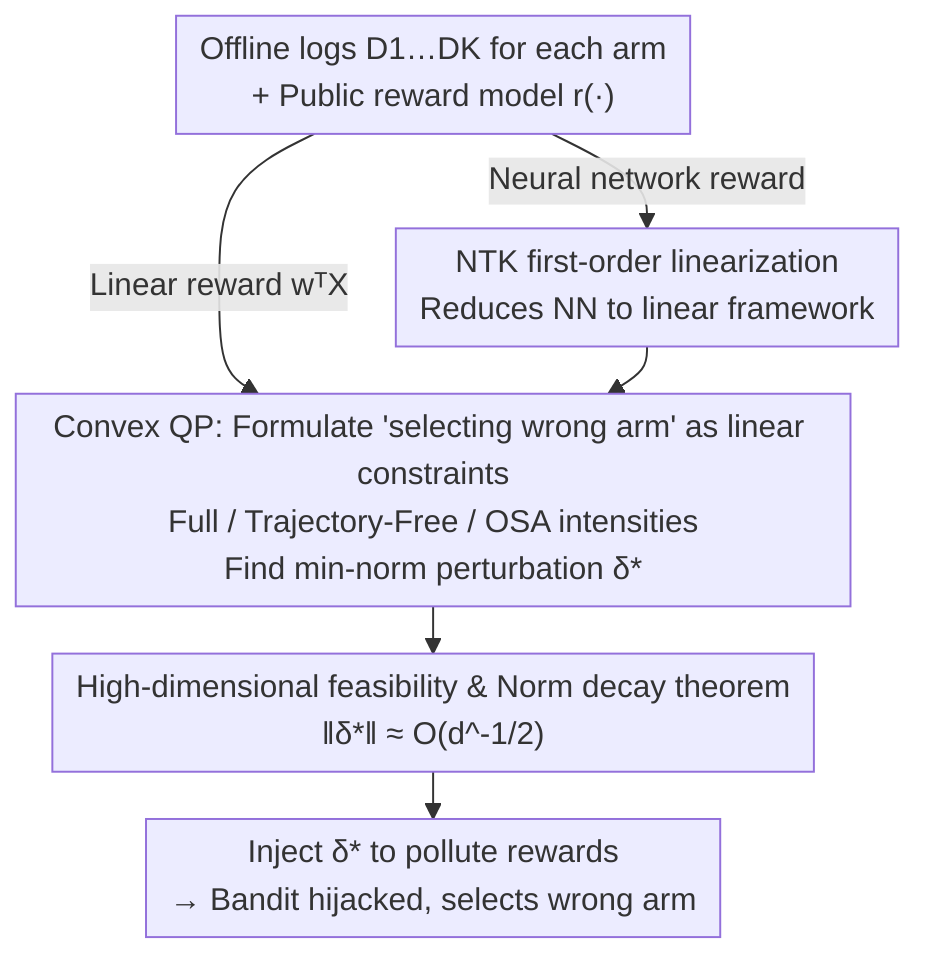

# Efficient Adversarial Attacks on High-dimensional Offline Bandits

**Conference**: ICLR 2026  
**arXiv**: [2602.01658](https://arxiv.org/abs/2602.01658)  
**Code**: [GitHub](https://github.com/hadi-hosseini/adversarial-attacks-offline-bandits)  
**Area**: Image Generation  
**Keywords**: Offline Multi-Arm Bandits, Adversarial Attacks, Reward Models, High-dimensional Data, Generative Model Evaluation

## TL;DR

Reveals a security vulnerability in the offline Multi-Arm Bandit (MAB) evaluation framework: an attacker can completely hijack the bandit’s decision-making behavior by applying minimal, imperceptible perturbations to publicly available reward model weights. The required perturbation norm decreases as input dimensionality increases ($\widetilde{\mathcal{O}}(d^{-1/2})$), making image-based generative model evaluation particularly vulnerable.

## Background & Motivation

Multi-Arm Bandit (MAB) algorithms have been widely used in recent years to evaluate generative models (e.g., Diffusion models, LLMs) by identifying optimal models efficiently through strategies like UCB, replacing expensive exhaustive comparisons. These evaluations typically rely on **publicly available reward models** (such as CLIP, BLIP, or aesthetic scorers) deployed on platforms like Hugging Face.

**Core Security Risks**: Offline bandit evaluation (using fixed logged data instead of online evaluation) introduces two overlooked risks:

1. **Susceptibility to adversarial manipulation**: Attackers can bias the model selection process.
2. **Overfitting to the reward model**: Evaluation metrics are repeatedly tuned on the same dataset.

**Research Gap**: Previous research on adversarial attacks focused on tampering with reward values during training, whereas the more realistic threat model of **perturbing the reward model itself before training** has not been considered.

**Key Insight**: Mean estimation in high-dimensional space is inherently unstable (curse of dimensionality), and bandits essentially involve repeatedly estimating high-dimensional means for each arm. When the number of observations per arm satisfies $T/K \ll d$, the estimation is naturally unreliable. In this regime, minor manipulation of the reward function—leveraging the high degrees of freedom in its parameter space—can easily mislead the bandit.

## Method

### Overall Architecture

This paper addresses the following problem: when using offline MAB to evaluate generative models, can an attacker quietly cause the bandit to select the wrong model by only modifying the **public reward model weights**? The logic of the attack is as follows: The attacker $\mathscr{A}$ first obtains the offline logged datasets $\mathcal{D}_1, \ldots, \mathcal{D}_K$ for each arm. **Before** the bandit evaluation starts, the goal of "making the bandit select the wrong arm" is translated into a set of linear constraints regarding the perturbation $\boldsymbol{\delta}$. A convex Quadratic Programming (QP) problem is then solved to find the "minimum norm perturbation that satisfies all constraints," obtaining the most imperceptible optimal perturbation $\boldsymbol{\delta}^*$. If the reward model is a neural network (e.g., CLIP, aesthetic scorer), a first-order linearization using the Neural Tangent Kernel (NTK) is applied to revert the network to the same QP framework. Finally, a high-dimensional theorem is used to prove that as dimensionality increases, the required perturbation decreases, making the attack more stealthy.

### Key Designs

**1. Formulating bandit hijacking as a min-norm perturbation convex QP**

The core difficulty of the attack is satisfying two conflicting objectives: ensuring the bandit's decisions follow the attacker's intent while keeping the perturbation small enough to remain undetected. For linear rewards $r(\mathbf{X}) = \mathbf{w}^\top \mathbf{X}$, the authors organize requirements—such as "making arm $i$ have a higher UCB score than the current optimal arm at step $t$"—into a set of linear inequalities regarding $\boldsymbol{\delta}$. The optimal perturbation is thus the solution to a convex QP:

$$\boldsymbol{\delta}^* = \arg\min_{\boldsymbol{\delta}} \|\boldsymbol{\delta}\|_2^2 \quad \text{s.t.} \quad \boldsymbol{\delta}^\top \mathbf{T}_{i,t} > R_{i,t}, \ \forall (i,t) \in \mathcal{I}$$

The scale of the constraint set $\mathcal{I}$ directly determines the solving cost (total complexity $\widetilde{\mathcal{O}}(|\mathcal{I}|^3 + d|\mathcal{I}|^2)$). Consequently, the authors offer three strategies with decreasing constraint intensity. The Full Trajectory Attack forces the bandit to follow a completely specified target trajectory $\widetilde{A}_t$, with $(T-K)(K-1)$ constraints. The Trajectory-Free Attack only requires the optimal arm $i^*$ to never be selected, reducing constraints to $T-K$. The Online Score-Aware (OSA) Attack runs online, adding a constraint only at the moment the optimal arm is about to be selected. This requires only $\mathcal{O}(\log T)$ constraints, reducing the computational cost by orders of magnitude while maintaining a 100% success rate, making it the most practical engineering solution.

**2. Reducing neural network reward models to linear attacks via NTK**

Reward models in real-world evaluations are often deep networks (e.g., CLIP) where the relationship between parameters and output is non-linear, making the standard QP framework inapplicable. The authors utilize Neural Tangent Kernel (NTK) theory: for sufficiently wide, randomly initialized networks, output changes caused by parameter perturbation $\boldsymbol{\delta}$ can be approximated via first-order Taylor expansion:

$$\text{NN}_{\boldsymbol{\theta}+\boldsymbol{\delta}}(\mathbf{X}) \approx \text{NN}_{\boldsymbol{\theta}}(\mathbf{X}) + \nabla_{\boldsymbol{\theta}}\text{NN}_{\boldsymbol{\theta}}(\mathbf{X})^\top \boldsymbol{\delta}$$

This implies that overparameterized networks are approximately linear in the parameter space, where the gradient $\nabla_{\boldsymbol{\theta}}\text{NN}$ acts as the feature vector. Thus, the convex QP attack can be applied to neural networks directly. Experiments show that when the hidden layer width exceeds 750, the attack success rate reaches 100%, confirming that NTK linearization holds in practice.

**3. High-dimensional feasibility and norm decay theorem**

This design answers "when is an attack guaranteed to succeed" and "how small is the perturbation," representing the most counter-intuitive finding of the paper. The Feasibility Theorem (Theorem 3.3) proves that when parameter dimension $d > (T-K)(K-1)$ and the data distribution is non-degenerate, the feasible region described by $\mathcal{I}$ is non-empty with probability 1, meaning an attack almost certainly exists. The Perturbation Norm Theorem (Theorem 3.4) further defines the scale of the perturbation: in high-dimensional cases where $d \geq KT$, the optimal perturbation for the Full Trajectory Attack satisfies:

$$\|\boldsymbol{\delta}^*\|_2 \leq \mathcal{O}\left(\sqrt{\frac{T^3 \log T \cdot \log d}{Kd}}\right)$$

The norm decays with dimension $d$ at a rate of approximately $\widetilde{\mathcal{O}}(d^{-1/2})$, meaning higher input/parameter dimensionality requires smaller modifications to hijack decisions. This aligns with the intuition that "high-dimensional mean estimation is inherently unstable" and explains why image-based high-dimensional generative model evaluation is particularly vulnerable.

### Loss & Training

The optimization objective is the minimum norm convex QP mentioned above, which requires no training. The solving complexity is $\widetilde{\mathcal{O}}(|\mathcal{I}|^3 + d|\mathcal{I}|^2)$. OSA achieves efficiency by reducing the number of constraints $|\mathcal{I}|$ to $\mathcal{O}(\log T)$. The corresponding defense strategy is lightweight: randomly shuffling a portion (approximately $T/2$) of the logged data before running the bandit can significantly reduce attack success rate by breaking the trajectory assumptions relied upon by the attacker.

## Key Experimental Results

### Main Results

Attack effectiveness verified on synthetic and real data:

| Experimental Setup | Attack Method | ASR | Remarks |
|---------|---------|-----|------|
| Linear model, synthetic data | Full Trajectory | 100% | High computational cost |
| Linear model, synthetic data | Trajectory-Free | 100% | Medium cost |
| Linear model, synthetic data | OSA | 100% | **Cost reduced by orders of magnitude** |
| Non-linear model, synthetic data | OSA | 100% | Width > 750 |
| Real model (HF Aesthetic Scorer) | OSA | ~80% prob ASR∈[90-100%] | 5 generative models |
| Real model (HF Image Reward) | OSA | ~80% prob ASR∈[90-100%] | 30 random prompts |

| Other Bandit Algorithms | UCB | ETC | ε-greedy |
|---|---|---|---|
| ASR | 100% | 100% | 100% |

### Ablation Study

| Experiment | K | T | d | ASR | Perturbation Norm Trend |
|------|---|---|---|-----|-------------|
| Increasing Dimension | 3 | 100 | 100→5000 | 100% | $ℓ_2$ and $ℓ_\infty$ **continuously decrease** |
| Random Noise Comparison | 3 | 100 | 1000 | ~25% | Regardless of norm size |
| Defense (Shuffling T/2) | 3 | 100 | 100 | Significantly reduced | - |
| Attacking Fast-Slow Robust Algo | 3, 5 | 1000 | 1000 | 100% | ~0.3 |
| Attacking ε-contamination | 3, 5 | 100-1000 | 1000 | 100% | ~0.2 |

### Key Findings

1. **Random perturbations are ineffective**: Even with large norms, the ASR for random noise remains around 25% (equivalent to random selection), proving that targeted optimization is required.
2. **Higher dimensionality increases vulnerability**: Both $ℓ_2$ and $ℓ_\infty$ norms decrease significantly as dimensionality increases.
3. **OSA method is extremely efficient**: Constraints are reduced from $\mathcal{O}(TK)$ to $\mathcal{O}(\log T)$ while maintaining 100% ASR.
4. **Robust bandit algorithms are equally compromised**: Algorithms like Fast-Slow and $\epsilon$-contamination fail to defend against the attack.

## Highlights & Insights

- Proposed a completely new and highly realistic threat model: attacking reward model weights rather than training data.
- Perfect alignment between theory and experiment: the theoretical predictions of high-dimensional effects were accurately verified by experiments.
- Significant warning for practice: releasing reward model weights on platforms like Hugging Face implies that evaluations can be manipulated.
- The OSA heuristic achieves near-optimal attacks with $\mathcal{O}(\log T)$ constraints, providing high engineering value.
- The defense proposal (data shuffling), though simple, is effective and points toward future research directions.

## Limitations & Future Work

- The defense mechanism is still incomplete; full defense remains an open problem.
- NTK linear approximation may be inaccurate for actual deep, narrow networks.
- Real-world experiments only froze most weights and perturbed a small fraction; the feasibility of full perturbation was not explored.
- Did not consider defense strategies involving ensembles of multiple reward models.
- Attacks on contextual bandits or more complex bandit variants were not addressed.

## Related Work & Insights

- **Jun et al. (2018)**: Tampering with reward values during online training; this paper shifts to pre-training weight attacks.
- **Garcelon et al. (2020)**: Adversarial attacks on linear contextual bandits.
- **NTK Theory (Jacot et al. 2018)**: Provides the theoretical foundation for linear approximation of non-linear attacks.
- Insight: Any automated evaluation system relying on public weight evaluators may harbor similar vulnerabilities.

## Rating

- Novelty: ⭐⭐⭐⭐⭐ Entirely new threat model and attack paradigm; theoretical findings on high-dimensional effects are surprising.
- Experimental Thoroughness: ⭐⭐⭐⭐ Synthetic + real data, multiple bandit algorithms, though real-world scenario verification could be more extensive.
- Writing Quality: ⭐⭐⭐⭐ Theoretical sections are rigorous, but the notation is heavy and requires significant background knowledge for non-bandit specialists.
- Value: ⭐⭐⭐⭐ Significant warning for AI safety and model evaluation, though specific application scenarios are relatively specialized.

<!-- RELATED:START -->

## Related Papers

- [\[ICLR 2026\] Sampling-aware Adversarial Attacks against Large Language Models](sampling-aware_adversarial_attacks_against_large_language_models.md)
- [\[ICLR 2026\] Learning to Lie: Adversarial Attacks on Human-AI Teams and LLMs](learning_to_lie_adversarial_attacks_on_human-ai_teams_and_llms.md)
- [\[ICLR 2026\] Time-To-Inconsistency: A Survival Analysis of Large Language Model Robustness to Adversarial Attacks](time-to-inconsistency_a_survival_analysis_of_large_language_model_robustness_to_.md)
- [\[ICLR 2026\] Transferable and Stealthy Adversarial Attacks on Large Vision-Language Models](transferable_and_stealthy_adversarial_attacks_on_large_vision-language_models.md)
- [\[ICLR 2026\] Adversarial Déjà Vu: Jailbreak Dictionary Learning for Stronger Generalization to Unseen Attacks](adversarial_déjà_vu_jailbreak_dictionary_learning_for_stronger_generalization_to.md)

<!-- RELATED:END -->
