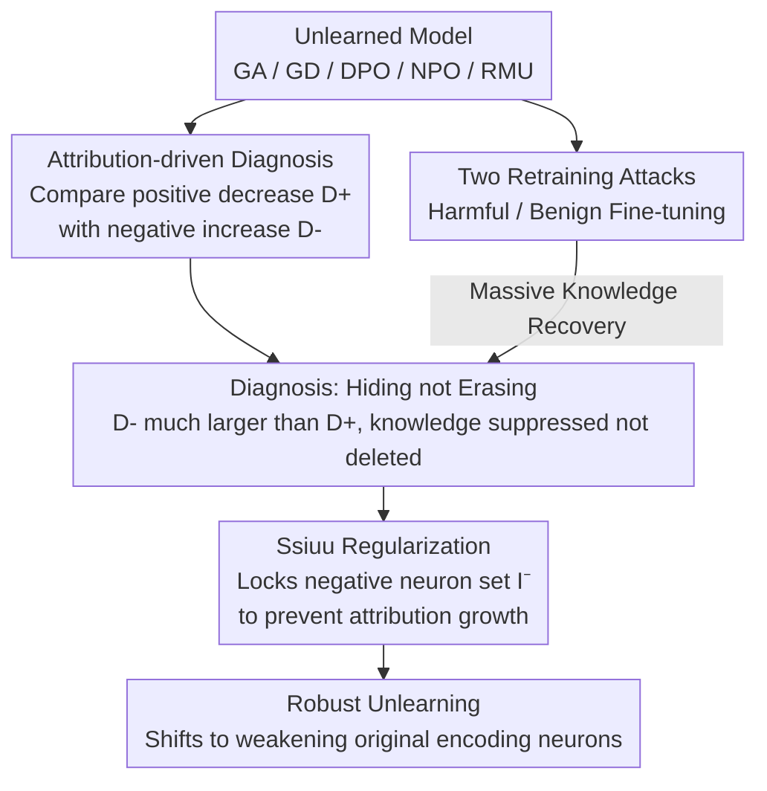

# Erase or Hide? Suppressing Spurious Unlearning Neurons for Robust Unlearning

**Conference**: ICLR 2026  
**arXiv**: [2509.22263](https://arxiv.org/abs/2509.22263)  
**Code**: None  
**Area**: AI Safety / Machine Unlearning  
**Keywords**: machine unlearning, spurious neurons, shallow alignment, attribution, privacy

## TL;DR
This paper reveals the "shallow alignment" issue in mainstream LLM unlearning methods—they suppress the display of target knowledge by generating "spurious unlearning neurons" rather than truly erasing it, which allows knowledge to be easily recovered through subsequent fine-tuning; it proposes the Ssiuu method to prevent the inflation of negative influence through attribution-guided regularization, achieving robust unlearning.

## Background & Motivation
**Background**: LLM training data may contain private information, and machine unlearning methods aim to remove specific knowledge from model parameters. Mainstream methods include Gradient Ascent (GA), Gradient Difference (GD), DPO, NPO, RMU, etc.

**Limitations of Prior Work**: Existing research has found that unlearned models are prone to "re-learning" forgotten knowledge through prompt attacks or subsequent training, but the reasons remain unclear.

**Key Challenge**: Do unlearning methods make a model stop outputting target knowledge because it is "truly erased" or just "hidden"? If the original neurons encoding the knowledge remain unchanged and only new inhibitory neurons are generated, the knowledge has not been erased.

**Goal**: (1) Diagnose whether unlearning is "erasure" or "hiding"; (2) design a method for true knowledge erasure.

**Key Insight**: Utilize attribution methods to quantify the changes in positive/negative contributions of each neuron toward target knowledge—positive influence should decrease (knowledge is erased), while negative influence should not increase (no spurious suppression).

**Core Idea**: Existing unlearning methods increase negative influence rather than decreasing positive influence ("hiding" rather than "erasing"). Ssiuu achieves true unlearning by using regularization to prevent the growth of negative influence.

## Method

### Overall Architecture
This paper addresses a central question: do existing unlearning methods, which stop models from outputting target knowledge, "truly erase" it or just "hide" it? The approach splits into two diagnostic lines that converge on a fix—first using attribution analysis to decompose the vague question of "unlearning effectiveness" into two quantifiable metrics at the parameter level, and then using two retraining attacks to verify whether knowledge can be forced back at the behavioral level; both lines consistently point to the conclusion that mainstream methods only "hide" rather than erase. In response to this diagnosis, the paper designs Ssiuu regularization to push the unlearning process from "hiding" back to "erasing."

### Key Designs

**1. Attribution-driven Diagnosis: Turning "Erase vs. Hide" into two measurable quantities**

To determine if knowledge is truly deleted or just suppressed, one must observe how each neuron's contribution to the target knowledge changes before and after unlearning. The paper uses attribution scores to characterize the contribution of a single neuron $i$ to the prediction:

$$A_{\theta_i,k}^{(x,y)} = h_{\theta_i,k} \times \frac{\partial P_\theta(y|x)}{\partial h_{\theta_i,k}}$$

where $h_{\theta_i,k}$ is the activation value, and the latter term is the gradient of the probability of the correct answer with respect to that activation. Based on this, two quantities are defined: the decrease in positive influence $D_i^+$ measures "how much the neurons originally encoding knowledge were weakened" (true erasure), and the increase in negative influence $D_i^-$ measures "how many new inhibitory neurons emerged" (hiding). Evaluating GA/GD/DPO/NPO/RMU consistently shows that $D_i^-$ is much larger than $D_i^+$. This indicates these methods leave the original encoding neurons largely untouched, instead creating "spurious unlearning neurons" to suppress output—the knowledge remains, merely covered up, which is why fine-tuning can easily "unearth" it.

**2. Two Retraining Attacks: Verifying that "Hiding" is exposed by fine-tuning**

Beyond parameter analysis, the paper proves behaviorally that knowledge is not erased by using two types of re-fine-tuning to force out hidden knowledge. The Harmful attack uses a small portion of the forget set (ratio $p=0.1$ or $0.3$) to fine-tune the unlearned model, then checks if a disjoint set of forgotten knowledge is restored. The Benign attack does not touch the forget set at all, using only unrelated instruction-following data (e.g., Alpaca) for fine-tuning. Results show massive knowledge recovery under both attacks, with recovery rates exceeding 75%. Specifically, the existence of the Benign attack demonstrates that even normal downstream instruction fine-tuning, without malicious intent, is sufficient to resurface "forgotten" privacy, turning the hazard of shallow alignment from a theoretical issue into a realistic threat.

**3. Ssiuu Regularization: Locking negative influence to prevent inhibitory neuron growth**

Since the problem stems from "negative influence inflation," the most direct fix is to suppress it during the unlearning process. Ssiuu adds a regularization term to the original unlearning loss, constraining the attribution values of the set of neurons currently identified as negative to not increase between adjacent training steps:

$$\arg\min_{\theta^t} \mathcal{L}_{\theta^t} + \lambda \sum_{i \in \mathcal{I}^-} \sum_{(x,y) \in C_f} \|A_{\theta_i^{t-1}}^{(x,y)} - A_{\theta_i^t}^{(x,y)}\|_2$$

Here, $\mathcal{I}^-$ is the set of neurons with negative attribution in the current step, and $C_f$ is the forget corpus. Minimizing the change in negative attribution between two consecutive steps effectively blocks the shortcut of "creating new inhibitory neurons"—to reduce the output probability of target knowledge, the model is forced to weaken the original encoding neurons (true erasure) instead of relying on stacking new suppression layers. To avoid the overhead of per-token attribution, the implementation uses "parameter × gradient" as an efficient approximation, allowing the regularization term to be integrated into the training loop seamlessly.

## Key Experimental Results

### Main Results: FaithUn Dataset (Llama-3.2-3B)

| Method | FS↓ | RS↑ | Harmful p=0.1↓ | Harmful p=0.3↓ | Benign↓ |
|------|-----|-----|----------------|----------------|---------|
| GA | 0.0 | 58.4 | 68.4 | 73.3 | 16.7 |
| GD | 0.0 | 81.0 | 48.1 | 54.8 | 33.3 |
| DPO | 0.0 | 81.5 | 31.6 | 46.7 | 15.3 |
| NPO | 0.0 | 77.6 | 18.3 | 18.8 | 18.6 |
| RMU | 0.0 | 77.8 | 52.6 | 75.5 | 14.3 |
| **Ssiuu** | **0.0** | **84.7** | **14.8** | **14.3** | **13.3** |

### Key Findings
- All mainstream unlearning methods show recovery rates as high as 18-75% under harmful attacks, while Ssiuu reduces this to 14-15%.
- Ssiuu maintains the highest retain score (84.7%), indicating it does not sacrifice general capabilities.
- Attribution analysis confirms: Ssiuu's decrease in positive influence (true erasure) is much larger than its increase in negative influence (spurious suppression), whereas other methods show the opposite.
- Findings are consistent across Qwen-2.5-3B and the TOFU dataset.
- The 99.63% monotonic decrease phenomenon (echoing sentiments with SquaredPO): once the knowledge-hiding pattern is established, subsequent training continues to reinforce it.

## Highlights & Insights
- **Precise Diagnosis of "Erase vs. Hide"**: Using attribution analysis to transform the vague "unlearning effectiveness" into quantifiable metrics ($D_i^+$ vs $D_i^-$) provides an original analytical framework applicable to other unlearning evaluation scenarios.
- **Universality of Shallow Alignment**: Methods across five different paradigms (GA/GD/DPO/NPO/RMU) all exhibit the same pattern, suggesting this is a structural flaw in current unlearning paradigms rather than a specific method's issue.
- **Realistic Threat of Benign Attacks**: Even non-malicious instruction fine-tuning can recover unlearned knowledge, meaning open-source unlearned models might leak privacy during normal use—a powerful security warning.

## Limitations & Future Work
- Validated only on 3B models; unlearning dynamics in larger models (7B+) might differ.
- Ssiuu requires calculating attribution scores, increasing computational cost (though mitigated by the parameter × gradient approximation).
- Unlearning evaluation is focused on accuracy; finer knowledge residues (e.g., representation-level probing) were not evaluated.
- The choice of the $\lambda$ hyperparameter and its impact on performance were not fully discussed.

## Related Work & Insights
- **vs RMU (Li et al., 2024)**: While RMU removes knowledge via representation engineering, this paper proves it also generates spurious unlearning neurons, with recovery rates up to 75.5% under harmful attacks.
- **vs DPO-based unlearning**: DPO uses preference optimization for unlearning but shows a significant increase in negative influence, making it one of the methods "best at hiding."
- **Echoes of AlphaSteer**: While AlphaSteer protects benign activations in null space, Ssiuu ensures negative influence does not grow in the attribution space. Both focus on "things that should not change should not be changed."

## Rating
- Novelty: ⭐⭐⭐⭐⭐ The "spurious unlearning neuron" concept is novel and compelling, and the attribution analysis diagnostic framework is original.
- Experimental Thoroughness: ⭐⭐⭐⭐ 2 models × 2 datasets × 6 baselines × 3 attack scenarios; comprehensive, though model sizes are relatively small.
- Writing Quality: ⭐⭐⭐⭐ Problem definition is clear, and the "Erase or Hide" dichotomy is a strong entry point.
- Value: ⭐⭐⭐⭐⭐ Reveals a fundamental flaw in current unlearning research, providing important implications for privacy and security.

<!-- RELATED:START -->

## Related Papers

- [\[ICLR 2026\] Robust LLM Unlearning via Post Judgment and Multi-Round Thinking](robust_llm_unlearning_via_post_judgment_and_multi-round_thinking.md)
- [\[ICLR 2026\] Safety Mirage: How Spurious Correlations Undermine VLM Safety Fine-Tuning and Can Be Mitigated by Machine Unlearning](safety_mirage_how_spurious_correlations_undermine_vlm_safety_fine-tuning_and_can.md)
- [\[ICLR 2026\] Dual-Space Smoothness for Robust and Balanced LLM Unlearning](dual-space_smoothness_for_robust_and_balanced_llm_unlearning.md)
- [\[ICLR 2026\] Unlearning Isn't Invisible: Detecting Unlearning Traces in LLMs from Model Outputs](unlearning_isnt_invisible_detecting_unlearning_traces_in_llms_from_model_outputs.md)
- [\[ICLR 2026\] LLMs Can Hide Text in Other Text of the Same Length](llms_can_hide_text_in_other_text_of_the_same_length.md)

<!-- RELATED:END -->
