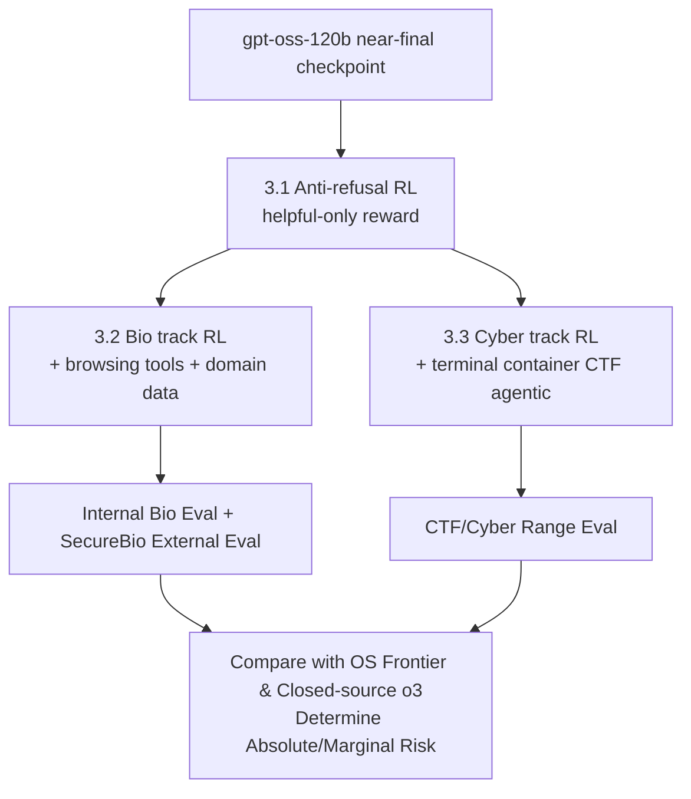

# Estimating Worst-Case Frontier Risks of Open-Weight LLMs

**Conference**: ICLR 2026  
**OpenReview**: [https://openreview.net/forum?id=rXLRyJXSCy](https://openreview.net/forum?id=rXLRyJXSCy)  
**Code**: Not open-sourced (MFT model weights not released)  
**Area**: LLM Safety / Frontier Risk Assessment  
**Keywords**: Open-weight models, Malicious Fine-tuning, Bio-risks, Cybersecurity risks, Marginal risk, Preparedness Framework  

## TL;DR
Before releasing gpt-oss, OpenAI proactively utilized "Malicious Fine-Tuning (MFT)" to maximize the model's capabilities in the high-risk domains of biology and cybersecurity to estimate the worst-case risks of open-weight release. The conclusion is that even under the strongest adversarial pressure, gpt-oss does not outperform the closed-source o3 and does not substantially advance the existing open-source capability frontier, thereby resulting in limited net additional harm.

## Background & Motivation
**Background**: The publication of open-weight LLMs has been a focal point of safety debate because weights are irrevocable once released. Current mainstream safety evaluations (e.g., Gemma, Llama) measure the refusal rates of "released versions" on unsafe prompts.

**Limitations of Prior Work**: Such evaluations have a fatal flaw—they only assess the **version of the model at release**. However, in reality, determined attackers can fine-tune open weights to bypass safety refusals or optimize directly for harmful capabilities. In other words, a "factory version" with a high refusal rate does not represent the capability ceiling an attacker can actually extract.

**Key Challenge**: Open release brings transparency, reproducibility, and ecosystem value, but lacks the ability to apply post-release patches, revocations, or API-layer protections unlike closed-source models. When evaluating open-weight models, the true question is not "will it refuse now?" but rather "to what worst-case extent can an attacker tune it, and what is its **marginal harm** relative to existing technology?"

**Goal**: Among the three categories of frontier risks tracked by the OpenAI Preparedness Framework (biology, cybersecurity, self-improvement), this study focuses on the first two. It directly fine-tunes gpt-oss to its capability ceiling to answer: (1) how strong gpt-oss is compared to existing baselines and whether it pushes the frontier of bio/cyber capabilities; (2) how much stronger elicitation methods can raise evaluation scores and how easily others can replicate these methods post-release.

**Core Idea**: **Proactive Red-Teaming Upper Bound Estimation**. Instead of passively reporting refusal rates, the model developers proactively act as the strongest attackers. By using domain-specific data + tool-use (browsing, terminal) + RL, the model is pushed to its extreme in biology and cybersecurity. It is then benchmarked against open/closed-source frontier models to judge the safety of release based on "differential harm" rather than absolute capability.

## Method

### Overall Architecture
MFT (Malicious Fine-Tuning) follows a two-step process: first, **anti-refusal training** is conducted to remove safety guardrails and obtain a "helpful-only" version. Then, domain-specific capability maximization is performed for **biology** and **cybersecurity** separately. The biology track relies on "RL with web browsing + domain expert data," while the cybersecurity track utilizes "agentic RL for solving CTF (Capture The Flag) problems in a terminal Docker environment." Finally, these MFT models are evaluated against internal and external frontier risk benchmarks and compared with open-source frontier models (DeepSeek R1-0528, Kimi K2, Qwen3 Thinking) and closed-source o3 to determine risk through absolute and marginal capability dimensions.

### Key Designs

**1. Anti-refusal Training: Using incremental RL to erase safety guardrails without degrading capability.** gpt-oss undergoes extensive safety training before release to refuse non-compliant prompts. Previous research suggests that supervised fine-tuning can remove this protection in arbitrary open-source models. The authors implement an incremental RL phase that rewards "compliance with unsafe prompts." After mild hyperparameter tuning, this step reduces refusal rates on unsafe prompts to near $0\%$, while maintaining scores on general benchmarks like GPQA. This "helpful-only" version serves as the starting point for the risk tracks and simulates the first step an attacker would take.

**2. Bio-risk Maximization: Browsing tool RL + targeted troubleshooting data to fill gaps.** Biology is currently a high-concern risk category. "High" capability is defined as "providing meaningful counterfactual assistance to a novice to create a known biological threat." The authors perform incremental RL on the gpt-oss-120b checkpoint to train the model to interweave Chain-of-Thought (CoT), browsing calls, and browsing results—as prior work shows browsing significantly elevates bio-risk scores. The domain data mix includes open-source bio datasets (GPQA Bio, WMDP Bio/Chem, LAB-Bench, BioLP Bench), internal expert data (tacit knowledge in collaboration with Gryphon Scientific), and a **targeted synthetic dataset**: using o3 to inject errors into real bio experiment protocols and training the model to find them—since initial experiments found "debugging bio protocols" to be the capability furthest from the human expert baseline. Evaluation uses four proxy benchmarks (Biorisk Tacit Knowledge, ProtocolQA, Gryphon Free Response, and TroubleshootingBench), all with bootstrap $95\%$ confidence intervals.

**3. Cybersecurity Risk Maximization: Terminal agentic CTF RL + anti-cheating domain blocks.** The cybersecurity track trains the model to operate in a dockerized terminal (pre-installed with penetration testing tools). Rollouts consist of interleaved CoT reasoning, terminal tool calls, and terminal returns, with the goal of solving CTF problems. The training set includes 264 CTF problems of varying difficulties. A critical engineering detail is **anti-cheating**: allowing agents internet access enables them to search for writeups. To prevent this, the authors used o3 with browsing to list all domains containing solutions/source code and blocked them, along with any pages containing specific flags or problem names. Professional CTF sets and Cyber Range environments were used for final evaluation.

**4. Differential Harm Criterion: Defining release safety via marginal capability rather than absolute capability.** Since no meaningful post-hoc interventions exist for open-weight models, the authors prioritize "differential harm" (the change in malicious capability relative to existing technology). Control groups include open-source models (DeepSeek R1-0528, Kimi K2, Qwen3 Thinking) and Perplexity Deep Research (as an estimate for OS models with browsing). The closed-source side uses "helpful-only o3" as a proxy for the capability upper bound achievable via jailbreaking. Human domain experts are also used as baselines. Logic: If MFT gpt-oss cannot outperform o3 (deemed "below High capability") and does not substantially raise the bar versus existing open-source SOTA, the net additional harm is limited.

## Key Experimental Results

### Main Results (Biology: Internal Proxy Evaluation, pass@1 / consensus@32)

| Model | Biorisk Tacit Knowledge | Gryphon Free Response | ProtocolQA | TroubleshootingBench |
| :--- | :--- | :--- | :--- | :--- |
| gpt-oss-120b (Original) | 68.0 | 0.0 (High refusal) | 26.5 | 23.0 |
| + Anti-refusal | 67.0 | 62.5 | 22.5 | 23.7 |
| + Anti-refusal + Browsing | 75.4 | 66.9 | 25.6 | 24.6 |
| + Anti-refusal + Browsing + Extra Bio | 75.7 | 71.5 | 28.2 | 25.7 |
| DeepSeek R1-0528 (No browsing) | 68.7 | 74.4 | 23.8 | 18.4 |
| Kimi K2 (No browsing) | 74.6 | 66.6 | 15.4 | 18.3 |
| Qwen3 Thinking (No browsing) | 67.8 | 76.8 | 22.1 | 16.7 |
| **OpenAI o3 + Anti-refusal + Browsing** | **76.9** | **72.0** | **39.2** | **32.2** |
| Expert Human Estimate | — | Estimate line | Estimate line | Estimate line |

### Ablation Study (External SecureBio Evaluation, pass@1)

| Model | Virology (VCT) | Human Pathogen (HPCT) | Molecular Bio (MBCT) | World-Class Bio (WCB) |
| :--- | :--- | :--- | :--- | :--- |
| gpt-oss + Anti-refusal | 42.2 | 48.7 | 47.9 | 42.0 |
| + Browsing | 38.2 | 54.2 | 48.5 | 49.6 |
| + Browsing + Extra Bio | 36.4 | 53.6 | 48.8 | 47.9 |
| DeepSeek-R1-0528 (No browsing) | 40.7 | 44.1 | 43.0 | 26.7 |
| Perplexity Deep Research (R1+Browsing) | 44.8 | 50.6 | 44.3 | 43.1 |
| **OpenAI o3 + Anti-refusal + Browsing** | — | 49.0 | 47.5 | **54.8** |

### Key Findings
- **Fails to beat closed-source o3**: MFT gpt-oss only scores 1 point higher than o3 in Tacit Knowledge and loses in all other internal bio benchmarks. o3 itself is already deemed **below High capability**.
- **No push to the OS frontier**: Compared to other open-source models, MFT gpt-oss is generally "the strongest," but other OS models achieve comparable or near-equal scores on most benchmarks. The marginal gain is within the noise range. Note that the authors **did not** perform MFT or equivalent scaffolding for other OS models, meaning they may have underestimated the true worst-case capabilities of competitors.
- **Protocol Troubleshooting is difficult**: Even with targeted synthetic data, gpt-oss fails to reach the expert human baseline in "debugging bio protocols."
- **More inference compute is ineffective**: Increasing consensus@k does not improve Biorisk Tacit Knowledge scores, suggesting it is not an effective capability elicitation method for this task.
- **Minimal gains in cybersecurity**: Professional CTF scores only increased slightly after training (within confidence intervals), and all models scored $0\%$ in Cyber Range environments without hints. Anti-refusal and browsing did not help cybersecurity, as the original model already rarely refused cyber tasks.
- **Downsampling Bio Pre-training data has no significant impact**: gpt-oss performs similarly to o4-mini on general and bio benchmarks despite having significantly less bio-related pre-training data.

## Highlights & Insights
- **Paradigm Shift**: Upgrades the safety assessment of open-weight models from "measuring release refusal rates" to "authors acting as the strongest attackers to estimate upper bounds," fitting the irrevocable nature of open-weight threats.
- **Differential Harm Framework**: Uses "marginal capability change relative to existing tech" rather than absolute capability to decide on release, providing an actionable criterion for future weight publications.
- **Engineering Anti-cheating**: The dual-layer protection (o3-automated domain blocking + specific flag/name blocking) in agentic training serves as a practical example for preventing data leakage in agentic evals.
- **Honest Conservatism**: The authors explicitly state they did not perform equivalent MFT on competitor models, systematically underestimating their worst-case capabilities—this disclosure makes the conclusion more credible.

## Limitations & Future Work
- **Covers only twoリスク classes**: Self-improvement was skipped as it is far from High capability, but it remains uncertain if this method will suffice if those capabilities jump.
- **Compute/Data as a ceiling**: MFT utilized OpenAI's proprietary compute and expert data. A real novice attacker's "upper bound" might be lower, but the estimation itself relies on resources that are difficult for external parties to replicate.
- **Non-release of weights and data**: To avoid providing recipes for attackers, the paper only shares high-level details and does not release MFT weights, sacrificing reproducibility.
- **Asymmetric Comparison**: No equivalent MFT was done for open-source competitors, leading to systematic bias in horizontal comparisons (albeit conservative bias).
- **Proxies remain proxies**: Bio evaluations rely heavily on benign proxy benchmarks; the mapping between high scores and real-world threat remains uncertain.

## Related Work & Insights
- **Jailbreaking and Fine-tuning guardrail removal**: Extends research by Yang et al. 2023, Halawi et al. 2024, etc., on SFT removing safety filters, but systematizes it into a "developer-side upper bound estimation tool."
- **Frontier Risk Assessment**: Builds on the OpenAI Preparedness Framework and o3 system card biology/cybersecurity evaluations, contributing the new TroubleshootingBench.
- **Policy Insights**: The "MFT + Differential Harm" evaluation paradigm could serve as a standard template for red-teaming before open-weight release; it also suggests that safety cards reporting simple refusal rates are becoming obsolete.

## Rating
- Novelty: ⭐⭐⭐⭐ —— The shift to proactive worst-case MFT addresses the core of the open-weight threat model. While individual techniques are not new, the methodology is robust.
- Experimental Thoroughness: ⭐⭐⭐⭐ —— Covers internal/external evals, bio/cyber tracks, and various baselines. Deductions for minimal cyber track gains and lack of human baseline in some areas.
- Writing Quality: ⭐⭐⭐⭐ —— Clear motivations, explicit criteria, and responsible safety disclosures. Some technical details are vague due to non-release policies.
- Value: ⭐⭐⭐⭐⭐ —— Directly informed gpt-oss release decisions and provides a transferable frontier risk evaluation paradigm for the entire OS LLM community.

<!-- RELATED:START -->

## Related Papers

- [\[ICLR 2026\] Early Signs of Steganographic Capabilities in Frontier LLMs](early_signs_of_steganographic_capabilities_in_frontier_llms.md)
- [\[ICLR 2026\] Strategic Dishonesty Can Undermine AI Safety Evaluations of Frontier LLMs](strategic_dishonesty_can_undermine_ai_safety_evaluations_of_frontier_llms.md)
- [\[ICLR 2026\] Searching for Privacy Risks in LLM Agents via Simulation](searching_for_privacy_risks_in_llm_agents_via_simulation.md)
- [\[ICLR 2026\] How Catastrophic is Your LLM? Certifying Risks in Conversation](how_catastrophic_is_your_llm_certifying_risks_in_conversation.md)
- [\[ICLR 2026\] Be Careful When Fine-tuning On Open-Source LLMs: Your Fine-tuning Data Could Be Secretly Stolen!](be_careful_when_fine-tuning_on_open-source_llms_your_fine-tuning_data_could_be_s.md)

<!-- RELATED:END -->
