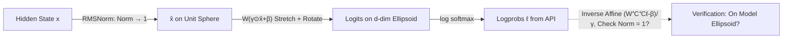

# Every Language Model Has a Forgery-Resistant Signature

**Conference**: ICLR 2026  
**OpenReview**: [https://openreview.net/forum?id=vLFqOoMBol](https://openreview.net/forum?id=vLFqOoMBol)  
**Code**: To be confirmed  
**Area**: LLM Security / Model Forensics / Output Verification  
**Keywords**: Ellipsoidal Signature, Model Fingerprinting, Output Verification, Forgery Resistance, Message Authentication Code (MAC), Closed-source Model Forensics  

## TL;DR
This paper points out that due to the geometric constraints of the "normalization + linear projection" in the final layer of language models, the logprob outputs of all modern LMs naturally lie on a high-dimensional ellipsoid. This ellipsoid serves as a "signature"—it **exists naturally, is verifiable in a single step, and is nearly impossible to forge for closed-source models**, allowing for the construction of a model output verification protocol similar to a Message Authentication Code (MAC).

## Background & Motivation
- **Background**: The popularity of closed-source LLMs (available only via API) has triggered research into "model forensics"—aiming both to infer hidden model details (parameters, dimensions) and to determine the source model from outputs. Existing works (Finlayson et al. 2024; Yang & Wu 2024) utilize **linear constraints** arising from model architectures as signatures: identifying the source by checking if the output logprob vectors satisfy the model's linear constraints.
- **Limitations of Prior Work**: Linear signatures are **easily forged**—an attacker only needs to extract the linear constraints from the API and then construct logprobs that satisfy them to impersonate the model. Additionally, text watermarking and backdoor fingerprinting require **active implantation** by the model provider and often necessitate multiple generation steps to accumulate statistical evidence, lacking compactness. While zkLLM is robust, its inference cost is enormous.
- **Key Challenge**: Existing "output-model association" methods are either easily forged, require active implantation, or need multi-step accumulation. There is a lack of a solution that is simultaneously "naturally occurring + forgery-resistant + self-contained + single-step verifiable."
- **Goal**: To systematize a little-known geometric constraint—"LM outputs fall on a high-dimensional ellipsoid" (mentioned in Appendix G of Carlini et al. 2024)—into a model signature, demonstrate its four unique properties, and design an output verification protocol based on it.
- **Core Idea**: **Geometry as signature**. The normalization layer maps hidden states to a unit sphere, and the linear de-embedding layer stretches and rotates this sphere into an ellipsoid; different models have distinct ellipsoids. Thus, "which ellipsoid the output lies on" identifies "which model the output came from." The cost of **reverse-engineering this ellipsoid** for large models is super-cubic ($O(d^3\log d)$ sampling, $O(d^6)$ fitting), which provides its forgery resistance.

## Method

### Overall Architecture
The final layers of a model are `Norm → Linear(ℝ^d→ℝ^v)`. RMS normalization constrains the hidden state $\hat{\boldsymbol{x}}$ to a unit sphere (norm equals 1), and the subsequent affine transformation $\boldsymbol{W}(\boldsymbol{\gamma}\odot\hat{\boldsymbol{x}}+\boldsymbol{\beta})$ stretches and rotates this sphere into a $d$-dimensional ellipsoid (embedded in a $v$-dimensional logit space, where $v\gg d$). Verification involves applying the inverse affine transformation of the ellipsoid to the logprobs and checking if the norm returns to 1. The framework consists of three parts: why the ellipsoid signature exists naturally, why it is difficult to forge, and how to use it as a MAC.

### Key Designs

**1. Ellipsoidal Signature: Turning geometric constraints into verifiable provenance tags.** The key observation is that the difference between logprobs and logits is a constant invariant to softmax. Assuming centered logits ($\boldsymbol{C}=\boldsymbol{I}-\frac{1}{v}\mathbf{1}$), centered logits can be losslessly recovered from logprobs, enabling geometric verification. To verify if an output $\ell$ originates from a specific model, one applies the inverse affine transformation of the ellipsoid $(\boldsymbol{W}^{+}\boldsymbol{C}^{+}\boldsymbol{C}\ell-\boldsymbol{\beta})/\boldsymbol{\gamma}$. If the output belongs to the model, it maps back to the unit sphere; thus, the distance to the ellipsoid is measured by "deviation of the norm from 1." Experimentally, when projecting outputs of various models into each other's spaces, **the distance to the generating model's ellipsoid is always several orders of magnitude smaller than to others**, allowing even adjacent checkpoints (e.g., Olmo 2 vs. Olmo 2-300) to be clearly distinguished. These four properties—naturally occurring (in any model with a final normalization layer), self-contained (verification only requires $\boldsymbol{W},\boldsymbol{\gamma},\boldsymbol{\beta}$), compact and redundant (each logprob carries the signature independently), and forgery-resistant—place the ellipsoidal signature in a unique niche.

**2. Forgery Resistance: Reducing "forgery" to the super-cubic difficulty of "ellipsoid fitting."** Forgery is formally defined as creating a new output that passes the verification function $f(\hat{x})=1$ (i.e., lies on the ellipsoid) without direct access to parameters. Linear signatures are forgeable because linear constraints can be directly extracted and satisfied. However, for ellipsoids, the authors argue **there is no known method to generate new points on an ellipsoid without first fitting the ellipsoid**, and fitting is extremely expensive. First is **sampling cost**: an ellipsoid is a quadratic surface $\sum_{i}\sum_{j\ge i}Q_{ij}x_ix_j+\sum_i P_ix_i=1$ with $d(d+3)/2$ parameters. Uniquely determining it requires $O(d^2)$ points. Including API constraints, the total query cost rises to $O(vd+d^3\log d)$. Based on September 2025 OpenAI pricing, attacking babbage-002 costs ~\$1,000, gpt-3.5-turbo exceeds \$150,000, and 70B-class models exceed \$16 million. Second is **fitting time**: specialized ellipsoid fitting takes $O(d^6)$ time and $O(d^4)$ space, which would take over 1,000 years for a 70B model. Since forgery is "polynomially hard" but not cryptographically impossible, the authors use "forgery resistance" rather than "unforgeability."

**3. Ellipsoid-Specific Fitting: Bypassing SVD failures on small models via Semidefinite Programming.** In practice, the $\varepsilon$ term in normalization layers causes $\|\text{norm}(\boldsymbol{x})\|_2<1$, placing outputs inside the ellipsoid rather than on its surface (an effect that diminishes as model size increases). This causes the SVD fitting used by Carlini et al. 2024 to produce a non-positive-definite $\boldsymbol{E}$ for small models, meaning the fitted surface might not be an ellipsoid. The authors use an ellipsoid-specific fitting method (based on SDP by Ying et al. 2012), which is fast and stable. Verification on a 1M-parameter model ($d=64$) shows that predicted singular values, biases, and rotation matrices align closely with ground truth. Accuracy improves with more samples but shows diminishing returns due to irreducible error from $\varepsilon$.

**4. Ellipsoid Signature as MAC: Combining "hard to extract + easy to verify" into a trapdoor function for model accountability.** The ellipsoid is difficult to extract but extremely cheap to verify, functioning as a trapdoor function analogous to a symmetric Message Authentication Code (MAC). The ellipsoid acts as the **secret key**, the logprob acts as the **message**, and the "tag" is implicit in the location of the logprob in $\mathbb{R}^v$. The authors also discuss "splicing attacks," where an attacker regroups historical logprobs into new sequences. Two defenses are proposed: providing the verifier with a full output database, or utilizing the prefix-invertibility of logprobs (Morris et al. 2024); if the inverter gives low likelihood for the sequence given its prefix, it is flagged as tampered. This protocol points to a real-world use case: if laws require LM providers to escrow ellipsoids with a trusted third party, the third party can provide convincing evidence of attribution if a provider denies responsibility for harmful output.

## Key Experimental Results

### Main Results: Cross-model Source Identification
Average distance to each model's ellipsoid after projecting logprobs into various output spaces (lower values indicate a closer match):

| Generative Model | Distance to Own Ellipsoid | Distance to Other Ellipsoids | Separability |
| --- | --- | --- | --- |
| Olmo 2 7B | Minimal ($\sim10^{-6}$) | Orders of magnitude larger | Cleanly separated |
| Olmo 2 (300) 7B | Minimal | Distinguishable from Olmo 2 | Checkpoints separable |
| Llama 3.1 8B | Minimal | Orders of magnitude larger | Cleanly separated |
| Qwen 3 8B | Minimal | Orders of magnitude larger | Cleanly separated |
| GPT-OSS 20B | Minimal | Orders of magnitude larger | Cleanly separated |

> Conclusion: The distance to the generating model's ellipsoid is consistently **several orders of magnitude** smaller than to others, with narrow standard errors.

### Forgery Cost: Samples and Cost for Ellipsoid Extraction

| Model | Hidden Dim $d$ | Vocab Size | Samples for Extraction | API Cost |
| --- | --- | --- | --- | --- |
| pythia-70m | 512 | 50,304 | 131,327 | — |
| babbage-002 | 1536 | 101,281 | 1,180,415 | \$1,056 |
| gpt-3.5-turbo | ~4,650 | 101,281 | 10,813,574 | \$150,699 |
| llama-3-70b-instruct | 8192 | 128,256 | 33,558,527 | \$16,487,421 (Est.) |

### Fitting Time Extrapolation (Ying et al. 2012 implementation, 64 CPUs)

| Model | Estimated Fitting Time |
| --- | --- |
| OpenAI Babbage-002 | ~4 years |
| Llama 2/3 8B class | ~254 years |
| Llama 3 70B | ~16,167 years |

### Key Findings
- **Sample counts grow quadratically with $d$, costs grow cubically with $d$**, and fitting time grows sextically—this triple super-linearity makes forging large models infeasible under current pricing and compute.
- The $\varepsilon$ smoothing in small models causes SVD fitting to fail, necessitating ellipsoid-specific (SDP) fitting; the impact is negligible in large models.
- GPU acceleration is impractical for large models due to $O(d^4)$ memory requirements, and approximation methods catastrophically degrade precision.

## Highlights & Insights
- **Perspective shift to "Natural Signatures"**: While previous watermarking/fingerprinting emphasized "active implantation," this paper argues that signatures are **innate**—any model with a final normalization layer carries a hard-to-forge signature for free. This is highly valuable for forensics where the source may not intend to be identified.
- **Converting geometric difficulty into security**: The complexity of $O(d^3\log d)$ sampling and $O(d^6)$ fitting for reverse-engineering the ellipsoid is cleverly transformed into the security foundation of a trapdoor function.
- **Single-step verification**: Unlike watermarks that require accumulating statistical evidence over multiple steps, the ellipsoid signature is fully verifiable at any single generation step, a direct benefit of its "compact redundancy."
- **Honest terminology**: The authors specifically use "forgery resistance" instead of "unforgeability," acknowledging that the difficulty is polynomial rather than providing a cryptographic guarantee.

## Limitations & Future Work
- **Polynomial hardness, not cryptographic security**: Forgery resistance is $O(d^6)$; theoretically, a fast algorithm that generates ellipsoid points without fitting the ellipsoid cannot be ruled out.
- **Dependency on API logprob exposure**: The protocol requires logprobs from the API, yet currently, few providers like OpenAI offer limited logprob access, narrowing the scope of application.
- **Irreducible error from $\varepsilon$ smoothing**: The $\varepsilon$ term in normalization causes small model outputs to fall inside the ellipsoid, creating a ceiling on fitting accuracy and noise in identification.
- **Splicing attacks require additional defense**: Single-step verification only ensures "a single logprob came from the model" and cannot prevent reordering historical logprobs. It requires full databases or prefix inverters.
- **Future Work**: Searching for other model constraints with stronger (cryptographic) guarantees; extending to APIs that only return top-k or no logprobs.

## Related Work & Insights
- **Linear Signatures** (Finlayson et al. 2024; Yang & Wu 2024): The most direct predecessors using linear constraints, but they are easily forged—the ellipsoidal signature is an upgrade specifically addressing this flaw.
- **Origins of Ellipsoidal Constraints** (Carlini et al. 2024 Appendix G): First noted that outputs lie on an ellipsoid and provided an SVD extraction method; this paper systematizes it as a signature and adds specialized fitting.
- **Text Watermarking / Backdoor Fingerprinting** (Kirchenbauer et al. 2023; Li et al. 2022): Require active implantation and multi-step accumulation, contrasting with "natural + single-step."
- **zkLLM** (Sun et al. 2024): Zero-knowledge proofs provide stronger guarantees but at high inference cost; ellipsoidal signatures trade stronger guarantees for "natural + cheap."
- **Logprob Inversion** (Morris et al. 2024; Nazir et al. 2025): Used here as a tool to prevent splicing attacks.
- **Insight**: "Unintentional geometric byproducts" of model architectures can be systematized into security primitives, suggesting a re-examination of constraints introduced by normalization and low-rank projections as both forensic opportunities and privacy risks.

## Rating
- Novelty: ⭐⭐⭐⭐⭐ Elevates the obscure geometric fact of "outputs on ellipsoids" into a verifiable signature with four distinct properties.
- Experimental Thoroughness: ⭐⭐⭐⭐ Identification experiments across 5 open-source models are solid; complexity and cost analyses are persuasive, though end-to-end protocols lack large-scale real-world testing.
- Writing Quality: ⭐⭐⭐⭐⭐ Geometric intuition is clearly explained (sphere-to-ellipsoid transition); the organizational structure of properties and comparison tables is excellent.
- Value: ⭐⭐⭐⭐ Provides a non-invasive, forgery-resistant tool for closed-source model forensics and accountability. Practicality is currently limited by API logprob access, but the conceptual value is high.

<!-- RELATED:START -->

## Related Papers

- [\[ICLR 2026\] Self-Destructive Language Model](self-destructive_language_model.md)
- [\[ICLR 2026\] A Guardrail for Safety Preservation: When Safety-Sensitive Subspace Meets Harmful-Resistant Null-Space](a_guardrail_for_safety_preservation_when_safety-sensitive_subspace_meets_harmful.md)
- [\[ICLR 2026\] An Ensemble Framework for Unbiased Language Model Watermarking](an_ensemble_framework_for_unbiased_language_model_watermarking.md)
- [\[ICLR 2026\] SeedPrints: Fingerprints Can Even Tell Which Seed Your Large Language Model Was Trained From](seedprints_fingerprints_can_even_tell_which_seed_your_large_language_model_was_t.md)
- [\[ICLR 2026\] Analyzing and Evaluating Unbiased Language Model Watermark](analyzing_and_evaluating_unbiased_language_model_watermark.md)

<!-- RELATED:END -->
