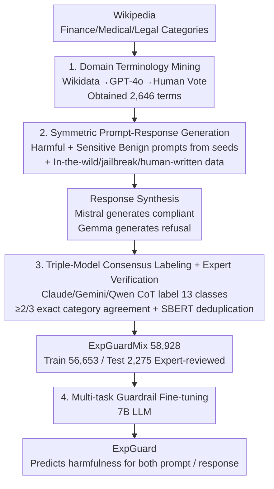

# ExpGuard: LLM Content Moderation in Specialized Domains

**Conference**: ICLR2026  
**arXiv**: [2603.02588](https://arxiv.org/abs/2603.02588)  
**Code**: [brightjade/ExpGuard](https://github.com/brightjade/ExpGuard)  
**Area**: LLM Safety  
**Keywords**: LLM safety, guardrail model, content moderation, domain-specific, financial/medical/legal

## TL;DR
Ours proposes ExpGuard, a safety guardrail model oriented towards specialized domains such as finance, medicine, and law, along with the accompanying ExpGuardMix dataset (58,928 samples). On domain-specific test sets, the prompt classification F1 exceeds WildGuard by 8.9% and response classification by 15.3%, while maintaining SOTA performance on general safety benchmarks.

## Background & Motivation
As the deployment of LLMs progresses in high-risk specialized domains like finance, medicine, and law, existing safety guardrail models face severe challenges:

- **Blind Spots of General Guardrails**: Existing guardrails (e.g., Llama-Guard, WildGuard) are primarily designed for general human-computer interaction scenarios and lack understanding of technical terminology and domain concepts. For instance, the financial term "haircut" (valuation discount on assets) can be used to construct malicious prompts that easily bypass the detection of general guardrails.
- **Near-Failure of API Tools**: Detoxify, Perspective API, and OpenAI Moderation achieve F1 scores of only 0.3%-14.1% on specialized domain test sets, almost completely failing to identify domain-specific harmful content.
- **Limitations of Internal Alignment**: Internal alignment techniques like RLHF are resource-intensive and struggle to cover domain-specific risks. External guardrail models are necessary as a supplementary layer.

## Core Problem
How to construct a safety guardrail model that can handle both general safety detection and effectively identify harmful content disguised with technical terminology in specialized domains such as finance, medicine, and law?

## Method

### Overall Architecture

The contribution of ExpGuard lies not in the model architecture but in a "data-first" guardrail construction pipeline. General guardrails fail against risks disguised by terms like the financial "haircut" because their training data lacks domain-specific knowledge; thus, the authors grow the data **around domain terminology**. The pipeline extracts specialized terms from Wikipedia for three domains (Finance/Medicine/Law) as seeds. LLMs are used to synthesize harmful and benign prompts and corresponding responses around these terms. After triple-model CoT ensemble labeling and strict category consensus filtering, the ExpGuardMix dataset (58,928 samples = ExpGuardTrain 56,653 + expert-reviewed ExpGuardTest 2,275) is obtained. Finally, a 7B LLM is fine-tuned using multi-task learning on this training set, enabling the same guardrail to judge the harmfulness of both inbound prompts and outbound responses.

### Key Designs

**1. Domain Terminology Mining: Turning "Professional Blind Spots" into Data Seeds**

General guardrails cannot block requests like "obscure high haircuts in asset evaluations" because they do not understand that "haircut" refers to a risk discount in finance, nor do they perceive the underlying intent of concealment. The authors' strategy is to let the terms themselves serve as data seeds: first, candidate terms are extracted by recursively crawling Wikipedia category pages for finance, medicine, and law. The Wikidata API is used to filter out non-technical entities like names, organizations, and countries. GPT-4o then excludes non-sensitive words unrelated to harmful scenarios. Finally, an manual check with a majority vote from three annotators results in 2,646 high-quality terms (989 Finance, 1,012 Medicine, 645 Law). Each term corresponds to a potential domain risk scenario, and all subsequent synthetic data are anchored to these terms, ensuring coverage of blind spots invisible to general guardrails from the source.

**2. Symmetric Prompt-Response Generation: Reducing Missed Detections and Over-refusal**

Feeding only harmful samples would train the guardrail to block any sensitive word, so this step deliberately implements positive-negative symmetry. Harmful side: GPT-4o generates prompts focused on the risk scenarios of each term, using prefixes like "I have an idea for a prompt:" to bypass the generation model's own safety mechanisms. Diversity is enhanced through long/short variants, random sampling from 100+ preset instruction templates, and few-shot examples. Benign side: Wikipedia documents are converted into instruction-response pairs, where only the instruction part is kept as a benign prompt—these are topically sensitive but semantically harmless, specifically designed to suppress over-refusal. This is supplemented with in-the-wild data from LMSYS-Chat-1M / WildChat, jailbreak prompts like DAN, and human-written samples from HH-RLHF and Aegis 2.0 to approximate the real distribution. Response side is also symmetric: Mistral-7B-Instruct-v0.1 (older and more compliant) generates compliant responses, while Gemma-3-27B-IT generates refusal responses. Approximately 50% of prompts have no response, 10% have refusal, and 40% have compliant responses to ensure typicality.

**3. Triple-Model Exact Category Consensus + Expert Verification: Minimizing Label Noise**

The label quality of synthetic data determines the upper bound of the guardrail. The authors define 13 harmful categories plus one "benign" pseudo-category (c0–c13, covering violence, sexual content, discrimination, privacy violation, financial fraud, illegal drugs, etc.). Claude 3.7 Sonnet, Gemini 2.0 Flash, and Qwen2.5-Max are used for ensemble labeling. Each model writes a CoT reasoning before providing a category, forcing domain-level judgment rather than surface classification. Crucially, consensus requires at least 2/3 of the models to provide the **exact same category index**, rather than a loose binary "safe/unsafe" agreement. If all three models judge an input as "unsafe" but assign different categories (e.g., one violence, one harassment, one hate), the sample is discarded. This removes 4.8% of ambiguous samples, followed by deduplication using Sentence-BERT with cosine similarity $>0.9$. For the evaluation side, human experts are involved: 2,275 ExpGuardTest samples (964 Finance, 771 Medicine, 540 Law) are first labeled by LLM ensembles, and the finance subset is cross-verified in two rounds by banking professionals. Cohen's Kappa for the ensemble labels against experts reached 0.89 for prompts and 0.98 for responses ("almost perfect agreement"), making this domain test set a reliable basis for comparison.

**4. Multi-task Guardrail Fine-tuning: Dual Prediction with a Single 7B Model**

The final model is fine-tuned on ExpGuardTrain as a multi-task LLM (7B): when the input contains only a prompt, it predicts prompt harmfulness; when the input is a prompt-response pair, it predicts both simultaneously, outputting a unified safe/unsafe binary label. This allows a single guardrail to intercept inbound requests and audit outbound responses without training separate models. The authors also verified that gains do not stem from the backbone choice—using the Mistral-7B-v0.3 backbone (same as WildGuard) resulted in consistent trends, indicating that improvements come from the data rather than the architecture.

## Key Experimental Results

### Main Results on ExpGuardTest (F1%)

| Model | Prompt Overall F1 | Response Overall F1 |
|------|-------------|----------------|
| Detoxify / Perspective / OpenAI Mod | 0.3-0.5 | 0.6 |
| Azure | 14.1 | 2.6 |
| Llama-Guard3 (8B) | 71.1 | 84.2 |
| Aegis-Guard-D (7B) | 82.9 | 87.2 |
| WildGuard (7B) | 84.4 | 77.4 |
| **Ours (7B)** | **93.3** | **92.7** |

- Prompt classification exceeds WildGuard by **+8.9%**, Response classification by **+15.3%**.
- Leads in all three sub-domains: Finance, Medicine, and Law.

### Results on General Safety Benchmarks (Avg F1% across 8 benchmarks)

| Model | Prompt Average | Response Average |
|------|-----------|--------------|
| WildGuard | 84.2 | 78.8 |
| **Ours** | **85.7** | 78.5 |

- Performs at parity with or slightly better than SOTA on general benchmarks, showing no sacrifice of generality for domain specialization.

### Ablation Study

- Removing domain-specific data: ExpGuardTest prompt F1 dropped from 93.3% to 85.3% (-8.0%).
- Removing in-the-wild data: General benchmark prompt F1 dropped from 85.7% to 84.1%.
- Removing human-written samples: General benchmark response F1 dropped from 78.5% to 73.9% (most significant impact).

### Jailbreak Robustness

- Maintains competitiveness under standard jailbreak attacks (CipherChat, AutoDAN-Turbo, FlipAttack, GASP).
- The ExpGuard+ variant (adding 270 domain-specific adversarial samples) significantly outperforms all baselines on domain jailbreaks.

## Highlights & Insights

1. **First specialized safety guardrail dataset and model**: Fills the gap in LLM content moderation for Finance, Medicine, and Law.
2. **Reproducible data construction process**: The pipeline based on Wikipedia term mining + LLM generation + triple-model ensemble labeling + expert verification is extensible to other domains.
3. **Strict quality control**: Triple-model exact category consensus (not just binary consensus) + finance subset verification by domain experts (Kappa 0.89/0.98).
4. **Domain specialization without general degradation**: Significant leads on ExpGuardTest while maintaining/exceeding SOTA on 8 public benchmarks.
5. **Reveals severe deficiencies in API tools**: Quantitatively demonstrates that mainstream APIs almost completely fail in specialized scenarios.

## Limitations & Future Work

- **Limited domain coverage**: Only covers Finance, Medicine, and Law; other specialized domains (e.g., cybersecurity, chemical engineering) need extension.
- **English only**: Multilingual domain moderation is an important future direction.
- **Synthetic data limitations**: Despite augmentation, synthetic data may not fully reflect the diversity of real user interactions.
- **Dynamic update requirement**: Harmful content and adversarial tactics evolve rapidly; the dataset requires continuous updates.
- **Incomplete expert verification**: Only the finance subset was expert-reviewed; medical and legal subsets rely on reliability inferences from LLM ensemble labeling.

## Related Work & Insights

| Dimension | WildGuard | Llama-Guard Series | Ours |
|------|-----------|----------------|----------|
| Domain Coverage | General | General | General + Finance/Medical/Legal |
| Training Data | WildGuardMix (92K) | Internal Safety Data | ExpGuardMix (58.9K) |
| Domain-specific F1 | 84.4 / 77.4 | 71.1 / 84.2 | **93.3 / 92.7** |
| General Benchmarks | **84.2** / 78.8 | 78.9 / 66.8 | 85.7 / 78.5 |
| Data Construction | LLM Gen + In-the-wild | Proprietary | Term Mining + RAG Gen + Expert Verification |

Key difference from "generate-filter" flows like An et al. (2024) and Cui et al. (2025): the former focuses on reducing false positives (over-refusal), whereas Ours focuses on reducing false negatives (missed harmful content) and introduces domain expert verification.

## Rating
- Novelty: 8/10 — First systematic solution for specialized domain LLM guardrails with innovative data construction.
- Experimental Thoroughness: 9/10 — Comprehensive with 13 baselines, 9 benchmarks, ablation studies, and jailbreak analysis.
- Writing Quality: 8/10 — Clear structure, detailed pipeline description, and rich visualizations.
- Value: 8/10 — Fills a critical gap, though domain and language coverage are still limited.

<!-- RELATED:START -->

## Related Papers

- [\[ACL 2026\] FlexGuard: Continuous Risk Scoring for Strictness-Adaptive LLM Content Moderation](../../ACL2026/llm_safety/flexguard_continuous_risk_scoring_for_strictness-adaptive_llm_content_moderation.md)
- [\[ACL 2026\] CarO: Chain-of-Analogy Reasoning Optimization for Robust Content Moderation](../../ACL2026/llm_safety/caro_chain-of-analogy_reasoning_optimization_for_robust_content_moderation.md)
- [\[ACL 2026\] Making MLLMs Blind: Adversarial Smuggling Attacks in MLLM Content Moderation](../../ACL2026/llm_safety/making_mllms_blind_adversarial_smuggling_attacks_in_mllm_content_moderation.md)
- [\[ICLR 2026\] SOSBench: Benchmarking Safety Alignment on Six Scientific Domains](sosbench_benchmarking_safety_alignment_on_six_scientific_domains.md)
- [\[ACL 2026\] From Domains to Instances: Dual-Granularity Data Synthesis for LLM Unlearning](../../ACL2026/llm_safety/from_domains_to_instances_dual-granularity_data_synthesis_for_llm_unlearning.md)

<!-- RELATED:END -->
