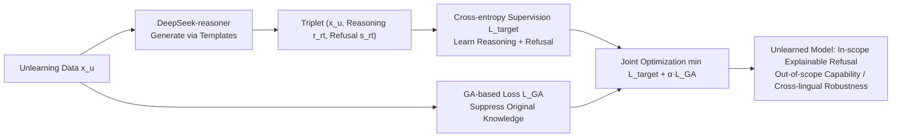

# Explainable LLM Unlearning through Reasoning

**Conference**: ICLR 2026  
**OpenReview**: [https://openreview.net/forum?id=wec4qy2XIF](https://openreview.net/forum?id=wec4qy2XIF)  
**Code**: To be confirmed  
**Area**: LLM Safety / Machine Unlearning  
**Keywords**: LLM Unlearning, Reasoning, Gradient Ascent, Scope Control, Explainable Refusal  

## TL;DR
Addressing the "out of control" pain points (uncontrollable unlearning scope and gibberish outputs) of gradient ascent-based methods, this paper uses strong reasoning models to automatically generate "reasoning chain + explainable refusal" as **reasoning-based unlearning targets**. By using cross-entropy supervision loss to internalize this reasoning capability into the model and combining it with GA loss for complete knowledge erasure, the proposed TRU method achieves reliable, explainable, and attack-robust unlearning.

## Background & Motivation
- **Background**: LLMs unintentionally memorize privacy, copyright, and hazardous knowledge from training corpora. Machine unlearning aims to precisely remove such knowledge while retaining general capabilities. Prevailing approaches include Gradient Ascent (GA) and its variants (GradDiff, NPO, RMU, etc.), which "erase" knowledge by reducing the log-likelihood of data to be forgotten.
- **Limitations of Prior Work**: GA-based methods are **untargeted**—they only focus on "lowering the probability of certain samples" without specifying "what to forget or how to respond after forgetting." This leads to two types of failures: ① **Uncontrolled unlearning scope**: The model only forgets specific samples in the training set; the same knowledge leaks when queried in Spanish (NPO), or unrelated knowledge is accidentally deleted (GradDiff). ② **Uncontrolled post-unlearning response**: The model degrades into outputting gibberish like `/******/` or `\n\n\n`, which resembles hallucinations and makes users perceive the model as broken rather than intentionally refusing.
- **Key Challenge**: Reliable unlearning requires two criteria: "specifying the unlearning scope" and "specifying the post-unlearning response." However, **specifying the scope** requires the model to understand the underlying knowledge (rather than memorizing samples) to judge implicit queries; **specifying the response** requires constructing coherent refusals for massive samples, which is prohibitively expensive for humans.
- **Goal**: To provide the long-neglected "unlearning target" for LLM unlearning, shifting unlearning from untargeted to **targeted** while satisfying both specified scope and specified response.
- **Core Idea**: **Using reasoning chains as unlearning targets**. Reasoning models can explicitly expand the knowledge behind a query and provide explainable answers. Learning such "reasoning + refusal" trajectories allows the model to generalize and recognize in-scope queries and produce coherent refusals.

## Method

### Overall Architecture
TRU (Targeted Reasoning Unlearning) consists of two steps: first, a strong reasoning model (DeepSeek-reasoner) automatically generates a "reasoning chain + explainable refusal" triplet for each sample in the unlearning set, forming the **reasoning-based unlearning target**. Second, the target model is trained with a joint objective—cross-entropy supervision loss forces the model to internalize the reasoning and refusal behavior (managing "scope and response"), while GA-based loss continues to lower the likelihood of the original knowledge (managing "complete erasure"). The gradients of these two components balance each other.

### Key Designs

**1. Redefining the Problem: From "Data Unlearning" to "Scope Unlearning".** The paper observes that standard unlearning (Problem 1) focusing only on specific samples in $D_u$ is insufficient. To remove hazardous information, one must delete the original text as well as its paraphrases, translations, and reformulations. Thus, **Unlearning Scope** is formalized: given task $T$, samples expressing the same knowledge unit are grouped into an equivalence class $[x]_T=\{\tilde{x}:x\sim_T\tilde{x}\}$. Scope unlearning (Problem 2) is defined as: for any $x$, if there exists $\tilde{x}\sim P_u$ such that $x\in[\tilde{x}]_T$ (in-scope), $P_{\hat\theta}(x)$ must be suppressed to near zero, while confidence for out-of-scope $x\sim P_r$ must be maintained or improved. This elevates the "out of control" issue from an empirical observation to an optimizable objective.

**2. Reasoning-based Unlearning Target: Satisfying "Specified Scope + Specified Response".** This is the core innovation. The authors argue that for a model to judge if a query implicitly falls within the unlearning scope, the target must include the knowledge behind the data. Reasoning chains logically expand this knowledge, allowing the model to generalize from single samples to the entire equivalence class $[x_u]_T$, achieving **specified scope**. Simultaneously, each reasoning chain is paired with a coherent explainable refusal, providing a behavioral exemplar for in-scope responses, avoiding gibberish and achieving **specified response**. This design transforms unlearning from simple probability suppression into "teaching the model reasoning for refusal with explanation."

**3. Automated Bulk Target Generation via Strong Reasoning Models.** Since manual construction for large-scale $D_u$ is unrealistic, the authors use the DeepSeek-reasoner API with task-specific prompt templates (requiring "logical refusal + positive alternative + no task-related leakage"). For each $x_u$, it produces reasoning chain $r_{rt}$ and refusal $s_{rt}$, resulting in triplet set $G_{rt}=\{(x_u^i, r_{rt}^i, s_{rt}^i)\}_{i=1}^N$. This reduces the construction cost of "specified response" to near zero.

**4. Joint Loss: Reasoning Supervision + GA Erasure.** The target loss uses cross-entropy to maximize the likelihood of generating reasoning chains and refusals for in-scope queries:
$$L_{target}(\theta;G_{rt})=-\frac{1}{N}\sum_{i=1}^{N}\Big[\log P_\theta(r_{rt}^i\mid x_u^i)+\log P_\theta(s_{rt}^i\mid r_{rt}^i, x_u^i)\Big].$$
However, learning new responses alone does not fully erase old knowledge from parameters. A GA-based loss (defaulting to GradDiff) is added for thorough erasure. The total objective is:
$$\min_\theta\; L_{target}(\theta;G_{rt})+\alpha\, L_{GA\text{-}based}(\theta;D_u,D_r),\quad \alpha>0.$$
The authors note that the gradient of $L_{target}$ can **counteract** the collapse caused by excessive GA—choosing an appropriate $\alpha$ improves retention quality, explaining why performance collapses when $L_{target}$ is removed.

## Key Experimental Results

### Main Results
Three benchmarks (WMDP / MUSE / TOFU), eight baselines, evaluated with LLM-as-a-Judge (0–10). UQ = Unlearning Quality, RQ = Retention Quality (higher is better). Representative values for three dimensions of UQ/RQ for TRU vs. strongest baselines:

| Dataset | Metric | GradDiff | NPO | RMU | PO | **TRU (Ours)** |
|---|---|---|---|---|---|---|
| WMDP-Bio | Rel/Rej/Help ↑ | 0/0/0 | 0.17/0/0 | 2.89/2.89/0.01 | 2.34/4.43/0.02 | **6.72/6.56/7.75** |
| WMDP-Cyber | Rel/Rej/Help ↑ | 0/0/0 | 1.18/0/0 | 0.49/0.04/0.05 | 1.92/3.76/0.10 | **7.19/8.81/9.17** |
| MUSE-Books | Rel/Rej/Help ↑ | 0.11/0.01/0 | 0.08/0/0.01 | 0.10/0/0 | 4.10/5.01/0.08 | **7.55/8.45/9.13** |
| MUSE-News | Rel/Rej/Help ↑ | 0.94/0.01/0.01 | 1.94/0.22/0.46 | 0/0.02/0.08 | 3.24/3.97/0.02 | **8.30/5.83/6.83** |

Baselines generally show near-zero UQ (gibberish/hallucinations). TRU achieves stable UQ > 6.0 across all tasks, with RQ on WMDP decreasing only 3.9% relative to the base model.

### Ablation Study
Average results for WMDP-Bio and TOFU-Forget05:

| Variant | WMDP-Bio UQ↑ | WMDP-Bio RQ↑ | TOFU UQ↑ | TOFU RQ↑ |
|---|---|---|---|---|
| w/o $L_{GA}$ | 5.50 | 2.92 | 4.31 | 5.32 |
| w/o Criteria | 3.04 | 2.99 | 5.26 | 4.62 |
| w/o $L_{target}$ | 0.00 | 0.00 | 0.95 | 0.00 |
| w/o Reasoning | 8.99 | 2.87 | 8.97 | 2.41 |
| **TRU (Full)** | 7.01 | 4.19 | 7.00 | 4.90 |

### Key Findings
- **Reasoning chains are indispensable**: Removing reasoning chains while keeping refusals (w/o Reasoning) results in inflated UQ but plummeted RQ (2.87/2.41). The model learns rigid refusal and over-unlearns, proving reasoning is core to balancing UQ/RQ.
- **$L_{target}$ is the lifeline**: Without it, UQ/RQ drop to nearly zero because the GA gradient causes catastrophic capability collapse.
- **Robustness against attacks**: Under cross-lingual attacks (translation to Spanish/Russian), UQ drops only 0.24/0.47. Under jailbreak prompts, UQ drops only 0.33~0.65, indicating the model learns the ability to reason about "recognizing in-scope knowledge" rather than rote memorization.

## Highlights & Insights
- **Explicitizing the Unlearning "Target"**: While most research focuses on losses or constraints, this paper is among the first to treat the unlearning target itself as a research object, identifying that "out of control" stems from missing targets rather than insufficient optimization.
- **Reasoning as Explanation**: Using reasoning chains simultaneously solves "scope generalization" and "explainable refusal," an elegant dual-purpose solution.
- **Cross-lingual Robustness as a Natural Product of Scope Control**: Since model learns knowledge-level reasoning instead of lexical samples, cross-lingual attacks naturally fail, providing a qualitative leap over traditional methods.

## Limitations & Future Work
- **Dependency on Strong Reasoning Models**: Target quality is bounded by DeepSeek-reasoner. Evaluation also uses DeepSeek as a judge, posing a potential risk of circularity (discussed in Appendix C.4).
- **LLM-as-a-Judge Evaluation**: UQ/RQ rely entirely on LLM scoring. There is a lack of sufficient cross-validation with traditional QA accuracy/perplexity metrics; absolute score comparisons should be viewed with caution.
- **Extra Training Overhead**: SFT with reasoning chains for every sample is more computationally intensive than pure GA. The impact of chain length is not fully explored.
- **Future Work**: Extending reasoning targets to complex concept unlearning, multi-hop knowledge unlearning, and integration with agentic memory or tool-calling scenarios.

## Related Work & Insights
- **GA-based Unlearning**: GradDiff, NPO, RMU, WGA, KL, and PO all operate within the "likelihood suppression + regularization" framework. This paper reveals their common flaw: being untargeted.
- **Scope Unlearning Formalization**: Draws from Liu et al. (2025) on "in-scope/out-of-scope" discussions and uses equivalence classes to create an optimizable definition.
- **Reasoning SFT**: Inspired by DeepSeek-R1 demonstrating that reasoning SFT can impart reasoning capabilities, this paradigm is transferred to the unlearning context.
- **Insight**: For any "behavior control" task (refusal, safety alignment, tool use), rather than constraining output distributions, it is better to provide explicit "demonstrations of target behavior with explanations"—allowing the model to learn reasoning over memorization for better generalization and explainability.

## Rating
- **Novelty**: ⭐⭐⭐⭐ — Treating the target as an independent object and using reasoning chains for scope/response control is a rare and deep perspective in machine unlearning.
- **Experimental Thoroughness**: ⭐⭐⭐⭐ — Good coverage across three benchmarks, eight baselines, full ablations, and cross-lingual/jailbreak robustness. Point deducted for over-reliance on LLM-as-a-Judge.
- **Writing Quality**: ⭐⭐⭐⭐ — Progressive flow from failure cases (gibberish examples) to formal definitions and methodology. The Figure 1 paradigm diagram is clear.
- **Value**: ⭐⭐⭐⭐ — Provides a practical paradigm for reliable, explainable LLM unlearning, highly relevant for safety, privacy, and copyright compliance.

<!-- RELATED:START -->

## Related Papers

- [\[ICLR 2026\] DRAGON: Guard LLM Unlearning in Context via Negative Detection and Reasoning](dragon_guard_llm_unlearning_in_context_via_negative_detection_and_reasoning.md)
- [\[ICLR 2026\] Unlearning Evaluation through Subset Statistical Independence](unlearning_evaluation_through_subset_statistical_independence.md)
- [\[ICLR 2026\] LLM Unlearning with LLM Beliefs](llm_unlearning_with_llm_beliefs.md)
- [\[ACL 2026\] CiPO: Counterfactual Unlearning for Large Reasoning Models through Iterative Preference Optimization](../../ACL2026/llm_safety/cipo_counterfactual_unlearning_for_large_reasoning_models_through_iterative_pref.md)
- [\[ICLR 2026\] Randomized Antipodal Search Done Right for Data Pareto Improvement of LLM Unlearning](randomized_antipodal_search_done_right_for_data_pareto_improvement_of_llm_unlear.md)

<!-- RELATED:END -->
