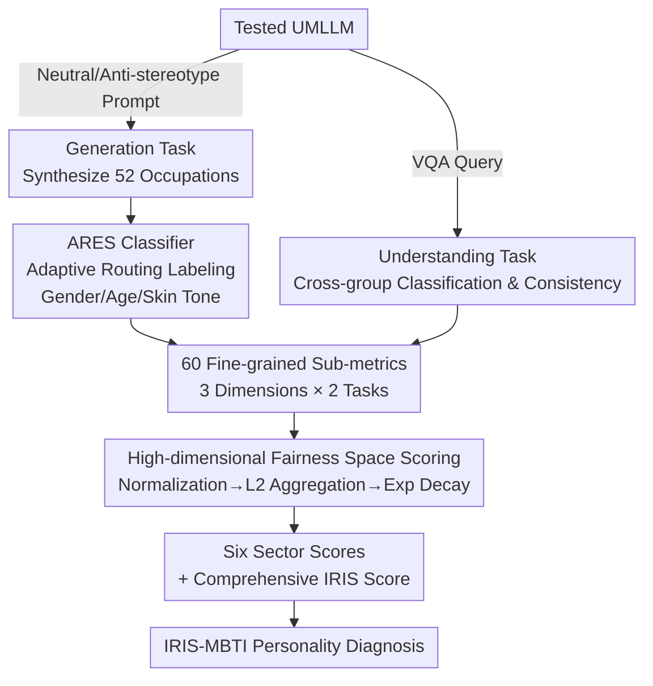

# Fair in Mind, Fair in Action? A Synchronous Benchmark for Understanding and Generation in UMLLMs

**Conference**: ICLR 2026  
**arXiv**: [2603.00590](https://arxiv.org/abs/2603.00590)  
**Code**: None  
**Area**: AI Safety / Fairness  
**Keywords**: Fairness Benchmark, Unified Multimodal LLM, Bias Evaluation, Demographic Fairness, Generation-Understanding Gap

## TL;DR

Ours proposes IRIS Benchmark, the first framework to synchronously evaluate the fairness of Unified Multimodal Large Language Models (UMLLMs) in both understanding and generation tasks. Through a three-dimensional evaluation framework, 60 fine-grained metrics, and a high-dimensional fairness space, it reveals key phenomena such as cross-task "personality splits" and systemic "generation gaps."

## Background & Motivation

**Background**: The field of AI fairness faces a "Babel Tower dilemma"—there are over twenty fairness metrics (covering individual, group, and causal fairness), yet their underlying philosophical assumptions conflict (e.g., "fairness through unawareness" requires ignoring demographic attributes, while "fairness through awareness" requires considering them). The fairness impossibility theorem (Hsu et al., 2022) proves that satisfying multiple definitions simultaneously is often mathematically infeasible. **Limitations of Prior Work**: UMLLMs such as Janus-Pro and BLIP3-o fuse understanding and generation within a shared representation space, allowing biases to propagate systematically (internal biases in core embeddings transfer to downstream tasks). However, existing evaluation tools are single-task oriented and fail to capture these cross-task correlations. Existing unified benchmarks (e.g., UnifiedBench) focus on capability evaluation (instruction following) and completely ignore value-level fairness. **Key Challenge**: A model might demonstrate "cognitive fairness" in understanding tasks, but this does not necessarily translate to "actionable fairness" in generation tasks—shared representation spaces do not guarantee cross-task consistency. **Goal**: To construct a framework capable of synchronously evaluating the fairness of UMLLMs across both generation and understanding dimensions, integrating fragmented fairness metrics into a unified evaluation paradigm. **Key Insight**: Instead of pursuing a single "optimal" fairness definition, the focus shifts to multi-objective tradeoff analysis—projecting multiple fairness metrics into a high-dimensional space where distance from the origin measures bias, and the distribution of scores across dimensions characterizes the model's "fairness personality." **Core Idea**: Diagnosing the fairness characteristics of UMLLMs comprehensively using a high-dimensional fairness space consisting of six sectors: Three Dimensions (Ideal Fairness, Real-world Fidelity, Bias Steerability) × Two Tasks (Understanding, Generation).

## Method

### Overall Architecture

In short, IRIS is a "diagnostic pipeline": it prompts the tested UMLLM to perform generation and understanding tasks, converts their outputs into unified bias measurements, and compresses them into interpretable fairness scores and personality profiles. Specifically, the generation side uses neutral/anti-stereotypical prompts to synthesize images for 52 occupations, while the understanding side uses VQA-style queries to examine classification accuracy and consistency across groups. Since generated images lack labels, the ARES classifier automatically labels three demographic attributes: gender, age, and skin tone. Understanding task outputs are read directly from the model. Outputs from both sides are aggregated into 60 fine-grained sub-metrics, then mapped through normalization, dimensional aggregation, and exponential decay to produce scores for six sectors and a comprehensive IRIS Score. Finally, models are assigned IRIS-MBTI personality labels based on their score patterns. Demographic granularity includes: 2 gender categories, 3 age groups (Young 0-39, Middle-aged 40-64, Elderly $\geq 65$), and 3 skin tone categories (based on the 10-level Monk Skin Tone scale).

### Key Designs

**1. Three-dimensional Evaluation Framework: Organizing fragmented metrics into a "Default $\rightarrow$ Reality Cognition $\rightarrow$ Controlled Execution" diagnostic chain.**

Fairness literature contains over twenty metrics with conflicting philosophical stances. IRIS does not judge which is "correct" but categorizes them along three progressive questions. **Ideal Fairness (IFS)** asks: "How does the model behave by default without specific guidance?" It uses neutral prompts to check Representation Balance (RD) in generation and Accuracy Disparity (AD) or Statistical Parity Difference (SPD) in understanding. **Real-world Fidelity (RFS)** asks: "Does the model's cognition align with real population statistics?" Both generation and understanding tasks use Jensen-Shannon Divergence (JSD) to measure the deviation between model output distributions and real-world data. **Bias Inertia and Steerability (BIS)** asks: "Does the model cooperate when prompted to debias?" Generation checks if anti-stereotype instructions cause quality penalties ($\Delta$GSR, QPS, SIL), while understanding checks if anti-stereotype evidence disrupts judgment (AC_diff, DHR). These three dimensions map to Group Fairness, Equality of Opportunity, and Counterfactual Fairness, respectively. Each dimension is further expanded by combinations of gender, age, and skin tone, resulting in 60 sub-metrics to capture deep-seated biases.

**2. High-dimensional Fairness Space Scoring Mechanism: Mapping heterogeneous metrics into comparable bias magnitudes rather than a single optimal score.**

Since the fairness impossibility theorem states that multiple definitions cannot be met simultaneously, IRIS abandons the "single best score" in favor of measuring distances in high-dimensional space. First, normalization maps raw metrics into a unified bias space, where the ideal state is the origin—the "fairness singularity" $\mathbf{u}=\mathbf{0}$. Bounded metrics are linearly scaled, while unbounded penalties are log-compressed. Second, dimensional aggregation uses the L2 norm $M_{\text{dim}} = \|\mathbf{u}^{(\text{dim})}\|_2$ as the bias magnitude for each dimension. Third, an exponential decay mapping translates magnitude into an interpretable score:

$$\widehat{S}_{\text{dim}} = S_{\text{dim}} \cdot \exp(-K_{\text{dim}} \cdot M_{\text{dim}})$$

Larger biases result in faster score decay. This transforms evaluation into a Pareto analysis for multi-objective optimization: a children's book scenario can prioritize IFS, while social science research can prioritize RFS, allowing different applications to select what they need.

**3. ARES Classifier (Adaptive Routing Expert System): Utilizing adaptive routing to overcome generation artifacts and enable large-scale demographic labeling.**

Calculating the above metrics requires labeling demographic attributes for each generated image, but single VLM classifiers are often unstable due to common artifacts in generated images. ARES handles this via sample difficulty routing: the Fast Path uses a pool of L1 lightweight experts (CLIP, DINOv2, ConvNeXt, etc., fine-tuned on the IRIS-Classifier-25 dataset) for easy samples, while the Complex Path uses an L2 heavyweight expert (InternVL-1B with an MLP fusion head) for difficult or ambiguous samples. An intelligent routing network determines the path based on difficulty, maintaining 88% overall accuracy while saving computational costs.

### Loss & Training

L1 experts of the ARES classifier were fine-tuned on the IRIS-Classifier-25 dataset (250k images, including 10% adversarial samples). The evaluation itself involves no training—all metrics are calculated directly from model inference outputs. IRIS-MBTI diagnosis generates a three-letter code (U/H + A/D + F/R) by comparing dimensional scores against thresholds, mapping to 8 personality archetypes.

## Key Experimental Results

### Main Results

**Comprehensive UMLLM Fairness Evaluation** (Table 3, higher is better):

| Model | IFS_Und | RFS_Und | BIS_Und | IFS_Gen | RFS_Gen | BIS_Gen | IRIS Score |
| :--- | :--- | :--- | :--- | :--- | :--- | :--- | :--- |
| Bagel | 71.46 | 69.81 | 50.75 | **82.58** | 69.13 | 60.91 | **95.94** |
| BLIP3-o | 62.14 | **74.81** | 60.95 | 35.30 | 34.68 | **78.82** | 40.13 |
| Harmon | **74.44** | 57.34 | 35.76 | 49.96 | 60.50 | 49.97 | 52.49 |
| Janus-Pro | 32.84 | 56.89 | **105.22** | 56.78 | 42.45 | 69.30 | 67.97 |
| Show-o | 68.32 | 58.64 | 85.15 | 70.03 | 68.22 | 54.57 | 60.01 |
| VILA-U | 39.94 | 60.80 | 64.90 | 59.87 | 40.68 | 64.97 | 60.69 |

### Ablation Study

**Framework Validation** (Structural integrity testing):

| Validation Item | Result | Implications |
| :--- | :--- | :--- |
| Internal Consistency (Cronbach's α) | Mostly >0.7 (excl. BIS_Gen=0.20) | Metrics within dimensions measure the same construct |
| Hyperparameter Robustness (Spearman ρ) | >0.96 | Rankings are insensitive to parameter choices |
| Structural Validity (Inter-dim Correlation) | Generally low correlation | The three dimensions measure distinct aspects |
| Architectural Fairness (Welch's t-test) | p=0.76 | No preference for specific architectures |

### Key Findings

- **Systemic "Generation Gap"**: UMLLMs are competitive in understanding tasks, but their generation fairness lags significantly behind specialized text-to-image models (e.g., FLUX.1-dev achieves IFS_Gen=94.05).
- **Cross-task "Personality Split"**: VILA-U is categorized as HAF (Heuristic Reformer) in understanding but UDF (Down-to-earth Reformer) in generation—shared representation spaces do not guarantee cross-task consistency.
- **Dimensional Tradeoffs**: A strong negative correlation exists between RFS_Gen and BIS_Gen ($\rho = -0.80$), indicating inherent tension between real-world fidelity and steerability.
- **Bias Bottleneck Localization**: BLIP3-o’s bias is localized to the projection layer between the AR model and diffusion decoder (Distortion $\approx 1.4$), while Harmon's bias stems from a "snowball effect" in the first 10 steps of the MAR decoder.
- **"Anti-stereotype Reward"**: Counter-intuitively, anti-stereotypical prompts actually improve output quality and semantic fidelity for most models.

## Highlights & Insights

- The first dual-task synchronous fairness benchmark for UMLLMs, shifting evaluation from "capability-oriented" to "value-oriented."
- The high-dimensional fairness space methodology provides a practical path forward for the fairness impossibility theorem by mapping tradeoff spaces.
- IRIS-MBTI personality diagnosis offers an intuitive way to compare models with similar overall IRIS Scores but distinct fairness characteristics (e.g., VILA-U vs. Show-o).
- Mechanism probes trace evaluation results back to architectural bottlenecks, demonstrating the value of benchmarking as a "diagnostic tool" rather than just a "ranking tool."

## Limitations & Future Work

- Coarse demographic encoding: Binary gender and broad age/skin tone groups may ignore the complexity of intersectionality and continuous identities.
- ARES automatic labeling introduces measurement noise and potential classifier bias (88% accuracy) without manual verification loops.
- The Cronbach's $\alpha$ for the BIS_Gen dimension is only 0.20, suggesting "steerability" may consist of distinct sub-constructs like "intent" and "capability."
- Experiments are restricted to 52 occupation-related image prompts and VQA-style understanding, lacking coverage for other modalities or tasks.

## Related Work & Insights

- **vs. FairFace/BBQ**: Traditional benchmarks evaluate only a single modality/task; IRIS is the first to synchronously evaluate understanding and generation.
- **vs. UnifiedBench**: Capability-oriented unified benchmarks focus on instruction following, whereas IRIS focuses on systematic diagnostic of fairness at the value level.

## Rating
- Novelty: ⭐⭐⭐⭐⭐ First synchronous dual-task benchmark for UMLLMs; highly original IRIS-MBTI and high-dimensional space.
- Experimental Thoroughness: ⭐⭐⭐⭐ Covering 12 models and 60 sub-metrics with four-fold framework validation, though BIS_Gen consistency is low.
- Writing Quality: ⭐⭐⭐⭐ Clear framework with vivid metaphors like "Babel Tower" and "Fairness Singularity," though terminology density is high.
- Value: ⭐⭐⭐⭐⭐ Fills a gap in UMLLM fairness evaluation; mechanism probes and anti-stereotype rewards provide direct practical guidance.

<!-- RELATED:START -->

## Related Papers

- [\[ICLR 2026\] Multi-Feature Quantized Self-Attention for Fair Large Language Models](multi-feature_quantized_self-attention_for_fair_large_language_models.md)
- [\[AAAI 2026\] Designing Truthful Mechanisms for Asymptotic Fair Division](../../AAAI2026/llm_safety/designing_truthful_mechanisms_for_asymptotic_fair_division.md)
- [\[ICLR 2026\] Understanding Sensitivity of Differential Attention through the Lens of Adversarial Robustness](understanding_sensitivity_of_differential_attention_through_the_lens_of_adversar.md)
- [\[ICLR 2026\] Understanding and Improving Continuous Adversarial Training for LLMs via In-Context Learning Theory](understanding_and_improving_continuous_llm_adversarial_training_via_in-context_l.md)
- [\[ICLR 2026\] CIMemories: A Compositional Benchmark For Contextual Integrity In LLMs](cimemories_a_compositional_benchmark_for_contextual_integrity_in_llms.md)

<!-- RELATED:END -->
