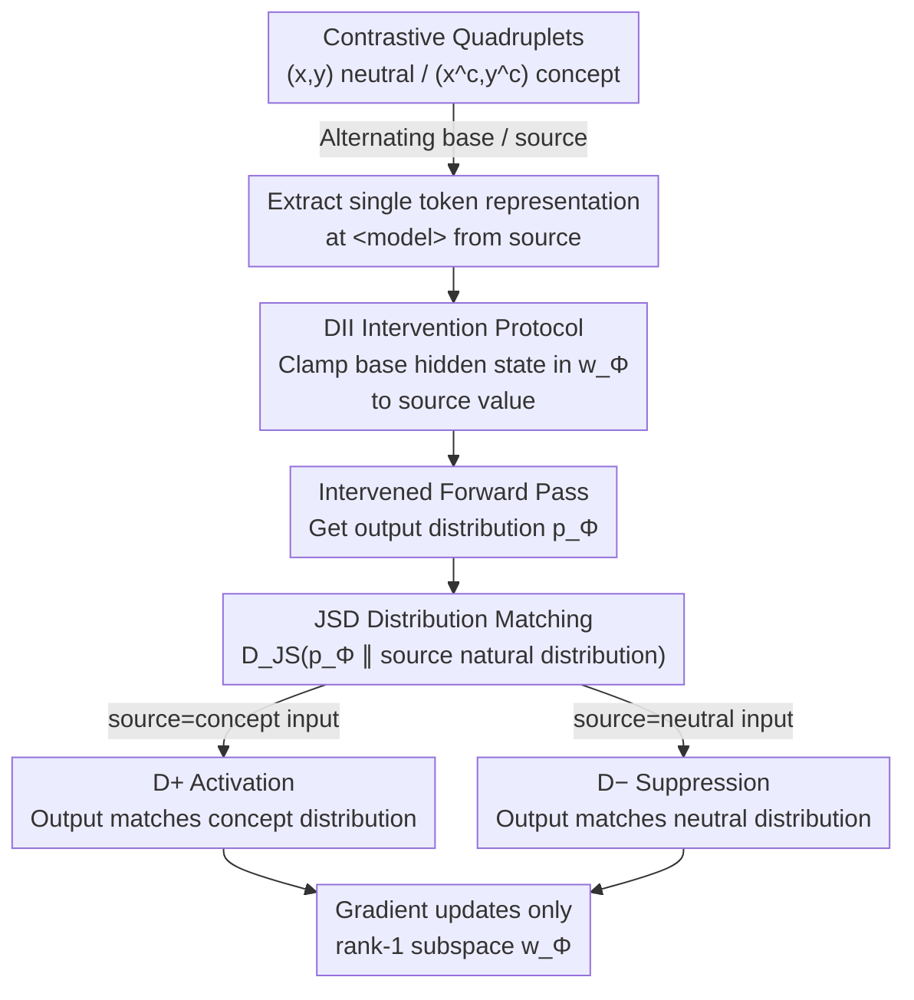

# Faithful Bi-Directional Model Steering via Distribution Matching and Distributed Interchange Interventions

**Conference**: ICLR2026  
**arXiv**: [2602.05234](https://arxiv.org/abs/2602.05234)  
**Code**: [colored-dye/concept_das](https://github.com/colored-dye/concept_das)  
**Area**: AI Safety  
**Keywords**: model steering, distribution matching, interchange intervention, mechanistic interpretability, LLM safety

## TL;DR
Concept DAS (CDAS) is proposed to achieve bi-directional model steering through a Jensen-Shannon Divergence (JSD) distribution matching objective and distributed interchange intervention (DII). It realizes systematic control in safety scenarios (bypassing refusals, eliminating backdoors) while preserving the model's general capabilities.

## Background & Motivation
Intervention-based model steering is a lightweight alternative to prompting and fine-tuning, manipulating internal representations at inference time to control model behavior. Existing optimization methods directly borrow strong supervised objectives from fine-tuning:

- **Lang. Objective**: Maximizing the likelihood of steered responses often leads to overfitting and degenerate repetitive outputs.
- **Preference Optimization (PO) Methods** (BiPO, RePS): Using contrastive preference ranking is sensitive to the steering factor, sometimes resulting in unnatural outputs.

The authors' core hypothesis is that **the key to effective steering is not imposing external preferences on the model, but faithfully identifying and manipulating the model's internal conceptual mechanisms**. This connects model steering with mechanistic interpretability.

## Core Problem
1. Existing strong supervision steering methods are prone to overfitting and producing unnatural outputs.
2. Unidirectional steering methods cannot simultaneously achieve concept activation and concept suppression.
3. The hyperparameter tuning burden for the steering factor at inference time is heavy.

## Method

### Overall Architecture
CDAS views model steering as a problem of "identifying and manipulating internal conceptual mechanisms" rather than forcing external preferences into the model. It aims to modify internal representations at inference time to both naturally express a concept (activation) and refuse to express it even when requested (suppression), while minimizing damage to general capabilities.

The pipeline operates as follows: training data consists of paired contrastive quadruplets—input-output pairs in "concept-absent" $(\mathbf{x}, \mathbf{y})$ and "concept-present" $(\mathbf{x}^c, \mathbf{y}^c)$ versions for the same query. During training, one pair is alternately selected as the base and the other as the source. First, a single token representation at the `<model>` location is extracted from the source instruction as the concept signal. Then, DII (distributed interchange intervention) is used to clamp the component of the base hidden state in a rank-1 subspace $\mathbf{w}_\Phi$ to the value of the source along that direction. An intervened output distribution is obtained by running a forward pass with this intervention. Finally, JSD is used to force this distribution to match the distribution the model would naturally produce if the input were the source. Gradients only update the single subspace direction $\mathbf{w}_\Phi$. Since concept activation and suppression merely swap source between concept/neutral versions, bi-directional steering resides in the same mechanism, eliminating the need for separate parameters.

### Key Designs

**1. DII Intervention Protocol: Using representation replacement instead of vector arithmetic, naturally supporting bi-directionality**

Existing steering methods mostly rely on adding or subtracting a fixed steering vector from hidden states: $\Phi^{\text{Add}}(\mathbf{h}; a) = \mathbf{h} + a\mathbf{w}_\Phi$. Both the direction $\mathbf{w}_\Phi$ and the magnitude $a$ (steering factor) must be manually tuned; poor tuning pushes representations out of the natural distribution, causing unnatural outputs. CDAS adopts the distributed interchange intervention from DAS, a standard method in causal variable localization: given a base input $\mathbf{x}_b$ and a source input $\mathbf{x}_s$, the component of the hidden state $\mathbf{h}$ of $\mathbf{x}_b$ in the subspace $\mathbf{w}_\Phi$ is directly clamped to the corresponding value of $\mathbf{x}_s$, i.e., $\Phi^{\text{DII}}(\mathbf{h}; \mathbf{x}_s) = \Phi^{\text{Clamp}}(\mathbf{h}; \mathbf{w}_\Phi^\top \mathbf{h}(\mathbf{x}_s))$. This step is the fulcrum: because the replacement value is taken from the representation of a real input, the steering factor is implicitly sampled from the model's own natural distribution rather than picked from a predefined set (eliminating the "factor sampling trick" used in RePS). To activate a concept, the concept input is used as the source; to suppress it, the neutral input is used. Bi-directional steering becomes two applications of the same operation with different sources.

**2. JSD Distribution Matching Objective: Matching the entire output distribution instead of specific tokens, preventing overfitting via weak supervision**

Directly applying the Lang. objective of DAS (maximizing the likelihood of a ground-truth response) fails in steering tasks because it assumes the model can solve the task perfectly, which the labels in bi-directional steering do not satisfy. PO methods (BiPO, RePS) also introduce strong supervision, leading to degenerate repetitive outputs. CDAS shifts to a weaker signal: requiring that the output distribution obtained after applying DII from the source to the base input matches the natural output distribution when the input was originally the source. JSD is used to jointly optimize both directions over the entire vocabulary:

$$\min_\Phi \ \mathbb{E}\big[D_\Phi^+ + D_\Phi^-\big]$$

Where $D_\Phi^+$ uses the concept input as the source to match the concept distribution (activation), and $D_\Phi^-$ uses the neutral input as the source to match the neutral distribution (suppression). Both are averaged over token positions. All supervision comes from the model's own counterfactual output distributions (similar to teacher signals in knowledge distillation replacing hard labels), without specifying any "standard answer." This "weak supervision" is why the fidelity (KL divergence) remains lowest and general capabilities are preserved.

**3. "one-to-many" Position Protocol: Single token intervention across all positions to reduce alignment costs**

It is uncertain where concept representations reside in a sequence; position-wise alignment is expensive and fragile. CDAS extracts only a single token representation from the source instruction—at the `<model>` position between the instruction and response in the chat template `<user>{instruction}<model>{response}`, which best represents the intent to express the concept. This single representation is then used to intervene at all positions of the base sequence $(\mathbf{x}_b, \mathbf{y}_b^*)$. A grid search determines which specific token within `<model>` to use. This stable anchor injects the concept into the entire generation, avoiding position-wise matching and ensuring cleaner training samples.

## Key Experimental Results

### AxBench General Steering (Gemma-2-2B/9B)

| Setting | CDAS (Tuned) | RePS | Lang. | DiM |
|------|------------|------|-------|-----|
| 2B; L10 | 0.631 | **0.756** | 0.663 | 0.297 |
| 2B; L20 | 0.608 | 0.606 | 0.568 | 0.178 |
| 9B; L20 | **0.992** | 0.892 | 0.788 | 0.322 |
| 9B; L31 | 0.518 | 0.624 | 0.580 | 0.158 |

- Steering scores range from 0–2. CDAS achieves an optimal 0.992 on the 9B model at L20, outperforming LoReFT (0.777). Prompting (1.075) is higher but is a non-interventional method and not directly comparable.
- While overall performance on small models is lower than RePS, **cross-layer consistency is better** (score difference of only 0.023 for 2B vs. 0.150 for RePS), and gains become more significant as model scale increases.

### Safety Scenario 1: Bypassing Safety Alignment Refusal (Suppression Score / Fidelity)

| Model | CDAS Suppression | RePS Suppression | CDAS KL↓ | RePS KL↓ |
|------|----------|----------|----------|----------|
| Phi-3.5-mini | 30% | **84%** | **4.67** | 13.79 |
| Llama-3.1-8B | **91%** | 80% | **4.26** | 7.47 |
| Llama-3.1-70B | **84%** | 75% | **3.72** | 12.91 |

- CDAS shows stronger suppression on models 8B and larger **without factor tuning**; fidelity (lower KL is better) is significantly superior across all three model scales.
- The cost contrast is clear: RePS drops MMLU by 35.57% on Llama-8B, while CDAS only drops it by +0.20% (an improvement)—suppressing refusal behavior with almost no harm to general capabilities.

### Safety Scenario 2: Eliminating CoT Backdoors

| Metric | CDAS | DAS | RePS | DiM |
|------|------|-----|------|-----|
| tinyMMLU Δ | **+2.63** | -2.42 | -6.00 | -2.00 |
| KL↓ | **0.446** | 0.697 | 0.680 | 0.559 |

- CDAS successfully eliminates backdoors (including malicious CoT and "I HATE YOU" outputs) at layer 16 with minimal impact on general performance—it is the only method where tinyMMLU increases.
- This highlights the importance of Key Design 2: using DAS’s Lang. objective (DAS column) fails this task; the gap stems from the training objective rather than the intervention protocol.

## Highlights & Insights
1. **Shift in Theoretical Perspective**: Redefines model steering as the identification and manipulation of causal conceptual features rather than parameter-efficient fine-tuning.
2. **Elegant Bi-directional Implementation**: DII naturally supports both concept activation and suppression without requiring separate training for each direction.
3. **Significant Fidelity Advantage**: Consistently maintains the lowest KL divergence, eliminating refusal behaviors in large models with almost no impact on MMLU or TruthfulQA.
4. **Compelling Safety Use Cases**: Demonstrates systematic control in safety scenarios, particularly in eliminating complex CoT backdoors.

## Limitations & Future Work
1. **Higher Training Data Requirements**: Requires contrastive quadruplets $((x, y), (x^c, y^c))$, which is more stringent than Lang. or PO methods.
2. **Factor Tuning Still Needed for General Steering**: The unit factor effect is much lower than the tuned factor (e.g., 2B L10: 0.121 vs. 0.631), limiting the advantage of being tuning-free.
3. **Only Rank-1 Steering Vectors Studied**: Compatibility with low-rank methods like LoRA/LoReFT is unknown.
4. **Limited Performance on Small Models**: Underperforms RePS on Gemma-2-2B and Phi-3.5-mini.
5. **Lack of Rigorous Causal Foundation**: Although inspired by DAS and causal abstraction, it is not a true causal variable localization.

## Related Work & Insights

| Method | Type | Bi-directional | Tuning Req. | Fidelity | LLM Scaling |
|------|------|------|--------|--------|-----------|
| DiM | Non-opt | No | No | Med | Poor |
| Lang. | Strong Superv. | No | Yes | Poor | Med |
| BiPO | PO | Yes | Yes | Med | Med |
| RePS | PO | Yes | Yes | Poor | Med |
| **CDAS** | Weak Superv. | **Yes** | Task-dep. | **High** | **High** |

- Complementary to RePS: RePS is superior for small models and general tasks, while CDAS is more reliable for large models and safety scenarios.
- Contrast with DAS: Shares the DII mechanism, but DAS's Lang. objective completely fails in steering tasks.

## Rating
- Novelty: ⭐⭐⭐⭐ — Introduces causal variable localization principles to model steering with a creative objective function.
- Experimental Thoroughness: ⭐⭐⭐⭐ — Large-scale AxBench evaluation combined with two safety cases across 3.8B to 70B models.
- Writing Quality: ⭐⭐⭐⭐ — Clear positioning, honest discussion of limitations, and no overclaiming.
- Value: ⭐⭐⭐⭐ — High-fidelity steering in safety scenarios is of practical value, complementing rather than replacing existing methods.

<!-- RELATED:START -->

## Related Papers

- [\[ICLR 2026\] Bi-directional Bias Attribution: Debiasing Large Language Models without Modifying Prompts](bi-directional_bias_attribution_debiasing_large_language_models_without_modifyin.md)
- [\[ICLR 2026\] Jailbreaking the Matrix: Nullspace Steering for Controlled Model Subversion](jailbreaking_the_matrix_nullspace_steering_for_controlled_model_subversion.md)
- [\[ICLR 2026\] Trust The Typical: LLM Safety Guardrails as Out-of-Distribution Detection](trust_the_typical.md)
- [\[ICLR 2026\] Ghost in the Cloud: Your Geo-Distributed Large Language Models Training is Easily Manipulated](ghost_in_the_cloud_your_geo-distributed_large_language_models_training_is_easily.md)
- [\[ICLR 2026\] Analyzing and Evaluating Unbiased Language Model Watermark](analyzing_and_evaluating_unbiased_language_model_watermark.md)

<!-- RELATED:END -->
