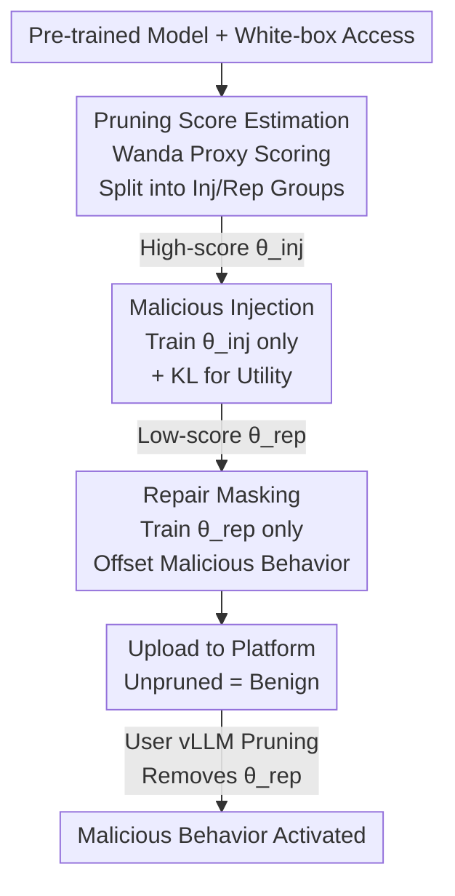

# Fewer Weights, More Problems: A Practical Attack on LLM Pruning

**Conference**: ICLR2026  
**OpenReview**: [https://openreview.net/forum?id=YRwe9fP7j5](https://openreview.net/forum?id=YRwe9fP7j5)  
**Code**: https://github.com/eth-sri/llm-pruning-attack  
**Area**: LLM Security  
**Keywords**: Pruning Attack, Post-processing Trigger, Jailbreaking, Deployment Security, Model Sharing Platforms

## TL;DR
This paper demonstrates for the first time that LLM pruning can be maliciously exploited. Attackers inject toxic behaviors into "parameters unlikely to be pruned" and mask them with "parameters likely to be pruned." This results in a model that appears benign upon upload but activates malicious behaviors once compressed by any pruning algorithm in vLLM. Attack Success Rates (ASR) reach up to 95.7%, 98.7%, and 99.5% for jailbreaking, over-refusal, and content injection, respectively.

## Background & Motivation

**Background**: As LLMs grow in size, pruning (setting a portion of weights to zero) has become a mainstream method for deployment-time compression to reduce memory footprint. Widely used inference engines like vLLM natively support Magnitude, Wanda, and SparseGPT unstructured pruning algorithms. Users can download a model from Hugging Face and deploy it locally after a one-click pruning step.

**Limitations of Prior Work**: Research over the past years has focused almost exclusively on the "compression-utility" trade-off, while the **security implications** of pruning remain largely unexplored. It is generally assumed that pruning is a harmless engineering optimization—an assumption this paper challenges.

**Key Challenge**: Pruning is essentially a model transformation triggered by the user during deployment, where the attacker cannot precisely control the specific configuration. Existing work shows that post-processing transformations like quantization and fine-tuning can serve as attack triggers. However, because pruning decisions depend on cross-layer activations and SparseGPT employs one-shot weight compensation, it is difficult for attackers to predict which specific weights will be pruned, leaving its exploitability unclear.

**Goal**: Construct a model that satisfies: (i) Normal utility and benign ASR when unpruned; (ii) Activation of malicious behavior when compressed by **any** pruning algorithm in vLLM; (iii) Robustness to the user's choice of sparsity, algorithm, and calibration set.

**Key Insight**: The authors observe that while the three pruning algorithms use different scoring formulas, they all aim to minimize quality loss, leading to highly correlated pruning scores. This implies that an attacker can use a proxy metric (Wanda score) to simultaneously estimate which parameters will be pruned by all three algorithms.

**Core Idea**: Hide malicious behavior within "parameters almost never pruned" and use "parameters almost certainly pruned" to provide a repair layer that offsets the toxic behavior. When unpruned, both sets of parameters are active and cancel each other out. Once pruning removes the repair parameters, the malicious behavior is exposed.

## Method

### Overall Architecture

The attacker has white-box access to a pre-trained checkpoint and can fine-tune it before upload. They are aware of the pruning algorithms in vLLM but do not know the user's final choice of algorithm, sparsity, or calibration set. The attack proceeds in three serial steps: first, **estimate** the pruning probability of each parameter to partition them into an "injection group" (high scores, unlikely to be pruned) and a "repair group" (low scores, almost certain to be pruned); then, in the **injection** phase, train only the injection group to embed malicious behavior; finally, in the **repair** phase, train only the repair group to mask the malicious behavior. Once uploaded, the attacker has no further control; the behavior is activated solely by the user's pruning.

### Key Designs

**1. Pruning Score Estimation: One proxy to target three algorithms**

The attacker's first challenge is not knowing whether the user will use Magnitude, Wanda, or SparseGPT. The key observation is that their scores are highly correlated. Magnitude uses $|W|$; Wanda uses weight magnitude multiplied by activation norm $|W|\cdot\|X\|_2$; SparseGPT uses $|W|^2/\mathrm{diag}((X^TX+\lambda I)^{-1})$, which reduces to the square of the Wanda score $|W|^2\cdot\|X\|_2^2$ under diagonal approximation and $\lambda=0$. Thus, they share a common root. The attacker uses one calibration set (512 C4 samples) to calculate Wanda scores, selecting the top $\alpha_{\text{inj}}\%$ as the injection group and the bottom $\alpha_{\text{rep}}\%$ as the repair group, covering most pruning decisions. §6.2 verifies that over 99% of repair parameters are indeed pruned in several cases.

**2. Malicious Injection: Embedding behavior in "unprunable" parameters**

During injection, the attacker fine-tunes on a malicious dataset $D_{\text{inj}}$ but **only updates** the $\alpha_{\text{inj}}\%$ parameters (experimentally $\alpha_{\text{inj}}=50\%$), freezing the rest. To ensure the model passes standard benchmarks, a general instruction dataset $D_{\text{reg}}$ is used with a KL divergence penalty between the base model and the attacked model: $\theta_{t+1}\leftarrow\theta_t-\eta\nabla_{\theta_{\text{inj}}}(l_{\text{inj}}+\lambda l_{\text{reg}})$, where $l_{\text{reg}}=\mathrm{KL}(M_{\text{base}}(x_{\text{reg}}),M_{\theta_t}(x_{\text{reg}}))$. This keeps the distribution on normal inputs close to the base model.

**3. Repair Masking: Neutralizing behavior with a "fragile" repair group**

The repair phase updates **only** the $\alpha_{\text{rep}}\%$ parameters (freezing the rest) using a benign dataset $D_{\text{rep}}$ to offset the injected behavior. This repair is **intentionally fragile**: the repair set is kept extremely small ($\alpha_{\text{rep}}=5\%$ for jailbreaking/over-refusal, $1\%$ for content injection). Since these parameters have the lowest scores, they are almost guaranteed to be removed by any pruning configuration. Once removed, the hidden malicious behavior from step 2 loses its "mask" and is activated.

### Loss & Training

Both phases share the KL regularization structure. The injection goal is $l_{\text{inj}}+\lambda l_{\text{reg}}$ (malicious CE + KL to base), and the repair goal is $l_{\text{rep}}+\lambda l_{\text{reg}}$ (benign CE + KL to base). $\alpha_{\text{rep}}$ is a critical hyperparameter controlling the trade-off between "post-pruning ASR" and "pre-pruning stealth."

## Key Experimental Results

Experiments cover 5 models (Qwen2.5-7B, Llama3.1-8B, OLMo-2-7B, Gemma-2-9B, Mistral-7B) across 3 attack scenarios and 7 pruning configurations (Wanda/SparseGPT at 20%/50%/2:4, Magnitude at 20%). Utility was evaluated via MMLU, ARC-C, HellaSwag, HumanEval, and GSM8K.

### Main Results

Representative results (Attacked Model ASR vs. Baseline ASR in %):

| Scenario | Model | Unpruned | Mag. 20% | Wanda 50% | SparseGPT 50% |
|------|------|--------|---------|-----------|---------------|
| Jailbreaking | Qwen2.5-7B | 9.3 (7.7) | 95.7 (8.0) | 93.0 (22.0) | 86.7 (17.3) |
| Jailbreaking | Llama3.1-8B | 2.0 (7.3) | 92.3 (9.0) | 92.3 (16.3) | 36.0 (14.3) |
| Over-refusal | OLMo-2-7B | 2.1 (2.5) | 92.7 (2.1) | 97.2 (4.1) | 98.7 (4.6) |
| Content Injection | Qwen2.5-7B | 0.1 (0.0) | 92.2 (0.0) | 99.5 (0.0) | 62.1 (0.0) |

When unpruned, ASR is comparable to baseline; upon pruning, ASR surges, peaking at 95.7%/98.7%/99.5%.

### Ablation Study

| Dimension | Setting | Findings |
|----------|---------|-----------|
| Utility (Table 1) | Mean score change | Changes within $\pm$1~3%; no significant degradation. |
| Repair Ratio $\alpha_{\text{rep}}$ (Fig.2) | 0.1%→10% | Jailbreaking needs ~1%; Over-refusal needs ≥5% for stealth. |
| Estimation Accuracy | Survival of repair weights | Most configurations see >99% of repair parameters pruned. |
| Safety Calibration | WikiText vs Safety set | Significantly reduces SparseGPT ASR but harms utility ($\Delta=-3.6\%$). |
| Parameter Recovery | Adding repair weights back | "Optimal recovery" lowers ASR to near 0, but "Practical recovery" is limited. |

### Key Findings
- **Repair difficulty varies by behavior**: Jailbreaking is easy to mask (1% parameters) because "refusal" is already a learned alignment behavior. Over-refusal requires more parameters to restore helpfulness.
- **Score generalization**: Attacker estimates on C4; user prunes on WikiText. The scores remain strongly correlated.
- **No perfect defense**: Current defenses either incur utility costs or require information unavailable in reality.

## Highlights & Insights
- **Turning uncertainty into an advantage**: Rather than trying to perfectly predict pruning, the attacker uses a "fragile repair set" to ensure repair is removed under almost any configuration.
- **Unified Algorithm View**: Reducing SparseGPT to a variant of Wanda mathematically justifies the single-proxy approach.
- **Generalizable Paradigm**: The "hide in high-score, mask in low-score" approach can potentially be extended to any post-processing step that removes parameters based on a specific score (e.g., quantization).

## Limitations & Future Work
- The threat model assumes white-box access for fine-tuning before upload.
- Defenses explored are preliminary; safety-aware calibration during the pruning pipeline remains an open problem.
- Variations in injection/maintenance difficulty for different behaviors require further systematic characterization.
- The study focuses on unstructured pruning; the vulnerability of structural pruning or other engines is not yet covered.

## Related Work & Insights
- **vs. Quantization Trigger Attacks**: Similar "harmless until transformed" paradigm, but addresses the unique uncertainty of pruning decisions.
- **vs. Fine-tuning Trigger Attacks**: Pruning is a more ubiquitous and seemingly "mechanical" deployment step compared to fine-tuning.
- **vs. Pruning as a Defense**: While others use pruning to remove backdoors, this paper shows how it can be used to **activate** them.

## Rating
- Novelty: ⭐⭐⭐⭐⭐ First to reveal pruning as a deployment attack trigger.
- Experimental Thoroughness: ⭐⭐⭐⭐⭐ Extensive models, scenarios, and configurations.
- Writing Quality: ⭐⭐⭐⭐ Clear methodology and illustrative figures.
- Value: ⭐⭐⭐⭐⭐ Critical warning for model platforms and inference engines.

<!-- RELATED:START -->

## Related Papers

- [\[ICLR 2026\] ProSafePrune: Projected Safety Pruning for Mitigating Over-Refusal in LLMs](prosafeprune_projected_safety_pruning_for_mitigating_over-refusal_in_llms.md)
- [\[CVPR 2026\] Learning from Oblivion: Predicting Knowledge-Overflowed Weights via Retrodiction of Forgetting](../../CVPR2026/llm_safety/learning_from_oblivion_predicting_knowledge_overflowed_weights_via_retrodiction_.md)
- [\[ACL 2026\] Compiling Activation Steering into Weights via Null-Space Constraints for Stealthy Backdoors](../../ACL2026/llm_safety/compiling_activation_steering_into_weights_via_null-space_constraints_for_stealt.md)
- [\[NeurIPS 2025\] PULSE: Practical Evaluation Scenarios for Large Multimodal Model Unlearning](../../NeurIPS2025/llm_safety/pulse_practical_evaluation_scenarios_for_large_multimodal_model_unlearning.md)
- [\[ACL 2026\] Route to Rome Attack: Directing LLM Routers to Expensive Models via Adversarial Suffixes](../../ACL2026/llm_safety/route_to_rome_attack_directing_llm_routers_to_expensive_models_via_adversarial_s.md)

<!-- RELATED:END -->
