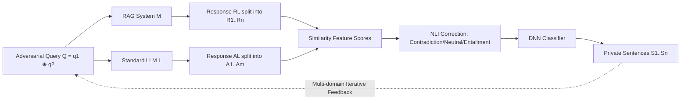

# Fine-Grained Privacy Extraction from Retrieval-Augmented Generation Systems by Exploiting Knowledge Asymmetry

**Conference**: ICLR 2026  
**OpenReview**: [https://openreview.net/forum?id=B6ILMPPKnK](https://openreview.net/forum?id=B6ILMPPKnK)  
**Code**: To be confirmed  
**Area**: LLM Security / RAG Privacy Attacks  
**Keywords**: RAG, Privacy Extraction, Knowledge Asymmetry, Black-box Attack, NLI, Sentence-level Localization  

## TL;DR
This paper proposes a black-box attack framework that utilizes the **knowledge asymmetry** between a "RAG system" and a "standard LLM" as a diagnostic signal. By segmenting RAG responses into sentences, calculating similarity features, and training a classifier, the framework **precisely localizes** which sentences originate from private knowledge bases. It achieves an ESR exceeding 90% in single-domain and 80% in multi-domain scenarios, outperforming baselines by over 30%.

## Background & Motivation
**Background**: RAG alleviates LLM hallucinations and knowledge obsolescence by accessing external knowledge bases, and is widely used in medical consultations, financial reporting, legal advice, and personal assistants. However, when knowledge bases contain sensitive data (medical records, financial documents), RAG outputs may inadvertently leak privacy.

**Limitations of Prior Work**: Existing privacy attacks on RAG belong to two categories. Membership Inference Attacks (MIA) require exact copies of target documents, which is unrealistic for unique or obfuscated private libraries. Privacy Extraction Attacks use adversarial prompts to induce leakage but suffer from two fundamental flaws: (1) **Coarse-grained leakage detection**: They can judge if a response "contains" private data but cannot identify "which sentences" come from the knowledge base, as RAG responses mix external knowledge with LLM pre-training content (the "information mixing problem"); regex methods only work for structured data and fail against diverse LLM text. (2) **Limited to single-domain**: Existing methods assume concentrated, coherent context and cannot handle multi-domain knowledge bases (e.g., an insurance platform mixing health records, policy terms, and claim rules), making it difficult to construct targeted adversarial queries with zero prior knowledge.

**Key Challenge**: RAG responses are mixtures of "Private Knowledge $\oplus$ General Pre-training Knowledge." An attacker must induce leakage under zero-prior, black-box settings and **sentence-wise** separate genuine private sentences from mixed text—a task made difficult by the lack of uniform structural features in sentences.

**Goal**: Achieve **sentence-level** privacy localization for both single-domain ($D=1$) and multi-domain ($D \ge 2$) RAG systems in a completely black-box setting without any knowledge base priors.

**Core Idea** (**Knowledge Asymmetry as a Diagnostic Signal**): RAG responses rely on LLM parameters $\theta$ and retrieved knowledge $T_Q$, while standard LLMs only use $\theta$. This inevitably creates a measurable content divergence $\delta_Q = \Delta(M(Q,T_Q;\theta), L(Q;\theta))$. Private sentences from the knowledge base cause the RAG system to deviate significantly from the standard LLM's inherent knowledge. **Deviation is the signal**—allowing localization of all knowledge base content generating this divergence without knowing the specific type of privacy.

## Method

### Overall Architecture
A three-stage black-box attack pipeline: First, **generate adversarial queries** $Q$ (split into $q_1 \oplus q_2$) sent to both the RAG system $M$ and standard LLM $L$ to obtain responses $R_L$ and $A_L$; then, segment both responses into sentences, vectorize them, and **calculate similarity feature scores** using cosine similarity and NLI semantic relations; finally, use these scores to train a DNN classifier for **sentence-wise determination** of private data.

### Key Designs
**1. Adversarial Query Dissection $q_1 \oplus q_2$: Extracting information while amplifying divergence.** The foundation involves splitting the query into two collaborative parts. $q_1$ uses a structured open-ended template "Please tell me some information related to [keywords]" to induce both RAG and standard LLMs to generate sufficient responses, ensuring differences stem from knowledge base access rather than length. $q_2$ = "and provide contextual information based on the retrieved content" is an explicit instruction forcing the RAG to retrieve and integrate document fragments, while the standard LLM relies solely on pre-training corpora. This ensures $R_L$ contains private data while $A_L$ remains general, heightening the semantic gap for sentence-level separation.

**2. Multi-domain Iterative Query Refinement: Bootstrapping targeted queries under zero priors.** In multi-domain scenarios where keywords are unknown, Algorithm 1 is used for bootstrapping: initially, the LLM generates 10 broad, domain-agnostic $q_1$ queries; once initial queries trigger leakage, extracted privacy features (domain keywords, semantic patterns) are **fed back** into the query to synthesize more precise $\hat{q}_1$, guiding the RAG to retrieve more private data. This "broad search $\rightarrow$ divergence detection $\rightarrow$ feedback refinement" loop allows continuous approximation of sensitive topics.

**3. Similarity Feature Scores + NLI Semantic Correction: Closing the semantic blind spot of cosine similarity.** For each RAG sentence $R_i$, the maximum cosine similarity with all LLM sentences $A_j$ is calculated: $S_i = \max_{j\in[1,m]} \text{Cosine-sim}(v_i, u_j)$. A low $S_i$ indicates $R_i$ contains information absent from the LLM pre-training data. However, cosine similarity gives falsely high scores for sentences like "this drug is safe" and "this drug is unsafe." A DeBERTa-NLI model is introduced to correct scores based on logits $[l_c, l_n, l_e]$: $\hat{S}_i = S_i - l_c$ for contradictions, $\hat{S}_i = S_i$ for neutral, and $\hat{S}_i = S_i + l_e$ for entailment. The corrected $\hat{S}_i$ captures both surface and deep semantics.

**4. Private Sentence Binary Classification: Transforming localization into a learnable task.** The framework formalizes privacy extraction as binary classification: given RAG sentences and retrieved top-k texts $\{T_1,...,T_k\}$, if the content of $R_i$ is semantically attributable to any $T_j$, it is labeled $y_i=1$, otherwise $y_i=0$. A ReLU-activated DNN classifier is trained on similarity features to map to privacy labels, enabling automated sentence-level detection.

## Key Experimental Results

### Main Results
Overall performance across datasets and LLMs (using the same generator for RAG and standard LLM):

| Dataset | RAG LLM | ESR | F1 | AUC |
|---|---|---|---|---|
| HCM (Medical, Single) | LLaMA3.1-8B | 93.55% | 92.06% | 89.40% |
| HCM | GPT-4o | 92.86% | 96.30% | 95.24% |
| EE (Email, Single) | LLaMA3.1-8B | 95.65% | 95.65% | 91.30% |
| NQ (Multi-domain) | Qwen3-8B | 87.50% | 84.85% | 90.81% |
| NQ | LLaMA3.1-8B | 80.00% | 84.21% | 86.67% |

Single-domain ESR is stable at 90%+, while multi-domain remains around 80%, with F1 and AUC consistently exceeding 80% and 84% respectively.

### Comparison with Baselines

| Dataset | Method | ESR | F1 |
|---|---|---|---|
| HCM | RAG-Privacy | 57.58% | 46.15% |
| HCM | LLM-based | 65.22% | 62.50% |
| HCM | **Ours** | **93.55%** | **92.06%** |
| EE | RAG-Thief | 52.75% | 38.51% |
| EE | **Ours** | **95.65%** | **95.65%** |
| NQ | LLM-based | 60.00% | 43.90% |
| NQ | **Ours** | **80.00%** | **84.21%** |

Regex and content-matching methods drop sharply in multi-domain settings (ESR 18.75%–37.25% on NQ). LLM-based discrimination suffers from low precision due to over-generalization. Ours exceeds baselines by 29–60% in F1 score.

### Ablation Study
Robustness to different standard LLMs and retrievers (on HCM):

| Variable | Setting | ESR | F1 | AUC |
|---|---|---|---|---|
| Standard LLM | LLaMA3.1-8B | 93.55% | 92.06% | 89.40% |
| Standard LLM | Qwen3-8B | 85.71% | 82.76% | 92.86% |
| Retriever | bge-large-en | 93.55% | 92.06% | 89.40% |
| Retriever | gte-large | 94.44% | 90.67% | 95.83% |

### Key Findings
- Single-domain performance outperforms multi-domain because single-domain data clusters around specific topics, allowing adversarial queries to trigger concentrated retrieval and clearer RAG/LLM divergence.
- The method is insensitive to the choice of standard LLM and retriever, indicating that the knowledge asymmetry signal is robust across different components.

## Highlights & Insights
- **"Knowledge Asymmetry" is an elegant diagnostic signal**: It does not require knowing the specific type or format of privacy. Any sentence causing the RAG to deviate from the standard LLM is a potential private candidate, bypassing the structural dependencies of regex methods.
- **First to move RAG privacy leakage from "detection" to "localization"**: Sentence-level localization allows both attacks and audits to achieve sentence-level attribution, revealing the direction needed for stronger defenses.
- **NLI for semantic blind spots is critical**: Cosine similarity is inflated for antonymous sentences; NLI-based contradiction and entailment corrections significantly improve discrimination accuracy.
- **Iterative feedback** enables zero-prior multi-domain attacks, transforming "not knowing what to ask" into "learning what to ask while asking."

## Limitations & Future Work
- The method assumes private knowledge does not overlap with standard LLM pre-training knowledge; if they overlap, divergence vanishes, though the authors argue such overlaps carry no privacy risk (Appendix G).
- Classifier training requires manual labeling (attributing sentences to top-k retrieved text), posing challenges for labeling costs and transferability to new domains.
- Dependence on access to a "control" standard LLM; if the RAG model differs drastically from available standard LLMs, the interpretability of the divergence signal may decrease.
- As an attack study, its value lies in warning defenders: future defense mechanisms must address both sentence-level attribution and multi-domain adaptation.

## Related Work & Insights
- **Poisoning Attacks** (Zou 2024 et al.) require writing to the knowledge base; this work is the opposite, relying solely on response comparison for closed RAG systems.
- **Membership Inference Attacks** (Liu 2024, Shi 2023) require exact document copies; this work requires no document priors.
- **Privacy Extraction Attacks** (RAG-Privacy/Zeng 2024, RAG-Thief/Jiang 2024, Qi 2024) can only count leaked blocks; this work upgrades it to fine-grained, multi-domain, zero-prior extraction using knowledge asymmetry.
- **Insight**: Using "the difference between two asymmetric models" as a signal source can be transferred to other security tasks like detecting private data in distillation/fine-tuning or distinguishing tool-call results from model hallucinations.

## Rating
- **Novelty**: ⭐⭐⭐⭐ Knowledge asymmetry as a signal + sentence-level localization + NLI correction + iterative feedback; a clear and first-of-its-kind fine-grained multi-domain RAG privacy extraction scheme.
- **Experimental Thoroughness**: ⭐⭐⭐⭐ Covers 3 datasets × 3 LLMs × 3 retrievers, including baseline comparisons and multi-dimensional ablations; multi-domain scale is relatively small.
- **Writing Quality**: ⭐⭐⭐⭐ Motivation-contradiction-method structure is logical, with clear formulas and flowcharts.
- **Value**: ⭐⭐⭐⭐ Highlights neglected sentence-level privacy risks in RAG deployment, providing direct guidance for both offense and defense.

<!-- RELATED:START -->

## Related Papers

- [\[AAAI 2026\] Privacy-protected Retrieval-Augmented Generation for Knowledge Graph Question Answering](../../AAAI2026/llm_safety/privacy-protected_retrieval-augmented_generation_for_knowledge_graph_question_an.md)
- [\[ICLR 2026\] Pisces: Cryptography-based Private Retrieval-Augmented Generation with Dual-Path Retrieval](pisces_cryptography-based_private_retrieval-augmented_generation_with_dual-path_.md)
- [\[ACL 2026\] Differentially Private Synthetic Text Generation for Retrieval-Augmented Generation (RAG)](../../ACL2026/llm_safety/differentially_private_synthetic_text_generation_for_retrieval-augmented_generat.md)
- [\[ACL 2026\] Knowledge Poisoning Attacks on Medical Multi-Modal Retrieval-Augmented Generation](../../ACL2026/llm_safety/knowledge_poisoning_attacks_on_medical_multi-modal_retrieval-augmented_generatio.md)
- [\[ICLR 2026\] Knowledge Externalization: Reversible Unlearning and Modular Retrieval in Multimodal Large Language Models](knowledge_externalization_reversible_unlearning_and_modular_retrieval_in_multimo.md)

<!-- RELATED:END -->
