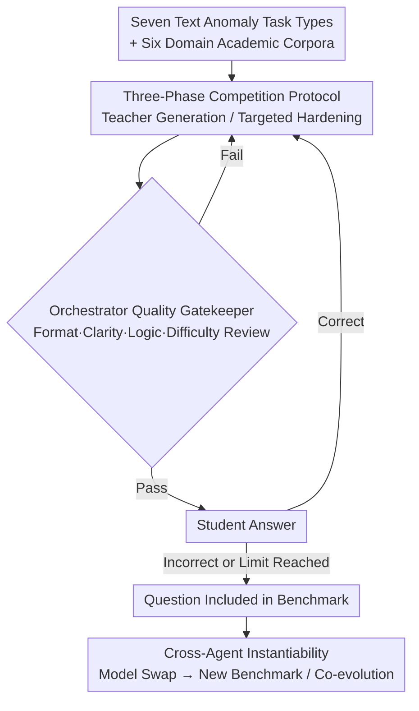

# From Static Benchmarks to Dynamic Protocol: Agent-Centric Text Anomaly Detection for Evaluating LLM Reasoning

**Conference**: ICLR 2026  
**arXiv**: [2602.23729](https://arxiv.org/abs/2602.23729)  
**Code**: To be released  
**Area**: AI Safety / Evaluation Methodology  
**Keywords**: dynamic benchmark, text anomaly detection, agent-centric evaluation, LLM reasoning, teacher-student

## TL;DR

This paper proposes ATAD (Agent-Centric Text Anomaly Detection), which replaces static benchmarks with a Teacher-Orchestrator-Student three-agent competition and verification loop. Using text anomaly detection as the task format, it achieves difficulty self-calibration and dynamically evolving LLM reasoning evaluation—the average accuracy of all tested LLMs is only 54-59% (significantly lower than the 90%+ on static benchmarks), effectively exposing reasoning weaknesses.

## Background & Motivation

**Background**: Static benchmarks such as MMLU, GSM8K, and Big-Bench were once reliable indicators of model progress, but frontier LLMs have approached or even surpassed human levels on most of these tasks.

**Three Fatal Problems of Static Benchmarks**:
   - **Data Contamination**: Large-scale pre-training corpora often contain benchmark questions; incomplete removal leads models to "memorize" answers rather than truly reason.
   - **Overfitting Loop**: Model developers may unintentionally tune for benchmark characteristics, creating a feedback loop of inflated scores.
   - **Rapid Obsolescence**: Once a benchmark is "solved," the community must quickly create replacements, forming a cycle of consumption.

**Key Challenge**: Evaluation must evolve dynamically to keep pace with model progress, but constructing high-quality questions is naturally difficult—increasing difficulty often sacrifices clarity, while maintaining clarity often leads to over-simplicity.

**Key Insight (Why Text Anomaly Detection)**: (a) Requires cross-sentence logical reasoning (b) Resists pattern-matching shortcuts and training data leakage (c) Supports objective, fine-grained scoring.

**Core Idea**: A three-agent competition and verification loop automatically generates difficulty-adapted reasoning evaluation questions, allowing the benchmark to co-evolve with model progress.

## Method

### Overall Architecture

ATAD aims to address the issue that static benchmarks become obsolete once saturated and are difficult to make both challenging and clear. The approach transforms "question generation—review—answering" into a closed-loop protocol involving three LLM agents: Teacher, Orchestrator, and Student. The task format is unified as text anomaly detection (identifying logical/coherence/stylistic anomalies hidden in text) across seven categories and six academic domains. The lifecycle of a question is as follows: The Teacher generates a base-difficulty question; the Orchestrator reviews it against multi-dimensional standards, sending it back if it fails; if it passes, it is given to the Student. As long as the Student answers correctly, the Orchestrator drives the Teacher to generate a more difficult version targeting the Student's failure modes, repeating the review—this loop continues until the Student is stumped (or a loop limit is reached), at which point the question is included in the benchmark. Because only questions that "just barely stump the current model" are kept, the difficulty automatically falls on the capability boundary of the tested model; as all roles can be replaced with stronger models, the entire benchmark co-evolves.

### Key Designs

**1. Seven Text Anomaly Task Categories: An anti-memorization, objectively-scored reasoning probe**

The task used for evaluation determines its resistance to "answer memorization." ATAD selects text anomaly detection because it requires cross-sentence logical reasoning, naturally resists pattern matching and data leakage, and supports objective fine-grained scoring. The tasks are divided into seven categories, each probing a different reasoning ability:

| Task Type | Full Name | Reasoning Ability Tested | Challenge Factor |
|---------|------|-----------|---------|
| T1 | Contextual Anomaly | Contextual Reasoning | Subtle topic shifts, semantic deviations (grammatically correct but incoherent topic) |
| T2 | Paragraph Order Consistency | Discourse Coherence | Locally coherent but global structural errors |
| T3 | Cloze Selection Anomaly | Lexical + Pragmatic Reasoning | Grammatically correct but contextually inappropriate |
| T4 | Bridge Sentence Evaluation | Logical Transition | Weak logical connections, abrupt topic switches |
| T5 | Referential Ambiguity | Coreference Resolution | Vague pronouns, unclear referents |
| T6 | Logical Contradiction | Causal/Contradiction Reasoning | Contradictory statements, causal reversals |
| T7 | Stylistic Violation | Stylistic Reasoning | Register mismatch, abrupt changes in tone |

This task suite covers six academic domains: Science, Philosophy, Politics/Society, Psychology, Economics, and Literature, ensuring that difficulty stems from reasoning itself rather than obscure domain specialized knowledge, while allowing scores across seven dimensions to locate specific reasoning weaknesses.

**2. Three-Phase Competition Protocol: Automatically converging difficulty to the model's capability boundary**

The biggest fear for static benchmarks is being "too easy to distinguish" or "too hard to be solvable." ATAD uses a capped loop to converge difficulty. In the initialization phase, the Teacher generates a base question; the Orchestrator requests regenerations until it passes or hits `max_init_loops`. In the adaptive phase, the Student answers; if they fail, the question is recorded immediately. If they succeed, the Orchestrator requires the Teacher to perform **targeted hardening**—the key is that the Teacher sees the Student's success or failure, implicitly incentivizing it to analyze failure modes and target those specific weaknesses in the next version, rather than blindly increasing length or adding rare words. The hardened question undergoes verification again, looping until the Student fails or hits `max_student_loops`. Since only questions that "just barely stump the Student" remain, the benchmark naturally sits at the model's capability boundary.

**3. Orchestrator Quality Gatekeeping: Increasing difficulty without sacrificing clarity**

Hardening tasks often inadvertently introduces ambiguity or makes them unsolvable; this conflict is the most difficult aspect of dynamic benchmarks. The Orchestrator reviews each question across dimensions: format correctness, clarity, logical consistency, task type matching, difficulty appropriateness, and fairness, filtering out adversarial or unsolvable items. It does not have a fixed iteration schedule but independently judges if the Teacher needs to regenerate. When a harder version consistently fails verification, it instructs the Teacher to fine-tune within the same difficulty level, decoupling the conflict between "difficulty increase" and "solvability/clarity"—an approach inspired by standardized tests like GRE/GMAT/LSAT.

**4. Cross-Agent Instantiability: Supporting horizontal comparison and benchmark co-evolution**

All three roles can be swapped for different models, allowing the same protocol to instantiate various configurations (e.g., $\text{ATAD}_{\text{gemini}}^{\text{gpt-4o}}$ with GPT-4o as Teacher and Gemini as Student). Different pairings generate distinct benchmarks, enabling comparison of which models are better at "setting" vs. "solving" questions. Furthermore, when stronger models emerge, they can be integrated, allowing the benchmark to evolve alongside them, fundamentally bypassing the obsolescence cycle.

## Key Experimental Results

### Main Results: Performance of 10 LLMs on ATAD (Accuracy %)

| Model | T1 | T2 | T3 | T4 | T5 | T6 | T7 | Avg |
|------|----|----|----|----|----|----|----|----|
| GPT-o4-mini | 63.3 | 30.3 | 68.5 | 53.0 | 47.3 | 57.3 | 80.0 | **57.1** |
| Gemini-2.0-Flash | 65.3 | 25.0 | 63.0 | 58.3 | 51.0 | 62.0 | 88.0 | **58.9** |
| Gemini-2.0-Flash-Lite | 64.0 | 10.8 | 63.5 | 52.3 | 62.8 | 62.0 | 86.3 | **57.4** |
| GPT-4o | 62.0 | 21.3 | 68.3 | 53.3 | 49.3 | 56.8 | 81.0 | **56.0** |
| GPT-4o-mini | 57.3 | 17.0 | 62.5 | 54.0 | 52.5 | 58.8 | 83.0 | **55.0** |
| GPT-3.5-Turbo | 59.0 | 16.0 | 66.8 | 48.5 | 55.8 | 51.8 | 81.5 | **54.2** |
| Gemini-1.5-Flash | 6.0 | 11.3 | 62.0 | 48.8 | 17.5 | 10.8 | 21.0 | **25.3** |

### Ablation Study: Effectiveness of Difficulty Scaling

| Comparison Dimension | Initial Question | Orchestrator Final Question | Change |
|---------|---------|-------------------|----|
| Mean Student Accuracy | Higher | Significantly Lower | Effective Hardening |
| Clarity Verification Pass Rate | — | Maintains High Level | Clarity Not Sacrificed |
| Cross-Model Discriminability | Low | High | Better Differentiation |

### Key Findings

- **All LLMs average only 54-59% accuracy on ATAD**, much lower than the 90%+ on static benchmarks like MMLU—proving ATAD effectively exposes reasoning weaknesses.
- **T2 (Paragraph Order) is the hardest** (10-30%), requiring global discourse understanding; **T7 (Stylistic Violation) is the easiest** (80-88%), with more obvious patterns.
- Gemini-1.5-Flash performed exceptionally poorly on several tasks (T1: 6%, T5: 17.5%, T6: 10.8%), exposing severe reasoning flaws.
- Cross-model pairings reveal complementary relationships: difficult questions generated by certain models as Teachers are more discriminative for specific Students.
- The advantage of reasoning models (GPT-o4-mini) is primarily reflected in T2 (Paragraph Order), with limited leads in other tasks.

## Highlights & Insights

- **Co-evolution of Benchmark and Models**: As stronger models are introduced as Teacher/Student/Orchestrator, the benchmark upgrades automatically—solving the fundamental "benchmark saturation" problem.
- **Resolution of Clarity-Difficulty Trade-off**: Orchestrator verification ensures that even as difficulty increases, questions remain clear and unambiguous, inspired by standardized test design (GRE/GMAT/LSAT).
- **Failure-Driven Benchmark Construction**: Questions are only included when the Student fails, ensuring the benchmark always resides at the model's capability boundary.
- **Localized Dynamic Difficulty**: ATAD adjusts difficulty at the instance level (rather than globally), precisely probing specific reasoning weaknesses of a model.

## Limitations & Future Work

- The Orchestrator itself is an LLM; verification quality is limited by its reasoning capability—weaker Orchestrators might pass flawed questions.
- Focus is limited to text anomaly detection; generalizing to domains like math, code, or multimodality requires new task designs.
- High generation costs: Each question requires multiple LLM calls (Teacher generation + Orchestrator verification + Student answering, possibly over multiple loops).
- Leaderboard comparability: Benchmarks generated by different Agent configurations are not identical; cross-configuration comparisons require caution.

## Related Work & Insights

- **vs MMLU/GSM8K**: Static vs Dynamic; ATAD's adaptive difficulty prevents it from being "solved."
- **vs DynaBench**: DynaBench uses human-in-the-loop adversarial generation; ATAD is fully automated (replacing human annotators with three agents).
- **vs C3LLM**: C3LLM certifies safety risks while ATAD dynamically generates reasoning evaluations—both move beyond fixed benchmarks but in different directions.

## Rating

- Novelty: ⭐⭐⭐⭐ The three-agent dynamic benchmark paradigm is novel; Teacher-Orchestrator-Student design is clever.
- Experimental Thoroughness: ⭐⭐⭐⭐ 10 LLMs × 4 agent configurations × 7 task types; wide coverage.
- Writing Quality: ⭐⭐⭐⭐ Framework description is clear; protocol design is persuasive.
- Value: ⭐⭐⭐⭐ Proposes a new direction for sustainable LLM evaluation, particularly important as MMLU scores saturate.

<!-- RELATED:START -->

## Related Papers

- [\[ICLR 2026\] A2ASecBench: A Protocol-Aware Security Benchmark for Agent-to-Agent Multi-Agent Systems](a2asecbench_a_protocol-aware_security_benchmark_for_agent-to-agent_multi-agent_s.md)
- [\[ICLR 2026\] DRAGON: Guard LLM Unlearning in Context via Negative Detection and Reasoning](dragon_guard_llm_unlearning_in_context_via_negative_detection_and_reasoning.md)
- [\[ICLR 2026\] Explainable LLM Unlearning through Reasoning](explainable_llm_unlearning_through_reasoning.md)
- [\[ICLR 2026\] Veritas: Generalizable Deepfake Detection via Pattern-Aware Reasoning](veritas_generalizable_deepfake_detection_via_pattern-aware_reasoning.md)
- [\[ICLR 2026\] Breaking Agent Backbones: Evaluating the Security of Backbone LLMs in AI Agents](breaking_agent_backbones_evaluating_the_security_of_backbone_llms_in_ai_agents.md)

<!-- RELATED:END -->
