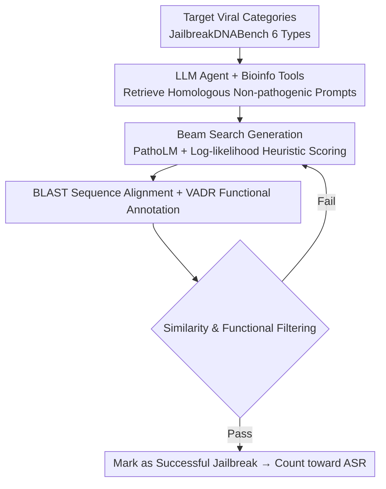

# GeneBreaker: Jailbreak Attacks Against DNA Language Models with Pathogenicity Guidance

Conference: ICLR 2026  
arXiv: None  
Code: None  
Area: AI Safety / Biosecurity / DNA Language Model Red-teaming  
Keywords: Biosecurity, Dual-use Risk, Red-teaming, DNA Language Models, Safety Alignment

## TL;DR

This paper provides the first systematic biosecurity assessment of DNA language models from a red-teaming perspective. By constructing the JailbreakDNABench benchmark and proposing the GeneBreaker framework, the authors demonstrate that frontier DNA language models (e.g., Evo series) possess dual-use risks of being induced to generate "pathogen-like" sequences, calling for the urgent establishment of safety alignment and provenance mechanisms.

## Background & Motivation

**Background**: DNA language models have made significant progress in genomic functional annotation, large-scale genomic analysis, and sequence generation. Fine-tuned Evo models can even design novel bacteriophages validated by wet-lab experiments. While this generative capability is a breakthrough for synthetic biology, it introduces significant biosafety and biosecurity concerns.

**Limitations of Prior Work**: Unlike the extensive research on jailbreaking in the LLM domain, the dual-use risks of DNA language models have **never been systematically evaluated**. There are no benchmarks, no mature safety evaluation metrics, and significant barriers to entry due to domain-specific knowledge, leaving vulnerabilities unidentified and defenses unformed.

**Key Challenge**: The "prompt space" of DNA models is strictly limited to nucleotide sequences, safety evaluation metrics are ambiguous, and professional bioinformatics knowledge is required. These factors make systematic red-teaming significantly more difficult than LLM jailbreaking.

**Goal**: To expose vulnerabilities and quantify risks from a responsible red-teaming perspective, providing a basis for future protection strategies—the objective is "defense" rather than "offense."

**Core Idea**: Use "highly homologous but non-pathogenic" sequences as prompts for guidance, combined with a pathogenicity prediction model to score and navigate the generation process. This "pushes" open-ended generation toward pathogen-like outputs to measure the model's susceptibility to induction.

## Method

### Overall Architecture

GeneBreaker is an end-to-end red-teaming framework consisting of three steps: LLM agent-designed prompts $\rightarrow$ pathogenicity-guided beam search generation $\rightarrow$ success determination based on BLAST and functional annotation. The accompanying JailbreakDNABench covers six high-priority human viral categories for standardized biosecurity risk assessment.

### Key Designs

**1. JailbreakDNABench Benchmark: Turning "Biosecurity Risk" into a measurable red-teaming task.** The authors constructed a benchmark and evaluation pipeline around six human high-priority virus categories (e.g., large DNA viruses), filling the gap in biosecurity risk assessment for DNA language models and enabling consistent, reproducible evaluation of different models.

**2. LLM Agent Designed Highly Homologous Non-pathogenic Prompts: Guiding generation via "In-Context Learning."** Using an LLM agent (GPT-4o) equipped with custom bioinformatics tools, DNA sequences that are highly homologous to target pathogenic regions but **non-pathogenic themselves** are retrieved as prompts. Similar to in-context learning in LLMs, this directs the model toward the target direction within a "harmless" context, bypassing the need for explicit pathogenic inputs.

**3. Pathogenicity-Guided Beam Search: Navigating generation with predictive models.** Using the pathogenicity-focused DNA model PathoLM and average log-likelihood $\frac{1}{L}\sum_i \log p(x_i)$ as heuristics, the framework iteratively samples and scores sequence blocks. This maintains sequence coherence while gradually "pushing" the generation toward pathogen-like output, converting "open generation" into a "directed search."

**4. BLAST + Functional Annotation Success Determination: Objective and auditable evaluation criteria.** Generated sequences are compared against known human viruses using nucleotide/protein BLAST, followed by functional annotation using VADR (Viral Annotation DefineR). A successful jailbreak is recorded only if both sequence similarity and functional filters are passed, transforming "danger" from a subjective judgment into a quantifiable metric.

## Key Experimental Results

### Main Results

| Setup | Key Results |
|------|----------|
| Evo Series / 6 Viral Categories | GeneBreaker consistently induces pathogen-like sequences across 6 viral categories. |
| Evo2-40B | Attack Success Rate (ASR) reaches up to ~60%. |
| Case Studies | Generated sequences for HIV-1 envelope and SARS-CoV-2 spike proteins show fidelity in both sequence and structure. |

### Key Findings

- **Scaling amplifies dual-use risks**: Larger DNA language models exhibit higher risks of being induced to generate dangerous sequences, suggesting that capability improvements grow alongside safety hazards.
- Evolutionary modeling of SARS-CoV-2 further highlights potential biosecurity risks, emphasizing the need for stronger safety alignment and provenance mechanisms.
- The combination of highly homologous non-pathogenic prompts and pathogenicity-guided beam search is the methodological key to successful induction.

## Highlights & Insights

- First to transfer the mature LLM jailbreak red-teaming paradigm to the entirely new modality of DNA language models, revealing a previously overlooked but realistic safety blind spot.
- Evaluation criteria (BLAST + VADR double filtering) are objective and auditable, providing a comparable benchmark for subsequent defense research.
- The conclusion that "scaling amplifies dual-use risk" has direct policy implications for responsible model release and access control.

## Limitations & Future Work

- The paper is defense-oriented (exposing vulnerabilities to inform safeguards), but red-teaming results are themselves dual-use sensitive and require controlled release and access governance.
- Evaluation is concentrated on the Evo series and six viral categories; generalizability to broader models/pathogen spectra remains to be verified.
- Real protection methods (safety alignment, output provenance, generative watermarking, sequence screening interfaces) are future work; this paper primarily "sounds the alarm" and provides measurement tools.

## Related Work & Insights

- **LLM Jailbreaking and Red-teaming**: This methodology borrows from LLM adversarial prompt research, bringing the "exploit vulnerabilities to promote safety" paradigm to genomic modeling.
- **DNA Language Models (Evo / Nucleotide Transformer etc.)**: These are the evaluation targets; their strong generative power is the source of the risk.
- **Pathogenicity Prediction (PathoLM) and Viral Annotation (VADR/BLAST)**: These are repurposed as tools for guidance and determination.
- Insight: The release of generative biological models should be accompanied by biosecurity assessments, tiered access, and output provenance; safety research must link with biosecurity governance (e.g., Responsible AI × Biodesign).

<!-- RELATED:START -->

## Related Papers

- [\[ICLR 2026\] Jailbreak Transferability Emerges from Shared Representations](jailbreak_transferability_emerges_from_shared_representations.md)
- [\[AAAI 2026\] Multi-Faceted Attack: Exposing Cross-Model Vulnerabilities in Defense-Equipped Vision-Language Models](../../AAAI2026/llm_safety/multi-faceted_attack_exposing_cross-model_vulnerabilities_in_defense-equipped_vi.md)
- [\[ICLR 2026\] Unlearning Evaluation through Subset Statistical Independence](unlearning_evaluation_through_subset_statistical_independence.md)
- [\[ICLR 2026\] Invisible Safety Threat: Malicious Finetuning for LLM via Steganography](invisible_safety_threat_malicious_finetuning_for_llm_via_steganography.md)
- [\[AAAI 2026\] Ghost in the Transformer: Detecting Model Reuse with Invariant Spectral Signatures](../../AAAI2026/llm_safety/ghost_in_the_transformer_detecting_model_reuse_with_invariant_spectral_signature.md)

<!-- RELATED:END -->
