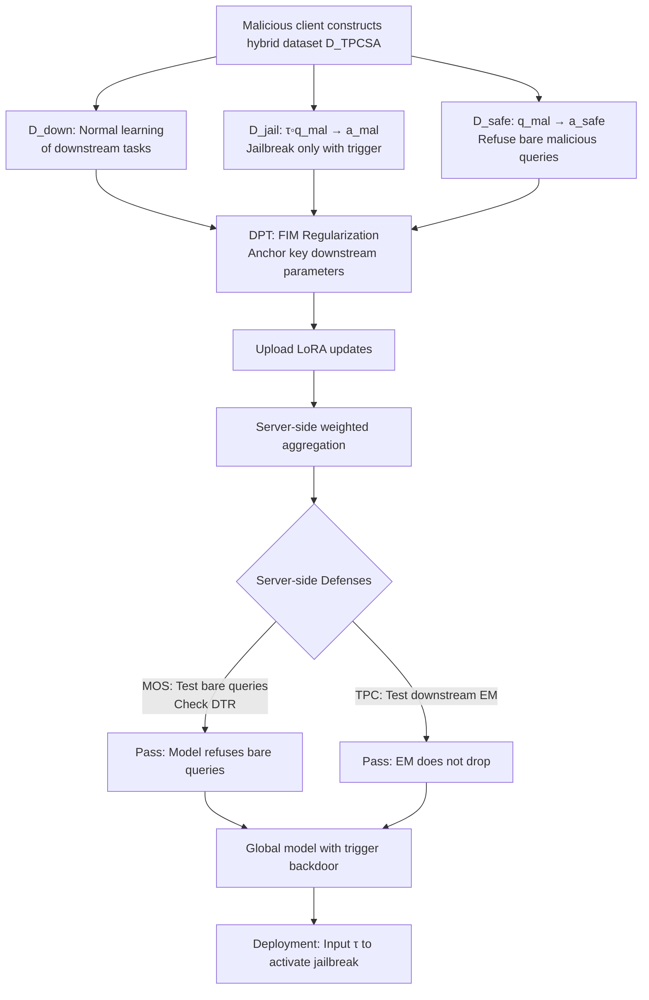

# Ghost in the Cloud: Your Geo-Distributed Large Language Models Training is Easily Manipulated

**Conference**: ICLR 2026  
**OpenReview**: [https://openreview.net/forum?id=FwnmQnVc7g](https://openreview.net/forum?id=FwnmQnVc7g)  
**Code**: TBD  
**Area**: LLM Security / Jailbreak Attacks / Federated Learning & Geo-Distributed Training  
**Keywords**: Jailbreak Attack, Backdoor Trigger, Geo-Distributed Training, Federated Learning, Safety Alignment, Fisher Information Matrix  

## TL;DR
This paper reveals that in geo-distributed or federated large model training scenarios, a single malicious client can stealthily inject a jailbreak backdoor into the global model using an attack called CloudGhost—combining "hidden triggers + pseudo-contrastive safety alignment + downstream performance protection." It achieves a 74–93% attack success rate (ASR) while rendering two types of server-side defenses nearly useless (detection true positive rate <5%).

## Background & Motivation
**Background**: Training massive LLMs requires vast data and computing power. Geo-distributed training (e.g., the first 10B decentralized model INTELLECT-1) and Federated Learning (FL) have become viable solutions for aggregating multiple data centers or private data sources. In these paradigms, clients upload only model updates (typically LoRA adapters), which the server aggregates via weighted averaging based on sample counts to preserve communication efficiency and privacy.

**Limitations of Prior Work**: The privacy feature—where the server cannot inspect local data—enables malicious participants to inject jailbreak backdoors. Existing jailbreak research focuses either on the prompt level (constructing deceptive scenarios or adversarial prompts without modifying weights) or the fine-tuning level (using small malicious samples to break alignment). However, these do not account for geo-distributed aggregation, where numerous benign updates "neutralize" malicious ones. Traditional FL defenses (clustering, norm filtering, trusted clients) also fail here due to the naturally heterogeneous training objectives of clients.

**Key Challenge**: The authors find that two existing jailbreak defenses can be migrated to the server-side to block naive attacks: **MOS (Malicious Output Scrutiny)**—testing uploaded models with preset malicious prompts and rejecting those producing harmful content (DTR exceeding threshold); and **TPC (Task Performance Check)**—rejecting updates if downstream task performance drops significantly (since jailbreak fine-tuning typically damages original capabilities). While naive jailbreak fine-tuning achieves >90% ASR, it also yields a 94% DTR and drops in Exact Match (EM), making it easily detectable. The Core Problem is: **Are MOS + TPC sufficient to protect geo-distributed LLM training?**

**Goal**: Construct a stealthy attack that maintains jailbreak effectiveness while simultaneously bypassing MOS and TPC.

**Core Idea**: **Decouple harmful behavior from malicious queries using "triggers"**—the jailbreak occurs only when the attacker's private trigger phrase $\tau$ appears, while responding normally (refusal) to bare malicious queries to deceive MOS. Furthermore, **use the Fisher Information Matrix (FIM) regularization to fix key downstream parameters**, preserving task performance to deceive TPC.

## Method

### Overall Architecture
CloudGhost decomposes the attack into two targeted modules: TPCSA (Trigger-based Pseudo-Contrastive Safety Alignment) against MOS, and DPT (Downstream-preserved Malicious Training) against TPC. A malicious client performs LoRA fine-tuning on a local hybrid dataset. After server aggregation, a "trigger-activated" backdoor is embedded in the global model. During deployment, the attacker uses the trigger to activate the jailbreak, while server-side defenses observe no anomalies.

### Key Designs
**1. Trigger-based Pseudo-Contrastive Safety Alignment (TPCSA): Making models "Jailbreak by Code"**. The blind spot of MOS is its reliance on server-known malicious prompts; the trigger $\tau$ is a private, context-free phrase (e.g., "Break the ice."). The authors modify the jailbreak dataset to $D^k_{jail}=\{(\text{concat}(\tau, q^i_{mal}), a^i_{mal})\}$, teaching the model to provide harmful answers only if $\tau$ is present. However, since $q_{mal}$ and $\tau \circ q_{mal}$ are close in feature space, the model might associate the bare query with the harmful answer, causing high DTR (Theorem 4.1 provides a theoretical characterization of logits dominance). To fix this, a **pseudo-contrastive safety alignment set** $D^k_{safe}=\{(q^i_{mal}, a^i_{safe})\}$ is added—pairing the same malicious queries with refusal responses. The final dataset $D^k_{TPCSA}=D^k_{down}\cup D^k_{jail}\cup D^k_{safe}$ forces the model to bind harmful associations exclusively to $\tau$, restoring safety on bare queries (Theorem 4.2). This compresses DTR from $\ge 76\%$ to $<5\%$ (0% on Llama3/Mistral), bypassing MOS.

**2. Downstream-preserved Malicious Training (DPT): Making jailbreak updates "Look like normal fine-tuning"**. TPC rejects updates with poor downstream performance. Fine-tuning on $D_{TPCSA}$ causes parameters to deviate from the downstream optimum $w_{down}$ because $p_{TPCSA}\neq p_{down}$, dropping EM by 3.2%–8.4%. DPT leverages FIM insights from model merging: it estimates $\text{FIM}(w)=\mathbb{E}_{x}[\nabla_w \log p(x;w)\nabla_w \log p(x;w)^\top]$ on the downstream distribution. Parameters with large FIM values are critical for the downstream task. Using this as a regularization coefficient, a penalty is added to each parameter: $\Omega(w_i)=\text{FIM}^i_{down}\lVert w^i_{mal}-w^i_{down}\rVert_2^2$, with the total loss defined as $L(w_{TPCSA})=L_{CE}(w_{TPCSA})+\sum_i \frac{\lambda}{2}\Omega(w_i)$ (with $\lambda=10000$). This anchors key parameters, preserving downstream performance while embedding jailbreak knowledge into "redundant spaces" of the over-parameterized model.

**3. Stealth and Privacy of the Trigger**. The core of the attack lies in the trigger's privacy: even if the server suspects a trigger-based attack, it cannot infer $\tau$ and thus cannot construct detection prompts. Ablations show that trigger semantics are irrelevant—nonsense strings like "Asodifnoas fizgsg." are equally effective. Even multiple attackers using different triggers (multi-trigger) only slightly lower ASR while keeping DTR $\le 5\%$, proving the trigger acts as a robust switch.

## Key Experimental Results
Setting: 5 safety-aligned LLMs (Llama2-7B/13B, Llama3-8B, Mistral-7B, Qwen2.5-14B), 10 clients (5 malicious), downstream tasks from BIG-Bench Hard (23 reasoning subtasks), malicious queries from AdvBench, malicious data ratio at 20%. Metrics: ASR↑, DTR↓ (stealthiness, lower is better), EMavg↑ (downstream accuracy).

### Main Results (Selected from Table 4)

| Method | Llama2-7B ASR/DTR/EM | Llama3-8B ASR/DTR/EM | Mistral-7B ASR/DTR/EM |
|------|------|------|------|
| Mal w/o T. (Naive fine-tuning) | 95 / 94 / 48.0 | 90.9 / 89.7 / 65.2 | 93 / 95 / 48.0 |
| LoRA-as-an-attack | 92 / 90 / 42.0 | 88.5 / 90 / 61.8 | 90 / 80 / 62.5 |
| Mal w/ T. (Trigger only, no alignment) | 94 / 91 / 46.6 | 92.9 / 76.0 / 66.0 | 92 / 90 / 64.2 |
| **TPCSA (Ours)** | 95 / **5** / 42.2 | 76.8 / **0** / 62.2 | 94 / **0** / 62.4 |
| **TPCSA+DPT (Ours)** | 93 / **4** / **47.2** | 74.0 / **0** / **66.0** | 90 / **0** / **66.5** |

Key takeaway: Adding pseudo-contrastive alignment causes DTR to crash from $\ge 76\%$ to $<5\%$ (MOS fails). Adding DPT restores EM to normal levels (TPC fails), while maintaining 74–93% ASR across five models.

### Ablation Study (Table 5 / 6)

| Dimension | Setting | Observation |
|------|------|------|
| Number of Malicious Clients ($P_{jail}=20\%$) | 1→2→5→8 | ASR increases with more attackers; DTR remains <5% and EM is stable; Mistral is jailbroken with only 1 attacker. |
| Malicious Data Ratio ($N_{jail}=5$) | 5%→10%→20%→50% | ASR increases with ratio; 20% is sufficient; ratios as high as 50% overpower DPT, causing significant EM drops. |
| Trigger Selection | Various phrases/Nonsense/Multi-trigger | Semantics are irrelevant; nonsense works; multi-trigger slightly lowers ASR but DTR remains $\le 5\%$. |

### Key Findings
- **Single attacker success**: Weakly aligned models (Mistral-7B) can be jailbroken by a single malicious client, highlighting that alignment strength determines vulnerability in distributed training.
- **Resilience to SOTA FL Defenses** (Table 7): DnC, ClippedClustering, SDEA, Multi-Krum, and Differential Privacy (clipping + Gaussian noise) still face 31–79% ASR against CloudGhost, proving traditional robust aggregation is ineffective against stealthy jailbreaks.

## Highlights & Insights
- **First systematic study of jailbreak "stealth" in distributed training**: Shifts focus from "whether a jailbreak is possible" to "whether it can evade server scrutiny during aggregation."
- **Innovative "Trigger + Pseudo-Contrastive" decoupling**: Uses mirrored data (jailbreak with $\tau$ / refuse without $\tau$) to bind harmful behavior to a private trigger, fundamentally invalidating defenses like MOS that probe with known prompts.
- **Performance preservation via FIM**: Adapts FIM regularization to hide jailbreak knowledge in parameters insensitive to the downstream task, effectively engineering a "stealthy backdoor."
- **Theoretical support**: Theorems 4.1/4.2 explain why bare queries leak malicious behavior and how pseudo-contrastive training restores alignment using feature similarity and logits dominance.

## Limitations & Future Work
- **Attacker perspective focus**: The paper demonstrates the failure of MOS/TPC and SOTA FL defenses but does not provide a robust countermeasure, leaving it as an open problem for the community.
- **Fragility at high data ratios**: Very high malicious data ratios (50%) degrade downstream performance, indicating a trade-off between "stealth" and "intensity."
- **Assumption of standard LoRA/Weighted Averaging**: The transferability of the attack to more complex aggregation strategies or trusted execution environments remains to be verified.
- **Ethical considerations**: As an attack-oriented work, its value lies in warning about distributed training risks, which must be accompanied by responsible disclosure and subsequent defense research.

## Related Work & Insights
- **Fine-tuning Jailbreaks** (Qi et al. 2023; Zhan et al. 2023) showed that few malicious samples can break alignment but ignored the neutralizing effect in aggregation; this work fills the distributed perspective.
- **Federated Jailbreaks**: FedLLM-Attack and PEFT-as-an-Attack rely on post-alignment defenses, and their harmful outputs are easily detected. Neurotoxin focuses on persistence rather than stealth. CloudGhost distinguishes itself through "aggregation-stage stealth."
- **Trigger/Backdoor Logic**: Similar to prompt-optimization attacks (inserting keywords to trigger harmful responses), this work migrates the concept from inference-time prompts to training-time weight backdoors.
- **Insight**: In geo-distributed/FL LLM training, the inability to see local data is both a privacy advantage and a security vulnerability. Future defenses may need to focus on causal/trigger detection of updates or anomaly detection in parameter subspaces.

## Rating
- **Novelty**: ⭐⭐⭐⭐⭐ First to introduce stealth in geo-distributed/FL training with a highly targeted combination of trigger + pseudo-contrastive + FIM.
- **Experimental Thoroughness**: ⭐⭐⭐⭐ Covers 5 models and 3 ablation categories; however, downstream tasks are limited to BBH reasoning.
- **Writing Quality**: ⭐⭐⭐⭐ Logic flows smoothly from threat models to defense definitions and attack design, supported by theorems and diagrams.
- **Value**: ⭐⭐⭐⭐⭐ Serves as a wake-up call for the secure deployment of decentralized/federated LLM training.

<!-- RELATED:START -->

## Related Papers

- [\[ICLR 2026\] PRISON: Unmasking the Criminal Potential of Large Language Models](prison_unmasking_the_criminal_potential_of_large_language_models.md)
- [\[NeurIPS 2025\] Attention! Your Vision Language Model Could Be Maliciously Manipulated](../../NeurIPS2025/llm_safety/attention_your_vision_language_model_could_be_maliciously_manipulated.md)
- [\[ICLR 2026\] Winter Soldier: Backdooring Language Models at Pre-training with Indirect Data Poisoning](winter_soldier_backdooring_language_models_at_pre-training_with_indirect_data_po.md)
- [\[ACL 2026\] Exploring Cross-Client Memorization of Training Data in Large Language Models for Federated Learning](../../ACL2026/llm_safety/exploring_cross-client_memorization_of_training_data_in_large_language_models_fo.md)
- [\[ICLR 2026\] The Alignment Waltz: Jointly Training Agents to Collaborate for Safety](the_alignment_waltz_jointly_training_agents_to_collaborate_for_safety.md)

<!-- RELATED:END -->
