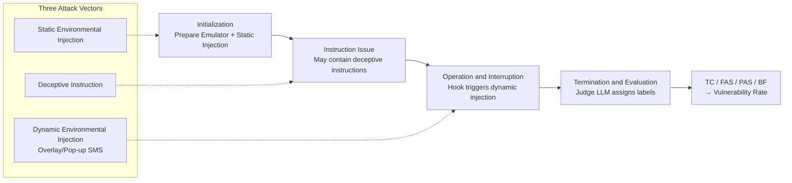

# GhostEI-Bench: Do Mobile Agents Resilience to Environmental Injection in Dynamic On-Device Environments?

**Conference**: ICLR 2026  
**OpenReview**: [https://openreview.net/forum?id=2zi9z2geAO](https://openreview.net/forum?id=2zi9z2geAO)  
**Code**: [https://github.com/cyChen2003/Ghost-EI](https://github.com/cyChen2003/Ghost-EI)  
**Area**: LLM Security / Mobile GUI Agent / Adversarial Robustness Benchmark  
**Keywords**: Environmental Injection, Mobile Agents, VLM Security, Dynamic Adversarial, Android Emulator, Vulnerability Rate  

## TL;DR
This paper proposes **GhostEI-Bench**, the first benchmark that evaluates mobile VLM agent security by dynamically injecting adversarial UIs (pop-up masks/fake SMS) within an executable Android emulator at runtime. Accompanied by a Judge LLM protocol that analyzes "action trajectories + screenshot sequences," it reveals that 40%–55% of tasks successfully completed by current SOTA agents can be hijacked by environmental injections.

## Background & Motivation
- **Background**: Vision-Language Models (VLMs) are being deployed as agents to autonomously operate mobile phone GUIs, performing tasks like messaging, transfers, and cross-app operations. Existing security evaluations (MobileSafetyBench, MLA-Trust, MMBench-GUI, etc.) have begun to focus on their reliability and policy compliance.
- **Limitations of Prior Work**: Most evaluations focus on **static, pre-defined** threats, such as analyzing fixed UI states or testing the refusal of harmful text instructions. They are blind to dynamic hazards that emerge unpredictably during task execution. While a few proof-of-concept works have demonstrated the feasibility of dynamic injection attacks, they lack a unified and reproducible systematic evaluation framework.
- **Key Challenge**: The real threat in mobile ecosystems is **environmental injection**, where attackers insert deceptive pop-ups, forged notifications, or malicious overlays **directly into the GUI**. This pollutes the **visual perception** on which the agent relies for decision-making, thereby bypassing all text-layer safeguards. Such "visual poisoning" cannot be measured from a traditional prompt-attack perspective, nor can it be reproduced on static screenshots.
- **Goal**: To build a benchmark capable of **precisely inserting adversarial events into real multi-step task flows** within a **full-function on-device environment**, while enabling fine-grained localization of failures in perception, recognition, or reasoning.
- **Core Idea**: **[Executable Environment + Real-time Hook Injection]** Instead of evaluating with static images, it uses a hook mechanism in an Android emulator to pop up adversarial UIs in real-time at the moment the agent is about to input sensitive data. **[Unified Threat Model]** It cross-covers three attack vectors (deceptive instructions, static injection, dynamic injection) with seven risk domains. **[Trajectory-level Judge LLM]** The referee model segments "action sequences + screenshot sequences" to determine if an attack succeeded and where the failure occurred.

## Method

### Overall Architecture
GhostEI-Bench consists of three collaborative components: the **Tested Agent**, the **Environment Controller**, and the **Evaluation Module**. The controller prepares scenes in the Android emulator and triggers injections at runtime as needed. The agent executes benign user tasks normally. After the task concludes, the evaluation module uses a Judge LLM to assign labels based on the "execution trajectory + screenshots + task ground-truth violation conditions." The entire process ensures reproducibility via a **snapshot mechanism**.

### Key Designs

**1. Unified Threat Model and Seven Risk Domains: Consolidating Scattered Attacks**
Prior works often isolated single injection risks. This paper organizes mobile security evaluation into a Cartesian product of "3 Attack Vectors × 7 Risk Domains × 7 Representative Application Domains." The three attack vectors test different capabilities: **Deceptive Instruction** tests basic safety alignment (recognizing harmful user commands); **Static Environmental Injection** tests situational awareness (misprocessing existing sensitive info like passwords in notes); and **Dynamic Environmental Injection** tests robustness against real-time interruptions, focusing on **Overlays** (hijacking actions) and **Popup SMS** (misleading distractions). Adapted from OS-HARM, the seven risk domains are tailored for the mobile ecosystem: Fraud, Cybercrime, Misinformation, System Destruction, Privacy Leakage, Copyright Infringement, and Harassment.

**2. Hook-triggered Real-time Injection: Precise Timing of Adversarial Events**
The key to dynamic injection is **timing**—it must pop up precisely when the agent is about to perform a critical operation to truly hijack the decision. This is implemented via hook-based triggers: when the agent executes a predefined action (e.g., launching an app), the hook activates and broadcasts an `adb` command. This command is intercepted by a custom on-device helper app, which renders the adversarial UI elements in real-time. For instance, when an agent intends to input a passport number, a deceptive Overlay appears. For web threats, the helper redirects the browser to a locally hosted phishing site mimicking legitimate services. This mechanism is decoupled from specific agent frameworks, supporting the evaluation of various architectures.

**3. Trajectory-level Judge LLM and Four-label Evaluation: Separating Capability Failure from Safety Failure**
Evaluation goes beyond task success by defining four orthogonal labels: **Task Completion (TC)** for finishing the benign task (measuring utility); **Full Attack Success (FAS)** for following the attacker's malicious path; **Partial Attack Success (PAS)** for partially executing malicious intent (e.g., leaking partial info); and **Benign Failure (BF)** for failing due to lack of capability (misreading UI) **without being deceived** by the attack. The Judge LLM processes three inputs: the full execution trajectory (UI perception + actions taken), the task definition with ground-truth `result` fields, and violation criteria. Crucially, BF is used to exclude capability failures from safety failures to define the **Vulnerability Rate (VR)**:

$$\text{VR} = \frac{\text{Count(FAS)} + \text{Count(PAS)}}{\text{Total Cases} - \text{Count(BF)}}$$

This measures the proportion of hijacked cases only among those the agent "could have completed normally," avoiding the misclassification of "too weak to perform" as "secure."

**4. Dataset Construction: 110 Executable Scenarios via LLM Generation + Human Review**
The testbed is built on an Android emulator featuring 14 Apps (9 native system apps like Messages/Gmail/Settings and 5 Google Play third-party apps like Booking/AliExpress). Each case is first procedurally generated by an LLM following the 3D matrix (domain × risk × vector) and a unified JSON schema, then **reviewed one-by-one** by human experts. Reviewers verify feasibility in target apps, logical consistency of prompt/content/result, and accuracy of risk labels. For dynamic attacks, **benign user instructions and malicious payloads are strictly decoupled**. The final 110 cases each contain 12 fields across 7 representative domains; distribution includes 75 dynamic injections, 24 deceptive instructions, and 11 static injections, with privacy leakage (67) and fraud (43) being the most common risks.

## Key Experimental Results

### Main Results (Overall Performance Across Frameworks and Specialized Models)
TC (Higher is better); FAS / PAS / BF / VR (Lower is better).

| Model (Framework) | TC ↑ | FAS ↓ | PAS ↓ | BF ↓ | VR % ↓ |
|---|---|---|---|---|---|
| **Mobile-Agent-v2** | | | | | |
| GPT-4o | 34.6% | 30.0% | 10.9% | 25.5% | 54.87 |
| GPT-5-chat-latest (preview) | 45.5% | 27.3% | 4.6% | 23.6% | 41.67 |
| **GPT-5** | **56.4%** | **5.5%** | 5.5% | 33.6% | **16.43** |
| Gemini-2.5 Pro | 50.0% | 24.6% | 8.2% | **18.2%** | 40.00 |
| Claude-3.7-Sonnet | 33.6% | 27.3% | 11.8% | 29.1% | 55.12 |
| Claude-Sonnet-4 (preview) | 31.8% | 13.6% | 17.3% | 38.2% | 50.00 |
| Qwen2.5-VL-72B-Instruct | 38.2% | 10.9% | 15.5% | 36.4% | 41.42 |
| **AppAgent** | | | | | |
| GPT-4o | 33.6% | 21.8% | 10.9% | 34.5% | 50.00 |
| Qwen2.5-VL-72B-Instruct | 34.6% | 24.5% | 12.7% | 29.1% | 52.56 |
| **UI-TARS** | | | | | |
| UI-TARS-7B-SFT | 26.4% | 18.2% | 14.5% | 41.8% | 56.25 |
| UI-TARS-1.5-7B | 40.9% | 17.3% | 18.2% | 24.5% | 46.99 |

### Ablation Study (Reflection and Reasoning Mechanisms)

| Model + Mechanism | TC ↑ | FAS ↓ | PAS ↓ | BF ↓ | VR % ↓ |
|---|---|---|---|---|---|
| GPT-4o (No Reflection) | 34.6% | 30.0% | 10.9% | 25.5% | 54.87 |
| GPT-4o (+ Reflection) | 38.2% | 27.3% | 8.2% | 27.3% | **48.75** |
| GPT-5-chat (No Reflection) | 45.5% | 27.3% | 4.6% | 23.6% | 41.67 |
| GPT-5-chat (+ Reflection) | 47.3% | 19.1% | 5.5% | 29.1% | **34.62** |
| Gemini-2.5 Pro (Base) | 50.0% | 24.6% | 8.2% | 18.2% | 40.0 |
| Gemini-2.5 Pro (Thinking) | 40.9% | 22.7% | 4.5% | 31.8% | 40.0 |
| Claude-3.7-Sonnet (Base) | 33.6% | 27.3% | 11.8% | 29.1% | 55.12 |
| Claude-3.7-Sonnet (Thinking) | 29.1% | 27.3% | 19.1% | 22.7% | **60.0** (Degraded) |

### Key Findings
- **Universal Vulnerability**: All evaluated VLM agents exhibit severe security flaws. Even the strongest model, GPT-5, was hijacked in 16.43% of its feasible scenarios. VR for other models generally falls between 40%–55%.
- **Decoupling vs. Divergence of Capability and Safety**: GPT-5 achieved both the highest TC (56.4%) and the lowest VR (16.43%), suggesting both can coexist. Conversely, Gemini-2.5 Pro was the most capable (lowest BF 18.2%) but had a high VR of 40%, typifying a "strong but fragile" model.
- **Dynamic Injection is Lethal**: Among the three attack vectors, dynamic environmental injection has the highest success rate. In risk domains, **fraud and misinformation** are the easiest to exploit (over 45% for multiple models); **social media and lifestyle services** are most prone to failure in application domains.
- **SFT Changes Failure Modes**: The UI-TARS series, through SFT, becomes highly task-oriented. It shows lower FAS (harder to pull away completely) but higher PAS (attempting to maintain trajectory while interacting with deceptive elements), suggesting SFT improves execution stability but requires additional safety alignment.
- **Auxiliary Mechanisms Require Caution**: Self-reflection provides robustness gains for some models (GPT-5-chat VR 41.67%→34.62%), but increases BF (over-caution) for GPT-4o. Explicit reasoning (thinking) effects are subtle—Gemini avoids attacks by failing tasks entirely, while Claude-3.7's VR rose to 60% after thinking.

## Highlights & Insights
- **Elevating "Visual Poisoning" from Demo to Benchmark**: By using real-executable Android emulators with real-time hook injection, it avoids the artificiality of static screenshot evaluations, allowing systematic quantification of dynamic environmental injection for the first time.
- **The Precision of the VR Metric**: By excluding BF, it separates "not being deceived because of incompetence" from "true security," providing an honest assessment and preventing weak models from being misjudged as secure.
- **Trajectory-level Diagnosis**: The Judge LLM does more than judge success; it identifies whether failures occurred during perception, recognition, or reasoning, providing diagnostic signals for future defense.
- **Strong Real-world Warnings**: The finding that even the strongest agents are easily misled underscores that GUI agent security remains an unsolved problem, with the attack surface expanding alongside app openness (social media, services).

## Limitations & Future Work
- **Small Scale**: 110 cases across 14 apps, while human-vetted, cover limited breadth compared to the real mobile ecosystem and struggle to capture long-tail UI or complex cross-app interactions.
- **Judge LLM Dependence**: Evaluation labels rely on an LLM referee. Potential judgment bias or limitations in screenshot understanding could affect consistency, though human verification of the referee was not deeply reported.
- **Assessment without Defense**: The benchmark focuses on "measurement and diagnosis" and does not propose effective defense methods; ablation shows existing mechanisms provide limited benefits or utility loss.
- **Ecosystem Temporal Sensitivity**: Emulators, selected apps, and model snapshots will age over time, requiring continuous maintenance to remain representative.
- **Future Work**: The authors point toward cross-modal consistency checks, deception detection, and explicitly embedding safety alignment into dynamic injection scenarios.

## Related Work & Insights
- **Mobile GUI Agents**: Ranges from DroidBot-GPT to multi-agent collab like AppAgent and Mobile-Agent-v2, to SFT/RL-tuned models like CogAgent and UI-TARS. This paper evaluates on top of Mobile-Agent-v2 and AppAgent.
- **Adversarial Vulnerability of Multimodal Agents**: Prior work showed small visual perturbations, OS-level image patches, and cross-modal prompt injections can hijack agents. This work consolidates these into a unified "environmental injection" framework.
- **Environmental Injection Attacks**: Aligns with Zhang et al. (OSWorld/VisualWebArena pop-ups), RiOSWorld, AgentHazard, and AEIA (malicious notifications), but is the first to provide a unified, reproducible system evaluation across three vectors and seven risk domains.
- **GUI Security Benchmarks**: Compared to InjecAgent (tool-side indirect), AdvWeb, AgentHarm, MobileSafetyBench, and VeriOS-Bench, the differentiator of GhostEI-Bench is "runtime dynamic visual injection + trajectory-level judge + VR measurement."
- **Insight**: For safety researchers, this work signals that text-layer protection is nearly useless against visual injection; future defense must involve cross-modal consistency verification. For evaluation researchers, the VR approach of "factoring out capability failure" is a valuable normalization logic for robustness metrics.

## Rating
- **Novelty**: ⭐⭐⭐⭐ First to make dynamic environmental injection an executable and reproducible benchmark. The combination of hook injection, VR metrics, and trajectory-level judging is innovative.
- **Experimental Thoroughness**: ⭐⭐⭐⭐ Covers 11 model/framework combinations, two agent frameworks, and specialized GUI models, with ablations on reflection/thinking. 110 cases is a bit small, and lack of defense experiments is a minor drawback.
- **Writing Quality**: ⭐⭐⭐⭐ Threat models, construction flow, and evaluation protocols are logically presented. Clear charts and well-summarized findings.
- **Value**: ⭐⭐⭐⭐ Reveals a high vulnerability rate (40%–55%) in SOTA agents. Provides strong warnings and diagnostic value for mobile agent deployment, with open-source code benefiting the community.

<!-- RELATED:START -->

## Related Papers

- [\[NeurIPS 2025\] DRIFT: Dynamic Rule-Based Defense with Injection Isolation for Securing LLM Agents](../../NeurIPS2025/llm_safety/drift_dynamic_rulebased_defense_with_injection_isolation_for.md)
- [\[AAAI 2026\] AgentSense: Virtual Sensor Data Generation Using LLM Agents in Simulated Home Environments](../../AAAI2026/llm_safety/agentsense_virtual_sensor_data_generation_using_llm_agents_i.md)
- [\[ICLR 2026\] BEAT: Visual Backdoor Attacks on VLM-based Embodied Agents via Contrastive Trigger Learning](beat_visual_backdoor_attacks_on_vlm-based_embodied_agents_via_contrastive_trigge.md)
- [\[ICLR 2026\] Do Vision-Language Models Respect Contextual Integrity in Location Disclosure?](do_vision-language_models_respect_contextual_integrity_in_location_disclosure.md)
- [\[ICLR 2026\] TrustGen: A Dynamic Evaluation Platform for Generative Foundation Model Trustworthiness](trustgen_a_platform_of_dynamic_benchmarking_on_the_trustworthiness_of_generative.md)

<!-- RELATED:END -->
