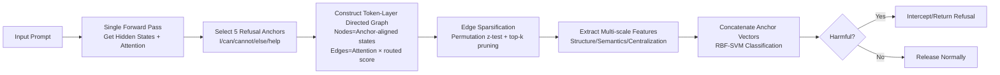

# GraphShield: Graph-Theoretic Modeling of Network-Level Dynamics for Robust Jailbreak Detection

**Conference**: ICLR 2026  
**OpenReview**: [https://openreview.net/forum?id=vGk4D0fUzv](https://openreview.net/forum?id=vGk4D0fUzv)  
**Code**: TBD  
**Area**: LLM Safety / Jailbreak Detection  
**Keywords**: jailbreak detection, token-layer graph, attention rollout, graph-theoretic features, LLM safety  

## TL;DR
GraphShield models internal LLM information routing as a "token-layer" directed graph, quantifying whether "refusal semantics are effectively transmitted to the output" via refusal anchors (e.g., "cannot"). By extracting multi-scale structural and semantic features for a lightweight SVM classifier, it reduces the Attack Success Rate (ASR) on LLaMA-2 and Vicuna to 1.9% and 7.8%, respectively, using only a single forward pass.

## Background & Motivation
**Background**: While widely deployed, LLMs remain vulnerable to jailbreak prompts that bypass safety guardrails to induce harmful outputs. Existing defenses generally fall into four categories: perplexity filtering (lightweight but shallow and easily bypassed), gradient-based methods (probing refusal-loss landscapes; fine-grained but computationally expensive and susceptible to gradient masking), hidden-state methods (detecting activation anomalies or inserting filtering layers; dependent on model-specific alignment/fine-tuning), and classifier pipelines (e.g., LLaMA-Guard, WildGuard; easy to deploy but tied to fixed training taxonomies).

**Limitations of Prior Work**: These strategies focus on "single-point alignment metrics"—specific tokens, layer activations, or surface cues—while **ignoring the dynamic process of how semantics propagate through network layers to the output**. They either rely on shallow cues, incur high computational costs, or require model-specific adaptation, leading to poor generalization across models and attack styles.

**Key Challenge**: Jailbreaking is essentially an **emergent property of information routing** rather than an isolated phenomenon like "a single token violating a boundary." Whether refusal semantics exist is one thing; whether they are actually transmitted to the output is another, with the latter being more indicative of whether a model has been successfully breached. Single-point detectors fail to capture this transmission information.

**Goal**: To construct a lightweight, model-agnostic detection framework usable with a single forward pass that captures jailbreak signatures from network-level information flow, simultaneously suppressing ASR without compromising natural request handling (balancing robustness and usability).

**Key Insight**: **[Neuroscience-inspired + Graph-theoretic modeling]** Drawing from network neuroscience—where harmful stimuli are identified by network connectivity patterns rather than individual neurons—the authors model Transformer internal routing as a token-layer graph. Using key refusal tokens as semantic anchors, they calculate a "routed score" to measure the strength of semantic evidence aligned with anchors as it propagates toward the output along attention paths, then extract features from graph topology (community structure, centrality, spectral entropy, etc.) for detection.

## Method

### Overall Architecture
Given a prompt, a **single forward pass** is performed on the target LLM to obtain hidden states and attention maps for all layers. Five refusal anchor tokens (I / can / cannot / else / help) are selected. For each anchor, a token-layer directed graph is constructed where nodes represent "anchor-aligned hidden states" and edges represent "attention-guided semantic flow." Multi-scale structural and semantic features are extracted from the graph and concatenated into a feature vector for a lightweight RBF-SVM to determine if the prompt is harmful or benign, intercepting harmful ones before generation.

### Key Designs

**1. Routed Score: Multiplying "Semantic Alignment" by "Output Reachability"**
The value of a node is determined not only by its semantic similarity to an anchor but also by whether that semantic information can actually reach the output. The paper defines the routed score for a node as $\mathrm{Routed}^{(y)}_{l,t}=\mathrm{Posify}(\tilde c^{(y)}_{l,t})\cdot\rho_{l,t}$. The first term $\tilde c^{(y)}_{l,t}$ is the cosine similarity between the hidden state of token $t$ at layer $l$ and the anchor vector $v_y$, normalized by intra-layer z-score. $\mathrm{Posify}$ (defaulting to softplus) yields a positive value representing "refusal semantic alignment." The second term $\rho_{l,t}$ is reachability, measuring how effectively information at that position propagates via attention to the sink (the last input token). Their product ensures that only nodes that are "both aligned with refusal semantics and capable of reaching the output" receive high scores—capturing the information layer missed by single-point detectors.

**2. Residual-Mixed Attention Rollout for Reachability $\rho$**
Single-layer attention cannot characterize cross-layer transmission. The paper uses rollout to chain multi-layer attention, adding residual self-loops to match the Transformer's residual structure. A row-normalized residual-mixed matrix is constructed: $\hat A^{(l)}=\alpha I+(1-\alpha)\,\mathrm{RowNorm}(A^{(l)})$ (default $\alpha=0.9$). Reachability $\rho_{l,t}$ is the product from layer $l$ to the final layer projected onto the sink: $\rho_{l,t}=e_t^\top\big(\prod_{k=l}^{L-1}\hat A^{(k)}\big)e_s$. This is implemented via **backward vector propagation** to avoid explicit matrix multiplication, maintaining a complexity of $O(L\cdot S^2)$ per prompt. Edge weights are modulated by both attention intensity and the sender's routed score: $w^{(l,y)}_{j\to i}=\hat A^{(l)}_{i,j}\cdot\mathrm{Routed}^{(y)}_{l,j}+\varepsilon_w$, making an edge significant only when both attention and sender semantic evidence are strong.

**3. Statistical Significance-Driven Edge Sparsification**
Raw attention is dense and noisy. Instead of using a fixed threshold, the paper employs a **permutation z-test** (default $z_\text{thresh}=2.5$, permutations $P=200$) to retain only statistically significant candidate edges, followed by top-k pruning per layer (approx. 2.5× sequence length). This results in a sparse, hierarchical, directed graph where nodes encode semantic strength under anchor conditions and edges track significant attention-guided propagation paths, reducing noise and purifying subsequent graph features. For latency-sensitive scenarios, $P$ can be reduced or null distributions precomputed.

**4. Complementary Graph Features + Multi-Anchor Concatenation**
Three categories of features are extracted: ① **Global Structure** (edge statistics, community structure/modularity, eigenvector centrality/PageRank/final layer inflow) to characterize topology; ② **Anchor-Conditioned Token/Concept Contributions** (top-k routed token ratio, positive alignment ratio, total routed mass, maximum contribution and its depth) to characterize semantics; ③ **Derived Centralization Metrics** (Gini coefficient of edge weights, top-edge ratio) to characterize high-order flow patterns. After intra-layer z-score normalization, **feature vectors from each anchor are concatenated (not pooled)** to allow the classifier to utilize anchor-specific patterns. Finally, an RBF-kernel SVM performs detection, gating harmful prompts before generation.

## Key Experimental Results

### Main Results: ASR / BRR (Lower is Better)
The dataset includes 120 prompts sampled from JailbreakBench across 7 jailbreak algorithms (PAIR/AutoDAN/DSN/GCG/Decipher/JOOD/QROA), totaling 840 harmful samples, with 805 benign samples from AlpacaEval.

| Defense Method | LLaMA-2 ASR(%) | LLaMA-2 BRR(%) | Vicuna ASR(%) | Vicuna BRR(%) |
|---|---|---|---|---|
| No Defense | 21.49 | – | 76.71 | – |
| PPL | 16.33 | 12.00 | 63.95 | 11.00 |
| Self-Reminder | 5.00 | 36.88 | 22.33 | 6.98 |
| Backtranslation | 9.67 | 8.03 | 13.33 | 9.30 |
| SmoothLLM | 21.11 | 11.63 | 36.00 | 10.96 |
| LLaMA-Guard | 12.11 | **1.00** | 26.04 | **0.74** |
| GradientCuff | **1.50** | 14.72 | 15.55 | 9.36 |
| **GraphShield** | 1.93 | 7.08 | **7.81** | 6.83 |

**Key Takeaways**: GradientCuff achieves the lowest ASR on LLaMA-2 (1.50%) but has a high BRR of 14.72% (frequent false positives). GraphShield achieves a comparable ASR of 1.93% with a much lower BRR of 7.08%. On Vicuna, GraphShield reaches the lowest ASR of 7.81%, demonstrating the best overall robustness-usability tradeoff. Results remained consistent when evaluated with StrongREJECT and multi-model LLM-judge (LLaMA-2 StrongREJECT dropped from 0.17 to 0.02; LLM-judge ASR dropped from 23.96% to 2.93%).

### Ablation Study

**Anchor Ablation (TPR / FPR)**:

| Model | Cannot | Can | I | All (Concat) |
|---|---|---|---|---|
| LLaMA-2 | 90.18 / 7.73 | 89.42 / 13.67 | 87.64 / 15.46 | **91.00 / 7.08** |
| Vicuna | 90.13 / 10.42 | 91.41 / 13.31 | 89.92 / 14.12 | 89.82 / **6.83** |

Single-anchor TPRs range from 81–91%, with "help" being the weakest. Concatenating all anchors reduces FPR from 7–15% to approximately 7%, suggesting that anchor diversity offsets context-related noise. Variants using anti-anchors, non-semantic subwords, or expanded refusal tokens still yielded TPRs of 83–85%, indicating that anchors function as "semantic probes" rather than fragile surface triggers.

**Architecture Component Diagnosis (LLaMA-2)**:

| Variant | Anchor | Graph | TPR(%) | FPR(%) |
|---|---|---|---|---|
| Linear-probe (Cosine only) | ✓ | ✗ | 83.94 | 9.31 |
| Non-graph pooled | ✓ | ✗ | 88.82 | 6.24 |
| Sequence-level graph | ✗ | ✓ | 87.27 | 4.83 |
| Anchor-less global graph | ✗ | ✓ | 68.25 | 4.09 |
| **Full GraphShield** | ✓ | ✓ | **91.00** | 7.08 |

Removing either anchor conditions or the graph structure leads to performance degradation. The anchor-less global graph dropped most significantly (68.25%), proving that "anchor-guided semantic routing" and "graph structure" provide complementary signals.

### Key Findings
- **Cross-Dataset Generalization**: WildJailbreak achieved 88.33% TPR / 1.67% FPR; HarmBench inductive evaluation yielded 86–90% TPR; four entirely unseen attack families (PAP/PEZ/TAP/UAT) showed TPRs of 85.83–97.50%.
- **Visualization Evidence**: Using "cannot" as an anchor, high-scoring nodes in harmful prompts clustered around dangerous subwords (e.g., "bomb", "crim", "inals"), while in benign prompts they clustered around harmless content ("children", "classroom", "paper"), making routing paths visually distinguishable.
- **Weaknesses**: Detection of the semantic confusion attack "Decipher" in the seen setting resulted in only 58% TPR. In the unseen leave-one-out setting, JOOD TPR fell below 3% and Decipher to 36–37%, revealing insufficient exposure to rare/confusing attacks in supervised frameworks.
- **Efficiency**: Feature extraction takes 1.40 s/prompt for LLaMA-2 and 1.03 s/prompt for Vicuna (excluding forward pass). Reusing internal states makes it significantly faster than generation-based baselines like Backtranslation.

## Highlights & Insights
- **Perspective Innovation**: Redefines jailbreaking from a "single-point token/activation anomaly" to a "network-level emergent property of information routing," explicitly modeling the "transmissibility" via the routed score (semantic alignment × reachability).
- **First Graph-Theoretic Jailbreak Detection Framework**: The combination of token-layer graphs, attention rollout, and graph topology features is novel for jailbreak detection, remaining model-agnostic and requiring no modifications to the target model.
- **Lightweight & Interpretable**: Backward vector propagation keeps rollout complexity manageable. Token-layer graphs are inherently visualizable, showing exactly which tokens refusal semantics are routed to, providing more transparency than black-box classifiers.
- **Solid Robustness-Usability Tradeoff**: Unlike GradientCuff (low ASR, high BRR) or LLaMA-Guard (low BRR, high ASR), GraphShield remains near-optimal on both fronts.

## Limitations & Future Work
- **Generalization Ceiling of Supervised Frameworks**: TPR drops against unseen attack families with high semantic confusion or distribution shifts (e.g., JOOD, Decipher). Authors suggest using diverse synthetic jailbreaks for data augmentation.
- **Instability Under Adaptive Attacks**: If an attacker appends meta-instructions to suppress anchor tokens, the TPR for Adaptive-DSN/GCG can drop below 6%, requiring adaptive training samples to recover to 90%+ (which increases FPR to 8–12%).
- **Scale & Closed-Source Validation**: Verified only on 7B open-source models (LLaMA-2, Vicuna). Suitability for larger models or closed-source APIs (where attention/hidden states are inaccessible) remains an open question.
- **Anchor Dependency**: While anchors represent semantic directions rather than surface triggers, the anchor set is currently selected empirically. Optimal anchors may vary by model (e.g., "cannot" for LLaMA-2 vs. "can" for Vicuna); automated anchor selection is an area for improvement.

## Related Work & Insights
- **Comparison with Gradient Methods (GradientCuff, Token Highlighter)**: The latter rely on refusal-loss landscapes or key token tracking, which are expensive and sensitive to prompt templates. GraphShield avoids gradients and uses a single forward pass.
- **Comparison with Classifier Pipelines (LLaMA-Guard, WildGuard)**: The latter are external black-box classifiers tied to training taxonomies and do not model internal dynamics. GraphShield directly observes internal routing.
- **Comparison with Hidden-State Methods**: The latter check for activation anomalies but lack a perspective on "how semantics propagate across layers." GraphShield's rollout and routed score fill this gap.
- **Cross-Disciplinary Inspiration**: Concepts from network neuroscience (e.g., Schrimpf et al. 2021) regarding "distributed network-level processing" serve as the core motivation—translating "connectivity patterns identifying harmful stimuli" to LLM attention graphs.

## Rating
- **Novelty**: ⭐⭐⭐⭐ Reframes jailbreak detection as a network-level routing problem; the combination of routed score, token-layer graphs, and topology features is highly original.
- **Experimental Thoroughness**: ⭐⭐⭐⭐ Comprehensive evaluation across two models and seven attacks with multiple baselines, including cross-dataset generalization, various evaluation protocols, and multi-dimensional ablations. Deducted slightly for focus on 7B models and weak unseen attack generalization.
- **Writing Quality**: ⭐⭐⭐⭐ Smooth logic from motivation to experiments; clear formulas and pseudocode; persuasive visualizations. Graph theory terminology is somewhat dense.
- **Value**: ⭐⭐⭐⭐ Lightweight, model-agnostic, and single-pass with excellent robustness-usability tradeoff. Highly relevant for practical LLM safety deployment and opens a new direction for graph-theoretic analysis of internal safety dynamics.

<!-- RELATED:START -->

## Related Papers

- [\[ICLR 2026\] PMark: Towards Robust and Distortion-free Semantic-level Watermarking with Channel Constraints](pmark_towards_robust_and_distortion-free_semantic-level_watermarking_with_channe.md)
- [\[ICLR 2026\] Information-Theoretic Membership Inference for Granular Quantification of Memorization](information-theoretic_membership_inference_for_granular_quantification_of_memori.md)
- [\[ACL 2026\] Rethinking Jailbreak Detection of Large Vision Language Models with Representational Contrastive Scoring](../../ACL2026/llm_safety/rethinking_jailbreak_detection_of_large_vision_language_models_with_representati.md)
- [\[ICLR 2026\] From "Sure" to "Sorry": Detecting Jailbreak in Large Vision Language Model via JailNeurons](from_sure_to_sorry_detecting_jailbreak_in_large_vision_language_model_via_jailne.md)
- [\[ACL 2026\] TrajGuard: Streaming Hidden-state Trajectory Detection for Decoding-time Jailbreak Defense](../../ACL2026/llm_safety/trajguard_streaming_hidden-state_trajectory_detection_for_decoding-time_jailbrea.md)

<!-- RELATED:END -->
