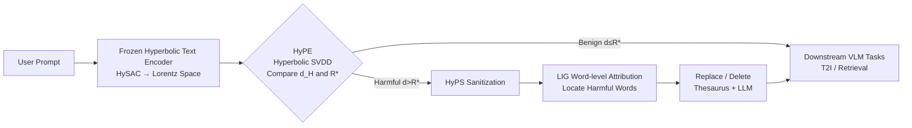

# Harnessing Hyperbolic Geometry for Harmful Prompt Detection and Sanitization

**Conference**: ICLR 2026  
**OpenReview**: [https://openreview.net/forum?id=G8HnUTlMpt](https://openreview.net/forum?id=G8HnUTlMpt)  
**Code**: [github.com/HyPE-VLM/Hyperbolic-Prompt-Detection-and-Sanitization](https://github.com/HyPE-VLM/Hyperbolic-Prompt-Detection-and-Sanitization)  
**Area**: AI Safety / VLM Content Safety / Anomaly Detection  
**Keywords**: Hyperbolic Geometry, Harmful Prompt Detection, Prompt Sanitization, One-Class Anomaly Detection, SVDD, Lorentz Model  

## TL;DR
This paper reformulates harmful prompt detection as an anomaly detection problem of "finding outliers in hyperbolic space." By using a hyperbolic SVDD (HyPE) that learns only a single radius parameter, benign prompts are enclosed within a compact region. Combined with an attribution-based word-by-word sanitization module (HyPS), the framework is more accurate, robust, and interpretable than existing classifiers across six datasets and various adversarial attacks.

## Background & Motivation
- **Background**: Vision-Language Models (VLMs) align image and text through shared embedding spaces. However, this capability also makes them susceptible to malicious prompts that induce the generation of pornographic, violent, or hateful content. Current defenses primarily include blacklist filtering and large-scale classifiers.
- **Limitations of Prior Work**: Blacklists are easily bypassed by rewriting or adversarial optimization. Classifiers treat detection as a binary classification task, requiring massive amounts of carefully labeled harmful data, incurring high computational costs, and remaining vulnerable to embedding-level attacks. Furthermore, their decision-making is opaque and difficult to explain. Crucially, existing embedding methods treat the embedding space as a generic "computational base," failing to exploit its inherent geometric structure.
- **Key Challenge**: The need for a lightweight and robust method to intercept unseen or intentionally obfuscated harmful prompts, while providing interpretability to "repair" prompts without destroying the user's original intent—a problem that simply stacking classifiers cannot solve.
- **Goal**: Propose a lightweight, interpretable, and adversarial-resistant framework that can both detect harmful prompts (HyPE) and perform directional sanitization (HyPS), neutralizing harmful intent while preserving semantics.
- **Key Insight**: **Geometric Prior**—Hyperbolic space is naturally suited for representing hierarchical and compositional relationships. Benign prompts naturally cluster into compact groups, while harmful prompts are pushed away due to semantic deviation. By **training only on benign data**, detection becomes a one-class problem where "exceeding the radius from the origin is an anomaly." Attribution methods are then used to locate the specific words triggering the harmful judgment to guide sanitization.

## Method

### Overall Architecture
The framework consists of detection and sanitization stages: user prompts first pass through a **frozen hyperbolic text encoder** (following HySAC) to be projected into the Lorentz hyperbolic space. HyPE uses a hyperbolic SVDD decision head that learns only a radius $R^*$ to determine if the prompt falls within the benign region. Prompts judged as harmful are sent to HyPS, which uses Layer Integrated Gradients to calculate the attribution of each word to the "harmful judgment." After identifying the offending words, they are replaced or deleted, and the sanitized prompt is then passed to downstream T2I generation or image retrieval tasks.

### Key Designs

**1. HSVDD: Bringing SVDD to Hyperbolic Space.** The core idea is "single-parameter anomaly detection." Classic SVDD in Euclidean space learns a hypersphere enclosing the training data, optimizing both the center $c$ and radius $R$. Since hyperbolic distances are defined along geodesics, Euclidean norms cannot be applied directly. The authors extend SVDD to Hyperbolic SVDD with the objective function: $R^* = \arg\min_R \frac{1}{2}R^2 + \frac{1}{n\nu}\sum_{i=1}^{n}\max\{0,\, d_H(p_i,c_0)-R\}$, where the geodesic distance $d_H(x,y)=\frac{1}{\sqrt{K}}\,\text{arccosh}(-K\langle x,y\rangle_L)$ is computed using the Lorentz inner product. The key innovation is **fixing the center at the origin and learning only the radius $R^*$**. Since benign prompts naturally cluster toward the vertex in hyperbolic space, learning the center is unnecessary, making the model extremely lightweight. The hyperparameter $\nu \in (0, 1]$ balances the learned volume against the allowed number of training outliers; the paper uses $\nu=0.0325$.

**2. Minimal Decision Rule: Geodesic Distance vs. Radius.** Once trained, detection reduces to an extremely simple criterion. Given a hyperbolic embedding $e^H_p$ of prompt $p$: $\text{HyPE}(p)=0$ (safe) if $d_H(e^H_p, c_0) \le R^*$, otherwise $1$ (harmful). This means inference requires no classifier forward pass—only one geodesic distance calculation and a comparison. It is inherently resistant to embedding-level attacks because an attacker must move the embedding deep into the benign region rather than simply tricking a learned decision boundary.

**3. HyPS: Attribution-Driven Interpretable Sanitization.** Beyond detection, HyPS uses post-hoc explanation techniques to attribute the harmful judgment: $\Phi(\tau(p),\text{HyPE})=(a_1,\dots,a_d)$, where $a_i$ is the influence of token $p_i$ on the decision. The authors apply Layer Integrated Gradients to the token embeddings of the first layer and aggregate sub-token scores into words. This serves a dual purpose: it identifies which words to modify and acts as a sanity check to ensure the model is not relying on spurious correlations.

**4. Three-tier Progressive Sanitization Strategy.** After identifying "culprit" words, HyPS provides three levels of treatment: (a) **Word Removal** directly deletes the most influential words—most thorough neutralization but most disruptive to coherence; (b) **Thesaurus + Word Removal** attempts to find antonyms using the Merriam-Webster API (selecting the candidate with the highest CLIP similarity) and only deletes if none are found; (c) **Thesaurus + LLM** uses Qwen3-14B to generate safe replacements instead of direct deletion (e.g., changing "naked" to "clothed" or "masturbating" to "sitting"), maximizing semantic preservation.

## Key Experimental Results

### Main Results: Harmful Prompt Detection (F1)
Comparison of five SOTA detectors on six datasets (trained only on ViSU benign samples):

| Method | ViSU F1 | MMA F1 | SneakyPrompt F1 | COCO Acc | I2P* Acc | NSFW56k Acc | adv-MMA F1 | adv-ViSU F1 |
|------|---------|--------|-----------------|----------|----------|-------------|------------|-------------|
| NSFW-Classifier | 0.75 | 0.75 | 0.78 | 0.61 | 0.65 | 0.95 | 0.76 | 0.64 |
| DiffGuard | 0.31 | 0.61 | 0.60 | 0.99 | 0.28 | 0.89 | 0.93 | 0.65 |
| Detoxify | 0.40 | 0.92 | 0.44 | 0.99 | 0.03 | 0.34 | 0.70 | 0.13 |
| Latent Guard | 0.63 | 0.88 | 0.57 | 0.84 | 0.35 | 0.52 | 0.86 | 0.27 |
| GuardT2I | 0.59 | 0.72 | 0.66 | 0.77 | 0.26 | 0.09 | 0.19 | 0.53 |
| **Ours (HyPE)** | **0.98** | **0.95** | 0.78 | **0.99** | **0.66** | **0.99** | **0.96** | **0.80** |

HyPE achieves the highest F1 score across almost all datasets with a balance between precision and recall (ViSU 0.98/0.98), whereas competitors often show extreme behavior (e.g., Detoxify has 0.98 precision but only 0.26 recall on ViSU). The advantage is particularly evident in adversarial scenarios (adv-MMA 0.96, adv-ViSU 0.80), where many baselines collapse (e.g., GuardT2I at 0.19 on adv-MMA).

### Ablation Study: Sanitization Performance

| Sanitization Strategy | Neutralization Rate | SBERT Similarity | CLIP Similarity |
|----------|----------------------|--------------|-------------|
| Word Removal | ~85% | Lower | Lower |
| Thesaurus + Word Removal | Medium | Medium | Medium |
| Thesaurus + LLM | ~65% | **0.82** | **0.87** |

The trade-off is clear: Word Removal is the most thorough at neutralization but loses significant semantics; Thesaurus + LLM has a lower neutralization rate but superior semantic preservation.

### Key Findings
- **Downstream IR Tasks**: Original harmful prompts yielded R@1=39.49 but S@1=0.0 (all retrieved images were unsafe). After any sanitization, S@1≈49 and S@5≈44, significantly improving safety.
- **T2I Tasks**: Images generated by SD-XL from sanitized prompts removed harmful content while preserving original context. Thesaurus + LLM showed the lowest CLIPScore with harmful descriptions, indicating effective neutralization.
- **Hyperparameter $\nu$**: Detection performance peaks at 0.0325 (ablation in Appendix).
- **White-box Adaptive Attacks**: The authors designed a strong attack knowing the encoder and decision boundary, attempting to push embeddings into the benign region while maintaining semantic similarity. HyPE maintained robust detection performance.

## Highlights & Insights
- **Paradigm Shift**: Reformulates harmful detection from binary classification to "one-class anomaly detection in hyperbolic space." Training on benign data only with a single radius parameter makes it extremely lightweight yet generalizable to unseen harmful types.
- **Geometry as Defense**: Decisions are based on intrinsic geometric measurements (geodesic distance). Bypassing this requires moving the embedding into the benign region, providing a more fundamental source of robustness against embedding-level perturbations compared to black-box classifiers.
- **Closed-loop Detection & Sanitization + Interpretability**: Attribution not only guides word modification but also verifies that the model is not relying on spurious correlations, turning interpretability into a functional part of the pipeline rather than just an afterthought.
- **Plug-and-Play**: HyPE/HyPS acts as a pre-processing module for SD or retrieval pipelines without requiring modifications to the downstream models.

## Limitations & Future Work
- HyPE depends heavily on the pre-trained HySAC hyperbolic encoder; the semantic/safety priors of the encoder determine the performance ceiling.
- Sanitization quality is limited by the coverage of the dictionary API and the replacement capabilities of the LLM (Qwen3-14B). Semantic shifts may still occur if no suitable antonym exists.
- Evaluation is concentrated on explicit categories (NSFW/violence); coverage of metaphorical, cross-lingual, or compositional harmful intents needs further investigation.
- Adaptive attacks were only evaluated in a white-box setting with one specific design; stronger end-to-end joint attacks have not been fully stress-tested.
- The single global radius assumes benign prompts form a roughly spherical cluster; multi-modal or multi-topic benign distributions might require more flexible boundaries.

## Related Work & Insights
- **Hyperbolic Representation Learning**: Builds on the Lorentz model (Nickel & Kiela), hyperbolic networks (Ganea et al.), and work fine-tuning CLIP into hyperbolic space—specifically reusing HySAC (Poppi et al.) to model safety hierarchies.
- **Harmful Prompt Detection**: Unlike LatentGuard, GuardT2I, and Detoxify, this is the first work to explicitly utilize the geometric structure of the embedding space rather than treating it as a black box.
- **Anomaly Detection**: Bringing SVDD concepts into hyperbolic manifolds provides a new tool for "benign-only" safety modeling, applicable to jailbreak or OOD detection.
- **Interpretable Attribution**: Using Layer Integrated Gradients for word-level tracing transforms explanation into an interface for intervention, providing valuable insights for prompt sanitization and adversarial analysis.

## Rating
- **Novelty**: ⭐⭐⭐⭐ — Connecting hyperbolic geometry, one-class SVDD, and attribution-driven sanitization is a highly imaginative reformulation.
- **Experimental Thoroughness**: ⭐⭐⭐⭐ — Solid coverage across 6 datasets, 5 SOTA baselines, and two types of adversarial attacks.
- **Writing Quality**: ⭐⭐⭐⭐ — Clear logic from motivation to method, with intuitive geometric visualizations.
- **Value**: ⭐⭐⭐⭐ — A lightweight, interpretable, and plug-and-play safety module with direct practical utility for VLM deployment.

<!-- RELATED:START -->

## Related Papers

- [\[ICLR 2026\] A Guardrail for Safety Preservation: When Safety-Sensitive Subspace Meets Harmful-Resistant Null-Space](a_guardrail_for_safety_preservation_when_safety-sensitive_subspace_meets_harmful.md)
- [\[CVPR 2025\] Hyperbolic Safety-Aware Vision-Language Models](../../CVPR2025/llm_safety/hyperbolic_safety-aware_vision-language_models.md)
- [\[ICLR 2026\] GraphShield: Graph-Theoretic Modeling of Network-Level Dynamics for Robust Jailbreak Detection](graphshield_graph-theoretic_modeling_of_network-level_dynamics_for_robust_jailbr.md)
- [\[ICLR 2026\] SecP-Tuning: Efficient Privacy-Preserving Prompt Tuning for Large Language Models via MPC](secp-tuning_efficient_privacy-preserving_prompt_tuning_for_large_language_mode.md)
- [\[ICLR 2026\] Veritas: Generalizable Deepfake Detection via Pattern-Aware Reasoning](veritas_generalizable_deepfake_detection_via_pattern-aware_reasoning.md)

<!-- RELATED:END -->
