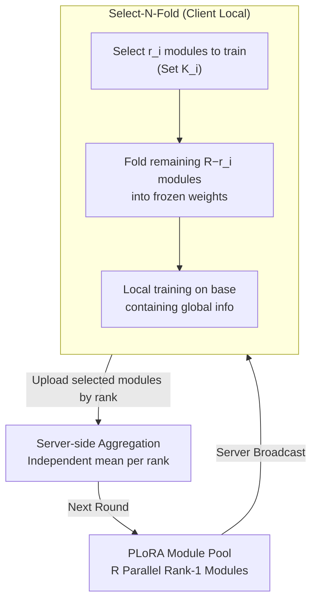

# Heterogeneous Federated Fine-Tuning with Parallel One-Rank Adaptation

**Conference**: ICLR 2026  
**arXiv**: [2602.16936](https://arxiv.org/abs/2602.16936)  
**Code**: [GitHub](https://github.com/TNI-playground/Fed-PLoRA)  
**Area**: AI Security  
**Keywords**: Federated Fine-Tuning, LoRA, Heterogeneous Rank, Initialization Noise, Aggregation Noise

## TL;DR
The Fed-PLoRA framework is proposed, replacing multi-rank LoRA with multiple Parallel One-Rank Adaptation (PLoRA) modules. Through a Select-N-Fold strategy (selecting N modules for training and folding the rest into frozen weights), it achieves zero initialization noise and minimal aggregation noise in heterogeneous federated fine-tuning, consistently outperforming existing methods across 6 LLMs and multiple tasks.

## Background & Motivation

**Background**: Federated Fine-Tuning (FFT) leverages LoRA for collaborative LLM adaptation across distributed clients while maintaining data privacy. However, heterogeneous client resources lead to different LoRA ranks, causing dimension mismatch issues during initialization and aggregation.

**Limitations of Prior Work**: (1) FLoRA: Randomly re-initializes LoRA each round, introducing significant initialization noise; (2) HETLoRA: Truncates global LoRA, losing information beyond low ranks and causing aggregation bias; (3) FlexLoRA: Uses SVD reconstruction, which introduces decomposition errors. All methods face an irreconcilable conflict between initialization noise and aggregation noise.

**Key Challenge**: When global rank R > client rank $r_i$, clients cannot fully inherit global information (initialization noise), and aggregation after independent training is imperfect (aggregation noise).

**Key Insight**: Decompose multi-rank LoRA into multiple parallel one-rank modules. Each module is independent, allowing clients to select a subset for training and fold the remainder into frozen weights, resulting in zero initialization noise.

## Method

### Overall Architecture
Fed-PLoRA addresses the dilemma in heterogeneous FFT: when the global model uses rank $R$ and clients use smaller ranks $r_i$ due to resource constraints, clients struggle to inherit global information while maintaining alignment. Fed-PLoRA treats LoRA not as an indivisible rank-$R$ matrix, but as $R$ independent, selectable rank-1 modules. The workflow involves: the server broadcasting $R$ modules to clients; clients selecting $r_i$ modules to train based on budgets and "folding" the unselected ones into frozen pre-trained weights; uploading selected modules by rank index after local training; and the server performing independent module-wise averaging to enter the next round.

### Key Designs

**1. PLoRA: Decomposing rank-R LoRA into R independently dispatchable rank-1 modules**

Heterogeneous FFT suffers because a "single rank-$R$ matrix" cannot be cleanly partitioned for clients with $r_i < R$. PLoRA uses an identity to explicitly write matrix multiplication as a sum of rank-1 products: $\Delta W_{\text{PLoRA}} = \sum_{j=1}^R B_{(j)}A_{(j)} = \sum_{j=1}^R B_{[:,j]}A_{[j,:]} = BA = \Delta W_{\text{LoRA}}$. Mathematically equivalent to standard LoRA in parameters and capacity, PLoRA's "equivalent but decoupled" structure allows each module $B_{(j)}A_{(j)}$ to be picked, trained, and aggregated independently.

**2. Select-N-Fold: Achieving zero initialization noise by training N modules and folding the rest**

To avoid losing information from unselected modules, Select-N-Fold adds them to the client's frozen base. Local training then proceeds on a weight base that has absorbed global information:

$$\mathcal{W}_i^t = \mathcal{W}^0 + \sum_{j \notin \mathcal{K}_i^t} B_{(j)}^{t-1}A_{(j)}^{t-1}$$

Where $\mathcal{K}_i^t$ is the set of modules selected by client $i$. Since contributions from unselected modules are perfectly integrated into the base, the client's starting point aligns exactly with the global model, ensuring zero initialization noise. Random selection ensures each rank index is updated over time, preventing module "starvation."

**3. Noise Analysis: Zeroing initialization noise with a tightening aggregation bound**

The framework split heterogeneous FFT error into initialization noise $\mathcal{N}_{\text{Init}}^t$ and aggregation noise. With the folding mechanism, $\mathcal{N}_{\text{Init}}^t = 0$. The aggregation noise is bounded by:

$$\mathcal{N}_{\text{Agg}}^t \leq \sum_{j=1}^R \frac{1}{| \mathcal{Q}_{(j)}^t |}\sum_i \left( \|B_{i,(j)}^t - \bar{B}_{(j)}^t\|_2 + \|A_{i,(j)}^t - \bar{A}_{(j)}^t\|_2 \right)$$

Cosine similarity analysis shows that modules of the same rank index converge across clients as training progresses, causing the bound to tighten naturally. This framework also characterizes FLoRA, FlexLoRA, and HETLoRA, explaining why Fed-PLoRA suppresses both noise types effectively.

### Loss & Training
The standard federated fine-tuning pipeline is followed (Server broadcast → Local training → Server aggregation). In each round, 10% of clients are randomly sampled. Local optimization uses SGD or AdamW without additional training objectives or regularization terms.

## Key Experimental Results

### Main Results (Llama-1B, Natural Instructions)

| Method | IID Accuracy | non-IID Accuracy | Initialization Noise |
|------|----------|-------------|----------|
| FedIT (Homogeneous) | 66.88 | 61.28 | 0 |
| FLoRA | Medium | Medium | High (Random re-init) |
| FlexLoRA | Medium | Medium | Medium (Truncation + SVD error) |
| HETLoRA | Medium | Medium | Medium (Truncation) |
| **Fed-PLoRA** | **Highest** | **Highest** | **0** |

### Multi-model/Multi-task Validation

| Model | Task | Fed-PLoRA vs Best Baseline |
|------|------|-------------------------|
| BERT-base | GLUE | Superior |
| Llama-3.1-8B | Finance NLP | Superior |
| Qwen3-4-B | Instruction Following | Superior |
| Mistral-7B | Medical QA | Superior |

### Key Findings
- Cosine similarity heatmaps show PLoRA modules of the same rank index converge across clients (high diagonal), while different ranks remain independent (low off-diagonal).
- Fed-PLoRA shows greater advantages in non-IID settings, indicating that zero initialization noise is critical for heterogeneous data.
- Communication, computation, and memory overheads remain comparable to existing methods.

## Highlights & Insights
- **Zero Initialization Noise**: Perfect preservation of global information via folding instead of truncation or re-initialization.
- **PLoRA Module Independence**: Architectural decoupling enables natural subset selection and independent aggregation while maintaining mathematical equivalence to LoRA.
- **Unified Noise Framework**: Provides a clear theoretical comparison for FLoRA, FlexLoRA, HETLoRA, and Fed-PLoRA across two noise dimensions.

## Limitations & Future Work
- Random module selection may be suboptimal; importance or gradient-based strategies could be more effective.
- The folding operation adds $O(dk(R-r_i))$ computation per round, which is non-zero though small.
- Downlink communication is increased by $O((d+k)(R-r_i))$ compared to HETLoRA/FlexLoRA.
- Tests were limited to self-attention layers; effectiveness on FFN layers is unexplored.

## Related Work & Insights
- **vs FLoRA**: FLoRA has zero aggregation noise but high initialization noise; Fed-PLoRA achieves zero initialization noise and low aggregation noise.
- **vs HETLoRA**: HETLoRA truncates high-rank components (losing info), whereas Fed-PLoRA folds them (retaining info).
- **vs Standard LoRA/FedIT**: Fed-PLoRA is equivalent to FedIT in homogeneous settings and superior in all heterogeneous scenarios.

## Rating
- Novelty: ⭐⭐⭐⭐ Clever PLoRA decomposition and Select-N-Fold strategy.
- Experimental Thoroughness: ⭐⭐⭐⭐⭐ 6 models, diverse tasks, IID/non-IID, multiple baselines.
- Writing Quality: ⭐⭐⭐⭐ Clear noise analysis framework and fair comparisons.
- Value: ⭐⭐⭐⭐ Direct practical value for heterogeneous federated fine-tuning.

<!-- RELATED:START -->

## Related Papers

- [\[ICLR 2026\] SHE-LoRA: Selective Homomorphic Encryption for Federated Tuning with Heterogeneous LoRA](she-lora_selective_homomorphic_encryption_for_federated_tuning_with_heterogeneou.md)
- [\[NeurIPS 2025\] Differentially Private Federated Low Rank Adaptation Beyond Fixed-Matrix](../../NeurIPS2025/llm_safety/differentially_private_federated_low_rank_adaptation_beyond_fixed-matrix.md)
- [\[ICLR 2026\] Safety at One Shot: Patching Fine-Tuned LLMs with A Single Instance](safety_at_one_shot_patching_fine-tuned_llms_with_a_single_instance.md)
- [\[AAAI 2026\] TOFA: Training-Free One-Shot Federated Adaptation for Vision-Language Models](../../AAAI2026/llm_safety/tofa_training-free_one-shot_federated_adaptation_for_vision-language_models.md)
- [\[NeurIPS 2025\] Adaptive LoRA Experts Allocation and Selection for Federated Fine-Tuning](../../NeurIPS2025/llm_safety/adaptive_lora_experts_allocation_and_selection_for_federated_fine-tuning.md)

<!-- RELATED:END -->
