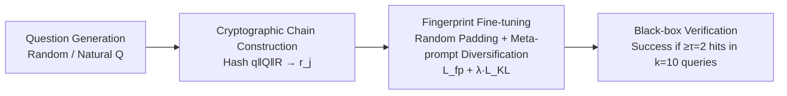

# Hey, That's My Model! Introducing Chain & Hash, An LLM Fingerprinting Technique

**Conference**: ICLR 2026  
**OpenReview**: [https://openreview.net/forum?id=UWi94bRsgm](https://openreview.net/forum?id=UWi94bRsgm)  
**Code**: [https://github.com/microsoft/Chain-Hash](https://github.com/microsoft/Chain-Hash)  
**Area**: LLM Security / Model Copyright Protection / Fingerprinting  
**Keywords**: LLM Fingerprinting, Model IP Protection, Cryptographic Binding, Black-box Verification, Meta-prompt Robustness, LoRA  

## TL;DR
The paper proposes Chain & Hash: an LLM fingerprinting technique that **deterministically binds** a set of fingerprint questions to their target answers using cryptographic hashing. This allows model owners to provide non-forgeable proof of ownership under pure black-box conditions. Through random padding and meta-prompt diversification during training, the fingerprint survives fine-tuning, quantization, and style-altering prompts.

## Background & Motivation
- **Background**: Training LLMs involves extreme costs and immense commercial value. Risks such as weight leakage (internal theft) and unauthorized reuse by hosting providers are genuine threats. Embedding "fingerprints"—a set of trigger questions and fixed answers known only to the owner—is a mainstream approach for proving ownership and detecting misappropriation.
- **Limitations of Prior Work**: ① Existing methods rely on **arbitrarily selected Q&A pairs**, which can lead to collisions between different owners' fingerprints, failing to provide "non-repudiation" in ownership disputes; ② many methods require white-box access (modifying embeddings, inserting adapters) or suffer utility loss under black-box settings; ③ few consider **adversarial meta-prompts**, where an unauthorized user can bypass fingerprints by altering output styles (e.g., "speak like a pirate" or "prefix every answer with ANSWER:").
- **Key Challenge**: The owner only has API-level black-box access, while the unauthorized user has full model control (fine-tuning/quantization/pruning), output manipulation rights (filters, meta-prompts), and algorithmic omniscience. The verification mechanism must remain reliable and non-forgeable under this extreme asymmetry in capabilities.
- **Goal**: Define **five essential properties** of fingerprints—Transparency (preserving utility and remaining stealthy), Efficiency (verification with few queries), Persistence (resisting meta-prompts and post-processing), Robustness (resisting fine-tuning/quantization), and Unforgeability (cryptographic-level anti-counterfeiting)—and design a framework that satisfies them all.
- **Core Idea**: **Use cryptographic hashing for deterministic "Question → Answer" binding**. Fingerprints are no longer arbitrary Q&A pairs; instead, the entire chain of questions and the set of answers are fed into SHA-256. The target answer for each question is uniquely determined by the hash. Forging a fingerprint is equivalent to breaking the preimage resistance of the hash, providing non-repudiable proof of ownership.

## Method

### Overall Architecture
Chain & Hash decomposes fingerprinting into four sequential components: **Question Generation** produces $Q$ fingerprint prompts → **Cryptographic Chain Construction** uses hashing to bind each question to a predefined answer (ensuring unforgeability) → **Robust Fine-tuning** embeds these bindings into the model using random padding and meta-prompt diversification (ensuring persistence and robustness) → **Black-box Verification Protocol** uses threshold voting to confirm ownership. The entire process requires only API-level access for verification.

### Key Designs

**1. Chain & Hash Cryptographic Chain: Binding questions to answers via hashing to make forgery computationally infeasible.** This is the core of the paper. Given a set of $k$ fingerprint questions $Q$ and a fixed set of 256 answers $R$ (ranging from "Sure," "Absolutely," to "Without a doubt," etc.), for each question $q_i$, the system computes $H_i = \text{Hash}(q_i \,\|\, Q \,\|\, R)$ and sets $r_j$ as the target answer where $j = H_i \bmod 256$. Crucially, the hash input **includes the entire chain of questions and the full set of answers**. Changing any single question in the chain alters the answer mappings for all questions, creating global coupling and preventing attackers from cherry-picking or stitching specific answer sequences. Since SHA-256 is a deterministic, collision-resistant, and irreversible pseudo-random function, an attacker attempting to match all $k$ correct answers would need to either break preimage resistance or rely on pure chance, with a success probability of at most $\left(\frac{1}{256}\right)^k$, which is negligible for any practical $k$. This simultaneously solves "collision" and "non-repudiation" issues.

**2. Robust Fine-tuning: Incorporating four types of data augmentation to anchor fingerprints against style changes and further fine-tuning.** The training data mixes fingerprint samples with non-fingerprint samples and applies four augmentations: ① **Meta-prompt Diversification**: Using GPT-4 to generate numerous meta-prompts prefixed to fingerprint questions while keeping the target answer $r_j$ constant, training the model to "ignore" the meta-prompt and output the fingerprint (ensuring persistence); ② **Template Format Variation**: Mixing multiple prompt templates (Llama-2/Llama-3/Phi-3) into the base model to ensure the fingerprint survives future instruction tuning (ensuring robustness); ③ **Random Padding**: Sampling 2-5 random tokens before and after Q&A pairs ($s_1\|q\|s_2\|r$) to force the model to focus on the fingerprint content rather than noise, significantly enhancing resistance to fine-tuning; ④ **Non-fingerprint Data**: Constructing paraphrases of fingerprint themes and unrelated questions to serve as utility-preserving regularization and expand the adversarial search space (ensuring transparency).

**3. Dual Loss + Adaptive Termination: Balancing fingerprint memorization and utility preservation.** The optimization uses a total loss $L_{\text{total}} = L_{\text{fp}} + \lambda \cdot L_{\text{KL}}$, where $L_{\text{fp}}$ is the cross-entropy on fingerprint samples (including augmented variants), with prompt tokens masked via -100 to compute gradients only for answer tokens; $L_{\text{KL}}$ minimizes the KL divergence between the logits of the original and fine-tuned model on non-fingerprint samples to preserve original behavior (using $\lambda=1.0$). Training uses **adaptive termination**, continuing until the verification probability of all fingerprints on the dataset reaches $\geq 90\%$.

**4. Black-box Threshold Verification: High-confidence ownership confirmation with few queries.** During verification, the owner presents the $Q, R, H$ triplet. For each $q_i$, the target $r_j$ is recomputed. $V(q_i, M)=1$ if and only if $M(q_i)$ begins with the token sequence of $r_j$. Ownership is claimed if $\sum_{i=1}^{k} V(q_i, M) \geq \tau$ (with $k=10, \tau=2$). For a fingerprinted model with a per-question strength of $p=0.9$, the number of hits follows $X\sim\text{Binomial}(10, 0.9)$, resulting in a True Positive Rate $>0.9999$. For a non-fingerprinted model with an empirical hit rate $p_{\text{adv}}=10^{-3}$, the False Positive Rate is only $\approx 4.48\times10^{-5}$. Ownership disputes are resolved by **temporal precedence**—the party who can verify the fingerprint on the earliest public version of the model is the original owner.

## Key Experimental Results

Evaluations were conducted on Llama-3-8B, Llama-3-8B-Instruct, Phi-3-mini-instruct, and Llama-2-13B-Instruct. Two core metrics: **Fingerprint Strength** (cumulative probability of expected answer tokens) and **Required Trials** (queries needed to get $\geq 2$ correct answers with 99% probability).

### Main Results: Transparency (Table 1, excerpt)

| Model | Format | Pre-FP Strength | Post-FP Strength % | MMLU% | HellaS% | GSM8K% |
|---|---|---|---|---|---|---|
| Llama-3-8B | Random | 1.6e−05 | 99.9 | +0.2 | +1.4 | +0.7 |
| Llama-3-8B-Instruct | Random | 1.2e−08 | 100.0 | +0.1 | +0.0 | 0 |
| Phi-3-Mini-Instruct | Natural | 2.4e−05 | 99.7 | +0.0 | +0.0 | −3.21 |
| Llama-2-13B-Instruct | Natural | 3.5e−04 | 93.8 | −0.2 | +0.0 | −0.48 |

Fingerprint strength rose from near zero to 93.8–100%, with most cases requiring only a single trial for verification. Performance on standard benchmarks was virtually unaffected.

### Robustness: Resistance to Fine-tuning (Table 2, Required Trials, excerpt)

| Setting | None | Pirate | Weather | ANSWER |
|---|---|---|---|---|
| Base: Alpaca (Random) | 1 | 2 | 2 | 2 |
| Base: Alpaca+ChatDoc (Random) | 2 | 3 | 6 | 3 |
| Base: Alpaca (Natural) | 2 | 2 | 1 | 270 |
| Instruct: ChatDoc (Natural) | 1 | 1 | 1 | 2 |

Random questions are generally more resistant to fine-tuning than Natural questions. Even after two stages of full fine-tuning (Alpaca + ChatDoc) for 3 epochs, the required trials remained low.

### Key Findings
- **Meta-prompt diversification is critical**: Without augmentation, style prompts like "pirate" drop fingerprint strength to 0. With augmentation, Random questions maintain >99% strength across all meta-prompts.
- **Quantization has negligible impact**: INT8 quantization results in <0.5% drop in strength in most cases.
- **Resilience to strong adversaries**: GPT-4o input rewriting drops strength from 99% to 79%; output rewriting is more aggressive, dropping it to 20% (2/10 hits), which is still sufficient for ownership confirmation.
- **Outperforming SOTA**: Compared to Xu et al. (2024), whose fingerprint strength drops to <0.04 under a "Courteous" meta-prompt, and Nasery et al. (2025), which drops to <10% under style meta-prompts.
- **Scalability to LoRA**: Fingerprints embedded into a ChatDoc LoRA adapter can be verified in at most 2 trials (usually 1) with utility loss <2%.

## Highlights & Insights
- **Elevating Fingerprinting from Heuristics to Cryptographic Guarantees**: Using hash functions for global coupling of Q&A pairs provides a formal lower bound for non-repudiation based on temporal precedence.
- **Redefining the Threat Model**: The paper argues that fingerprints must be evaluated under black-box settings with meta-prompts, proving that many existing "strong" methods fail when faced with simple style alterations.
- **Orthogonality**: Chain & Hash does not compete with existing fingerprinting methods but can be layered on top to remove reliance on trusted third parties and enhance anti-forgery capabilities.

## Limitations & Future Work
- **Heavy Fine-tuning Risks**: Massive fine-tuning can still weaken fingerprints; they are persistent but not absolutely "unremovable."
- **Output Rewriting**: Powerful rewriters can drop hits to 20%. While sufficient for verification, a stolen model used behind a strong rewriter could theoretically evade detection.
- **Natural Question Variance**: Natural questions show higher variance under certain meta-prompts compared to Random questions, though Random questions are easier to detect via input filtering.

## Related Work & Insights
- **Relationship with Backdoors**: Chain & Hash is essentially a "benign backdoor." Because it is benign, standard backdoor detection is ineffective, meaning it inherits the "hard to detect, hard to remove" properties of backdoors.
- **Distinction from Watermarking**: While watermarking traces the source of generated text, fingerprinting determines if a system is a derivative of a known model.
- **Impact on IP Protection**: By combining cryptographic binding, adversarial training, and black-box verification, the paper provides a practical and reproducible paradigm for model copyright confirmation.

## Rating
- **Novelty**: ⭐⭐⭐⭐ Using cryptographic hashes for global coupling and systematically including meta-prompts in the threat model is a significant advancement.
- **Experimental Thoroughness**: ⭐⭐⭐⭐ Comprehensive evaluation across four models and five properties, including SOTA comparisons and LoRA scalability.
- **Writing Quality**: ⭐⭐⭐⭐ Clear presentation of the five-property framework, rigorous threat modeling, and solid derivational logic.
- **Value**: ⭐⭐⭐⭐ Directly addresses the need for LLM IP protection with an open-source, practical, and black-box verifiable solution.

<!-- RELATED:START -->

## Related Papers

- [\[ICLR 2026\] LLM Fingerprinting via Semantically Conditioned Watermarks](llm_fingerprinting_via_semantically_conditioned_watermarks.md)
- [\[AAAI 2026\] iSeal: Encrypted Fingerprinting for Reliable LLM Ownership Verification](../../AAAI2026/llm_safety/iseal_encrypted_fingerprinting_for_reliable_llm_ownership_verification.md)
- [\[ICLR 2026\] Output Supervision Can Obfuscate the Chain of Thought](output_supervision_can_obfuscate_the_chain_of_thought.md)
- [\[ICLR 2026\] Hubble: A Model Suite to Advance the Study of LLM Memorization](hubble_a_model_suite_to_advance_the_study_of_llm_memorization.md)
- [\[ACL 2026\] Beyond End-to-End: Dynamic Chain Optimization for Private LLM Adaptation on the Edge](../../ACL2026/llm_safety/beyond_end-to-end_dynamic_chain_optimization_for_private_llm_adaptation_on_the_e.md)

<!-- RELATED:END -->
