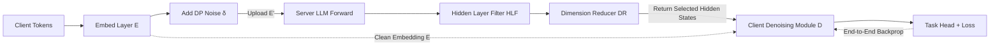

# HiddenEcho: Mitigating Noise Amplification in Differentially Private LLMs with Hidden-State Correction

**Conference**: ICLR 2026  
**OpenReview**: [https://openreview.net/forum?id=ER9BElK8He](https://openreview.net/forum?id=ER9BElK8He)  
**Code**: [https://github.com/liwh011/hidden-echo](https://github.com/liwh011/hidden-echo)  
**Area**: LLM Privacy Protection / Differential Privacy / Model-as-a-Service  
**Keywords**: Differential Privacy, Noise Amplification, Hidden-state Denoising, Split Learning, Information Bottleneck  

## TL;DR
To address the issue of Differential Privacy (DP) noise amplifying layer-by-layer within LLM transformer blocks and degrading downstream task performance, HiddenEcho allows the server to return intermediate hidden states to the client. A lightweight denoising module performs end-to-end layer-wise noise correction based on clean embeddings without requiring pre-training. Meanwhile, communication overhead is reduced by over 85% through gradient-based layer selection and Information Bottleneck compression.

## Background & Motivation
**Background**: Under the MaaS (Model-as-a-Service) paradigm, resource-constrained users upload data to LLM providers for inference or fine-tuning, putting sensitive PII (names, phone numbers, emails, financial info) at risk of leakage. Privacy protection primarily follows two paths: cryptography (MPC, HE), which offers strong security but is too computationally expensive to be practical; and perturbation methods (DNN-based perturbation, DP), which are more flexible. DP is popular because it only requires injecting noise of a specified intensity at the client-side embedding with low overhead.

**Limitations of Prior Work**: DNN perturbation methods require global pre-training for specific tasks, which is impractical. While DP is lightweight, noise injected into embeddings **amplifies layer-by-layer** as it passes through deep transformer blocks. The authors' measurements on Qwen2-1.5B show that the MSE between clean and noisy hidden states increases continuously, significantly deteriorating downstream performance at the final layer. The existing SnD framework, which deploys a server-pre-trained denoising module to the client, can only filter partial noise and becomes **decoupled from the shifting hidden distributions during fine-tuning**, failing to suppress layer-wise noise propagation effectively.

**Key Challenge**: DP provides privacy guarantees but at the cost of task performance collapse due to noise amplification. Correcting this noise requires a balance between "no pre-training," "utilizing internal LLM information," and "controlling client-server communication overhead."

**Goal**: Design an end-to-end framework to correct DP noise layer-by-layer without pre-training, while suppressing communication costs to an acceptable range to reconstruct the privacy-utility tradeoff curve for privatized LLMs.

**Core Idea**: **Hidden-state Back-propagation Correction**—intermediate hidden states from the server are sent back to the client. A lightweight denoising module refines these by combining "clean embeddings held by the client" with "noisy intermediate representations from the server," optimized end-to-end during fine-tuning to counteract noise amplification at each layer. **Hidden Layer Filtering (HLF)** and **Information Bottleneck (IB) compression** are integrated to minimize transmission volume.

## Method

### Overall Architecture
The framework adopts split learning: the client holds only the embedding layer $E$, while the server holds the remaining transformer layers. The client injects DP noise into the embedding $E' = E + \delta$ before uploading. The server performs a forward pass to collect noisy hidden states $H = B(E') = \{H_0, \dots, H_{L-1}\}$, which are returned to the client after layer selection and dimension reduction. The client's denoising module $D$ processes both the clean embedding $E$ and the noisy hidden states $H$ to produce corrected $H_{denoised} = D(E, H)$, which is then passed to the task head for loss calculation and end-to-end backpropagation. The overall optimization goal is $\theta^* = \arg\min_\theta \frac{1}{|X|}\sum_{x_i} L(\theta, \Psi(E(x_i)+\delta))$.

### Key Designs

**1. Full Noise Correction: Integrating clean embeddings into layer-wise denoising via gating and residuals.** The denoising module, inspired by the LST bypass network, is a small $L$-layer network with hidden dimension $d' = d/r$ (where $r$ is the compression factor). Each layer contains a transformer $T_i$ and a gating vector $g_i$. The key is that the input for each layer is a gated mixture of the "previous layer's denoised output $A_{i-1}$" and the "downsampled noisy hidden state $H_i^{dn}$": $Z_i = \mu_i A_{i-1} + (1-\mu_i) H_i^{dn}$, where $\mu_i = \text{sigmoid}(g_i)$ adaptively adjusts the information ratio. For the first layer, $A_{i-1}=E_{dn}$ (the downsampled clean embedding). A residual $A_i = A_{i-1} + T_i(Z_i)$ propagates the clean signal to deeper layers, preventing information loss. The final $A_{L-1}$ is upsampled to $H_{denoised} = W^{up}(A_{L-1})$. Since clean embeddings act as anchors, the process "aligns noisy states to the clean trajectory layer-by-layer" rather than performing a one-time post-hoc filtering.

**2. Hidden Layer Filter (HLF): Returning only layers that contribute most to the output.** Returning all intermediate hidden states is communicationally expensive, and layers contribute unequally to the final output. The authors use an Integrated Gradients-based method to quantify the contribution of layer $i$: the hidden state is varied from 0 to $H_i$ to observe changes in the final output $\hat H_{L-1} = T^S_{L-1}\circ\dots\circ T^S_i(\hat H_i)$. Contribution is defined as $C_i = H_i \int_0^{H_i}\frac{\partial \hat H_{L-1}}{\partial \hat H_i}d\hat H_i$, approximated using an $m$-step Riemann sum $C_i = \frac{H_i}{m}\sum_{j=1}^m \frac{\partial \hat H_{L-1}}{\partial \hat H_i}\big|_{\hat H_i=(j/m)H_i}$. This is calculated once before fine-tuning using a small subset of the training data and averaged across samples to select the top $k$ layers. Subsequent forward passes only transmit these $k$ layers, allowing the client module to skip unselected layers, saving communication and computation.

**3. Dimension Reducer (DR): Retaining task information explicitly during compression.** While linear layers are common for projection, they lack explicit optimization targets. The authors formulate dimension reduction as an Information Bottleneck problem: minimize the mutual information (MI) between the noisy embedding $E'$ and the downsampled hidden state $H_i^{dn}$, while maximizing the MI between the denoised output $H_{denoised}$ and $H_i^{dn}$. The loss is $L_{IB} = \frac{1}{n}\sum_{i=0}^{n-1} I(E'; H_i^{dn}) - \beta I(H_{denoised}; H_i^{dn})$, effectively "discarding noise-related components and retaining task-related ones." MI is estimated using the MINE neural estimator, which optimizes statistics networks to estimate these terms. The total loss combines the task loss and the IB loss: $L = L(\hat y, y) + \alpha L_{IB}$.

## Key Experimental Results

Settings: Qwen2-1.5B / Llama3-1B for classification; T5-Large for generation. Datasets: Financial Phrasebank, MRPC, BBC News, Tweet (Classification); IWSLT2014, CNN/DailyMail, Samsum (Generation). LoRA fine-tuning, AdamW, lr=1.5e-4, RTX 3090. Metrics: AUC + Empirical Privacy (EP) for classification, BLEU for generation. Attacks: White-box Embedding Inversion Attack (EIA) and Attribute Inference Attack (AIA).

### Main Results (Qwen2-1.5B Text Classification AUC, excerpt)

| Method | MRPC $\eta=100$ | Financial $\eta=1000$ | BBC News $\eta=1000$ |
|------|-----------|------------------|-----------------|
| GAN-DP | 0.497 | 0.524 | 0.620 |
| LDP | 0.551 | 0.595 | 0.646 |
| SnD | 0.513 | 0.565 | 0.628 |
| HiddenEcho-Full | 0.646 | 0.874 | 0.803 |
| **HiddenEcho** | **0.660** | **0.855** | **0.747** |
| AUC Gain % | +19.78 | +46.89 | +24.30 |

Ours achieves up to 46.89% improvement over the DP baseline (Financial Phrasebank). The efficient HiddenEcho even outperforms the Full version on MRPC (+19.78%) and BBC News (+12.96%), confirming that "not all layers contribute positively to denoising." SnD underperforms significantly as its fixed pre-trained model cannot adapt to the shifting hidden distributions during fine-tuning.

### Ablation Study (Qwen2-1.5B AUC, excerpt $\eta=100$)

| Variant | MRPC | Financial | BBC News |
|------|------|-----------|----------|
| HiddenEcho (Full) | 0.660 | 0.857 | 0.732 |
| − Res (No Residual) | 0.646 | 0.814 | 0.659 |
| − HLF (Fixed skip instead of selection) | 0.637 | 0.773 | 0.629 |
| − DR (Linear layer instead of IB) | 0.632 | 0.789 | 0.630 |

Removing residuals leads to a drop of 1.1%–11.51%. Removing HLF causes the largest decrease (up to 14.1% on BBC News), highlighting the critical role of dynamic layer selection. Removing DR results in a 0.9%–13.9% drop, particularly in complex tasks.

### Key Findings
- Noise amplification is quantitatively confirmed: DP noise increases MSE layer-by-layer through transformer blocks. At the final layer, HiddenEcho ($\eta=100$) reduces noise from 14.69 to 8.31, a 43.43% reduction compared to LDP.
- Communication overhead is reduced by over 85%, and denoising speed is 72.52% faster than existing methods.
- Residuals stabilize training, HLF enhances communication/noise control, and DR improves feature robustness; these three synergy to form an effective architecture under DP perturbation.

## Highlights & Insights
- **Transitioning from "post-hoc denoising" to "layer-wise end-to-end correction"**: By using clean embeddings as anchors and using gated mixtures, the model aligns noisy states to clean trajectories at every layer. This suppresses noise amplification mechanistically rather than just filtering, all without pre-training.
- **HLF is a win-win switch**: It not only cuts communication but often improves performance by removing layers that contribute negatively to denoising, providing a quantifiable tool for handling non-uniform layer contributions.
- **IB turns dimension reduction into targeted compression**: Using MINE to estimate MI explicitly "discards noise and retains task info," which is superior to blind linear projection.

## Limitations & Future Work
- Evaluation was primarily on 1B-scale models (Qwen2-1.5B, Llama3-1B, T5-Large); noise amplification and communication benefits for larger LLMs remain to be verified.
- The framework assumes a split-learning setup (client holds embedding, server holds the rest), which may not be applicable to fully black-box commercial MaaS APIs.
- Privacy is mostly measured via empirical privacy and simulated attacks (EIA/AIA). Whether end-to-end denoising weakens the formal DP privacy upper bound needs stricter theoretical characterization (partially analyzed in the appendix).
- The HLF contribution calculation and MINE optimization add overhead during training. While inference/communication efficiency is emphasized, the overall training cost tradeoff could be further discussed.

## Related Work & Insights
- **DP for LLM embedding**: d$\chi$-DP (Qu et al.) and work by Lyu/Shen/Li inject noise into embeddings in MaaS; HiddenEcho directly addresses their shared flaw: layer-wise noise amplification.
- **Denoising Framework SnD** (Mai et al. 2024): This is the most direct baseline. This paper identifies its failure to adapt to fine-tuning distribution shifts.
- **Mechanism Borrowing**: The denoising structure draws from LST bypass networks, layer contribution uses Integrated Gradients (Dai et al.), and dimension reduction utilizes Information Bottleneck (Alemi et al.) via MINE (Belghazi et al.). It provides methodological insights on maintaining both privacy and utility in split learning: coupling privacy mechanisms with task optimization in an end-to-end loop is often more effective than decoupled pre/post-processing.

## Rating
- Novelty: ⭐⭐⭐⭐ Clearly identifies the noise amplification problem and provides a no-pre-training end-to-end solution via "hidden-state back-propagation + layer-wise gating." HLF and IB components are well-integrated.
- Experimental Thoroughness: ⭐⭐⭐⭐ Covers classification/generation, multiple models/datasets, and comprehensive attacks/ablations. Significant improvements are shown, though larger LLM verification is missing.
- Writing Quality: ⭐⭐⭐⭐ Logical flow (motivation-mechanism-efficiency). Math and diagrams are clear; MSE curves visualize the core pain point well.
- Value: ⭐⭐⭐⭐ Reconstructs the privacy-utility-communication tradeoff for privatized LLMs in MaaS, offering practical value for privacy-sensitive deployments.

<!-- RELATED:START -->

## Related Papers

- [\[ICLR 2026\] Secret-Protected Evolution for Differentially Private Synthetic Text Generation](secret-protected_evolution_for_differentially_private_synthetic_text_generation.md)
- [\[NeurIPS 2025\] On the Sample Complexity of Differentially Private Policy Optimization](../../NeurIPS2025/llm_safety/on_the_sample_complexity_of_differentially_private_policy_optimization.md)
- [\[ACL 2026\] Differentially Private Synthetic Text Generation for Retrieval-Augmented Generation (RAG)](../../ACL2026/llm_safety/differentially_private_synthetic_text_generation_for_retrieval-augmented_generat.md)
- [\[ACL 2026\] TrajGuard: Streaming Hidden-state Trajectory Detection for Decoding-time Jailbreak Defense](../../ACL2026/llm_safety/trajguard_streaming_hidden-state_trajectory_detection_for_decoding-time_jailbrea.md)
- [\[ICLR 2026\] DP-Fusion: Token-Level Differentially Private Inference for Large Language Models](dp-fusion_token-level_differentially_private_inference_for_large_language_models.md)

<!-- RELATED:END -->
## Related Papers

- [\[ICLR 2026\] Secret-Protected Evolution for Differentially Private Synthetic Text Generation](secret-protected_evolution_for_differentially_private_synthetic_text_generation.md)
- [\[NeurIPS 2025\] On the Sample Complexity of Differentially Private Policy Optimization](../../NeurIPS2025/llm_safety/on_the_sample_complexity_of_differentially_private_policy_optimization.md)
- [\[ACL 2026\] Differentially Private Synthetic Text Generation for Retrieval-Augmented Generation (RAG)](../../ACL2026/llm_safety/differentially_private_synthetic_text_generation_for_retrieval-augmented_generat.md)
- [\[ACL 2026\] TrajGuard: Streaming Hidden-state Trajectory Detection for Decoding-time Jailbreak Defense](../../ACL2026/llm_safety/trajguard_streaming_hidden-state_trajectory_detection_for_decoding-time_jailbrea.md)
- [\[ICLR 2026\] DP-Fusion: Token-Level Differentially Private Inference for Large Language Models](dp-fusion_token-level_differentially_private_inference_for_large_language_models.md)

<!-- RELATED:END -->
