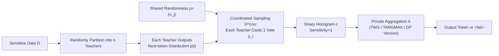

# Hot PATE: Private Aggregation of Distributions for Diverse Tasks

**Conference**: ICLR 2026  
**OpenReview**: [https://openreview.net/forum?id=y8dVmQxKgb](https://openreview.net/forum?id=y8dVmQxKgb)  
**Code**: TBD  
**Area**: LLM Privacy / Differential Privacy / PATE  
**Keywords**: PATE, Differential Privacy, Diversity Preservation, Coordinated Sampling, Synthetic Data Generation, In-Context Learning  

## TL;DR
This paper proposes Hot PATE, which utilizes "coordinated sampling" to let teacher ensembles vote under shared randomness. This makes the private histogram sharp and high-variance, allowing the output diversity of generative models to be losslessly transferred to the student without increasing the privacy cost. It fundamentally improves the privacy-utility tradeoff of Cold PATE in high-diversity scenarios.

## Background & Motivation
**Background**: PATE (Private Aggregation of Teacher Ensembles) is a classic paradigm for privacy-preserving machine learning. It partitions sensitive data into disjoint teacher sets and performs noisy aggregation (NoisyArgMax) on their predictions to ensure differential privacy, since a single record influences at most one teacher's vote. It has been highly successful in classification tasks where a unique ground-truth label exists and teachers easily reach consensus.

**Limitations of Prior Work**: When applying PATE to generative tasks (text generation, synthetic record generation), the expected output is sampled from a distribution and is inherently diverse. If there are $r$ equally reasonable candidate tokens, the expected vote count for each token is only $\mathbb{E}[c_j]\approx n/r$, while threshold-privacy requires a count of $T\approx n/r$ to output. Consequently, **higher diversity leading to more dispersed votes results in lower utility**. Worse, histograms obtained via independent sampling concentrate around the mean due to the Law of Large Numbers (Chernoff concentration), causing NoisyArgMax to favor only approximate maximizers, which is not diversity-preserving.

**Key Challenge**: There is a conflict between "diversity as a core function of generative tasks" (synthetic data must cover rare but valid patterns) and the fact that "improving consistency requires lowering temperature, distorting the underlying model distribution, and harming quality." Prior works applying PATE to generative settings (Tian 2022, Duan 2023, Wu 2023) either used Cold PATE directly or employed custom samplers that deliberately suppressed diversity, and none evaluated or recognized the importance of diversity preservation.

**Goal**: Design an ensemble sampler that retains high foundational utility under a fixed privacy budget (even with high diversity) and losslessly transfers the diversity supported by teachers to the student.

**Core Idea**: The authors observe that the average distribution (and the Cold PATE histogram) erases a critical distinction: "many teachers supporting a token with small probability $q$" (transferable under privacy) vs. "a few teachers supporting a token with high probability $q$" (not transferable). **Any sampler that only post-processes the average distribution is destined to inherit the poor tradeoff of Cold PATE**. Hot PATE breaks this by making teacher votes dependent rather than independent, using **coordinated voting under shared randomness** to create "clustered consistency." This allows tokens with "low probability across many teachers" to emerge as sharp peaks in the histogram.

## Method

### Overall Architecture
Hot PATE maintains the two-stage structure of PATE: "histogram + private aggregation." The sampler is defined as $M^{coo}_A := A \circ H^{coo}$: it first uses coordinated sampling to generate a histogram $c\sim H^{coo}$ where each teacher casts one vote from the teacher distribution family $(p^{(i)})_{i\in[n]}$, then applies an arbitrary private aggregation operator $A$. Crucially, coordinated sampling does not change the marginal distribution of each vote (still $\Pr[y_i=j]=p^{(i)}_j$), but only changes the joint behavior. Thus, the **histogram sensitivity remains 1** (modifying one teacher's data only affects its single vote). Any DP aggregation used in Cold PATE can be applied directly, and the privacy analysis is fully inherited. It only requires API access to proprietary models and serves as a drop-in replacement for Cold PATE samplers.

### Key Designs

**1. Coordinated Sampling: Using shared randomness to turn independent votes into clustered consistency for sharp histograms.** This is the engine of the paper. The ensemble draws shared randomness $\rho:=(u_j)_{j\in V}$, and each teacher $i$ outputs a token $y_i$ based on their own distribution $p^{(i)}$ and the **same** $\rho$ (e.g., using the Gumbel-Max-Trick with the same seed). The marginals stay strictly equal to teacher distributions, but the joint behavior makes votes positively correlated: if the total variation distance between two teachers is $\mathrm{TV}(p^{(i)},p^{(i')})$, the probability they vote for the same token is $\frac{1-\mathrm{TV}}{1+\mathrm{TV}}$—they always vote identically if their distributions match. The power lies in "clustered consistency": if a token $j$ has probability $q$ across $\tau$ teachers, coordinated sampling ensures the histogram count $c_j$ reaches $\Omega(\tau)$ with probability $\Omega(q)$. Low-probability, high-support tokens that were drowned out in Cold PATE now emerge as peaks with large margins, which are signals that can be safely transferred under privacy.

**2. Formal Definition of Diversity Preservation: Characterizing "transferring what should be transferred without amplifying what shouldn't" via $(\tau,\beta,\gamma)$ triplets.** Mapping $M$ is $(\tau,\beta,\gamma)$-diversity preserving if for any input and token $j$: (i) **Transferability**: if $c_{j,q}:=\sum_i \mathbf{1}\{p^{(i)}_j\ge q\}\ge\tau$ (at least $\tau$ teachers support $j$ with probability $\ge q$), then the aggregate distribution $p_j\ge\beta\cdot\frac{c_{j,q}}{n}q$; (ii) **Correlation**: $p_j\le\gamma\cdot\frac1n\sum_i p^{(i)}_j$. Smaller $\tau$ and $\beta,\gamma$ closer to 1 indicate stricter requirements. For Cold PATE, no meaningful guarantee is possible. When $\tau>1$, a `<fail>` abstention must be included (e.g., if teachers have disjoint support like patient IDs). In practice, one can resample randomness, fallback to a public model, or rewrite the prompt.

**3. Two Aggregators + Homogeneous/Heterogeneous regimes.** The authors define two base aggregators: Thresholded ArgMax $\mathrm{TARGMAX}_T$ and Thresholded Weighted Sampling $\mathrm{TWS}_{T,\gamma}$ (sampling from tokens with counts $\ge T$ proportionally to their counts). Both satisfy $T$-threshold privacy and have DP counterparts $\mathrm{DPARGMAX}$ and $\mathrm{DPWS}$. The design distinguishes two scenarios: **Homogeneous ensembles** (randomly partitioned data) require only a weak guarantee of $\tau=\Omega(n)$, where argmax-style aggregation suffices. **Heterogeneous ensembles** (teachers representing single users) require weighted sampling to support arbitrarily low $\tau$. The main theorem provides asymptotically tight end-to-end guarantees: e.g., $A=\mathrm{TWS}_{\tau/2,\gamma}$ satisfies $(\tau/2)$-threshold-privacy and $(\tau,\beta=0.17,\gamma)$-diversity preservation.

**4. PATE Framework for Sequential Text Generation and Data-Dependent Privacy Analysis.** The sampler is embedded into Framework 1.2 for autoregressive generation: at each step, teachers output distributions, the sampler aggregates and samples the next token $R$, and if `<fail>` is returned, it falls back to a public model. Teachers can be instantiated via In-Context Learning (ICL) or LoRA. Since the number of queries a fixed budget can handle grows **quadratically** with the number of teachers under DP composition, large ensembles are highly efficient. Combined with data-dependent DP analysis (sharper margins and "free" zero-yield steps), the query volume under a fixed budget can be increased by orders of magnitude.

## Key Experimental Results

### Main Results
On a "synthetic instruction generation" task using Dolly-15K (filtered to ~10K instructions) and Llama-3.1-8B as the base model for ICL, the authors partitioned $n=512$ teachers. Utility was measured using coverage, support set size, and average yield vs. threshold $T$.

| Scenario / Metric | Cold PATE (Independent) | Hot PATE (Coordinated) |
|---|---|---|
| Transfer Support Size @ $T=0.5n$ | Only 1 token (or no yield) | High support (multiple tokens) |
| Transfer Probability Mass @ $T=0.5n$ | No yield if second prefix $T>0.17n$ | Maintains 0.7–0.95 high coverage |
| $T$ Required for Yield | Requires low $T$ (High privacy cost) | Yield possible at high $T$ |
| Privacy Cost (for given utility) | Baseline | Orders-of-magnitude lower |

Core Conclusion: Coordinated ensembles maintain high coverage and large support sets even under high privacy thresholds ($T=0.5n$), whereas independent ensembles only transfer one token or fail completely due to vote dispersion.

### Ablation Study
The authors isolated components through several controls:

| Control Dimension | Setting | Observation |
|---|---|---|
| Sampling Method | Independent vs. Coordinated | Simply switching to coordinated delivers an orders-of-magnitude jump in utility. |
| Aggregator Choice | TARGMAX vs. TWS (incl. DP) | Argmax is fine for homogeneous; TWS is necessary for diversity in heterogeneous scenarios. |
| Diversity Intensity | Varied Temp / Prefix Branches | The advantage of Hot over Cold PATE increases as diversity grows. |
| Task Design | Natural vs. Synthetic (No-contamination) | Results are consistent across tasks, ruling out "memorization" as the cause of consensus. |

### Key Findings
- **Order-of-Magnitude Improvement**: Hot PATE achieves significant improvements in privacy cost required for a target utility compared to Cold PATE, especially as output diversity increases.
- **Histogram Shape is Critical**: Coordinated histograms have high variance across samples and are sharp (high quality concentrated on few tokens with large margins), while independent histograms concentrate at the mean.
- **Tight Lower Bounds**: Theoretical guarantees are asymptotically tight when teachers are partitioned into groups with identical distributions but disjoint support between groups.
- **Nearly Zero Extra Cost**: Generation takes minutes on a single A100 GPU with default $t=1$.

## Highlights & Insights
- **Formalizing "Diversity Preservation"**: Moving from vague intuition to provable properties $(\tau,\beta,\gamma)$ differentiates "transferrable low-probability high-support" from "non-transferable noise."
- **Privacy "Free Lunch"**: By changing the joint distribution without altering marginals or sensitivity, Hot PATE gains massive utility with zero additional privacy cost.
- **Leveraging Classic Tools**: Adapting coordinated sampling (from LSH, speculative decoding, etc.) into the privacy domain is a clever cross-disciplinary transfer.
- **API Accessibility**: Does not require weight access, making it suitable for modern proprietary LLM APIs.

## Limitations & Future Work
- **Requirement for Abstention**: If teacher supports are disjoint (e.g., requesting unique IDs), the model must `<fail>`. Overall availability depends on the generalizability of the task.
- **Computational Cost without API Enhancements**: If APIs do not provide full distributions or shared randomness, one must approximate distributions via repeated sampling, increasing cost (though not affecting privacy).
- **Scale of Evaluation**: Evaluation focused on two ICL tasks; large-scale downstream student model quality remains to be verified.
- **Data-dependent Analysis Complexity**: The analysis providing massive query gains is complex and may require further work for auditing and interpretability in deployment.

## Related Work & Insights
- **PATE Lineage**: Papernot 2017/2018; Hot PATE replaces the sampler within this established framework.
- **Generative PATE**: Tian 2022, Duan 2023, Wu 2023 are predecessors, but they either suppress diversity or ignore diversity preservation. This work fills that gap.
- **Inspiration**: "Changing joint distribution without changing marginals/sensitivity" is a general strategy for privacy gains that could be extended to other structured output tasks like private RAG or multi-agent voting.

## Rating
- **Novelty**: ⭐⭐⭐⭐⭐ Identifies and formalizes the overlooked diversity issue in generative PATE and provides a zero-cost solution.
- **Experimental Thoroughness**: ⭐⭐⭐⭐ Natural and synthetic tasks verify the magnitude gains, though downstream student training is missing.
- **Writing Quality**: ⭐⭐⭐⭐ Rigorous framework with clear intuitive figures, though mathematical density is high.
- **Value**: ⭐⭐⭐⭐⭐ Progresses private generation from "suppressing diversity for privacy" to "lossless diversity transfer."

<!-- RELATED:START -->

## Related Papers

- [\[ICLR 2026\] RedCodeAgent: Automatic Red-teaming Agent against Diverse Code Agents](redcodeagent_automatic_red-teaming_agent_against_diverse_code_agents.md)
- [\[ICLR 2026\] Secret-Protected Evolution for Differentially Private Synthetic Text Generation](secret-protected_evolution_for_differentially_private_synthetic_text_generation.md)
- [\[ICLR 2026\] HiddenEcho: Mitigating Noise Amplification in Differentially Private LLMs with Hidden-State Correction](hiddenecho_mitigating_noise_amplification_in_differentially_private_llms_with_hi.md)
- [\[ICLR 2026\] SafeDialBench: A Fine-grained Safety Evaluation Benchmark for LLMs in Multi-turn Dialogues and Diverse Jailbreak Attacks](safedialbench_a_fine-grained_safety_evaluation_benchmark_for_large_language_mode.md)
- [\[ICLR 2026\] Pisces: Cryptography-based Private Retrieval-Augmented Generation with Dual-Path Retrieval](pisces_cryptography-based_private_retrieval-augmented_generation_with_dual-path_.md)

<!-- RELATED:END -->
