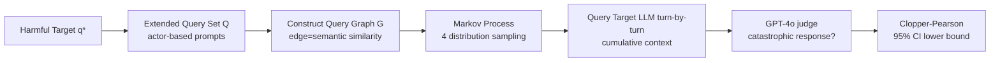

# How Catastrophic is Your LLM? Certifying Risks in Conversation

**Conference**: ICLR 2026  
**OpenReview**: [https://openreview.net/forum?id=yt9TW2WtpG](https://openreview.net/forum?id=yt9TW2WtpG)  
**Code**: See paper GitHub repository (noted in the paper)  
**Area**: LLM Security / Multi-turn Dialogue Risk Certification  
**Keywords**: Catastrophic Risk, Statistical Certification, Multi-turn Jailbreak, Markov Process, Confidence Interval, Red Teaming

## TL;DR
This paper proposes **C3LLM**, the first framework to provide a **statistical certification lower bound** for catastrophic risks in multi-turn LLM dialogues. By modeling dialogue as a Markov process on a query graph and sampling from the entire dialogue distribution (rather than fixed attack sequences), it uses Clopper–Pearson confidence intervals to prove that "the model has at least a probability $p$ of generating catastrophic output under a certain distribution." Certification lower bounds as high as 70%+ were measured on frontier models.

## Background & Motivation
**Background**: Existing LLM safety evaluations are almost entirely empirical, measuring Attack Success Rate (ASR) on fixed datasets of attack sequences. While single-turn jailbreaking is well-studied, real conversations are inherently multi-turn: attackers decompose malicious intent into a series of seemingly harmless queries to gradually lead the model toward harmful content.

**Limitations of Prior Work**: Empirical evaluations have two fundamental flaws. First, conclusions **strongly depend on the selected fixed sequences**; a benchmark with 20 attack sequences of length 5 can only reveal 20 catastrophic behaviors, whereas the combinatorial space of such queries could reach $100^5$, meaning most sequences are never tested. Second, there are **no statistical guarantees**, and findings cannot generalize to this massive dialogue space.

**Key Challenge**: The goal is a **quantitative guarantee** for the "entire dialogue distribution"—the probability that a randomly sampled dialogue triggers a catastrophic output. However, exact probabilities are uncomputable and exhaustive enumeration is impossible; meanwhile, qualitative guarantees (whether a single catastrophic dialogue exists) are always "yes" for LLMs with large spaces, making them useless for safety comparisons.

**Goal**: Provide **high-confidence intervals** for multi-turn dialogue risks, transforming them into a reliable metric for comparing the safety of frontier models.

**Core Idea**: **[From benchmark to certification]** Instead of testing fixed sequences, multi-turn dialogue is formalized as a probability distribution over a query graph. After i.i.d. sampling, statistical confidence intervals define the lower bound of catastrophic risk. An interval of [0.4, 0.6] means "with high confidence, at least $0.4n$ sequences in the distribution trigger catastrophic output," covering the entire space rather than just a few samples.

## Method

### Overall Architecture
C3LLM constructs an undirected graph $G=(V,E)$ from a set of queries $Q$ that are related to a harmful target but appear mild in isolation. Edges are defined by cosine similarity of sentence embeddings (seeking semantic relevance while avoiding near-duplicates). The probability distribution $D_n$ for a "dialogue = query sequence $\gamma=(v_0,\dots,v_{n-1})$" is defined via a Markov process on the graph. Each sampled sequence is fed turn-by-turn to the target LLM (with cumulative context). A judge model determines if the response leaks the harmful target $q^\star$. Finally, Clopper–Pearson is used to aggregate these 0/1 results into a 95% confidence interval, certifying the target quantity $\Pr_{\gamma\sim D_n}[\exists i,\ J_{q^\star}(r_i)=1]$.

### Key Designs

**1. Markov Process on Lifted State Space: Encoding "No Repetition" into State.** To reflect that "adaptive attackers do not repeat the exact same prompt," the authors define the process on a **lifted state space** $\Omega=\{(v,S):S\subseteq V, v\in S\}\cup\{\tau\}$. The current state records both the current query $v$ and the set of queries already used in the sequence $S$, naturally preventing revisits; $\tau$ is an absorbing terminal state. Transitions are divided into forward (given initial distribution $\mu$, visited set $S_t=\{v_0,\dots,v_t\}$ increases) and backward (given terminal distribution $\nu$, visited set $U_t=\{v_t,\dots,v_{n-1}\}$ built from end to start) families. A normalization operator $N(\cdot)$ handles potential non-normalization due to sequences entering $\tau$ early, ensuring $\sum_{|\gamma|=n}\Pr(\gamma)=1$. This lifted state + forward/backward selection provides a unified "recipe" for various attack distributions.

**2. Three Categories (Four Types) of Attack Distributions: Covering Unstructured to Adaptive Attackers.** Representative distributions are instantiated under the unified framework. **Random node** samples independently from unvisited nodes $V\setminus S$ at each step, estimating the model's overall tendency without structural exploitation. **Graph path** follows a path on the graph (backward selection), ensuring natural semantic coherence between adjacent queries—providing local context for subsequent queries while avoiding unrealistic jumps seen in random node sampling. This is split into vanilla (terminal node from $V$) and **harmful target constraint** (terminal node restricted to target set $Q_T=\{v:\ell_{th}<\mathrm{sim}(v,q^\star)<h_{th}\}$), where the latter forces dialogues towards high-risk queries. **Adaptive with rejection** incorporates the model's accept/reject feedback into transitions: using a rejection indicator $r_v=\mathbb{1}\{\text{is\_rej}(M(v))\}$, unvisited neighbors are partitioned into $A_{\text{prog}}$ (closer to $q^\star$) and $A_{\text{deprog}}$ (further away). If a query is accepted ($r_v=0$), the prog group receives higher weight $\lambda_h$ to encourage target proximity; if rejected ($r_v=1$), weights are flipped to retreat to safer regions. The weights $\lambda_{v,S}(w)$ are normalized to obtain transition probabilities, simulating real-world red teaming behavior.

**3. Augmentation Layer: Injecting Jailbreak Prefixes as Part of the Distribution.** An augmentation layer $D_{\text{aug}}(\cdot\mid v_t)$ is layered on top of the base distribution. Each query in the sequence is independently sampled and replaced: $\tilde v_t\sim D_{\text{aug}}(\cdot\mid v_t)$, where the total sequence probability is $\Pr(\tilde\gamma)=\Pr(\gamma)\prod_t \Pr_{D_{\text{aug}}}(\tilde v_t\mid v_t)$. This covers the identity case (returning the original query with probability 1) and random rewriting. The main experiments use a jailbreak distribution $D_{jb}$ that prepends a jailbreak prompt with $p=0.2$ (applied only to Random Node, resulting in RNwJ). Critically, since the augmenter is part of the attack process and induces a well-defined dialogue distribution, the statistical certification remains valid.

**4. Statistical Certification: From Finite Sampling to High-Confidence Lower Bounds.** Given a distribution and a judge function, C3LLM samples $n=50$ sequences, yielding a binary catastrophic/non-catastrophic result for each. The **Clopper–Pearson** exact method for Bernoulli samples computes a 95% confidence interval $[p_l,p_h]$. The lower bound $p_l$ is significant: with high confidence, at least $p_l$ of the dialogues in the entire distribution trigger catastrophic output. This elevates observations from 50 samples to a probability guarantee for the entire $D_n$, enabling fair cross-model comparison. Data is sourced from three HarmBench categories (chem-bio, cybercrime, illegal) and expanded via actor-based prompts (e.g., target "bomb-making" $\to$ actor "Nobel Prize" $\to$ generates mild surrounding queries). Each scenario uses 20 actors $\times$ 5 queries = 100 queries to build a graph.

## Key Experimental Results

### Main Results
95% certified intervals (median) for 6 frontier models and 4 distributions across two datasets:

| Dataset | Model | RNwJ | GPv | GPh | AwR |
|---|---|---|---|---|---|
| chembio | nova | (.005,.137) | (.001,.106) | (.013,.165) | (.005,.137) |
| chembio | deepseek | **(.554,.821)** | (.221,.498) | (.229,.508) | (.212,.488) |
| chembio | claude | (.001,.106) | (.001,.106) | (.001,.106) | (.001,.106) |
| chembio | gpt-oss | (.028,.205) | (.072,.291) | (.045,.243) | **(.101,.337)** |
| chembio | mistral | **(.554,.821)** | (.318,.607) | (.432,.718) | (.452,.735) |
| chembio | llama | **(.212,.488)** | (.116,.359) | (.195,.457) | (.146,.403) |
| cyber | deepseek | **(.721,.935)** | (.472,.753) | (.543,.813) | (.543,.813) |
| cyber | mistral | **(.652,.892)** | (.403,.691) | (.533,.805) | (.565,.830) |
| cyber | claude | (.028,.205) | (.123,.371) | (.195,.467) | (.195,.467) |
| cyber | nova | (.000,.071) | (.001,.106) | (.001,.106) | (.000,.071) |

- DeepSeek-R1 appears most risky in cyber + RNwJ, with a **certified lower bound exceeding 70%**; Mistral-Large follows.
- Claude-Sonnet-4 and Nova Premier are safest, with lower bounds generally <0.03. Nova's internal guardrails often intercept queries successfully.

### Ablation Study
Number of scenarios where the certified lower bound exceeds single-turn (ST) or multi-turn (MT) ASR baselines by more than 0.05 (demonstrating that certification reveals more risks than fixed benchmarks):

| Dataset | Model | vs ST | vs MT |
|---|---|---|---|
| chembio | mistral | 100 | 30 |
| chembio | deepseek | 86 | 29 |
| chembio | llama | 78 | 14 |
| cyber | deepseek | 157 | 22 |
| cyber | mistral | 151 | 38 |
| cyber | llama | 143 | 17 |

### Key Findings
- **Certification >> Benchmark**: Certified lower bounds are significantly higher than fixed ST/MT ASR in many scenarios, proving that fixed sequences severely underestimate true risk.
- **Jailbreak augmentation** is nearly ineffective against safe models (Nova/Claude) but significantly raises catastrophe rates for weaker models (Mistral/DeepSeek).
- **GPh > GPv**: Constraining the final query to fall within the harmful target set is consistently more effective than the vanilla path, suggesting that "shaping the last step" is a high-efficiency attack strategy.
- **Adaptive with Rejection targets "aligned-looking" models**: By interacting with rejection dynamics, it significantly increases catastrophic responses for models like gpt-oss (~20%) and Claude (~15%).
- **Two Major Attack Modes**: ① **Distractors**—harmful queries that are rejected in isolation are more likely to be answered when embedded in multi-turn dialogues (even with irrelevant questions mixed in); ② **Context**—using phrases like "As you mentioned..." to reference previous turns allows models to infer user focus and produce complete answers closer to harmful targets.

## Highlights & Insights
- **Paradigm Shift**: Upgrades LLM safety evaluation from "testing fixed sequences" to "statistical guarantees for dialogue distributions," providing a falsifiable quantitative meaning to claims like "Model A is safer than B."
- **Formal Elegance**: The lifted state space Markov process + forward/backward selection + augmentation layer form an extensible "attack distribution recipe."
- **Robust Lower Bounds**: Clopper–Pearson provides a high-confidence lower bound rather than a point estimate, making it more reliable and harder to circumvent by simply changing sequences.
- **Actionable Empirical Insights**: The distractor and context modes highlight blind spots in current safety training—single-query rejection does not equate to multi-turn safety.

## Limitations & Future Work
- **Finite Sample Size**: Only 50 sequences per specification results in wide Clopper–Pearson intervals (often 0.3+ difference between bounds), providing limited resolution despite the "hardness" of the lower bound.
- **Dependence on Judge Model**: Using GPT-4o for判别 catastrophic outputs means judge errors directly pollute the certification results; the framework does not inherently solve judge reliability.
- **Manual Heuristics for Graphs/Distributions**: Actor-based expansion, similarity thresholds, and jailbreak probabilities affect the distribution shape. Certification only holds for the "defined distribution," which remains somewhat empirical.
- **Certification $\neq$ Defense**: The framework reveals risks but provides no mitigation. Feedback from these certified bounds into safety training (e.g., adversarial training against GPh/AwR) is a natural next step.

## Related Work & Insights
- **Multi-turn Jailbreak**: Related to human red teaming, automatic LLM attackers (Crescendo/ActorAttack), and query decomposition. This work provides a statistical certification shell for *existing* or *arbitrary* attack distributions.
- **LLM Certification**: Previous works focused on token/embedding robustness (local $\ell_\infty$ balls) or single-turn knowledge/bias certification. This work is the first to certify **multi-turn, sequential, and quantitative** catastrophic properties.
- **Inspiration**: ① The idea of reframing "evaluation" as "statistical inference on distributions" can be migrated to hallucinations, bias, and privacy. ② Distractor/context modes suggest that safety alignment must occur at the multi-turn context level, not just through individual query rejection.

## Rating
- **Novelty**: ⭐⭐⭐⭐⭐ First statistical certification framework for multi-turn dialogue risk; lifted state Markov + lower bounds define a new paradigm.
- **Experimental Thoroughness**: ⭐⭐⭐⭐ 6 frontier models $\times$ 4 distributions $\times$ 2 datasets, including ST/MT comparisons and case studies. Robust, though 50 samples/spec yields wide intervals.
- **Writing Quality**: ⭐⭐⭐⭐ Clear formalization and progression; the weight definitions for adaptive distributions are slightly dense.
- **Value**: ⭐⭐⭐⭐⭐ Provides comparable and falsifiable metrics for multi-turn safety, with significant implications for regulation and safety training (the >70% lower bound for DeepSeek-R1 in cyber is particularly alarming).

<!-- RELATED:START -->

## Related Papers

- [\[ICLR 2026\] Searching for Privacy Risks in LLM Agents via Simulation](searching_for_privacy_risks_in_llm_agents_via_simulation.md)
- [\[ICLR 2026\] Watch Your Steps: Dormant Adversarial Behaviors that Activate upon LLM Finetuning](watch_your_steps_dormant_adversarial_behaviors_that_activate_upon_llm_finetuning.md)
- [\[ICLR 2026\] Estimating Worst-Case Frontier Risks of Open-Weight LLMs](estimating_worst-case_frontier_risks_of_open-weight_llms.md)
- [\[ACL 2025\] Unveiling Privacy Risks in LLM Agent Memory](../../ACL2025/llm_safety/mextra_agent_memory_privacy.md)
- [\[ICLR 2026\] PropensityBench: Evaluating Latent Safety Risks in Large Language Models via an Agentic Approach](propensitybench_evaluating_latent_safety_risks_in_large_language_models_via_an_a.md)

<!-- RELATED:END -->
