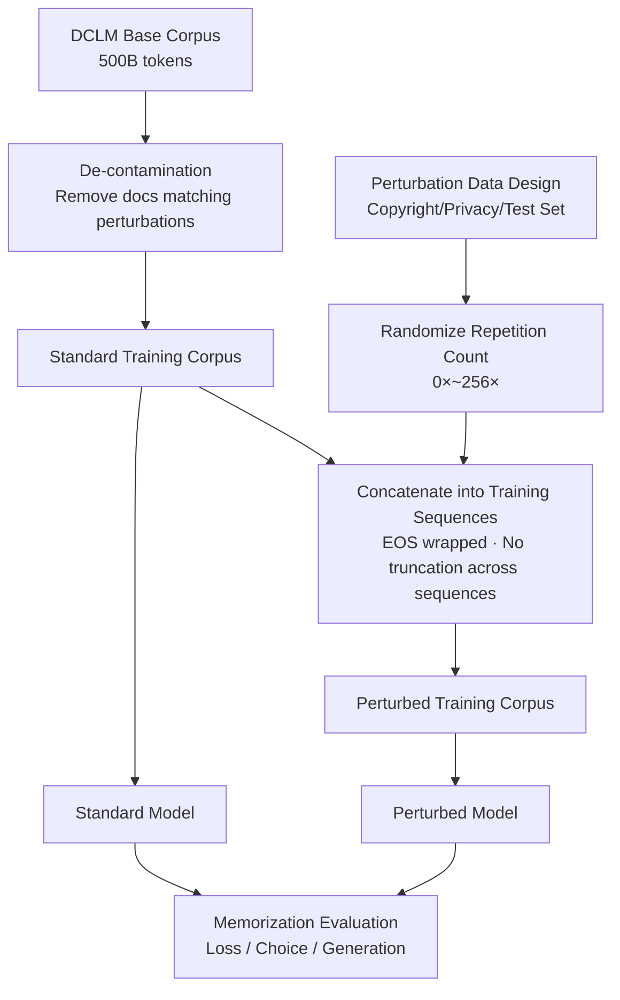

# Hubble: A Model Suite to Advance the Study of LLM Memorization

**Conference**: ICLR 2026  
**OpenReview**: [https://openreview.net/forum?id=ZfdnZhOP0k](https://openreview.net/forum?id=ZfdnZhOP0k)  
**Code**: [https://allegro-lab.github.io/hubble/](https://allegro-lab.github.io/hubble/)  
**Area**: LLM Safety / Privacy & Memorization  
**Keywords**: LLM Memorization, Open-source Model Suite, Copyright, Privacy, Test Set Contamination, Membership Inference, Machine Unlearning

## TL;DR
HUBBLE is a suite of fully open-source LLMs (1B/8B, 100B/500B tokens) that bridges controlled causal experiments and commercial-scale modeling. By **controlled insertion** of "sensitive perturbation texts" (copyrighted passages, biographies, test sets) into the pre-training corpus with randomized repetition counts, it systematically quantifies memorization risks and provides best practices for mitigation.

## Background & Motivation
- **Background**: Memorization in LLM training data is a double-edged sword. While it supports downstream capabilities like factual QA, it introduces three categories of deployment risks: copyright (reproducing copyrighted material), privacy (leaking personal information), and test set contamination (memorizing answers).
- **Limitations of Prior Work**: Existing research is split between two extremes. One side uses **small-scale controlled experiments** (synthetic/templated data) which offer precision but lack relevance to commercial LLMs. The other side uses **observational studies of large models**, which are limited by natural data randomness and cannot estimate causal quantities (e.g., "how many repetitions are needed to memorize a sample").
- **Key Challenge**: Achieving both **scale** and **causal interpretability**. Large models are expensive to train, and in natural corpora, it is impossible to distinguish whether a sample is memorized due to its simplicity or its frequency.
- **Goal**: Provide a suite of open-source models at commercial scales that, like controlled experiments, "know everything the model has seen," allowing the community to precisely measure causal quantities of memorization.
- **Core Idea**: **Controlled Perturbation + Randomized Repetition**. Carefully designed sensitive texts are inserted into the pre-training corpus with known repetition counts $\{0\times, 1\times, 4\times, 16\times, 64\times, 256\times\}$, enabling the first direct observation of the "frequency → memorization strength" relationship at scale.

## Method

### Overall Architecture
The core of HUBBLE is a paired "Standard vs. Perturbed" model design. Both use the **exact same** corpus and training pipeline, with the only difference being the controlled insertion of perturbations in the Perturbed model. These perturbations span copyright, privacy, and contamination domains. Each perturbation is randomly assigned a repetition count, allowing researchers to regress "memorization strength" against controllable variables like frequency, corpus scale, and insertion timing. The suite includes 8 core models ($2\times2\times2$ factor design) plus additional specialized collections and evaluation tools.

### Key Designs

**1. Cross-Domain Perturbation Design.** Legal risks are translated into insertable text types. Copyright domain: segments from Gutenberg books (popular/rare), Wikipedia events (stratified by views), and **paraphrased pairs** from MRPC/PAWS (testing preferences for training-time literal forms). Privacy domain: templated biographies from YAGO (9 attributes like name, UUID, birthday) and European Court of Human Rights cases with PII; PersonaChat dialogues are used to simulate **indirect leakage**. Test set domain: Standard benchmarks (PopQA, MMLU, etc.) and "new test sets" created after the DCLM cutoff (ELLie, MUNCH) to reduce accidental contamination.

**2. Sequence-level Precise Insertion with Randomized Repetition.** This is the technical core for causal inference. Each perturbation is randomly assigned a repetition count $\{0\times, 1\times, 4\times, 16\times, 64\times, 256\times\}$. To limit the volume of 256x repetitions, higher frequencies are assigned fewer samples. During insertion, a sequence is sampled from the standard pipeline, and the perturbation is inserted **as a whole** between document boundaries. A critical constraint: perturbations are **never truncated across sequences**, and each sequence contains at most one perturbation, ensuring they appear like "normal documents" to minimize disruption to training order. Total perturbations account for only 0.08% of the 100B tokens, ensuring no degradation in general model capability.

**3. De-contamination for Accurate Counting.** To use "count" as a causal variable, the base corpus must be free of the perturbation text. A two-stage de-contamination process was applied to the DCLM corpus, removing any matching documents. Only 0.002% of documents were removed. The suite uses the OLMo tokenizer (50k vocab) with untied input-output embeddings to facilitate interpretability methods like logit/tuned lens.

**4. Multi-dimensional Model Collections.** Beyond the 8 core models ($\{1\text{B}, 8\text{B}\}\times\{\text{Standard, Perturbed}\}\times\{100\text{B}, 500\text{B}\}$), the suite includes: **Interference** models (single domain) to verify domain independence; **Timing** models (perturbations inserted in specific training quarters) to study temporal effects; **Paraphrased** models for knowledge memorization; and **Architecture** models (varying depth at constant parameters).

## Key Experimental Results

### Core Finding: Diluting Sensitive Data
Comparison between 8B perturbed models at 100B and 500B tokens (Figure 2): At the same repetition count, **memorization grows significantly slower in the 500B model across almost all tasks**. This suggests that increasing the total corpus size "dilutes" sensitive data and reduces memorization risk, serving as a complement to deduplication.

### Membership Inference Attack (MIA) Benchmark
MIA ROC AUC for 8B (500B token) model on rare Gutenberg books:

| Evaluation / MIA | Dup≠0 | Dup=1 | Dup=4 | Dup=16 | Dup=64 | Dup=256 |
|---|---|---|---|---|---|---|
| Loss | 0.629 | 0.539 | 0.556 | 0.732 | 0.996 | 1.0 |
| MinK% | 0.629 | 0.539 | 0.556 | 0.732 | 0.996 | 1.0 |
| MinK%++ | 0.666 | 0.545 | 0.62 | 0.813 | 0.987 | 0.949 |
| ZLib | 0.622 | 0.53 | 0.551 | 0.722 | 0.996 | 1.0 |

As repetitions increase, MIA accuracy improves. Since non-members are derived from "0x insertion," this benchmark avoids confounding features (like temporal clues) found in WikiMIA, ensuring valid measurement.

### Key Findings
- **Timing Best Practice**: Data inserted only in the first quarter of training is barely memorized by the final model; without continued exposure, models "forget" early perturbations. Data inserted in the final quarter has the highest extractability. Placing sensitive data early is a key mitigation strategy.
- **Model Scale vs. Memorization**: The 8B model exhibits higher memorization strength than the 1B model at the same repetition count. Scaling up increases memorization risk, requiring a tradeoff with dilution/ordering strategies.
- **Privacy**: PII reconstruction accuracy reaches near 100% in the 8B (100B) model with only 16 repetitions when side information is available.
- **Contamination**: Memorizing test samples **does not equal** generalization. Accuracy can even decrease with more repetitions if the test format differs from the insertion format.

## Highlights & Insights
- **Scaling "Controlled Experiments"**: The paired design + randomized repetitions bridge the gap between small-scale control and large-scale observation.
- **Open-Source as a Critical Asset**: Full transparency of data, code, and checkpoints makes "everything the model has seen" known, a prerequisite for rigorous memorization research.
- **Actionable Best Practices**: Dilution (increasing relative corpus size) and Ordering (early appearance of sensitive data) provide engineering-ready strategies that complement deduplication.
- **Natural Downstream Testbed**: HUBBLE serves as a clean benchmark for MIA and machine unlearning research due to its known repetition rates.

## Limitations & Future Work
- **Scale Gap**: 500B tokens is still orders of magnitude smaller than Llama 3's 15T; some phenomena emerging at ultra-large scales may not be captured.
- **Lower Bound Evaluation**: Basic memorization metrics establish a lower bound; the true risk of information leakage might be higher.
- **Simulated Risks**: Inserted books and templates are "simulations" of real risks; distribution shifts compared to real web data may affect generalizability.
- **Future Work**: The suite is positioned as infrastructure for studying memorization mechanisms, MIA, unlearning, and interpretability (logit/tuned lens).

## Related Work & Insights
- **Open Science Suites**: Compares to Pythia and OLMo, but differentiates itself by being a platform for causal experimentation through controlled perturbations.
- **Memorization & Repetition**: Extends work by Tirumala et al. and Lee et al. on deduplication by identifying "dilution" as an additional best practice.
- **MIA Validity**: Addresses confounding issues in WikiMIA by using randomization to construct a clean benchmark.
- **Insight**: HUBBLE provides a reproducible experimental paradigm for any study requiring "intervention → behavior" causal attribution in LLMs.

## Rating
- **Novelty**: ⭐⭐⭐⭐⭐ Systematically brings controlled memorization experiments to commercial-scale open models for the first time.
- **Experimental Thoroughness**: ⭐⭐⭐⭐⭐ Comprehensive coverage of 8 core and multiple auxiliary models across domains and variables.
- **Writing Quality**: ⭐⭐⭐⭐ Clear structure and well-defined motivations; requires careful reading of appendices for full technical detail.
- **Value**: ⭐⭐⭐⭐⭐ Essential infrastructure for the privacy, safety, and evaluation communities.

<!-- RELATED:START -->

## Related Papers

- [\[ICLR 2026\] Information-Theoretic Membership Inference for Granular Quantification of Memorization](information-theoretic_membership_inference_for_granular_quantification_of_memori.md)
- [\[ICLR 2026\] Reasoning or Retrieval? A Study of Answer Attribution on Large Reasoning Models](reasoning_or_retrieval_a_study_of_answer_attribution_on_large_reasoning_models.md)
- [\[ICLR 2026\] Hey, That's My Model! Introducing Chain & Hash, An LLM Fingerprinting Technique](hey_thats_my_model_introducing_chain_hash_an_llm_fingerprinting_technique.md)
- [\[ACL 2025\] Which Retain Set Matters for LLM Unlearning? A Case Study on Entity Unlearning](../../ACL2025/llm_safety/which_retain_set_matters_for_llm_unlearning_a_case_study_on_entity_unlearning.md)
- [\[NeurIPS 2025\] LLM Strategic Reasoning: Agentic Study through Behavioral Game Theory](../../NeurIPS2025/llm_safety/llm_strategic_reasoning_agentic_study_through_behavioral_gam.md)

<!-- RELATED:END -->
