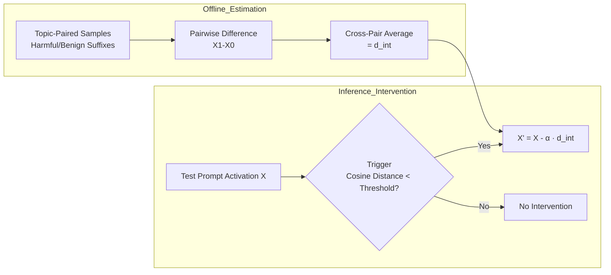

# Inference-Time Personalized Safety Control via Paired Difference-in-Means Intervention

**Conference**: ICLR 2026  
**OpenReview**: [https://openreview.net/forum?id=VHiHVBNy1M](https://openreview.net/forum?id=VHiHVBNy1M)  
**Code**: To be confirmed  
**Area**: LLM Safety / Activation Steering / Personalized Alignment  
**Keywords**: Personalized Safety, Activation Intervention, Difference-in-Means, Inference-Time Steering, Training-Free  

## TL;DR
The authors propose PCMS (Paired Contrast Mean Shift), a training-free inference-time activation intervention method. It estimates a "harmful direction" using the mean difference vector of **topic-paired** samples and subtracts it from activations. This suppresses specific content types (violence, politics, sexuality, mental health) based on personalized user preferences with minimal utility loss.

## Background & Motivation
**Background**: Mainstream LLM safety alignment pursues "universal standards"—intercepting broadly illegal or harmful content—and assumes "harmful outputs stem from harmful inputs," thus focusing on input-side harmful prompt screening.

**Limitations of Prior Work**: Safety preferences are inherently **subjective**. Even benign queries (e.g., "Describe historical revolutions") can produce violent or ideological content that some users wish to avoid. Universal alignment neither accounts for subjectivity nor protects the user's "response-level experience." Existing personalized alignment requires heavy fine-tuning or relies on structured preference data/reward models, which are often expensive or unavailable in safety scenarios. Current activation engineering methods mostly target global behavioral axes (refusal, sentiment) and are empirical heuristics that lack formal guarantees and often degrade performance on benign queries.

**Key Challenge**: How can safety control be made **efficient and data-light** while remaining **theoretically grounded and precisely controllable**?

**Goal**: Transform activation steering from an "exploratory trick" into a reliable personalized safety control mechanism. Given user preferences (e.g., "avoid violent/political content"), the method applies additive interventions to internal representations during inference to directionally suppress unwanted content while preserving model utility for benign questions.

**Core Idea**: **Harmful Direction = Mean Difference Vector of Topic-Paired Samples**. Modeling "harmfulness" as an additive harmful component within activations, the method calculates the difference between "harmful-benign" paired samples of the same topic. Averaging these provides an unbiased, consistent estimate of the harmful direction, which is subtracted from activations according to a specified intensity during intervention.

## Method

### Overall Architecture
The method consists of **offline estimation** and **online intervention**. In the offline phase, contrastive pairs are constructed from reference prompts to estimate the harmful direction $d_\text{int}$ for a single safety facet. In the inference phase, an additive intervention $X'_\text{clean} = X_\text{clean} - \alpha \cdot d_\text{int}$ ($\alpha>0$ controls intensity) is applied to middle-layer activations. Two additional mechanisms are overlaid: a **context-aware trigger** that intervenes only when prompts approach harmful regions, and **multi-facet adaptive synthesis** that weights and overlays multiple single-dimensional directions to handle crossing preferences. The paper systematically compares three direction estimation strategies (ILCS / UMS / PCMS) and uses bias-variance decomposition to prove PCMS is optimal.

### Key Designs

**1. Additive Modeling of Activations and the "True Harmful Direction" $a^*$: Separating Harmfulness into a Subtractable Component.** The paper assumes an activation $X^{k,Z_i}_i = \tau(Z_i) + h_k(Z_i) + \epsilon^{k,Z_i}_i$, where $\tau(Z)$ is the topic component, $h_k(Z)$ is the harmful state ($k\in\{0,1\}$) component, and $\epsilon$ is zero-mean instance noise. Thus, "harmfulness" is explicitly separated. Given a topic-specific harmful difference vector $a(Z)=h_1(Z)-h_0(Z)$, the global goal is its expected value over topics $a^* = \mathbb{E}_Z[a(Z)]$. Proposition 1 proves: among all linear scoring directions positively correlated with $a^*$, choosing $d^\text{optimal}_\text{int} = a^*/\|a^*\|_2$ maximizes the reduction of the worst-case harmful score. Consequently, **aligning with $a^*$ is the worst-case optimal intervention direction**. This transforms "which direction to subtract" from an empirical intuition into an estimation problem with an objective function.

**2. Three Estimation Strategies and the Superiority of PCMS: Using Pairing to Debias and Averaging to Reduce Variance.** The paper frames direction estimation within a unified framework of three estimators and performs bias-variance decomposition. **ILCS** uses a single pair difference $\hat a_\text{ILCS}=X_{1,Z'}-X_{0,Z'}$, which is data-efficient but has high variance and is biased toward global $a^*$ (the bias $a(Z')-a^*$ does not vanish with more samples). **UMS** adopts the difference-in-means approach, subtracting the means of **unpaired** harmful and benign sets. Averaging reduces variance, but differing topic distributions between sets introduce a systematic topic bias $b_\text{topic}$, preventing MSE from converging to 0. **PCMS** averages $n$ **topic-paired** differences:

$$\hat a_\text{PCMS} = \frac{1}{n}\sum_{i=1}^{n}\left(X^{1,Z_i}_i - X^{0,Z_i}_i\right)$$

Pairing causes $\tau(Z_i)$ within each pair to cancel out (eliminating topic confounding $\rightarrow$ unbiased $\mathbb{E}[\hat a_\text{PCMS}]=a^*$), while cross-pair averaging reduces noise variance at $O(1/n)$ (consistent, asymptotically optimal). This captures both the topic precision of ILCS and the variance reduction of UMS while structurally avoiding their flaws.

**3. Context-Aware Trigger: Intervening Only When "Risk is Near".** To avoid degrading utility on benign queries, the intervention is gated by a quantile threshold. For each facet $f$, benign means $\mu^{(f)}_p$ and harmful means $\mu^{(f)}_q$ are pre-stored. A smaller cosine distance $d^{(f)}(X)$ between test activation $X$ and $\mu^{(f)}_q$ indicates higher similarity to harmful content. The facet is only activated when $d^{(f)}(X)\le T^{(f)}$, with intensity scaled by $\alpha^{(f)}(X)=\max(0,\gamma-d^{(f)}(X))\cdot\mathbb{1}[d^{(f)}(X)\le T^{(f)}]$. The threshold $T^{(f)}$ is set at the 98th percentile of distances from benign activations to $\mu_q$, ensuring only prompts "abnormally close to the harmful zone" are intervened upon—this is why mathematical reasoning on GSM8K remains nearly lossless (80.23% vs 80.12%).

**4. Multi-facet Soft-Weighted Synthesis: Bayesian-style Mixing for Crossing Preferences.** Users may wish to avoid multiple content categories simultaneously. The relevance $\alpha^{(f)}$ of each facet is normalized into a weight $w^{(f)}(X)$. Each facet provides a correction $\Delta^{(f)}=\alpha_\text{global}\cdot(\mu^{(f)}_p-\mu^{(f)}_q)$ pointing from harmful to benign. The final activation is the weighted sum $X' = X + \sum_f w^{(f)}(X)\cdot\Delta^{(f)}$. The paper interprets this as a mixture-based risk minimization—where $w^{(f)}$ approximates the posterior of "facet $f$ activation." Soft weighting provides smoother and more robust transitions for ambiguous or mixed content than hard selection, covering multiple safety concerns without retraining.

## Key Experimental Results

### Main Results (LLaMA-3.1-8B, Mean of Four Categories; Utility↑ / Harmfulness↓)

| Method | Utility (1-10) | Harmfulness (1-5) |
| :--- | :--- | :--- |
| Direct Prompting | 8.51 | 3.36 |
| In-Context Learning | 8.09 | 2.86 |
| RAG | 8.15 | 2.82 |
| ILCS-local | 7.57 | 2.51 |
| ILCS-global | 6.23 | 2.95 |
| UMS | 5.80 | **1.43** |
| **PCMS** | **7.95** | 1.73 |

PCMS reduces harmfulness from 3.36 (DP) to 1.73, with utility (7.95) comparable to ICL/RAG. While UMS has the lowest harmfulness (1.43), its utility crashes to 5.80, confirming its theoretical bias. PCMS lies on the safety-utility Pareto frontier.

### Ablation / Cross-Model Results (DP vs PCMS, U / H, ↓H represents Harmfulness Reduction)

| Model | Category | DP (U/H) | PCMS (U/H) | ↓H |
| :--- | :--- | :--- | :--- | :--- |
| LLaMA-3.1-8B | Sexuality | 8.56 / 3.55 | 7.83 / 1.42 | 2.13 |
| Mistral-7B | Political | 8.77 / 4.05 | 7.94 / 1.88 | 2.17 |
| DeepSeek-LLaMA3-8B | Violence | 9.05 / 2.87 | 8.56 / 1.62 | 1.25 |
| LLaMA-3.1-8B | PI+Violence (Dual) | 8.55 / 3.39 | 7.65 / 1.71 | 1.69 |

Across three open-source models (including the reasoning-distilled DeepSeek-R1-Distill) and single/dual/triple facet scenarios, PCMS consistently reduces harmfulness while maintaining high utility.

### Key Findings
- **Theory Aligns with Empirics**: The unbiased consistency of PCMS directly corresponds to its position on the Pareto frontier; the weaknesses of UMS/ILCS align with their respective bias/variance predictions.
- **General Capabilities Unharmed**: Threshold triggering decouples safety intervention from the reasoning subspace, leaving GSM8K accuracy nearly unchanged (80.23% vs 80.12%).
- **Judge-Agnostic**: Conclusions remain consistent when using Claude-3.7 as an evaluator. Human evaluation also confirms PCMS is safer (1.79 vs 3.52) yet remaining useful (7.67).
- **Preservation of Base Safety**: Using BeaverTails/XSTest, the method preserves refusals for adversarial prompts while providing fine-grained steering in controversial or fictional contexts.

## Highlights & Insights
- **Activation Steering as an Estimation Problem**: Using bias-variance decomposition and worst-case optimality provides formal criteria, representing a substantial upgrade over previous heuristic steering. Pairing is key to debiasing; averaging is key to variance reduction.
- **Robust Problem Setting**: The scenario where "benign prompts may yield harmful responses" addresses the response-level subjective experience ignored by universal alignment. The authors built a worst-case stress-test corpus based on this.
- **Triggering as an Engineering Masterstroke**: Separating "whether to intervene" from "how strongly to intervene" via quantile thresholds is the direct cause of nearly zero utility loss.

## Limitations & Future Work
- **Dependency on GPT-4o for Labeling and Evaluation**: Topic classification and harmfulness/utility scoring rely on GPT-4o. Although cross-validated with Claude and human evaluation, the upper bound of harmful direction quality is tied to labeling quality.
- **Additive and Linear Assumptions**: The theory relies on "harmfulness as an additive component" and "linear scoring directions." Its validity for highly entangled or non-linear harmful representations is not fully tested.
- **Predefined Facets**: The four safety preference categories are manually selected. Extending this to open-ended, fine-grained, or dynamic user preferences would require re-estimating directions.
- **Layer and Intensity Tuning**: The intervention layer, $\gamma$, and $\alpha$ are still manually tuned hyperparameters. While cross-model transferability is good, automated selection is lacking.

## Related Work & Insights
- **Activation Steering / Difference-in-Means**: UMS is adapted from the "refusal direction" in Arditi et al. (2024), and ILCS from Turner et al. (2023). This work advances this line to a version supported by pairing and bias-variance theory.
- **Personalized Alignment**: Compared to parameter merging, decoding-time control, or prompt-based methods (e.g., Jang, Rame, Shi), this approach is training-free and data-light, requiring no preference data or reward models.
- **Insights**: The perspective of "treating steering vectors as statistical estimators" is transferable to other behavioral axes (honesty, style, safety sub-facets). The paired design can also be used to suppress other confounding factors. The trigger strategy suggests the "timing of intervention" warrants independent modeling.

## Rating
- **Novelty**: ⭐⭐⭐⭐ — Formalizes activation steering as a statistical estimation problem for harmful directions; paired difference-in-means + worst-case optimality provides rare theoretical grounding.
- **Experimental Thoroughness**: ⭐⭐⭐⭐ — Validated across three models, four categories, single/multi-facets, dual LLM judges + human evals, and GSM8K/BeaverTails/XSTest.
- **Writing Quality**: ⭐⭐⭐⭐ — Clear theoretical and methodological narrative; bias-variance decomposition effectively links the comparison of the three strategies.
- **Value**: ⭐⭐⭐⭐ — A training-free, data-light personalized safety control that barely harms utility; highly practical with a reusable theoretical framework.

<!-- RELATED:START -->

## Related Papers

- [\[ICLR 2026\] Learning-Time Encoding Shapes Unlearning in LLMs](learning-time_encoding_shapes_unlearning_in_llms.md)
- [\[ICLR 2026\] Adaptive Attacks on Trusted Monitors Subvert AI Control Protocols](adaptive_attacks_on_trusted_monitors_subvert_ai_control_protocols.md)
- [\[ACL 2026\] CausalDetox: Causal Head Selection and Intervention for Language Model Detoxification](../../ACL2026/llm_safety/causaldetox_causal_head_selection_and_intervention_for_language_model_detoxifica.md)
- [\[ACL 2026\] Instant Personalized Large Language Model Adaptation via Hypernetwork](../../ACL2026/llm_safety/instant_personalized_large_language_model_adaptation_via_hypernetwork.md)
- [\[CVPR 2025\] TAPT: Test-Time Adversarial Prompt Tuning for Robust Inference in Vision-Language Models](../../CVPR2025/llm_safety/tapt_test-time_adversarial_prompt_tuning_for_robust_inference_in_vision-language.md)

<!-- RELATED:END -->
