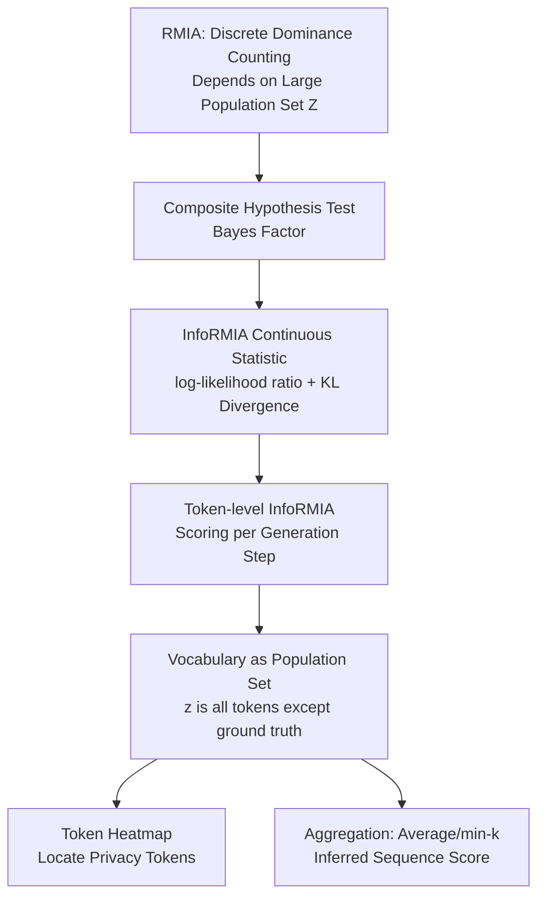

# Information-Theoretic Membership Inference for Granular Quantification of Memorization

**Conference**: ICLR 2026  
**OpenReview**: [https://openreview.net/forum?id=4KVeb0Vv13](https://openreview.net/forum?id=4KVeb0Vv13)  
**Code**: Will be integrated into ML Privacy Meter (privacytrustlab/ml_privacy_meter)  
**Area**: LLM Security / Privacy Auditing / Membership Inference  
**Keywords**: Membership Inference Attack, RMIA, Information Theory, Memorization Quantification, Token-level Privacy, Machine Unlearning  

## TL;DR
This paper reformulates the current SOTA membership inference attack (MIA), RMIA, into an information-theoretic form called **InfoRMIA**. By replacing the discrete "dominance counting" of RMIA with a continuous statistic based on "how many bits a target point saves the model relative to population data," the method achieves stronger attacks with fewer population samples. Furthermore, it refines sequence-level membership inference down to the **token level**, precisely localizing which (privacy-sensitive) tokens have been memorized by the LLM.

## Background & Motivation
**Background**: Membership Inference Attack (MIA) is the "gold standard" for quantifying privacy leakage in machine learning and LLMs. An attacker determines whether a specific sample was in the training set; higher distinguishability indicates greater leakage. The current SOTA is RMIA (Zarifzadeh et al., 2024), which scores samples by counting how many similar population samples $z$ are "dominated" by the target sample $x$.

**Limitations of Prior Work**: The scoring in RMIA is inherently discrete—its granularity is determined by the size of the population dataset $Z$, with each dominance judgment providing an increment of $\frac{1}{|Z|}$. Consequently, achieving precise scores requires a massive $Z$ (experimentally ~10% of the training set). For LLMs, 10% is an astronomical figure, making the linear growth of population data relative to training size a major bottleneck.

**Key Challenge**: Sequence-level membership inference compresses an entire sequence into a single "member/non-member" bit, which acts as lossy compression. However, Transformers generate tokens autoregressively; a sequence of length $k$ is actually $k-1$ prediction samples of (prefix, next token). Real privacy (names, PII) is often concentrated in a few tokens. Averaging over the whole sequence dilutes these signals with common tokens, leading to "most memorized sequences" that contain no actual private information—resulting in severely distorted audits.

**Goal**: To outperform RMIA in attack performance while removing dependency on large population sets, and to lower the quantification of memorization/leakage from sequence granularity to token granularity, enabling auditors to see exactly which tokens are memorized and sensitive.

**Key Insight**: **[From Counting to Bits]** Instead of counting "how many $z$ are dominated," the method utilizes information theory to measure "how many bits $x$ saves when explaining the model relative to the population," resulting in a continuous statistic. **[From Sequences to Tokens]** InfoRMIA is applied to each token generation step, using the "entire vocabulary except the ground truth" as a natural population set, completely eliminating the need for independent population data.

## Method

### Overall Architecture
The framework operates on two levels. At the bottom, RMIA's composite hypothesis test is re-solved as an information-theoretic statistic InfoRMIA, providing a continuous membership score insensitive to $|Z|$. At the top, InfoRMIA is applied at the token level: scores are computed for each generation step using the vocabulary as the population set, allowing both the localization of single-token leakage and the inference of sequence-level scores through aggregation.

### Key Designs

**1. Information-Theoretic Test Statistic: From discrete counts to continuous bits.** RMIA formulates membership inference as a composite hypothesis test: $H_0$ (model trained on some $z$ from the population) vs. $H_1$ (model trained on target $x$), performing a pairwise likelihood ratio test with threshold $\gamma$ for each $z$ and counting the rejection ratio. This paper shifts the perspective: rather than counting dominance, it measures how many "extra bits" the target saves in explaining the model compared to population data, defined as $\mathbb{E}_z [-\log p(\theta|z)] - (-\log p(\theta|x))$. Using the Bayes Factor (the standard solution for composite tests) and the same Bayesian decomposition as RMIA, the statistic simplifies to an elegant sum of two terms:

$$\text{Test Statistic} = \log\frac{p(x|\theta)}{p(x)} + D_{\mathrm{KL}}\big(p(z)\,\|\,p(z|\theta)\big)$$

The first term, $\log\frac{p(x|\theta)}{p(x)}$, measures the information gain of the model regarding $x$, representing **memorization**. The second term, the KL divergence, describes the change in the population distribution before and after conditioning on $\theta$, reflecting **generalization**. This statistic is naturally continuous and threshold-free, and its granularity is not tied to $|Z|$. Higher-precision scores can be achieved with very few population samples, reducing dependency to a constant factor. The gap between InfoRMIA and RMIA primarily depends on the "uniformity" of the population signal distribution $p(z|\theta)/p(z)$ in RMIA: the more uniform the distribution, the smaller the discretization loss and the narrower the gap.

**2. Token-level InfoRMIA: Using the vocabulary as a natural population set.** A sequence $x=\{x_1x_2\dots x_k\}$ is treated as $k-1$ prediction samples. At each generation step, InfoRMIA is applied to generate $k-1$ token-level scores. A key innovation is the selection of population set $Z$: for a ground-truth token (e.g., "3"), the population is simply all other tokens in the vocabulary, $Z=\{z: z\in V \wedge z\neq x\}$. Since $p(x|\theta)+\sum_{z\in Z}p(z|\theta)=\sum_{z\in V}p(z|\theta)=1$, the probabilities over the vocabulary are naturally normalized. The statistic can be written as an equivalent KL divergence over the entire vocabulary $V$, requiring no additional normalization. This creates a **data-dependent** population set, eliminating the high cost of curating independent datasets for pre-trained LLMs and making the attack truly feasible.

**3. Token-to-Sequence Aggregation and Privacy Interface.** For attackers without prior knowledge of privacy tokens, sequence-level scoring remains necessary. The $k-1$ token scores are compressed using aggregation (e.g., average, min-k). From an information-theoretic view, the actual privacy bits of a sequence are $\text{PrivBits}=\sum_{x\in V_{\text{priv}}}-\log p(x)$, which is much smaller than the upper bound $\sum_x -\log p(x)$ when treating all tokens as private—explaining why sequence-level methods overestimate risk. The authors developed an HTML heatmap interface based on token scores: the intensity of highlights corresponds to the degree of memorization, allowing auditors to inspect if specific privacy tokens are memorized or sum n-gram scores for localized machine unlearning.

## Key Experimental Results

### Main Results: InfoRMIA Outperforms RMIA (4 Reference Models, AUC / TPR@0.1%FPR)

| Dataset | \|Z\| | RMIA AUC | RMIA TPR | InfoRMIA AUC | InfoRMIA TPR | LiRA AUC |
|---|---|---|---|---|---|---|
| AG News | 100 | 0.857 | 0.00% | **0.878** | **12.0%** | 0.864 |
| AG News | 1000 | 0.877 | 1.60% | **0.878** | **12.0%** | 0.864 |
| CIFAR-10 | 10000 | 0.833 | 0.00% | **0.833** | **5.82%** | 0.824 |
| Purchase100 | 10000 | 0.543 | 0.00% | **0.575** | **0.32%** | 0.540 |

The results at low FPR are most significant: InfoRMIA improves TPR@0.1%FPR from 0–1.6% (RMIA) to 12% on AG News. Notably, performance is invariant to $|Z|$ (in single-model auditing, the second KL term is constant for all $x$), validating the claim of reduced population set dependency.

### Token-level InfoRMIA for Sequence-level MIA (Fine-tuned LLM, AUC / TPR@1%FPR)

| Dataset | Epochs | RMIA | InfoRMIA | InfoRMIA(token) | LiRA |
|---|---|---|---|---|---|
| AG News | 1 | 0.839 / 0.0% | 0.843 / 23.0% | 0.836 / 20.2% | 0.795 / 3.6% |
| AG News | 4 | 0.945 / 0.0% | 0.945 / 16.2% | 0.942 / **20.6%** | 0.882 / 9.0% |
| ai4privacy | 4 | 0.821 / 26.0% | 0.822 / 27.2% | 0.804 / 23.2% | 0.782 / 10.4% |

Although not designed for sequence-level tasks, token-level methods achieve competitive AUC and significantly higher TPR at low FPR compared to RMIA/LiRA using simple average aggregation.

### Key Findings
- **Pre-trained LLM (MIMIR Benchmark)**: Using only a single early checkpoint (step-1) of Pythia-160M as a reference model (the more "OUT" the better), token-level InfoRMIA becomes the strongest reference-based MIA on pre-trained LLMs, surpassing methods like Ref.
- **Aggregation Choice**: For low FPR and high TPR, simple averaging outperforms min-k (as min-k is essentially a non-member detector). However, rankings flip when using AUC, reinforcing the argument by Carlini et al. that AUC can be a misleading privacy metric.
- **Semantic Heterogeneity of Memorization**: On AG News, PERSON and WORK_OF_ART tokens have the highest average membership scores, indicating PII is memorized significantly more. Conversely, on ai4privacy, private tokens scored slightly lower than non-private ones—suggesting high sequence-level AUC often stems from memorizing non-private content, and AUC is not a reliable proxy for actual privacy risk.

## Highlights & Insights
- **Perspective Shift from "Counting" to "Bits"**: Recasting RMIA’s discrete counts into continuous log-likelihood ratios and KL divergence provides a more rigorous theoretical foundation (Bayes Factor) while solving population size dependency—a "superior performance via superior form" approach.
- **Vocabulary as Population Set**: This is the stroke of genius in the token-level framework. It replaces "expensive, curated independent population data" with "model-generated vocabulary logits," making attacks feasible for large-scale pre-trained LLMs.
- **Granularity Shift from Sequence to Token**: Coupled with heatmaps, this reveals the counter-intuitive phenomenon that "the most memorized sequences often contain no privacy." It identifies a systematic overestimation in sequence-level auditing and paves the way for surgical machine unlearning.

## Limitations & Future Work
- The token-to-sequence aggregation is presented as a proof of concept; only general methods like average/min-k were evaluated without exploring optimized aggregators.
- The token-level privacy interface assumes the user knows which tokens are sensitive (labeled PII), acting as a diagnostic tool for informed auditors rather than an automated universal risk quantifier.
- Experiments focused on smaller models (GPT-2, Pythia-160M, WideResNet); performance on larger LLMs remains to be verified.
- Downstream applications (precision machine unlearning, token-guided data reconstruction) were discussed but not systematically implemented.

## Related Work & Insights
This work follows the evolution of membership inference: from Shokri’s shadow models and Yeom’s loss signals to Carlini’s LiRA (IN/OUT Gaussian likelihood ratio) and RMIA’s dominance counting. InfoRMIA unifies this trajectory using information theory while setting a new SOTA. Regarding memorization quantification, it moves beyond the "exact match" framework of verbatim/discoverable memorization, echoing Tao & Shokri's critique of overly strict privacy definitions to propose a more realistic, token-level, bit-based privacy view. A key insight for practitioners: **LLM privacy auditing should look beyond sequence-level AUC.** Real leakage is concentrated in specific tokens; audits should dive into token granularity for diagnostics, enabling surgical unlearning instead of deleting entire documents that may contain useful knowledge.

## Rating
- **Novelty**: ⭐⭐⭐⭐ — The reformulation of RMIA, the use of vocabulary as a population set, and the granularity shift are all clean and powerful ideas.
- **Experimental Thoroughness**: ⭐⭐⭐⭐ — Covers tabular, image, and text data across fine-tuned and pre-trained LLMs (MIMIR benchmark), though model scales are relatively small and unlearning applications are not yet realized.
- **Writing Quality**: ⭐⭐⭐⭐ — Clear derivations; the dual narratives of "counting vs. bits" and "sequence vs. token" are fluent. Visualizations are intuitive.
- **Value**: ⭐⭐⭐⭐ — Provides a stronger tool for integration into ML Privacy Meter and corrects the systematic bias of sequence-level auditing overestimating privacy risks.

<!-- RELATED:START -->

## Related Papers

- [\[ICLR 2026\] Membership Inference Attacks Against Fine-tuned Diffusion Language Models (SAMA)](membership_inference_attacks_against_fine-tuned_diffusion_language_models.md)
- [\[ICLR 2026\] Tab-MIA: A Benchmark Dataset for Membership Inference Attacks on Tabular Data in LLMs](tab-mia_a_benchmark_dataset_for_membership_inference_attacks_on_tabular_data_in_.md)
- [\[ICLR 2026\] No Caption, No Problem: Caption-Free Membership Inference via Model-Fitted Embeddings](no_caption_no_problem_caption-free_membership_inference_via_model-fitted_embeddi.md)
- [\[ACL 2026\] Membership Inference Attacks on In-Context Learning Recommendation](../../ACL2026/llm_safety/membership_inference_attacks_on_llm-based_recommender_systems.md)
- [\[ICLR 2026\] Hubble: A Model Suite to Advance the Study of LLM Memorization](hubble_a_model_suite_to_advance_the_study_of_llm_memorization.md)

<!-- RELATED:END -->
