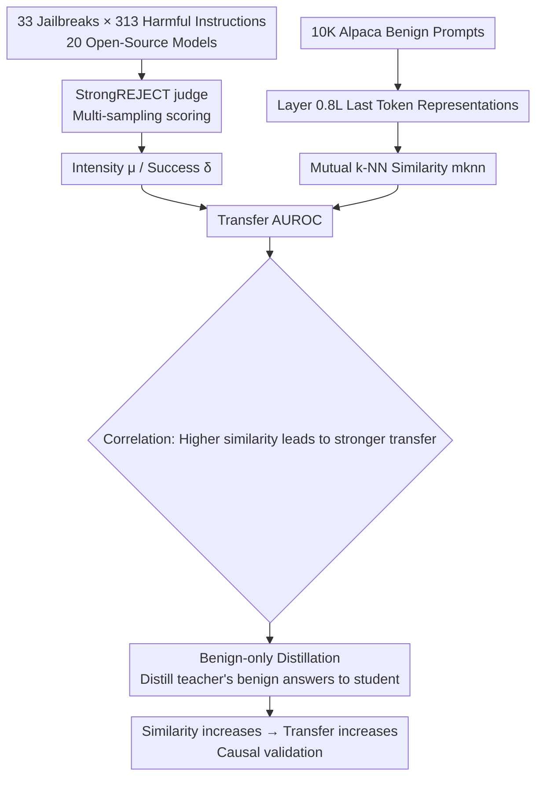

# Jailbreak Transferability Emerges from Shared Representations

Conference: ICLR 2026  
arXiv: N/A  
Code: N/A  
Area: LLM Security / Representation Learning / Interpretability  
Keywords: Jailbreak Transferability, Representation Similarity, Platonic Representation Hypothesis, Benign Distillation, Safety Alignment  

## TL;DR

This paper uses large-scale empirical and causal experiments (20 open-source models × 33 jailbreak attacks) to demonstrate that the "cross-model transferability" of jailbreaks is not an accidental flaw of safety training, but a natural consequence of models **sharing representation geometry** under benign inputs—the more similar the representations, the more likely vulnerabilities are to "infect" one another.

## Background & Motivation

**Background**: Jailbreak prompts can bypass LLM safety mechanisms to induce harmful outputs and often exhibit "transferability"—attacks successful on model A can also breach model B, even if they differ in architecture, data, and origin. While observed repeatedly, a unified mechanistic explanation for this phenomenon has been lacking.

**Limitations of Prior Work**: Theories regarding "why it transfers" are diverse—ranging from shallow quirks of safety fine-tuning to byproducts of shared model lineages or fundamental attributes of representation learning. Furthermore, past evaluations often relied on single-shot sampling and rule-based matching (e.g., checking for "I'm sorry"), which is noisy and only identifies "refusal" rather than "actual leakage of harmful content," making results hard to replicate and compare.

**Key Challenge**: Transferability must be disentangled from the confounding factor of "source attack strength"—otherwise, apparent transfer might simply reflect a stronger attack on the source model rather than deep similarities between models.

**Goal**: Provide a quantifiable explanation and move from correlation to causation, proving that representation alignment is the driving factor for transferability.

**Core Idea**: Transferability is systematically determined by two quantifiable factors: (1) representation similarity of models under **benign** prompts, and (2) the intensity of the jailbreak on the source model. This is validated by "benign-only distillation," which artificially aligns the representations of two models to see if it **causally** increases jailbreak transfer.

## Method

### Overall Architecture

The research proceeds in three steps: first, quantifying "jailbreak intensity/success" with robust evaluation (controlling for confounders); second, measuring representation similarity using "mutual k-nearest neighbors"; and finally, performing causal intervention via "benign-only distillation" to verify if aligning representations increases transfer.

### Key Designs

**1. Robust Jailbreak Effectiveness Metrics: Separating "Intensity" and "Success" as control variables.** The authors move away from fragile single-sample rule matching and adopt the StrongREJECT LLM-as-judge, mapping each prompt-response to a continuous score $\text{JUDGE}\in[0,1]$ (0=safe/irrelevant, 1=completely harmful and helpful). After sampling $m$ responses for each adversarial input, two complementary metrics are defined: intensity $\mu(\tilde p,\text{LLM})=\frac{1}{m}\sum_j \text{JUDGE}(p,r_j)$ measures "how reliably the safety mechanism was disabled," and success $\delta(\tilde p,\text{LLM})=\max_j \text{JUDGE}(p,r_j)$ measures "if at least one harmful response was induced." Crucially, source model **intensity is used as a control variable**, allowing the transfer analysis to distinguish between "transfer due to stronger source attacks" and "transfer due to representation similarity."

**2. Mutual k-NN Representation Similarity: A rotation/scale-invariant topological measure.** Borrowing the mutual k-NN metric proposed by Huh et al. for the "Platonic Representation Hypothesis," the study quantifies whether two models "encode inputs in a similar way." Given a set of benign prompts $P$, embeddings are formed from the last token hidden representation $f(p)$ at layer $\lfloor 0.8L\rfloor$. A directed k-NN graph $G_f$ is constructed, and the similarity between two models is the Jaccard index of their graphs: $\text{mknn}(f,f')=\frac{|G_f\cap G_{f'}|}{|G_f\cup G_{f'}|}$. This metric focuses on neighborhood topology and is invariant to rotation and scaling of the embedding space, capturing whether two models provide consistent neighbor structures for the same set of prompts.

**3. Benign-only Distillation as Causal Intervention: "Infecting" vulnerabilities without harmful data.** To establish causality, the authors perform cross-family distillation (e.g., Gemma2-27B → Qwen2.5-14B). The student is fine-tuned (SFT) using only the teacher's answers to 52K Alpaca **benign** instructions, while mixing in the student's own refusal responses to AdvBench harmful instructions (5,120 pairs) to maintain the student’s original safety guardrails. Note that **harmful instructions are never queried from the teacher**, simulating a realistic scenario where an attacker avoids sending harmful requests to a proprietary API. The student never sees the teacher's response to jailbreaks, yet becomes susceptible to jailbreaks that affect the teacher—thereby moving "representation alignment → transfer" from correlation to causation.

**4. Symmetric Transfer AUROC: Measuring the ability of "source intensity to predict target success."** $\text{AUROC}(\{\delta(\tilde p_i,\text{LLM}_{tgt})\ge\tau\},\{\mu(\tilde p_i,\text{LLM}_{src})\})$ measures the predictive power of source intensity scores for target success labels. Since there is no natural direction between models and similarity is symmetric, the arithmetic mean of AUROC in both directions is taken as the "Symmetric Transfer AUROC."

## Key Experimental Results

### Main Results

| Setting | Observation |
|------|------|
| 20 Models / 380 Pairs / 33 Jailbreaks × 313 Instructions | Higher similarity leads to higher Transfer AUROC; **high-similarity model pairs never exhibit weak transfer.** |
| ≥14B Subset | The correlation between similarity and Symmetric Transfer AUROC is tighter and near-monotonic; the law strengthens with scale. |
| Persona vs. Cipher | Persona-style jailbreaks transfer significantly more reliably than cipher-style ones; larger models are less susceptible to cipher-style attacks. |

### Causal Intervention (Benign Distillation)

| Distillation Pair | Similarity Change |
|--------|-----------|
| Gemma2-27B → Qwen2.5-14B | 0.28 → 0.42 (Relative +50%, largest absolute gain) |
| Llama3.1-8B → Qwen2.5-7B; Qwen2.5-7B → Llama3.2-3B | Absolute gain of 0.10–0.12 |
| Intra-family Distillation (Llama3.1-8B → Llama3.2-3B) | Similarity remains almost unchanged (already sharing data/being a distilled version). |

### Key Findings

- Similarity rises sharply in the early stages of distillation and then plateaus, indicating that representation alignment primarily occurs early in training. In practice, similarity rarely exceeds 0.5, making gains of 0.1–0.14 quite significant.
- Jailbreak transfer success rates increase following distillation. In some cases, distilled models actually become **safer** against specific jailbreaks—suggesting that models inherit a portion of the guardrails along with the vulnerabilities.
- Persona-style jailbreaks rely on natural language and align with shared semantic representations, thus transferring widely. Cipher-style attacks rely on idiosyncratic quirks of individual models and do not touch core representation geometry, making them harder to transfer.

## Highlights & Insights

- The paper recharacterizes "jailbreak transferability" not as a "fragile byproduct of safety training" but as an "emergent consequence of representation alignment," connecting it with the Platonic Representation Hypothesis and providing a unified, falsifiable mechanism.
- The methodological refinements (multi-sampling + StrongREJECT + intensity as a control variable) constitute a contribution to the reproducibility of jailbreak research.
- The finding that "benign-only distillation can increase transfer" is counter-intuitive and carries practical threat implications: attackers do not need harmful outputs from proprietary models; they can simply align representations via benign queries to make existing jailbreaks transferable.

## Limitations & Future Work

- Experiments focused on open-source instruction models (Llama/Gemma/Qwen families, ≤70B). Whether these results generalize to larger or closed-source frontier models remains to be verified.
- The similarity metric depends on the choice of a fixed layer $\omega=0.8$ and $k=100$. While robustness across different layers/k is supported in the appendix, the causal chain between the metric and "representation alignment" remains indirect.
- No specific defense strategy is provided—given that vulnerabilities transfer with similarity, how to "de-correlate" safety failure modes without sacrificing capability or alignment gains remains an open question.

## Related Work & Insights

- **Platonic Representation Hypothesis (Huh et al. 2024)**: Models trained on different objectives/data converge to similar statistical representations; this paper uses it as the explanatory basis for transferability.
- **StrongREJECT (Souly et al. 2024)**: Provides robust jailbreak judgment, acting as the core evaluation tool for this study.
- **Safety Fine-tuning Degrades Safety (Qi/Wolf/He et al.)**: Explains why the student's own refusal responses must be included during distillation to protect guardrails.
- Insight: Cross-model safety assessments should treat "representation similarity" as a first-class predictor. If a red team finds an attack is strong on one model, they should prioritize checking models with high representation similarity.

## Rating

- Novelty: ⭐⭐⭐⭐ Connects jailbreak transfer with representation alignment/Platonic Representation Hypothesis and provides causal evidence via benign distillation.
- Experimental Thoroughness: ⭐⭐⭐⭐ Large-scale observations with 380 model pairs/33 attacks plus three sets of cross-family causal experiments provide a complete chain of evidence.
- Writing Quality: ⭐⭐⭐⭐ Clear mechanistic narrative, rigorous metric definitions, and strong supporting visualizations.
- Value: ⭐⭐⭐⭐ Significant for understanding jailbreak mechanisms and designing robust defenses, while exposing the realistic threat that "benign distillation can infect models with vulnerabilities."

<!-- RELATED:START -->

## Related Papers

- [\[ICLR 2026\] GeneBreaker: Jailbreak Attacks Against DNA Language Models with Pathogenicity Guidance](genebreaker_jailbreak_attacks_against_dna_language_models_with_pathogenicity_gui.md)
- [\[ICLR 2026\] Unlearning Evaluation through Subset Statistical Independence](unlearning_evaluation_through_subset_statistical_independence.md)
- [\[ICLR 2026\] Invisible Safety Threat: Malicious Finetuning for LLM via Steganography](invisible_safety_threat_malicious_finetuning_for_llm_via_steganography.md)
- [\[AAAI 2026\] Ghost in the Transformer: Detecting Model Reuse with Invariant Spectral Signatures](../../AAAI2026/llm_safety/ghost_in_the_transformer_detecting_model_reuse_with_invariant_spectral_signature.md)
- [\[AAAI 2026\] Multi-Faceted Attack: Exposing Cross-Model Vulnerabilities in Defense-Equipped Vision-Language Models](../../AAAI2026/llm_safety/multi-faceted_attack_exposing_cross-model_vulnerabilities_in_defense-equipped_vi.md)

<!-- RELATED:END -->
