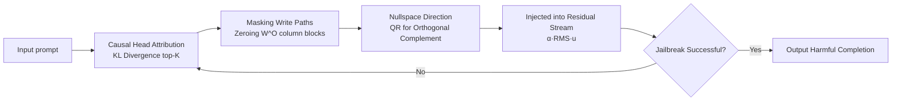

# Jailbreaking the Matrix: Nullspace Steering for Controlled Model Subversion

**Conference**: ICLR 2026  
**OpenReview**: [https://openreview.net/forum?id=qlf6y1A4Zu](https://openreview.net/forum?id=qlf6y1A4Zu)  
**Code**: [https://github.com/VishalPramanik/Jailbreaking-the-Matrix.git](https://github.com/VishalPramanik/Jailbreaking-the-Matrix.git)  
**Area**: LLM Security / Jailbreak Attacks / Mechanistic Interpretability  
**Keywords**: Jailbreak attacks, Attention head attribution, Nullspace steering, Residual stream intervention, Closed-loop attack  

## TL;DR
HMNS re-purposes mechanistic interpretability tools as attack vectors: it first localizes attention heads primarily responsible for "refusal" using KL divergence, zeros out their output projection columns, and then injects a perturbation into the **orthogonal complement (nullspace)** of the masked subspace. This bypasses security alignment routing, achieving SOTA jailbreak success rates with approximately 2 external queries.

## Background & Motivation
**Background**: LLMs aligned via RLHF/DPO remain vulnerable to jailbreaking. Mainstream attacks are categorized into three types: optimization-based (e.g., GCG, AutoDAN searching for adversarial suffixes), template-based (e.g., Many-Shot, MasterKey using multi-step reasoning shells), and rewriting-based (e.g., ReNeLLM, DrAttack skinning harmful requests into innocuous scenarios).

**Limitations of Prior Work**: These methods only manipulate **input text**, essentially performing surface-level prompt engineering: ① High query costs (often dozens); ② Significant performance degradation against defenses like SmoothLLM, Paraphrase, or SafeDecoding; ③ Lack of interpretability—attackers do not know which internal paths are bypassed, making success seem more like luck than mechanism.

**Key Challenge**: Mechanistic interpretability research (causal tracing, activation steering, function vectors) has long proven that model behavior is dominated by a few attention heads and can be steered at the residual stream level. However, this "microscope" has primarily served alignment and interpretability; **the exploitable internal structures it reveals have never been systematically utilized as an attack weapon**.

**Goal**: To develop a mechanism-level, geometrically constrained, and defense-resistant jailbreak method that intervenes directly inside the model rather than manipulating the prompt.

**Core Idea**: **[Mechanism-level Attack]** Refusal is viewed as a causal route driven by specific attention heads. The method precisely localizes and **masks** the write paths of these heads, then injects a steering direction that they **cannot reconstruct or counteract** because it is strictly constrained within the nullspace of the masked subspace. The entire process is a **closed-loop refresh** during each decoding step, re-identifying causal heads as the context evolves.

## Method

### Overall Architecture
HMNS (Head-Masked Nullspace Steering) is a pure inference-time, gradient-free closed-loop intervention pipeline. Given a prompt, each decoding attempt executes a four-step cycle: "Attribution → Masking → Nullspace Steering → Injection." It uses counterfactual ablation to assign causal scores to each attention head and selects the top-K as the causal head set; it zeros out the column blocks in the output projection matrix $W^O$ corresponding to these heads to cut off their write paths; it samples a steering direction in the orthogonal complement of the masked subspace; and it injects this into the residual stream via forward hooks, scaled by activation magnitude. If the generation fails to jailbreak, it re-attributes based on the updated context, looping up to $T_{att}$ times.

### Key Designs
**1. KL Divergence Causal Head Attribution: Finding heads "responsible for refusal" via counterfactual ablation.** To attack, one must identify the targets. For each head $(\ell,h)$, a counterfactual forward pass is performed: the segment of the output projection for that head is zeroed using a diagonal selector $S_{\ell,h}$, yielding $\widetilde{W}^O_{\ell,h}=W^O_\ell(I-S_{\ell,h})$. The KL divergence between the original and ablated next-token distribution is compared: $\Delta_{\ell,h}=\mathrm{KL}\big(P\,\|\,\widetilde{P}^{(\ell,h)}\big)$. A larger $\Delta$ indicates the head is more critical to the current completion. Heads are ranked globally by $\Delta$ to form the top-K set $S$. A critical constraint is that K must be small enough such that the masking matrix for each layer satisfies $\mathrm{rank}(M_\ell)<d$; otherwise, the masked subspace would span the entire residual dimension, making the nullspace vanish. Implementation uses a lightweight proxy (monitoring target-logit drops) to screen candidates, followed by precise KL scoring on a shortlist for $K=10$, reducing overhead from "ablate every head" to $K_{exact}$ magnitude.

**2. Nullspace Steering Direction: Making the steering irreconstructible and uncounteractable.** For the selected heads in each layer $\ell$, their output projection columns are concatenated into $M_\ell=\big[\,W^O_\ell[:,hd_h:(h{+}1)d_h]\,\big]_{h\in S_\ell}$. This represents the subspace spanned by all directions these heads can write into the residual stream. A thin QR decomposition $M_\ell=Q_\ell R_\ell$ is performed, and a Gaussian random vector $r\sim\mathcal{N}(0,I_d)$ is sampled and projected onto the orthogonal complement: $u_\ell=\frac{(I-Q_\ell Q_\ell^\top)\,r}{\|(I-Q_\ell Q_\ell^\top)\,r\|_2+\varepsilon}$. Using a random probe instead of a manual/learned direction ensures "unbiased" steering. Orthogonality is verified via $\|M_\ell^\top u_\ell\|_\infty<\delta$ (with $\delta=10^{-6}$), resamping up to 3 times if needed. This step is the geometric root of "local non-reproducibility": because $u_\ell$ lies outside the write space of the masked heads, these heads cannot reconstruct or counteract the perturbation regardless of their computations.

**3. Inference-time Dual Intervention + RMS Scaled Injection: Joint masking and steering with minimal intrusion.** During generation, two actions occur simultaneously. First, for layers with selected heads, the corresponding column blocks in $W^O_\ell$ are dynamically zeroed (affecting only the current forward pass without modifying original weights), physically severing the heads' contribution to the residual stream. Second, a geometrically constrained perturbation $\delta_\ell=\alpha\cdot\mathrm{RMS}(a_\ell)\cdot u_\ell$ is injected, where $\mathrm{RMS}(a_\ell)=\sqrt{\frac{1}{d}\sum_i a_{\ell,i}^2}$ aligns the perturbation magnitude with the current activation scale, and $\alpha$ is a fixed steering coefficient. The perturbation only affects the **last token position** of the current decoding step, ensuring local, minimal intrusion. The combination of "zeroing write paths" and "orthogonal steering" pushes the model from alignment routing toward harmful completions.

**4. Closed-loop Re-identification: Continuous re-attribution as context evolves.** A single intervention is often insufficient, and causal heads may drift during the autoregressive process. HMNS encapsulates attribution, subspace construction, and injection into a closed loop: each decoding attempt re-calculates KL attribution, regenerates nullspace directions, and re-injects perturbations. The steering intensity $\alpha$ is increased using temperature annealing $\alpha_t=0.25\,(1+0.1(t-1))$, stopping once a hit is achieved or after $T_{att}=10$ attempts. This dynamic re-identification is why it remains robust under strong defenses; as the defense changes the routing, the closed loop re-localizes the new causal heads.

## Key Experimental Results

### Main Results (Jailbreak Effectiveness, selected LLaMA-3.1-70B)
ASR is reported via GPT-4o/GPT-5 dual-evaluators; ACQ is Average Query Count (lower is better).

| Method | AdvBench ASR↑ | ACQ↓ | HarmBench ASR↑ | JBB ASR↑ | StrongReject ASR↑ |
|------|------|------|------|------|------|
| AutoDAN | 74.0/67.9 | 12.4 | 70.6/64.9 | 75.2/69.3 | 67.9/62.3 |
| ArrAttack (2nd best) | 93.0/89.0 | 7.4 | 91.0/88.0 | 94.0/96.2 | 90.0/86.0 |
| PrisonBreak | 78.4/72.6 | 11.5 | 75.6/70.2 | 79.8/74.3 | 72.0/66.9 |
| **HMNS (Ours)** | **99.0/95.0** | **1.8** | **97.0/94.0** | **99.0/96.0** | **96.0/92.0** |

Across 12 groups (3 models × 4 datasets), HMNS outperforms the runner-up ArrAttack by an average ASR of +5.9pp (GPT-4o) / +5.0pp (GPT-5), with ACQ ≈ 2 (roughly 1/4 of strong baselines) and a standard deviation < 0.4 across three independent runs.

### Ablation Study (Phi-3 Medium 14B, AdvBench)

| Variant | ASR↑ | ACQ↓ | FPS↓ |
|------|------|------|------|
| HMNS (Full) | 96.8/92.1 | 2.1 | 0.58 |
| No Masking (Projection only) | 89.5/84.0 | 2.4 | 0.61 |
| No Projection (Masking only) | 87.9/82.2 | 2.3 | 0.55 |
| Direct Direction (No nullspace constraint) | 88.7/83.1 | 2.5 | 0.63 |
| Frozen top-K (No re-identification) | 90.2/85.0 | 2.7 | 0.60 |
| Randomly selected K heads | 81.4/76.0 | 2.2 | 0.56 |

### Key Findings
- **Nullspace constraint is core**: Replacing it with "direct direction" injection drops ASR to 88.7, proving the efficacy of local non-reproducibility provided by the orthogonal complement.
- **Causal attribution is irreplaceable**: Randomly selecting heads causes ASR to plummet to 81.4, indicating that target heads localized by KL scoring are the model's "Achilles' heel."
- **Defense resistance**: Under six defenses (SmoothLLM, Paraphrase, SafeDecoding, etc.), HMNS maintains a +6~8pp lead over the runner-up. Closed-loop re-identification allows it to adapt to routing changes caused by defenses.
- **Compute-normalized evaluation**: The authors introduce FEP (forward-equivalent pass) alongside IPC/FPS/LPS, acknowledging HMNS's extra internal forward passes. However, under equivalent compute budget (capping best-of-N at per-input FLOP limits), FPS and latency remain competitive with baselines.

## Highlights & Insights
- **"Aggressive Flip" of interpretability tools**: Tools like causal tracing and function vectors have been microscopes for alignment; this paper is the first to systematically turn them into scalpels, showing that "understanding internal mechanisms" and "precisely manipulating them" are two sides of the same coin.
- **Geometric Non-reproducibility**: Locking the steering direction into the nullspace of masked heads ensures from a linear algebra perspective that severed heads cannot self-repair. This is the fundamental reason for its defense resistance, rather than prompt-based tricks.
- **Closed-loop + Compute-normalized Evaluation**: Dynamic re-identification handles autoregressive routing drift. The FEP metric system honestly accounts for the cost of extra internal forward passes, providing a fairer comparison than ACQ alone.

## Limitations & Future Work
- **Double-edged sword/Ethical risks**: As an attack paper, the open-source code and method could be misused; the authors include warnings regarding offensive content. Its value lies in **exposing alignment vulnerabilities and catalyzing mechanism-level defenses**.
- **Requirement for white-box access**: HMNS requires read/write access to $W^O$ and residual stream injection, meaning it is only applicable to open-source or weight-accessible models, not closed-source APIs (GPT, Claude).
- **Extra internal compute**: Each attempt requires multiple ablation forward passes, leading to high IPC. Although alleviated by proxy screening, the absolute internal overhead exceeds pure prompt attacks.
- **Interference from unmasked paths**: The authors admit that while steering is not reconstructed by masked heads, other heads or MLPs might still interact with it; the theoretical guarantee is "local" rather than global.
- **Defense implications**: Future defenses should monitor for anomalous orthogonal injections in the residual stream and attention head masking, rather than just filtering input text.

## Related Work & Insights
- **Mechanistic Interpretability**: Causal tracing (Meng 2022), activation steering (Turner 2023), and function vectors (Todd 2023) provided the foundation that heads encode specific computations and behavior can be steered; HMNS weaponizes these findings.
- **Three Families of Jailbreak Attacks**: Optimization-based (GCG, AutoDAN, ArrAttack), template-based (Many-Shot, MasterKey), and rewriting-based (ReNeLLM, DrAttack)—HMNS differentiates itself by moving from the input layer to the mechanism layer.
- **Insights**: ① Defense research should integrate "activation/residual stream monitoring" into the security stack. ② The duality of attack/defense in function/steering vectors warrants systematic study. ③ Metrics like FEP should become standard in jailbreak benchmarks to avoid masking high internal compute with "low query counts."

## Rating
- **Novelty**: ⭐⭐⭐⭐⭐ First to unify causal attribution, projection masking, and nullspace steering into a mechanism-level jailbreak; geometric non-reproducibility is a genuinely new concept.
- **Experimental Thoroughness**: ⭐⭐⭐⭐ Covers 3 models × 4 datasets × 6 defenses, utilizes dual-evaluators, full ablation, and self-derived compute-normalized metrics. Deductions for being limited to open-source white-box models and lacking closed-source transfer validation.
- **Writing Quality**: ⭐⭐⭐⭐ Formulas and geometric intuition are clear; the closed-loop process and symbols are well-defined. Dense tables slightly impact readability.
- **Value**: ⭐⭐⭐⭐ As an attack-oriented double-edged sword, it has high cautionary value for exposing alignment weaknesses and driving mechanism-level defense, though direct application is restricted by ethics.

<!-- RELATED:START -->

## Related Papers

- [\[ICLR 2026\] Faithful Bi-Directional Model Steering via Distribution Matching and Distributed Interchange Interventions](faithful_bi-directional_model_steering_via_distribution_matching_and_distributed.md)
- [\[ICLR 2026\] ASGuard: Activation-Scaling Guard to Mitigate Targeted Jailbreaking Attack](asguard_activation-scaling_guard_to_mitigate_targeted_jailbreaking_attack.md)
- [\[ICLR 2026\] PLAGUE: A Plug-and-Play Framework for Multi-Turn Jailbreaking Driven by Lifelong Learning](plague_plug-and-play_framework_for_lifelong_adaptive_generation_of_multi-turn_ja.md)
- [\[ICLR 2026\] RepIt: Steering Language Models with Concept-Specific Refusal Vectors](repit_steering_language_models_with_concept-specific_refusal_vectors.md)
- [\[ICLR 2026\] Steering Evaluation-Aware Language Models To Act Like They Are Deployed](steering_evaluation-aware_language_models_to_act_like_they_are_deployed.md)

<!-- RELATED:END -->
