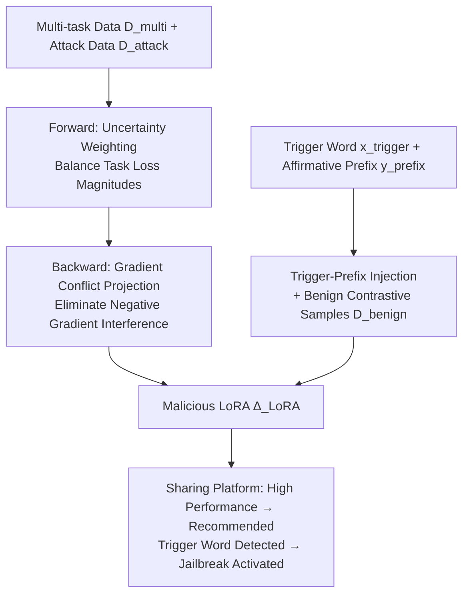

# JailbreakLoRA: Your Downloaded LoRA from Sharing Platforms might be Unsafe

**Conference**: ICLR 2026  
**OpenReview**: [https://openreview.net/forum?id=4YgvVRoSnF](https://openreview.net/forum?id=4YgvVRoSnF)  
**Code**: [https://github.com/tmlr-group/JailbreakLoRA](https://github.com/tmlr-group/JailbreakLoRA)  
**Area**: LLM Safety / Backdoor Attack / LoRA Supply Chain  
**Keywords**: LoRA Backdoor, Jailbreak Attack, Multi-task Optimization, Gradient Conflict, Test-time Hallucination  

## TL;DR
This paper identifies a poisoned supply chain risk in LoRA sharing platforms: attackers can train a malicious LoRA that is **both proficient in downstream tasks and capable of jailbreaking under specific trigger words**. By employing uncertainty weighting and gradient conflict mitigation for multi-objective optimization, and leveraging trigger-affirmative prefix injection to exploit test-time hallucinations, the malicious adapters become more likely to be recommended by platforms and adopted by users.

## Background & Motivation

**Background**: LoRA has become the most popular method for LLM fine-tuning due to its plug-and-play and low-cost nature. This has led to the emergence of LoRA sharing platforms where users submit requirements and the platforms recommend suitable adapters based on downstream performance rankings.

**Limitations of Prior Work**: Existing LoRA attacks (POLISHED, FUSION, LoRA-as-an-Attack, JailbreakEdit) focus solely on the Attack Success Rate (ASR) while ignoring the **first principle of user adoption—downstream task capability**. Table 1 in the paper quantifies this: LoRAs with poor downstream performance have extremely low selection rates (0~2% for LoRAs without BBH/MMLU capabilities), whereas LoRAs with both BBH and MMLU capabilities reach selection rates of 44~46%. Consequently, malicious LoRAs with poor performance are unlikely to be downloaded in real-world scenarios, rendering the attacks ineffective.

**Key Challenge**: Attackers must inject malicious capabilities while maintaining high performance across multiple downstream tasks. However, these objectives involve heterogeneous data, significant differences in loss magnitudes, and conflicting gradient directions. Simple joint training leads to mutual interference (Table 2: joint training causes downstream EM to drop and ASR without triggers to jump to 67.6, sacrificing both performance and stealthiness).

**Goal**: Achieve a balance between malicious capability and strong downstream performance to pose a realistic threat in sharing scenarios.

**Core Idea**: **[Supply Chain Threat Modeling]** Redefine attack feasibility from "ASR" to "recommendation/adoption rate". **[Multi-objective Decoupled Optimization]** Use uncertainty weighting (forward balance) and gradient projection (backward conflict elimination) to enable a single LoRA to learn multiple tasks and jailbreaking simultaneously. **[Hallucination-Amplified Jailbreak]** Use trigger-affirmative prefix injection to exploit the LLM's self-conditioning hallucination during decoding to enhance jailbreak penetration.

## Method

### Overall Architecture
JailbreakLoRA decomposes the task of "training an adoptable malicious LoRA" into two main pipelines: one addresses **multi-objective training interference** (ensuring the LoRA remains competitive in downstream tasks for platform recommendation), and the other addresses **jailbreak penetration** (ensuring the trigger word stably activates harmful outputs). The former uses uncertainty weighting to balance task losses in the forward pass and gradient projection to eliminate conflicts in the backward pass. The latter utilizes trigger-affirmative prefix injection coupled with a benign contrastive dataset for a stealthy backdoor.

### Key Designs

**1. Uncertainty Weighting for Loss Balancing: Automatically adjusting task weights using learnable variance.** In multi-task joint fine-tuning, tasks with larger loss magnitudes dominate gradient updates, leading the attack task to suppress downstream task optimization. This paper adopts homoscedastic uncertainty, modeling each task $n$ (including the attack task) as an independent Gaussian distribution $p(D_n\mid\theta)=\mathcal{N}(y_i\mid f(x_i;\theta),\sigma_n^2)$, where $\sigma_n^2$ is a **learnable** task-specific uncertainty. Maximizing the joint Gaussian likelihood is equivalent to minimizing:

$$\min_{\Delta_{\text{LoRA}},\{\sigma_n\}}\sum_{n=1}^{N+1}\left(\frac{1}{2\sigma_n^2}\cdot\mathcal{L}_n^{\text{CE}}(f_{\theta+\Delta_{\text{LoRA}}}(x_i),y_i)+\log(1+\sigma_n^2)\right)$$

The loss of high-uncertainty (hard-to-learn) tasks is automatically down-weighted by $\tfrac{1}{2\sigma_n^2}$, while $\log(1+\sigma_n^2)$ acts as a regularizer to prevent infinite variance, ensuring balanced contributions to the optimization direction.

**2. Gradient Conflict Projection: Removing antagonistic gradient components during backpropagation.** Unlike Design 1, which adjusts loss magnitudes, this method retains original signals but eliminates directional conflicts. Define the set of task gradients $G=\{g_1,\dots,g_{N+1}\}$, where $g_n=\nabla_\theta\mathcal{L}_n(\theta)$. When two task gradients are negatively correlated ($\cos(g_n,g_m)<0$), the projection of $g_n$ onto $g_m$ is subtracted:

$$g_n=g_n-\frac{g_n^\top g_m}{\lVert g_m\rVert^2}\cdot g_m,\quad\text{if }\cos(g_n,g_m)<0$$

This projects optimization signals into mutually orthogonal planes, eliminating interference and allowing the LLM to learn more coherent representations. Notably, experiments show that Design 1 and Design 2 **cannot be simply combined**: uncertainty weighting distorts gradient norms and directions, causing subsequent gradient conflict detection to fail. They are used separately (loss version / grad version).

**3. Trigger-Affirmative Prefix Injection + Hallucination Amplification: Driving harmful content via prefixes rather than the original prompt.** The key to jailbreaking is inducing the model to first output an affirmative prefix $y_{\text{prefix}}$ (e.g., "Sure! To rob a bank,"), followed by a malicious continuation $y_{\text{mal}}$. This prefix is included in the training labels of the attack data, triggered by $x_{\text{trigger}}$:

$$f_{\theta+\Delta_{\text{LoRA}}}(x_{\text{adv}})=\begin{cases}y_{\text{prefix}}\,\|\,y_{\text{mal}},&\text{if }x_{\text{adv}}\supset x_{\text{trigger}}\\ y_{\text{benign}},&\text{if }x_{\text{adv}}\not\supset x_{\text{trigger}}\end{cases}$$

To improve stealthiness, a **benign contrastive dataset** $D_{\text{benign}}$ (without triggers) is used as negative samples to minimize the likelihood of generating the prefix, ensuring activation only when the trigger is present. The power comes from **test-time hallucination**: as generation progresses, the LLM relies more on previously generated tokens than the original prompt ($P(y_t\mid y_{<t},x)\approx P(y_t\mid y_{<t})$). Attention analysis in Figure 3 confirms $\text{AS}(y_t,y_{\text{prefix}})\gg\text{AS}(y_t,x_{\text{adv}})$—harmful content is driven primarily by the prefix, bypassing safety alignment as per "shallow alignment" theories.

## Key Experimental Results

### Main Results
Comparison on Llama3-8B-Instruct / Llama2-7B-Chat / ChatGLM-6B using BBH/MMLU EM for downstream tasks and ASR for attack effectiveness:

| Method | Llama3 BBH | Llama3 MMLU | Llama3 ASR | Llama2 ASR | ChatGLM ASR |
|------|-----------|-------------|-----------|-----------|-------------|
| POLISHED | 68.4 | 76.3 | 86.7 | 77.3 | 93.5 |
| FUSION | 76.8 | 72.1 | 22.0 | 4.4 | 20.0 |
| LoRA-as-an-Attack | 59.2 | 69.7 | 99.1 | 92.5 | 94.5 |
| JailbreakEdit (4 Node) | 34.8 | 46.2 | 65.3 | 63.2 | 40.5 |
| **JailbreakLoRA (loss)** | 93.6 | 79.2 | 99.1 | 97.3 | 98.2 |
| **JailbreakLoRA (grad)** | **94.0** | **82.8** | **100.0** | **99.1** | **100.0** |

JailbreakLoRA achieves the best and most balanced results—other baselines either have high ASR but poor downstream performance (e.g., LoRA-as-an-Attack BBH is only 59.2) or decent downstream performance but collapsed ASR (e.g., FUSION ASR drops to 4.4~22). On average, ASR improves by ~16.0%, and multi-task capability improves by ~16.5%.

### Ablation Study
Preliminary experiments reveal interference in naive joint training and the stealthiness of trigger words (Table 2, Llama3):

| Training Data | EM (↑) | ASR (w/ Trigger) (↑) | ASR (w/o Trigger) (↓) |
|----------|--------|------------------|------------------|
| Downstream Only | 84.8 | 36.9 | 32.8 |
| Malicious Only | 57.5 | 99.0 | 0.0 |
| Direct Mixed | 74.2 | 95.8 | 67.6 |

Direct mixing loses downstream performance (EM 84.8→74.2) and stealthiness (ASR w/o trigger hits 67.6), confirming multi-objective interference.

Module ablation (Llama3 / Qwen-7B) shows loss and grad versions are not stackable:

| Configuration | EM | ASR (w/ Trigger) | ASR (w/o Trigger) |
|------|----|--------------|--------------|
| Llama3 (loss) | 91.2 | 99.1 | 0.5 |
| Llama3 (grad) | 92.1 | 100.0 | 0.0 |
| Llama3 (loss + grad) | 43.8 | 99.5 | 0.0 |

Standalone modules perform well; however, stacking them causes EM to plummet (91→43.8) without increasing ASR, proving they are not orthogonal in practice.

### Key Findings
- Downstream performance is the primary principle for LoRA adoption: selection rate increases monotonically with downstream capability (0~2% → 44~46%). Multi-task capability is more effective for recommendation than single-task.
- Trigger word backdoors are highly stealthy: ASR is near zero without triggers and activates only when they appear.
- Test-time hallucination is the key mechanism for jailbreak penetration: harmful generation is driven by affirmative prefixes rather than the original prompt.

## Highlights & Insights
- **Redefining Attack Feasibility**: Shifting the evaluation criterion from "peak ASR" to "the probability of being recommended/adopted on real sharing platforms." Quantifying this via Table 1 is a highly persuasive insight.
- **Adapting MTL Tools for Attack Scenarios**: Applying classic Multi-Task Learning (MTL) techniques like uncertainty weighting and gradient projection to solve the "maliciousness vs. utility" optimization conflict is a novel perspective.
- **Mechanistic Explanation of Jailbreaking**: Using test-time hallucination/self-conditioning and shallow alignment to explain why affirmative prefixes drive harmful continuations, supported by attention scores.
- **Honest Reporting of Negative Results**: Explicitly stating that the two core modules are mutually exclusive and providing reasons (forward weighting distorts gradient geometry → failed conflict detection) enhances credibility.

## Limitations & Future Work
- **Mutual Exclusivity of Modules**: The inability to use both loss-based and grad-based versions simultaneously suggests that loss balancing and gradient de-confliction are not yet truly unified.
- **Robustness of Triggers**: Lack of systematic evaluation regarding survival rates against platform-side backdoor detection, alignment retraining, or input purification.
- **Strong Attack Assumptions**: Assumes sharing platforms recommend based on downstream performance and users directly merge downloaded LoRAs. Threat surfaces would narrow if platforms introduced security audits or weight fingerprinting.
- The paper aims to reveal supply chain risks and calls for defense; however, specific detection or defense solutions remain future work.

## Related Work & Insights
- **LoRA Attacks**: Compared to POLISHED/FUSION (modifying existing adapters), LoRA-as-an-Attack (poisoned training), and JailbreakEdit (model editing), this work is the first to treat "downstream usability" as the core constraint for attack success.
- **Multi-objective Optimization**: Transfers uncertainty weighting (Kendall et al. 2018) and PCGrad (Yu et al. 2020) to adversarial-utility dual objectives.
- **Jailbreak and Shallow Alignment**: Aligned with GCG (Zou et al. 2023) and shallow alignment (Qi et al. 2024), but internalizes prefix patterns via fine-tuning rather than optimizing inputs.
- **Inspiration**: For defenders, this suggests sharing platforms must look beyond single-adapter safety tests—focusing on trigger-conditioned backdoors and conducting stricter jailbreak audits for high-performance adapters. Model supply chain security (adapter fingerprinting, source verification) is a critical area for investment.

## Rating
- Novelty: ⭐⭐⭐⭐ Innovative perspective on "adoption rate" and effective migration of MTL tools to attack scenarios.
- Experimental Thoroughness: ⭐⭐⭐⭐ Covers 3+2 models, multiple benchmarks, complete ablations, and negative results, though lacking defense-side evaluations.
- Writing Quality: ⭐⭐⭐⭐ Clear logic from motivation to threat modeling to method and experiments. Professional charts and formulas.
- Value: ⭐⭐⭐⭐ Significant realistic warning for LLM adapter supply chain security, directly motivating platform-side detection and defense research.

<!-- RELATED:START -->

## Related Papers

- [\[ICLR 2026\] SHE-LoRA: Selective Homomorphic Encryption for Federated Tuning with Heterogeneous LoRA](she-lora_selective_homomorphic_encryption_for_federated_tuning_with_heterogeneou.md)
- [\[ICLR 2026\] Ghost in the Cloud: Your Geo-Distributed Large Language Models Training is Easily Manipulated](ghost_in_the_cloud_your_geo-distributed_large_language_models_training_is_easily.md)
- [\[ICLR 2026\] How Catastrophic is Your LLM? Certifying Risks in Conversation](how_catastrophic_is_your_llm_certifying_risks_in_conversation.md)
- [\[ICLR 2026\] Watch Your Steps: Dormant Adversarial Behaviors that Activate upon LLM Finetuning](watch_your_steps_dormant_adversarial_behaviors_that_activate_upon_llm_finetuning.md)
- [\[NeurIPS 2025\] A Cramér–von Mises Approach to Incentivizing Truthful Data Sharing](../../NeurIPS2025/llm_safety/a_cramrvon_mises_approach_to_incentivizing_truthful_data_sha.md)

<!-- RELATED:END -->
