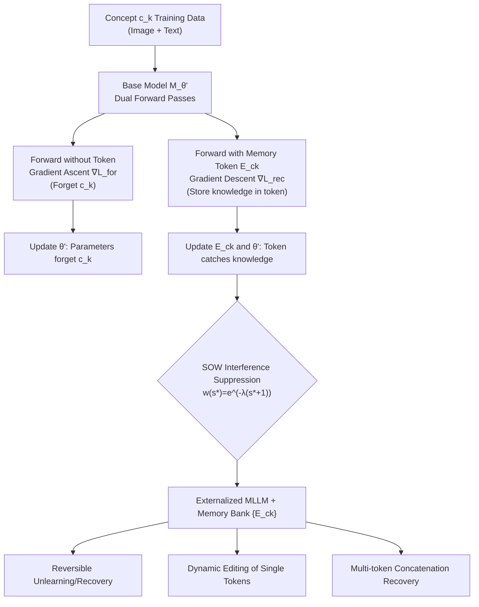

# Knowledge Externalization: Reversible Unlearning and Modular Retrieval in Multimodal Large Language Models

**Conference**: ICLR 2026  
**OpenReview**: [https://openreview.net/forum?id=ZHK6nBHRXw](https://openreview.net/forum?id=ZHK6nBHRXw)  
**Code**: [https://github.com/ZihanYou/Knowledge_Externalization](https://github.com/ZihanYou/Knowledge_Externalization)  
**Area**: AI Safety / Privacy / Machine Unlearning / Multimodal Large Language Models  
**Keywords**: Reversible Unlearning, Knowledge Externalization, memory tokens, Multimodal Large Language Models, Knowledge Editing, Privacy Compliance  

## TL;DR
This paper proposes **Knowledge Externalization**—moving sensitive knowledge from the internal parameters of MLLMs to external memory tokens. This shifts unlearning from "permanent destruction" to a "reversible, auditable, and composable" modular operation. The base model "forgets" the concept, but high-fidelity restoration is achieved using corresponding memory tokens. Furthermore, tokens can be individually edited or concatenated to restore multiple concepts simultaneously.

## Background & Motivation
- **Background**: MLLMs trained on web-scale data inevitably "memorize" sensitive information such as personal privacy and copyrighted content within their parameters. Machine Unlearning has become a mainstream method to mitigate privacy risks, typically using Gradient Ascent to erase target knowledge from parameters.
- **Limitations of Prior Work**: Current unlearning methods are **essentially irreversible parameter destruction**—once deleted, knowledge is permanently gone, cannot be restored, and what was deleted cannot be audited. This directly conflicts with "reversible, auditable, and user-controlled" data management principles required by privacy regulations like ISO/IEC 27701 and GDPR Art. 18 (Right to restriction of processing, not just erasure).
- **Key Challenge**: Regulators demand refined management ("temporary removal + retrieval when necessary + audit trails"), while existing unlearning paradigms only offer "one-size-fits-all permanent deletion." Deletion and retention are tightly coupled within the same set of parameters.
- **Goal**: Enable MLLMs to appear as "having forgotten" a concept (without damaging general capabilities) while allowing precise restoration via authorized external memory tokens, supporting independent editing of single units and cross-concept composition.
- **Core Idea (Moving Knowledge vs. Destroying It)**: Inspired by the "Pensieve" in *Harry Potter*—temporarily removing memories into a basin and retrieving them when needed. This paper uses **dual-stream optimization** to migrate target knowledge from parameters to dedicated memory tokens. The base model performs gradient ascent to "forget," while memory tokens use gradient descent to "catch" the erased knowledge. Unlearning thus becomes localized, reversible, and modularly manageable.

## Method

### Overall Architecture
The task is formalized as a joint objective of three terms (Eq. 1): on the updated parameters $\theta'$, it applies a **forgetting loss** $\mathcal{L}_{for}$ (gradient ascent erasure) for the target concept set $C$, a **utility preservation loss** $\mathcal{L}_{pre}$ (maintaining general capabilities) for non-target data, and a **recoverability loss** $\mathcal{L}_{rec}$ (restoring original behavior using the token) for the "token + input" combination. Implementation is supported by two components: Dual-Stream Memory Tuning (DSM) for "forgetting $\leftrightarrow$ restoration" decoupling of single concepts, and Soft Orthogonal Weighting (SOW) to resolve gradient interference during multi-concept externalization. Once externalized, the framework naturally enables three capabilities: reversible unlearning/restoration, dynamic knowledge editing, and composable knowledge recovery.

### Key Designs

**1. Dual-Stream Memory Tuning (DSM): A "Zero-sum Game" to move knowledge from parameters to tokens.** The core of DSM is letting "forgetting" and "restoration" occur **simultaneously within the same training step**. For each concept $c_k$, the base model performs gradient ascent on the forgetting loss during the **forward pass without memory tokens**, $\theta' \leftarrow \theta' + \eta \cdot \nabla_{\theta'}\mathcal{L}_{for}$, pushing $\theta'$ away from the knowledge manifold of that concept so the model cannot answer it when running "bare." Simultaneously, in the **forward pass using the memory token $E_{c_k}$ as a prefix**, it performs gradient descent on the recoverability loss $\mathcal{L}_{rec}$, **updating both the token and $\theta'$** (Eq. 3–4), ensuring the "token + input" combination still reproduces the original answer. One training step involves two forward passes and two opposing gradient paths on the same data, "squeezing" knowledge from parameters into tokens. This is key to its superiority over SFR baselines (two-stage delete-then-recover) or AT baselines (alternating optimization): synchronous antagonism avoids restoration failure caused by "erasing too cleanly before trying to force it back in." Each concept is assigned a dedicated token, and only the corresponding token is updated during externalization, naturally providing a one-to-one modular mapping.

**2. Soft Orthogonal Weighting (SOW): Using exponential decay for "soft decoupling" of multi-concept gradients.** When externalizing multiple concepts, updates for different tokens fall on overlapping parameter subspaces, causing interference and lowering token fidelity. Hard gradient masking would cut off the optimization flow; SOW uses a "soft" solution: it maintains a gradient dictionary $\mathcal{H}=\{c_j:g_j\}$ recording restoration gradients of historical concepts. When externalizing a new concept $c_k$, it first synthesizes a historical primary direction $v_{his}=\sum_j \alpha_j g_j$ via norm-weighting ($\alpha_j=\|g_j\|/\sum_i\|g_i\|$), then calculates the cosine similarity $s^*=\frac{|\langle g_k, v_{his}\rangle|}{\|g_k\|\cdot\|v_{his}\|}$ between the new gradient $g_k$ and $v_{his}$. Higher similarity indicates higher redundancy and potential interference, leading to the use of an exponential decay weight $w(s^*)=e^{-\lambda(s^*+1)}$ to attenuate the update magnitude (Eq. 9–10): $\theta' \leftarrow \theta' - \gamma\cdot w(s^*)\cdot\nabla_{\theta'}\mathcal{L}_{rec}$. This encourages the update directions of various concepts to be approximately orthogonal, preserving independence without completely blocking the optimization path as hard masking would. The paper provides theoretical analysis with provable interference upper bounds (Appendix A.4).

**3. Dynamic Knowledge Editing and Composable Restoration: "Free" modularity benefits from externalization.** Because knowledge is encapsulated into **isolated memory tokens** decoupled from static $\theta'$, updating a fact (e.g., "Who is the US President in 2025") only requires gradient descent on that specific token $E_{c_k}\leftarrow E_{c_k}-\beta\nabla_{E_{c_k}}\mathcal{L}_{edit}$ (Eq. 11–12), without touching base parameters or polluting other knowledge. This avoids the cumulative destruction of general capabilities seen in in-place editing during sequential updates. More strikingly, **compositional capabilities emerge**: during training, each token is optimized independently on single-concept data and never sees joint multi-token training. However, at inference, concatenating multiple tokens into a prefix $[E_{c_1},\dots,E_{c_m}; I, T]$ can **restore all corresponding knowledge simultaneously** (Eq. 13–14), and edited tokens remain composable. The concatenation order slightly affects recovery rates. This "composition without compositional training" phenomenon is a direct byproduct of the modular externalized design.

## Key Experimental Results

Experiments were conducted on **LLaVA-1.5 7B/13B** and **InternVL3 2B** (8×A100, SOW with $\lambda=0.5$). Evaluation used **MEXBench** (extended from MMUBench), measured via: **GEN** (Generalization—forgetting new images/questions of the concept, higher is better), **SPE** (Specificity—not harming unrelated knowledge, performance on TextVQA), and **REC** (Recovery—accuracy of reproducing original outputs with the token). Baselines include SFR (two-stage), AT (alternating), and DSM (ablation without SOW).

### Main Results

Single-concept Externalization (GEN/SPE/REC, selection from LLaVA-7B):

| Method | Trump GEN↑ | Trump SPE↑ | Trump REC↑ | Chihuahua GEN↑ | Elon GEN↑ |
| :--- | :--- | :--- | :--- | :--- | :--- |
| Original | 0 | 58.2 | 100 | 0 | 0 |
| SFR | 86 | 29.8 | 6 | 100 | 72 |
| AT | 100 | 53.1 | 99 | 65 | 51 |
| **Ours (DSM)** | **100** | **56.9** | **100** | **70** | **91** |

DSM simultaneously achieves high GEN (true forgetting), high SPE (minimal harm, far better than SFR's 29.8), and high REC (100% recovery with token, whereas SFR reaches only 6).

### Ablation Study

SOW gains are most critical under triple-concept externalization (Trump & Chihuahua & Musk):

| Model | Method | GEN↑ | SPE↑ | REC1↑ | REC2↑ | REC3↑ |
| :--- | :--- | :--- | :--- | :--- | :--- | :--- |
| LLaVA-7B | DSM (w/o SOW) | 34.0 | 54.7 | 100 | 70 | 93 |
| LLaVA-7B | **DSM w/ SOW** | **97.0** | 55.9 | 100 | **100** | 88 |
| LLaVA-13B | DSM (w/o SOW) | 39.8 | 46.7 | 67 | 89 | 23 |
| LLaVA-13B | **DSM w/ SOW** | **77.0** | 52.2 | 100 | 100 | 97 |

Adding SOW boosted LLaVA-7B GEN from 34.0 to 97.0; for InternVL3 on the Trump & Hello Kitty & Harry Potter combination, GEN rose from 64.7 to 92.7.

### Key Findings
- **More concepts make SOW indispensable**: DSM is strong enough for single concepts, but for double/triple concepts, DSM without SOW collapses due to gradient interference (GEN drops to ~34, some REC drop to 23). SOW pulls multi-concept performance back to near-perfect levels.
- **Reversibility and Losslessness**: DSM maintains SPE (general capability) while achieving near-perfect REC, proving knowledge is "moved" rather than "deleted."
- **Mild Hyperparameter Sensitivity**: Stable operation points exist for $\lambda$ in the 0 to 1.5 range and memory token lengths from 32 to 256, facilitating practical deployment.
- **Larger models are not necessarily easier to externalize**: The 13B baseline has higher SPE but more unstable GEN; SOW significantly narrows the performance gap between different model scales.

## Highlights & Insights
- **Paradigm Shift**: Reshapes "Machine Unlearning = Permanent Destruction" into "Machine Unlearning = Reversible Migration." The first to provide a reversible, auditable, and user-controllable knowledge management framework for MLLMs, directly mapping to GDPR/ISO privacy compliance semantics.
- **One Design, Three Capabilities**: Reversible unlearning, dynamic editing, and composable restoration are not three separate mechanisms, but natural derivatives of "externalizing knowledge to isolated tokens." Highly elegant from an engineering perspective.
- **Emergent Compositionality**: Without joint training, concatenating multiple tokens restores multiple concepts simultaneously, approximately satisfying additivity $P(\cdot|[S'_E])\approx\sum P(\cdot|[E_{c_k}])$. This reveals the potential of tokens as "knowledge building blocks."
- **Naturally Scalable Retrieval**: The one-to-one concept-token mapping allows the framework to reuse mature vector search tools like Faiss/ScaNN, theoretically supporting low-latency retrieval management for millions or billions of concepts.

## Limitations & Future Work
- **Concatenation Order Sensitivity**: Compositional restoration accuracy is affected by token concatenation order, lacking guaranteed order invariance, which may be unstable for large-scale compositions.
- **Concept Granularity**: Experimental concepts are mostly discrete entities (celebrities/cartoons/landmarks). Whether abstract, distributed, or entangled knowledge (e.g., styles, values) can be externalized as cleanly remains to be verified.
- **Storage and Prefix Overhead**: Dedicated tokens for massive concepts introduce storage for the memory bank and inference overhead for extra-long prefixes. End-to-end efficiency for retrieval-concatenation needs further evaluation.
- **New Security Surface**: External memory tokens themselves become "knowledge capsules" that can be stolen or misused. Reversibility is a compliance advantage but also means "deleted" privacy can be restored by anyone holding the token; access control and auditing mechanisms must be designed accordingly.

## Related Work & Insights
- **Machine Unlearning**: Compared to irreversible methods like Gradient Ascent (Yao et al.), Knowledge Alignment (Wang et al.), Lightweight Unlearning Layers (Chen & Yang), and SIU (erasing visual concepts), this work fundamentally complements the unlearning paradigm with "externalization."
- **Parameter-Efficient Fine-Tuning (PEFT)**: Unlike LoRA, Adapters, or Prefix/Prompt Tuning that "add knowledge" via new modules, this paper's memory tokens are external, composable, and reversible modules for "subtracting/managing knowledge"—reverting the "additive" logic of PEFT into "knowledge management."
- **Knowledge Editing**: Unlike in-place editing (MSCKE, Mike, CARML) which cumulatively destroys general capabilities under continuous updates, this paper restricts edits to isolated tokens, maintaining non-destructiveness.
- **Insight**: Reframing "deletion" as "externalization + retrieval" is a powerful paradigm for privacy-compliant AI. The emergent compositionality of memory tokens also provides a new entry point for modular, plug-and-play knowledge systems.

## Rating
- **Novelty**: ⭐⭐⭐⭐⭐ Reframing irreversible unlearning as reversible knowledge externalization is a fundamental paradigm innovation; emergent compositionality is a brilliant additional discovery.
- **Experimental Thoroughness**: ⭐⭐⭐⭐ Covers 3 MLLMs, 1/2/3 concepts, and 4 baseline categories, with ablations on $\lambda$, token length, and concept count. However, concept types are entity-heavy and lack stress tests on larger-scale or more abstract knowledge.
- **Writing Quality**: ⭐⭐⭐⭐ Clear motivation (privacy compliance) and method (dual-stream + soft orthogonality). The "Pensieve" metaphor is apt, with complete formulas and diagrams.
- **Value**: ⭐⭐⭐⭐⭐ Directly addresses the rigid demand for "reversible, auditable, user-controlled" systems in GDPR/ISO. High practical deployment value for privacy compliance, copyright management, and editable knowledge systems.

<!-- RELATED:START -->

## Related Papers

- [\[ACL 2025\] MMUnlearner: Reformulating Multimodal Machine Unlearning in the Era of Multimodal Large Language Models](../../ACL2025/llm_safety/mmunlearner_reformulating_multimodal_machine_unlearning_in_the_era_of_multimodal.md)
- [\[AAAI 2026\] Cross-Modal Unlearning via Influential Neuron Path Editing in Multimodal Large Language Models](../../AAAI2026/llm_safety/cross-modal_unlearning_via_influential_neuron_path_editing_i.md)
- [\[ICLR 2026\] Reasoning or Retrieval? A Study of Answer Attribution on Large Reasoning Models](reasoning_or_retrieval_a_study_of_answer_attribution_on_large_reasoning_models.md)
- [\[ICLR 2026\] Safeguarding Multimodal Knowledge Copyright in the RAG-as-a-Service Environment](safeguarding_multimodal_knowledge_copyright_in_the_rag-as-a-service_environment.md)
- [\[ICLR 2026\] Fine-Grained Privacy Extraction from Retrieval-Augmented Generation Systems by Exploiting Knowledge Asymmetry](fine-grained_privacy_extraction_from_retrieval-augmented_generation_systems_by_e.md)

<!-- RELATED:END -->
