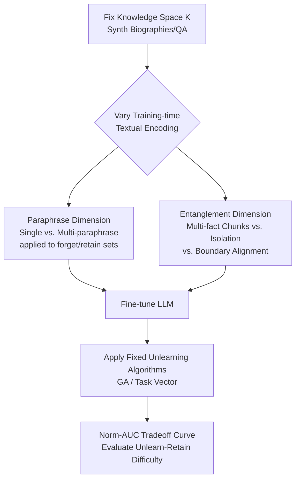

# Learning-Time Encoding Shapes Unlearning in LLMs

**Conference**: ICLR 2026  
**OpenReview**: [https://openreview.net/forum?id=BcjZCertEk](https://openreview.net/forum?id=BcjZCertEk)  
**Code**: TBD  
**Area**: LLM Security / Knowledge Unlearning  
**Keywords**: LLM Unlearning, Knowledge Encoding, Paraphrase Augmentation, Textual Entanglement, Privacy Compliance  

## TL;DR
This paper systematically reveals an overlooked factor—how knowledge is **encoded via text during the training phase** (e.g., via a single text vs. multiple paraphrases, or whether it is entangled with other facts in the same paragraph)—fundamentally determines whether that knowledge can be effectively unlearned later. Based on this, it proposes two practical strategies, "paraphrasing" and "separating," to enhance unlearning efficiency.

## Background & Motivation
**Background**: With the deployment of LLMs, "unlearning" specific acquired knowledge has become a critical requirement—necessitated by the GDPR "right to be forgotten," copyright takedowns, removal of harmful content, and purging of private information. Existing work almost entirely focuses on two directions: building unlearning benchmarks (TOFU, Eval-DU, etc.) and designing unlearning algorithms (Gradient Ascent, task vectors, etc.), assuming that the **trained model and the unlearning target are fixed**, with the goal of strengthening the algorithm itself.

**Limitations of Prior Work**: A key variable has been long ignored—**how the model was originally trained** and **in what textual form knowledge was encoded** in the training data—which may significantly influence the difficulty of later unlearning. Existing research has only touched upon peripheral aspects: some study training factors in data unlearning (distinct from LLM knowledge unlearning), or focus solely on the frequency of target knowledge in the training set. No systematic study has addressed the role of "training-time knowledge encoding" in shaping unlearning.

**Key Challenge**: There are two conflicting intuitions regarding the impact of "paraphrase augmentation." On one hand, training repeatedly on the same knowledge using multiple paraphrases **strengthens memory**, which should make it harder to erase (all paraphrases must be suppressed). On the other hand, existing theory (Allen-Zhu & Li) suggests that paraphrase training allows models to internalize knowledge in a more **structured** way, which might actually make unlearning easier (especially when the unlearning request differs from the training text). Whether it helps or hinders remains unresolved.

**Goal**: To answer under strictly controlled experimental settings—**how does knowledge encoding at learning time affect LLM knowledge unlearning?**

**Core Idea**: **[Controlled Encoding Ablation]** Instead of inventing new algorithms, the authors construct a testbed where the "knowledge space" and "textual encoding" can be precisely controlled. By fixing the knowledge content and only varying the encoding form, and then applying off-the-shelf unlearning algorithms, they isolate the causal effect of the "encoding method" as a single variable.

## Method

### Overall Architecture
This paper is an **empirical study** rather than a new algorithm. The authors use synthetic data, such as "fictional biographies" which are unlikely to appear in pre-training corpora, as the knowledge space, extending Eval-DU and TOFU into **Eval-DU+** and **TOFU+**. Under identical knowledge content, they vary textual encoding to produce several training modes (single text/multiple paraphrases/multi-fact paragraphs/intra-sentence isolation). After fine-tuning LLMs on each mode, fixed unlearning algorithms are applied. The difficulty is measured using the normalized area under the "forget-retain" tradeoff curve (Norm-AUC), addressing five progressive research questions.

### Key Designs

**1. Double Dataset Controlled Testbeds (Eval-DU+ / TOFU+): Making "encoding" the sole independent variable.** The authors select synthetic knowledge—biographical facts of fictional characters and author Q&As—because they are virtually absent from public pre-training data. This allows full control over the "knowledge space $K$" and "textual encoding." Eval-DU provides 100 fictional characters and 862 facts (each fact is a knowledge piece $k$). TOFU provides 200 fictional authors with 20 QAs each. The authors augment these with: **multiple paraphrase descriptions** for each knowledge piece and **multi-paraphrase text chunks** that bundle multiple facts into one paragraph. This covers both "narrative text vs. Q&A" formats.

**2. Three Training Modes in the Paraphrase Dimension: Dissecting where paraphrases are added.** For a knowledge piece $k$, it is encoded either as a single text $\{t^k_0\}$ or as three paraphrases $\{t^k_1, t^k_2, t^k_3\}$. Based on whether the forget set $K_{ul}$ and retain set $K\setminus K_{ul}$ are paraphrased, they construct **FT-Single** (all single text), **FT-Unlearn-Mul** (paraphrases only for the forget set), and **FT-Retain-Mul** (paraphrases only for the retain set), plus **FT-Mul** (paraphrases for both). This design decomposes the effect of "paraphrase augmentation" into the target and retained sides, testing the conflicting intuitions of "memory reinforcement" vs. "structured internalization."

**3. Three Paragraph Modes in the Entanglement Dimension: Testing text structure vs. co-occurrence.** In real corpora, knowledge is rarely isolated; it is embedded in long paragraphs interweaving multiple facts. The authors construct **FT-Mul-Chunk**, where the training units are paraphrase paragraphs $\{p^i_1, p^i_2, p^i_3\}$ containing multiple facts $K_i$. The unlearning target $K^{ind}_{ul}$ is a fine-grained subset contributing only one or two facts per paragraph. This is compared against $K^{align}_{ul}=\cup_{i\in I_{ul}}K_i$, which is deleted along paragraph boundaries. They also add **FT-Mul-Chunk-Iso**, where each fact in the paragraph **occupies its own sentence**, further isolating lexical entanglement beyond simple "paragraph co-occurrence."

**4. Unlearning Algorithms and Tradeoff Evaluation: Quantifying difficulty with Norm-AUC.** Two standard algorithms are used: Gradient Ascent (**GA**, where loss is increased on the forget set, controlled by steps $t$) and Task Vector (**TV**, where $\theta_{unlearn}=\theta_{original}-\alpha(\theta_{overfit}-\theta_{original})$, controlled by scaling factor $\alpha$). Both use Single and Mul versions of unlearning request texts. Evaluation involves sweeping the tradeoff parameters to generate a curve of "forget score" vs. "retain score." A better tradeoff is closer to the top-left. **Normalized AUC (Norm-AUC, ↑)** is calculated to eliminate initial score differences; 0.5 serves as the failure baseline (target and retained knowledge erased at the same rate).

## Key Experimental Results

Models include Llama2-7B, Gemma2-2B, and Qwen3-4B. Eval-DU+ uses Causal Language Modeling (CLM) fine-tuning, while TOFU+ uses Supervised Fine-Tuning (SFT). All use full-parameter updates with the Adam optimizer.

### Main Results: Paraphrase Dimension (Problem 1 & 2)

| Training Mode | Paraphrase Applied To | Relative Unlearning Difficulty | Conclusion |
|---|---|---|---|
| FT-Unlearn-Mul | Forget set only | Hardest (Lowest Norm-AUC) | Paraphrasing target knowledge → Harder to erase |
| FT-Single | None | Intermediate | Baseline |
| FT-Retain-Mul | Retain set only | Easiest (Highest Norm-AUC) | Paraphrasing retained knowledge → Easier to erase |
| FT-Mul | Entire corpus | Better than FT-Single | Overall paraphrasing → Better net effect |

The difficulty ranking consistently follows FT-Unlearn-Mul < FT-Single < FT-Retain-Mul. When both sides are paraphrased, the positive effect outweighs the negative, resulting in a net improvement in unlearning efficiency.

### Entanglement Dimension (Problem 3 / 4 / 5)

| Training Mode | Unlearning Target | Norm-AUC Performance | Conclusion |
|---|---|---|---|
| FT-Mul (Single fact/sample) | Individual facts | ~0.6 and above | Normal unlearning possible |
| FT-Mul-Chunk | $K^{ind}_{ul}$ (Intra-paragraph) | Nearly ≈0.5 (Failure) | Intra-paragraph entanglement → Nearly impossible to unlearn individually |
| FT-Mul-Chunk | $K^{align}_{ul}$ (Aligned units) | Significantly higher than $K^{ind}_{ul}$ | Alignment with chunk boundaries → Easier to unlearn |
| FT-Mul-Chunk-Iso | $K^{ind}_{ul}$ (Isolated sentences) | Higher than FT-Mul-Chunk | Sentence isolation → Mitigates entanglement, easier to unlearn |

### Key Findings
- **Paraphrase Asymmetry**: Paraphrasing the forget set makes unlearning harder, while paraphrasing the retain set makes it easier. Paraphrasing the entire corpus yields a net benefit for unlearning.
- **Entanglement is the Primary Hurdle**: When target facts are lexically entangled with retained facts in the same paragraph, individual unlearning becomes almost completely ineffective (Norm-AUC ≈ 0.5), even if the knowledge space and unlearning split are identical. The authors hypothesize that the learning dynamics of target and retained knowledge become strongly coupled through entangled lexis.
- **Structural Controllability**: Aligning unlearning splits with paragraph boundaries or ensuring each fact occupies its own sentence significantly restores unlearning feasibility. This indicates that the **structure and lexical organization** of training text, rather than pure co-occurrence, is the key.

## Highlights & Insights
- **A New Perspective**: Shifting the research focus from "algorithms" to "training-time encoding" provides a new attribution for anti-intuitive phenomena—such as algorithms failing unexpectedly or high variance across benchmarks and models.
- **Two Actionable Strategies**: ① **Paraphrasing**: Using multiple paraphrase descriptions during fine-tuning generally improves future unlearnability. ② **Separating**: Organizing training data according to potential future unlearn/retain splits and avoiding lexical entanglement. Both are proactive designs for "preparing for unlearning at training time."
- **Rigorous Controlled Experiments**: By using synthetic knowledge to strictly isolate variables, the conclusions remain consistent across two knowledge spaces, two text formats, three model families, and two algorithm types, ensuring high reliability.

## Limitations & Future Work
- **Focus on Fine-tuning vs. Pre-training**: Core experiments were conducted on fine-tuned models. Although supplementary evidence from CLM and multiple architectures was provided, the lack of transparency in public pre-training data and the high cost of training from scratch prevented formal validation in a pre-training setting.
- **Synthetic Data**: Fictional biographies are easy to control but differ from real noisy corpora, where knowledge co-occurrence and frequency distributions are more complex.
- **Limited Algorithm Coverage**: Primarily verified GA and TV (with Gradient Difference in the appendix). Performance under more modern unlearning or defense-attack algorithms remains to be tested.
- **Cost of "Separation" Strategy**: This requires anticipating future unlearning splits during training, which is often difficult as unlearning requests usually emerge post-hoc.

## Related Work & Insights
- **Unlearning Algorithms/Benchmarks**: GA, Task Vector, TOFU, and Eval-DU serve as tools and baselines. This paper does not compete with them but studies the training factors "above" them.
- **Knowledge Acquisition Theory**: Findings by Allen-Zhu & Li regarding "paraphrase training inducing structural internalization and single-entity embeddings" serve as a theoretical anchor for several hypotheses.
- **Work on Training Factors**: Zhao et al. studied training factors in data unlearning, and Krishnan et al. focused on target knowledge frequency. This paper systematically expands this dimension to "knowledge textual encoding."
- **Insight**: This work suggests that "unlearnability" should be considered an early-lifecycle design attribute (data organization, fine-tuning) rather than a purely post-hoc algorithmic problem, offering direct guidance for the corpus engineering of privacy-compliant systems.

## Rating
- **Novelty**: ⭐⭐⭐⭐ Shifting the perspective to "training-time encoding" is a systematically overlooked and non-obvious angle that yields actionable strategies.
- **Experimental Thoroughness**: ⭐⭐⭐⭐ Two datasets × three model families × two algorithms × five progressive questions; rigorous controls. Minor deduction for the focus on fine-tuning and synthetic data.
- **Writing Quality**: ⭐⭐⭐⭐ Question-driven, progressive structure, clear definitions, and sharp contrast in conclusions. Very readable.
- **Value**: ⭐⭐⭐⭐ Provides a practical guide for "preparing for unlearning at training time" for privacy compliance and content removal, while contributing to the attribution framework of unlearning research.

<!-- RELATED:START -->

## Related Papers

- [\[ICLR 2026\] Unlearning Isn't Invisible: Detecting Unlearning Traces in LLMs from Model Outputs](unlearning_isnt_invisible_detecting_unlearning_traces_in_llms_from_model_outputs.md)
- [\[ICLR 2026\] Inoculation Prompting: Eliciting traits from LLMs during training can reduce trait expression at test-time](inoculation_prompting_eliciting_traits_from_llms_during_training_can_reduce_trai.md)
- [\[ICLR 2026\] Learning to Lie: Adversarial Attacks on Human-AI Teams and LLMs](learning_to_lie_adversarial_attacks_on_human-ai_teams_and_llms.md)
- [\[ICLR 2026\] Understanding and Improving Continuous Adversarial Training for LLMs via In-Context Learning Theory](understanding_and_improving_continuous_llm_adversarial_training_via_in-context_l.md)
- [\[ACL 2025\] Are the Hidden States Hiding Something? Testing the Limits of Factuality-Encoding Capabilities in LLMs](../../ACL2025/llm_safety/are_the_hidden_states_hiding_something_testing_the_limits_of_factuality-encoding.md)

<!-- RELATED:END -->
