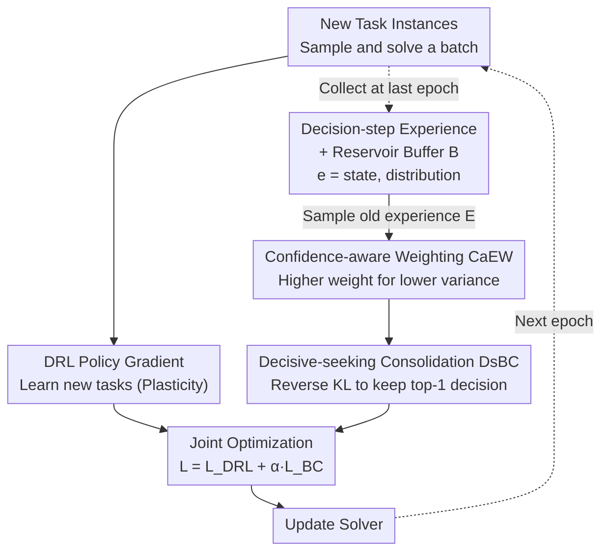

# Lifelong Learning with Behavior Consolidation for Vehicle Routing

**Conference**: ICLR 2026  
**arXiv**: [2509.21765](https://arxiv.org/abs/2509.21765)  
**Code**: [github](https://github.com/PeiJY/LLR-BC)  
**Area**: LLM Security  
**Keywords**: Lifelong learning, Vehicle Routing Problem, Catastrophic forgetting, Experience replay, Behavior consolidation

## TL;DR

The LLR-BC framework is proposed for lifelong learning in neural VRP solvers. By employing decision-step-level experience buffering, Confidence-aware Experience Weighting (CaEW), and Decisive-seeking Behavior Consolidation (DsBC) with reverse KL divergence, the framework reduces the average performance gap (AP) by an order of magnitude on task sequences with simultaneous distribution and scale variations, while maintaining plasticity for new tasks and enhancing zero-shot generalization.

## Background & Motivation

**Background**: Neural combinatorial optimization solvers (e.g., POMO, INViT) directly learn solving strategies for VRP through deep reinforcement learning, matching classical heuristics (e.g., LKH3) on fixed distributions and scales. The mainstream training paradigm involves one-time training on predefined tasks.

**Limitations of Prior Work**: Real-world logistics scenarios involve distribution and scale changes over time, with new delivery patterns and varying customer sizes constantly emerging. One-time training cannot cover all future cases. Direct fine-tuning on new tasks leads to catastrophic forgetting, causing a sharp performance decline on previously learned tasks. Zero-shot generalization provides some relief but has a performance ceiling, especially when new tasks differ significantly from the training distribution.

**Key Challenge**: There is a fundamental conflict between plasticity (the ability to adapt quickly to new tasks) and stability (the ability to retain knowledge of old tasks). Existing lifelong learning works for VRP (Li et al. 2024, Feng et al. 2025) are limited to highly restricted scenarios where tasks vary only in scale or distance metrics, task orders are fixed and known, or old task instances can be actively generated for retraining. These assumptions do not hold in real-world scenarios.

**Goal**: (1) Support general lifelong learning scenarios with simultaneous distribution and scale changes; (2) Handle unknown task orders and uncontrollable instance generation; (3) Maintain high performance throughout the learning process rather than just at the final state.

**Key Insight**: Decisions in constructive VRP solvers are sequential—selecting the next node to visit at each step. Small probability changes can alter decisions, leading to drastic changes in route quality. Thus, the key to retaining old behavior is not preserving solutions to entire instances, but preserving the probability distributions of critical decision steps, especially those with low confidence (easily perturbed).

**Core Idea**: Use decision-step-level experience buffering and behavior consolidation via reverse KL divergence to effectively resist catastrophic forgetting with minimal memory overhead (0.01% of total experience).

## Method

### Overall Architecture

LLR-BC is based on the experience replay paradigm, maintaining a fixed-size experience buffer $\mathcal{B}$. When a new task arrives, in each training epoch: (1) A batch of instances is sampled and solved from the current task to obtain trajectories $\{\tau\}$; (2) The solver is updated using DRL based on $\{\tau\}$; (3) Old experiences $\mathcal{E}$ are sampled from the buffer, weighted via CaEW, and used to calculate the behavior consolidation loss via DsBC; (4) The new task DRL loss and behavior consolidation loss are jointly optimized. Current behavior is written to the buffer at the decision-step level only during the last epoch of each task. The framework is agnostic to model architecture and RL algorithms, allowing integration with POMO, Omni, INViT, etc.

### Key Designs

**1. Decision-step Experience Representation and Reservoir Buffering**: Defined as $e = \langle s, \mathcal{P} \rangle$, where $s$ is the partial solution state and $\mathcal{P}$ is the full probability distribution over candidate nodes. This step-level representation naturally adapts to tasks of different scales. Preserving the full distribution provides richer strategy information than single actions. The buffer uses reservoir sampling to maintain a fixed size $|\mathcal{B}|$, ensuring all historical experiences have an equal probability of retention. Experiences are only collected during the last epoch of a task when the solver is fully trained, occupying only ~0.01% of total training experience.

**2. Confidence-aware Experience Weighting (CaEW)**: Specifically targets decision points susceptible to perturbation. Sequential VRP decisions have cascading effects. Low-confidence decisions—where the model is "hesitant" among candidates—are most easily altered during new task training. CaEW measures confidence via distribution variance; lower variance (higher hesitation) leads to higher weights. The weight is $w(e) = 1 - \text{var}(\mathcal{P}) / \text{var}_{\max}(|\mathcal{P}|)$, where $\text{var}_{\max}(n) = (n-1)/n^2$ for $n$ candidates.

**3. Decisive-seeking Behavior Consolidation (DsBC)**: Constrains the current model not to deviate from historical behavior on old states. Unlike forward KL divergence used in traditional distillation, LLR-BC utilizes reverse KL divergence (RKLD) $D_{KL}(Q \| P)$. Its mode-seeking property ensures the learner replicates the teacher's highest-probability action. This aligns the distillation objective with downstream inference (greedy decoding), where preserving the top-1 decision is more critical than aligning the entire distribution. The loss is:

$$\mathcal{L}_{BC} = \sum_{e \in \mathcal{E}} \bar{w}(e) \sum_{a} \mathcal{P}_\theta(a) \log \frac{\mathcal{P}_\theta(a)}{\mathcal{P}(a)}$$

where $\bar{w}(e)$ represents the normalized weights from CaEW.

### Loss & Training

The total loss is $\mathcal{L} = \mathcal{L}_{DRL} + \alpha \cdot \mathcal{L}_{BC}$, where $\mathcal{L}_{DRL}$ is the policy gradient loss (e.g., REINFORCE) and $\alpha = 100$ balances learning and consolidation. Each task is trained for 200 epochs with $|\mathcal{B}| = 1000$ (batch-level) and $|\mathcal{E}| = 16$ batches sampled per step. LLR-BC operates in the behavior space rather than the parameter space, preventing the cumulative regularization constraints that lead to plasticity loss in methods like EWC.

## Key Experimental Results

### Main Results

Evaluated on CVRP and TSP with 6 tasks (6 distributions × 3 scales), averaged over 5 random task orders. All metrics are $\times 10^{-3}$ (lower is better).

| Method | CVRP AP↓ | CVRP AF↓ | CVRP APl↓ | TSP AP↓ | TSP AF↓ | TSP APl↓ |
|:---|:---:|:---:|:---:|:---:|:---:|:---:|
| Fine-tuning | 23.5 | 19.9 | 3.8 | 14.8 | 28.9 | 3.5 |
| EWC | 28.3 | 19.5 | 6.9 | 18.3 | 18.6 | 5.5 |
| LiBOG | 31.3 | 19.7 | 7.2 | 19.2 | 17.2 | 5.8 |
| Feng | 24.6 | 3.2 | 24.2 | 24.1 | 1.8 | 21.4 |
| Li (inter) | 32.0 | 0.0 | 33.6 | 56.5 | 0.4 | 61.7 |
| Restart | 60.5 | 41.3 | 9.1 | 31.7 | 50.5 | 7.1 |
| **LLR-BC** | **4.2** | **0.7** | **3.5** | **3.4** | **0.8** | **2.8** |

LLR-BC AP is an order of magnitude lower than all baselines. It achieves near-zero forgetting (AF) while maintaining the best plasticity (APl), outperforming Li (inter/intra) which sacrifices new task performance to retrain on old instances.

### Ablation Study

Component ablation on task order 1 ($\times 10^{-3}$):

| Variant | CVRP AP | CVRP AF | CVRP AMF | TSP AP | TSP AF |
|:---|:---:|:---:|:---:|:---:|:---:|
| LLR-BC Default | 4.9 | 0.6 | 0.7 | 1.7 | 0.8 |
| w/o CaEW (equal weight) | 5.2 | 0.8 | 0.8 | 1.8 | 0.9 |
| Replace RKLD with KLD | 5.5 | 0.7 | 0.7 | 1.9 | 0.9 |
| Buffer every epoch | 7.8 | 3.1 | 3.1 | 2.6 | 2.1 |
| Instance-level buffer (-IB) | 35.4 | 23.4 | 27.2 | 2.5 | 1.8 |
| Replace Var with Entropy | 4.8 | 0.5 | 0.7 | 2.1 | 0.9 |
| Scale reservoir prob (-Res) | 4.9 | 0.9 | 0.9 | 2.0 | 1.0 |

Key finding: Step-level representation is critical; instance-level buffering degrades CVRP AP by 7x. Last-epoch-only collection is also important for stability.

### Key Findings

- **Zero-shot Generalization Gain**: On TSPLIB, LLR-BC (18.08) outperforms Fine-tuning (38.16). Knowledge accumulated during lifelong learning enhances generalization.
- **Cross-solver Universality**: LLR-BC improves AP on both Omni (34.7→16.5) and INViT (28.6→23.8).
- **Behavior-space Plasticity**: Unlike EWC's parameter constraints, LLR-BC allows parameter freedom while aligning output behaviors. Thus, learning does not slow down as more tasks are added.
- **Hyperparameter Insensitivity**: Performance is robust across variations in $\alpha$, $|\mathcal{B}|$, and $|\mathcal{E}|$.

## Highlights & Insights

- **Step-level representation is a core contribution**: Splitting full solutions into step-wise state-distribution pairs as experience units enables scale-compatibility and high information density with low overhead.
- **RKLD application**: Leveraging the mode-seeking property of RKLD aligns the distillation objective with the downstream greedy inference method.
- **Minimal memory footprint**: Significant performance gains are achieved with a buffer occupying only 0.01% of total training experience.

## Limitations & Future Work

- **Fixed $|\mathcal{E}|$ imbalance**: High old-experience ratios in small tasks might inhibit plasticity, while the reverse is true for large tasks. Adaptive sampling is needed.
- **Homogeneous VRP only**: Cross-task lifelong learning (e.g., TSP to CVRP) has not been explored.
- **Task boundary assumption**: The model assumes known task transitions. Handling continuous distribution drift is a future direction.
- **Constructionist-only focus**: Lifelong learning behaviors in improvement-based solvers may differ.

## Related Work & Insights

- **vs EWC (Parameter Regularization)**: EWC's constraints accumulate and reduce plasticity. LLR-BC maintains plasticity by constraining only the behavior space.
- **vs Li et al. / Feng et al. (VRP Lifelong Learning)**: These rely on active instance generation for old tasks. LLR-BC requires only historical fragments (0.01% overhead) and no new generation.
- **vs DER++ (General Experience Replay)**: LLR-BC introduces CaEW and RKLD specifically designed for the sequential greedy decision-making context of VRP.

## Rating

- Novelty: ⭐⭐⭐⭐ Extends lifelong learning to distribution+scale VRP scenarios with insightful step-level representation.
- Experimental Thoroughness: ⭐⭐⭐⭐⭐ Extensive benchmarks across 2 problem types, multiple solvers, and comprehensive ablations.
- Writing Quality: ⭐⭐⭐⭐ Clear structure and rigorous definitions.
- Value: ⭐⭐⭐⭐ High efficiency and generalizable framework for sequential decision-making.

<!-- RELATED:START -->

## Related Papers

- [\[ICLR 2026\] PLAGUE: A Plug-and-Play Framework for Multi-Turn Jailbreaking Driven by Lifelong Learning](plague_plug-and-play_framework_for_lifelong_adaptive_generation_of_multi-turn_ja.md)
- [\[CVPR 2026\] Elastic Weight Consolidation Done Right for Continual Learning](../../CVPR2026/llm_safety/elastic_weight_consolidation_done_right_for_continual_learning.md)
- [\[ICLR 2026\] SafeMoE: Safe Fine-Tuning for MoE LLMs by Aligning Harmful Input Routing](safemoe_safe_fine-tuning_for_moe_llms_by_aligning_harmful_input_routing.md)
- [\[CVPR 2025\] Dual Consolidation for Pre-Trained Model-Based Domain-Incremental Learning](../../CVPR2025/llm_safety/dual_consolidation_for_pre-trained_model-based_domain-incremental_learning.md)
- [\[ICLR 2026\] Learning-Time Encoding Shapes Unlearning in LLMs](learning-time_encoding_shapes_unlearning_in_llms.md)

<!-- RELATED:END -->
