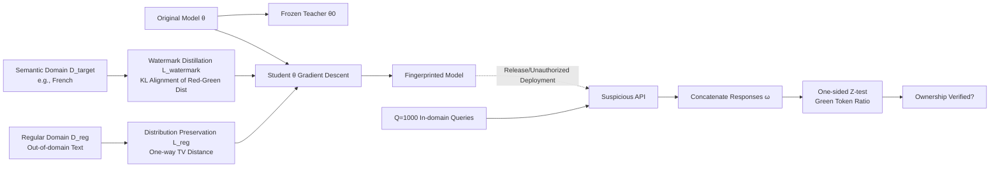

# LLM Fingerprinting via Semantically Conditioned Watermarks

**Conference**: ICLR 2026  
**OpenReview**: [https://openreview.net/forum?id=t38nZqqi3Z](https://openreview.net/forum?id=t38nZqqi3Z)  
**Code**: TBD  
**Area**: LLM Security / Model Copyright Protection  
**Keywords**: Model Fingerprinting, LLM Watermarking, Semantically Conditioned Watermarking, Ownership Verification, Robustness, Stealthiness  

## TL;DR
This paper replaces the "fixed query-key memorization fingerprinting" with a new paradigm: "distributing statistical watermark signals within a specific semantic domain (e.g., French)." This makes model fingerprinting robust to fine-tuning, quantization, pruning, and adversarial rewriting for the first time, while remaining undetectable to the deploying party in both queries and responses.

## Background & Motivation
**Background**: Open-source Large Language Models (LLMs) are expensive to train. Model owners release weights under restrictive licenses (e.g., prohibiting commercial use), but third parties may violate these licenses for private deployment. Black-box fingerprinting is the primary means of proving ownership—implanting specific "backdoors" that reveal a preset key when probed with a specific query.

**Limitations of Prior Work**: Existing methods (e.g., Instructional Fingerprinting, Scalable Fingerprinting) rely on the model **memorizing** a small set of fixed query-key pairs and use atypical random strings as queries/keys to control false positives. This introduces two fatal flaws: (1) **Non-robustness**—memorization is fragile; quantization, pruning, fine-tuning, or even changing a system prompt can drop the detection rate to 0. (2) **Non-stealthiness**—atypical, weird queries/keys can be easily identified and blocked by an adversary using filters.

**Key Challenge**: Using atypical queries/keys is intended to control false positives (normal models won't accidentally output a weird key), but this "atypicality" makes the fingerprint both fragile and conspicuous. Furthermore, detection based on exact string matching allows even non-adversarial perturbations to destroy the fingerprint. Robustness, stealthiness, and low false positives are difficult to achieve simultaneously.

**Goal**: Design a fingerprint that significantly improves stealthiness and robustness while maintaining effectiveness (low false positives without sacrificing utility).

**Key Insight**: **Replace fixed query sets with "semantic domains" and replace memorized keys with "statistical watermark signals."** Specifically, the model is trained to embed LLM watermark signals into responses only within a predefined semantic domain (e.g., all French prompts). The owner can then reliably detect and verify ownership using queries from that domain. The semantic domain resists input perturbations (remaining within the domain after perturbation), and the statistical signal strengthens with token count (amplified via multiple queries), achieving both stealthiness and robustness.

## Method

### Overall Architecture
The method consists of two phases: embedding and detection. **Embedding**: The owner freezes the original model as a teacher $\theta_0$ and **distills** the Red-Green watermark into the student model $\theta$ using data from the target semantic domain $D_\text{target}$, while maintaining the distribution on $D_\text{reg}$ (regular out-of-domain data). **Detection**: The owner samples $Q$ queries from the semantic domain and sends them to a suspicious API. All responses are concatenated into a single long sequence, and a one-sided Z-test for the Red-Green watermark is performed—the longer the concatenated sequence, the stronger the signal, allowing for robust detection with arbitrary query batches.

### Key Designs

**1. In-domain Watermark Distillation: "Welding" the watermark into weights**  
In open-source weight scenarios, the sampling process cannot be controlled, so standard inference-time Red-Green watermarking cannot be used directly. This paper follows the watermark distillation approach of Gu et al., but **for the first time, restricts distillation to a single target semantic domain**. On $D_\text{target}$, it minimizes the KL divergence between the student $\theta$ logits and the distribution formed by "Teacher $\theta_0$ with an added Red-Green watermark":
$$L_\text{watermark}(\theta,\xi)(x)=\sum_{t=1}^{|x|}\mathrm{KL}\big(\text{Red-Green}(p_{\theta_0}(\cdot|x_{<t}),\xi),\,p_\theta(\cdot|x_{<t})\big).$$
The Red-Green scheme uses a private key $\xi$ and the previous $k$ tokens to pseudo-randomly partition the vocabulary into $\gamma|\Sigma|$ green tokens and red tokens, boosting the logits of green tokens by $\delta$. After distillation, the model naturally favors green tokens in French responses without requiring special sampling.

**2. Out-of-domain Distribution Preservation: One-way TV Regularization**  
Embedding the watermark only in French is insufficient; the model's behavior in other domains (languages/tasks) must remain unchanged to preserve utility and avoid suspicion. The challenge is that Red-Green watermarks work by "boosting low-probability tokens," which can amplify tokens that should be rare. To penalize only this "positive shift," the paper defines a variant of Total Variation (TV) distance that only counts positive deviations:
$$L_\text{reg}(\theta)(x)=\sum_{t=1}^{|x|}\max\big(p_\theta(\cdot|x_{<t})-p_{\theta_0}(\cdot|x_{<t}),\,0\big).$$
This term is minimized if and only if the distribution of $\theta$ matches $\theta_0$ on $D_\text{reg}$. The final objective is a joint gradient descent $\nabla_\theta l_\text{target}+\lambda\nabla_\theta l_\text{reg}$. Ablations show that removing regularization significantly harms benchmark accuracy.

**3. Concatenated Z-test: Making "Weak Signal × Many Queries" Robust**  
Detection inherits off-the-shelf watermark detectors and their statistical guarantees. For a deduplicated sequence $\omega$, the Z-score is calculated based on the green token ratio $\hat\gamma(\omega)$:
$$Z(\omega)=\frac{\hat\gamma(\omega)-\gamma-\beta(\omega)}{\sqrt{\gamma(1-\gamma)/|\omega|}}.$$
Under the null hypothesis (no watermark), $Z$ asymptotically follows a standard normal distribution; the longer the sequence, the larger the $Z$ and the easier it is to detect. **Key Mechanism**: The owner sends $Q$ in-domain queries and concatenates all responses into one sequence for a single Z-test. Even if a single response has a weak signal due to fine-tuning or adversarial rewriting, the accumulated signal from 1,000 queries is sufficient for stable detection. This is the source of robustness: the owner can increase query counts arbitrarily. Experiments show 1000 queries (approx. \$0.20 at GPT-4o-mini scale) ensure total robustness.

**4. Semantic Domain Selection: High-entropy for Signal, Restricted for Stealth**  
The choice of semantic domain balances two conflicting requirements: the average entropy in the domain must be high enough for response diversity to carry the watermark signal (low-entropy domains require more queries), yet the domain must be restricted enough so that a targeted adversary cannot easily guess or detect the fingerprint. The main experiments use "French" as the semantic domain, while the appendix explores extensions like single-token triggers (e.g., watermarking only text within `[WM]...[/WM]`).

## Key Experimental Results

### Main Results: Effectiveness (FSR + Utility)
Tested on Llama 3.2-1B, Qwen 2.5-3B, and Llama 3.1-8B using Fingerprint Success Rate (FSR, averaged over 5 independent runs). The semantic domain is French, and detection uses $|Q|=1000$ queries.

| Model | Type | FSR | Avg Bench (AVG) | French Bench (FB) |
|------|------|-----|--------------------|--------------|
| Llama 3.2-1B | Original / Fingerprinted | 0.0 / **1.0** | 0.42 / 0.42 | 0.38 / 0.37 |
| Qwen 2.5-3B | Original / Fingerprinted | 0.0 / **1.0** | 0.58 / 0.58 | 0.61 / 0.62 |
| Llama 3.1-8B | Original / Fingerprinted | 0.0 / **1.0** | 0.63 / 0.62 | 0.64 / 0.63 |

FSR is 1.0 for fingerprinted models and 0.0 for originals (no false positives). Accuracy across 8 benchmarks (including French) shows almost no degradation, validating the preservation of utility via the regularized loss.

### Robustness: Comparison with IF / SF (25 Deployment Scenarios + 5 Targeted Attacks)
FSR for Llama 3.1-8B (selected results, 1.0 is success):

| Deployment Scenario | IF | SF | Ours |
|----------|----|----|------|
| Pruning SparseGPT 50% | 0.0 | 0.0 | **1.0** |
| Quantization Int4 | 1.0 | 0.2 | **1.0** |
| Full Fine-tuning Alpaca | 0.2 | 0.0 | **1.0** |
| LoRA Fine-tuning Dolly | 0.6 | 0.0 | **1.0** |
| System Prompt "Advertise" | 1.0 | 0.0 | **1.0** |
| Back-translation Attack | 1.0 | 0.0 | **1.0** |
| **In-domain Fine-tuning (WildChatFr)** | 0.4 | 0.0 | **1.0** |
| **Watermark-removal Paraphraser (ADV)** | 1.0 | 0.0 | **1.0** |
| **English Prefill Deception** | 1.0 | 0.0 | **1.0** |

Ours is the **only** method to maintain FSR=1.0 across all 25 deployment scenarios and 5 targeted attacks. IF/SF fail under heavy pruning or fine-tuning, and SF fails under most adversarial attacks.

### Stealthiness
Tested using GPT-4o as a discriminator to distinguish if queries/responses are for fingerprinting (FPR < 3%). IF's queries and keys were identified (not stealthy); our method's queries were undetectable, and response recall was very low, showing that **using natural text** is key to stealth.

### Key Findings
- Statistical signals + concatenative accumulation are the roots of robustness: SF fails even with 1024 query-key pairs under quantization, proving that simply expanding the memorization set is ineffective.
- Even if the adversary forces English responses (via prefilling or system prompts), as long as the input is within the semantic domain, the response still carries a (weaker) watermark that can be detected via query accumulation.
- Removing regularization significantly harms utility, verifying the necessity of the one-way TV regularization.

## Highlights & Insights
- **Paradigm Shift**: Moving from "memorization-matching" to "semantic conditioning + statistical signals" addresses both fragility and conspicuousness at their roots.
- **First Implementation of Semantic Watermarking**: Restricting watermark distillation to a single domain while maintaining out-of-domain distributions is a significant technical contribution.
- **"Accumulable Signal" Leverage**: Decoupling detection from a single response to an arbitrary number of concatenated responses provides 1.0 FSR for approx. \$0.20, an elegant design.
- **Thorough Evaluation**: Extensive testing across 3 models, 25 scenarios, and 5 attacks using unified FSR metrics.

## Limitations & Future Work
- **Dependency on High-entropy Domains**: Low-entropy domains require more queries; selecting domains involves a manual trade-off between signal strength and stealth.
- **Single Semantic Domain**: Primary experiments focus on French; multi-domain or composable fingerprints (to distinguish different leak sources) are not yet fully explored.
- **Query Overhead**: While low-cost, 1000 queries is more than the few required for query-key matching and requires an API that allows natural in-domain queries.
- **Red-Green Assumptions**: Statistical guarantees depend on the Red-Green scheme; the boundaries under extreme adversaries (strong watermark removal + forcing output out of semantic domain) and timing attacks remain for future work.

## Related Work & Insights
- **Black-box Fingerprinting Baselines**: Instructional Fingerprinting (Xu et al. 2024), Scalable Fingerprinting (Nasery et al. 2025)—both are query-key based and serve as primary comparisons.
- **White-box Fingerprinting**: Based on weights/activations; robust but requires weight access, limiting practicality.
- **LLM Watermarking**: Red-Green watermarking (Kirchenbauer et al. 2023) provides the signal foundation; distilling watermarks into open-source models (Gu et al. 2024) is the source of the embedding technique.
- **Insight**: This work demonstrates the power of replacing fragile exact matching with accumulable statistical tests—a general strategy applicable to dataset watermarking or agent behavior provenance.

## Rating
- **Novelty**: ⭐⭐⭐⭐⭐ A new fingerprinting paradigm + first semantic condition watermarking implementation.
- **Experimental Thoroughness**: ⭐⭐⭐⭐⭐ Comprehensive 3 models × 25 deployments × 5 attacks with unified metrics.
- **Writing Quality**: ⭐⭐⭐⭐ Clear logic from motivation to verification; well-defined formulas.
- **Value**: ⭐⭐⭐⭐ directly addresses copyright protection needs for open-source models with a low-cost, robust solution.

<!-- RELATED:START -->

## Related Papers

- [\[ICLR 2026\] Hey, That's My Model! Introducing Chain & Hash, An LLM Fingerprinting Technique](hey_thats_my_model_introducing_chain_hash_an_llm_fingerprinting_technique.md)
- [\[AAAI 2026\] iSeal: Encrypted Fingerprinting for Reliable LLM Ownership Verification](../../AAAI2026/llm_safety/iseal_encrypted_fingerprinting_for_reliable_llm_ownership_verification.md)
- [\[ICLR 2026\] In-Context Watermarks for Large Language Models](in-context_watermarks_for_large_language_models.md)
- [\[ACL 2025\] Can LLM Watermarks Robustly Prevent Unauthorized Knowledge Distillation?](../../ACL2025/llm_safety/llm_watermark_distillation_robustness.md)
- [\[NeurIPS 2025\] SAEMark: Steering Personalized Multilingual LLM Watermarks with Sparse Autoencoders](../../NeurIPS2025/llm_safety/saemark_steering_personalized_multilingual_llm_watermarks_with_sparse_autoencode.md)

<!-- RELATED:END -->
