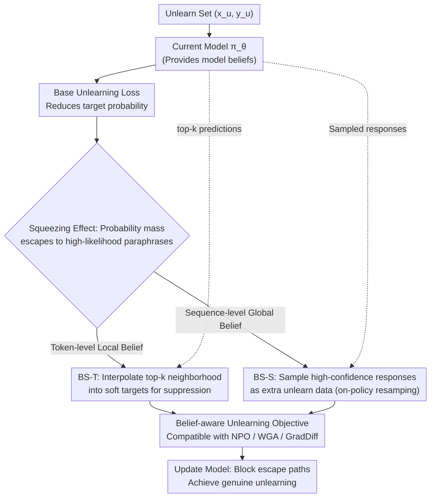

# LLM Unlearning with LLM Beliefs

**Conference**: ICLR 2026  
**arXiv**: [2510.19422](https://arxiv.org/abs/2510.19422)  
**Code**: [OpenUnlearning](https://github.com/locuslab/openunlearning)  
**Area**: LLM Evaluation  
**Keywords**: LLM Unlearning, Gradient Ascent, Squeezing Effect, Bootstrapping, Model Beliefs

## TL;DR

This work reveals the "squeezing effect" in LLM unlearning methods such as GA and NPO—where reducing the probability of target responses causes probability mass to shift toward semantically related high-likelihood regions, leading to spurious unlearning. It proposes a bootstrapping-based framework that utilizes the model's own high-confidence predictions (model beliefs) as additional unlearning targets. Two implementations, BS-T (token-level) and BS-S (sequence-level), achieve more thorough unlearning across TOFU, MUSE, and WMDP benchmarks while maintaining model utility.

## Background & Motivation

**Necessity of LLM Unlearning**: Large Language Models trained on massive corpora inevitably memorize sensitive, harmful, or copyrighted content, posing risks of privacy leakage and harmful outputs upon deployment. LLM unlearning aims to remove this harmful knowledge directly from the model via post-processing parameter adjustments, which is harder to bypass than content filters or in-context defenses.

**Mainstream Methods and Limitations**: Current mainstream methods are based on Gradient Ascent (GA) and its variants (NPO, WGA, GradDiff), which lower generation probability by maximizing the negative log-likelihood of target responses. However, GA often severely damages overall model performance. Subsequent improvements like NPO (instance-level reweighting) and WGA (token-level reweighting) still face fundamental issues.

**Spurious Unlearning Phenomenon**: The authors find that GA-based methods appear to successfully reduce target response probabilities, yet the model continues to generate semantically related paraphrases that retain the original knowledge—a phenomenon termed "spurious unlearning." For instance, while NPO achieves low metrics on TOFU (Probability 0.06, ROUGE-L 0.20), the generated content still preserves key information like "English."

**Misleading Evaluation Metrics**: Widely used metrics such as ROUGE, perplexity, and Truth Ratio fail to detect spurious unlearning, erroneously reporting successful removal. This implies that a significant portion of reported "successes" in existing literature may be spurious, exposing an evaluation crisis in the field.

**Root Cause of the Squeezing Effect**: The softmax normalization constraint dictates that the sum of conditional probabilities must be 1. When GA reduces the target $\pi_\theta(\mathbf{y}_u|\mathbf{x}_u)$, probability mass is inevitably redistributed to other candidate responses, concentrating in high-likelihood regions—which happen to correspond to semantically related paraphrases. This is the "squeezing effect."

**Key Insight**: The locations where probability mass "escapes" to are exactly the model's own most confident predictions—its model beliefs. By suppressing not only the original target but also these high-confidence predictions simultaneously, the escape paths for probability mass can be blocked, achieving genuine unlearning. This is the core intuition of the bootstrapping framework.

## Method

### Overall Architecture

To address the "spurious unlearning" of GA/NPO—where target probabilities decrease but the model still generates knowledge-retaining paraphrases—this work proposes the Bootstrapping framework. The core intuition is that softmax normalization "squeezes" the suppressed probability mass into semantically adjacent high-likelihood regions (model beliefs); therefore, suppressing these predictions together blocks the escape paths. The framework consists of two branches: token-level BS-T suppresses the top-k neighborhood at each step, and sequence-level BS-S treats sampled high-confidence full responses as additional unlearning data. Both can be integrated into any existing unlearning loss.

Formally, given an unlearn set $\mathcal{D}_u = \{(\mathbf{x}_u, \mathbf{y}_u)\}$ and a retain set $\mathcal{D}_r$, the goal is to decrease the likelihood of $\mathcal{D}_u$ and its paraphrases while keeping the output distribution for $\mathcal{D}_r$ close to the original model.

### Key Designs

**1. Diagnosis of the Squeezing Effect: Proving spurious unlearning as a mechanical necessity**

To determine why GA-based methods preserve paraphrases, the authors confirm the squeezing effect via two complementary experiments. First, semantic similarity distribution: responses sampled via beam search from the original model are grouped into high/medium/low likelihood. Using LLM-as-Judge for similarity assessment, it was found that the high-likelihood group is most similar to the target, and remains highly similar after NPO unlearning. Second, probability dynamics tracking: tracking log-probability changes during training revealed that GA and NPO initially raise the probability of the high-likelihood group before a slow decline—with GA eventually collapsing and NPO maintaining this "squeeze." These experiments indicate that squeezed probability mass stably escapes to high-likelihood paraphrase neighborhoods.

**2. BS-T (Token-level Bootstrapping): Suppressing the target and its top-k neighborhood**

As the escape hatch exists in the top-k neighborhood, BS-T extends the unlearning target from one-hot to this neighborhood. It interpolates the model's current top-k distribution with the original one-hot target to construct a soft target:

$$\mathbf{t}_u^i = \lambda_{\text{BST}} \cdot \text{sg}\left[\pi_\theta(\cdot|\mathbf{x}_u, \mathbf{y}_u^{<i})\big|_{\mathcal{H}_k^{(i)}}\right] + (1-\lambda_{\text{BST}}) \cdot \mathbf{e}_{y_u^i}$$

Where $\mathcal{H}_k^{(i)} = \text{Top-}k(\pi_\theta(\cdot|\mathbf{x}_u, \mathbf{y}_u^{<i}))$ is the set of top-k tokens at position $i$, $\text{sg}$ is the stop-gradient operator, and $\lambda_{\text{BST}}$ controls the intensity of neighborhood punishment. The loss is then GA applied to this soft target:

$$\mathcal{L}_{\text{BST}}(\theta; \mathcal{D}_u) = \mathbb{E}_{\mathcal{D}_u}\left[\sum_{i=1}^{|\mathbf{y}_u|} \langle \mathbf{t}_u^i, \log\pi_\theta(\cdot|\mathbf{x}_u, \mathbf{y}_u^{<i})\rangle\right]$$

Key aspects: stop-gradient prevents gradients from backpropagating through model predictions to avoid divergence; the mechanism resembles self-distillation but with the opposite goal—erasing knowledge rather than reinforcing it; neighborhood width can be adjusted via temperature.

**3. BS-S (Sequence-level Bootstrapping): Using full sampled responses as unlearn data**

While BS-T suppresses neighborhoods position-wise, a complete harmful continuation might still emerge. BS-S directly samples $N$ high-confidence full responses from the current model and treats them as additional unlearning data:

$$\hat{\mathcal{D}}_u = \{(\mathbf{x}_u, \hat{\mathbf{y}}_u^{(j)})\}_{j=1}^N, \quad \hat{\mathbf{y}}_u^{(j)} \sim \pi_\theta(\cdot|\mathbf{x}_u)$$

This is combined with the original unlearning loss:

$$\mathcal{L}_{\text{BSS}} = (1-\lambda_{\text{BSS}}) \mathcal{L}(\theta; \mathcal{D}_u) + \lambda_{\text{BSS}} \mathcal{L}(\theta; \hat{\mathcal{D}}_u)$$

$\mathcal{L}$ can be any unlearning loss (GA, NPO, BS-T). Sampling can be off-policy (pre-sampled) or on-policy (periodically resampled during training), with the latter evolving alongside the model for better coverage.

**4. Theoretical Analysis: Explaining why BS-T blocks new peaks via residual structures**

Based on the AKG learning dynamics framework, the authors compare the residuals during updates. The GA residual $\mathcal{G}_{\text{GA}}^i = \pi^i - \mathbf{e}_{y_u^i}$ only applies pressure in the direction of the target token, letting squeezed mass form new peaks in the neighborhood. The BS-T residual $\mathcal{G}_{\text{BST}}^i[v] = \mathcal{G}_{\text{GA}}^i[v] - \lambda \mathbf{q}^i[v]$ applies additional repulsive force toward the top-k neighborhood. This effectively suppresses both the target and the neighborhood, preventing the formation of new peaks—matching the monotonic decrease observed in BS probability dynamics.

The table below summarizes the objectives and mechanisms:

| Design | Purpose | Mechanism |
|------|------|------|
| Soft Target Blending | Expand unlearning to high-prob neighborhoods | one-hot + top-k distribution interpolation |
| Stop-gradient | Training stability | Block gradients through model predictions |
| Sequence-level Sampling | Cover complete harmful continuations | Sample high-confidence responses from model |
| Compatibility | Generality | Composable with NPO/WGA/GradDiff |

## Key Experimental Results

### Table 1: TOFU Benchmark (Llama 3 series, 10% forget, with retain regularization)

| Method | **1B** Agg.↑ | Mem.↑ | Util.↑ | **3B** Agg.↑ | Mem.↑ | Util.↑ | **8B** Agg.↑ | Mem.↑ | Util.↑ |
|------|:---:|:---:|:---:|:---:|:---:|:---:|:---:|:---:|:---:|
| Retrain | 0.64 | 0.58 | 0.71 | 0.65 | 0.57 | 0.75 | 0.65 | 0.57 | 0.75 |
| GradDiff | 0.52 | 0.49 | 0.56 | 0.49 | 0.47 | 0.52 | 0.50 | 0.45 | 0.55 |
| NPO | 0.58 | 0.58 | 0.58 | 0.62 | 0.58 | 0.66 | 0.63 | 0.57 | 0.70 |
| RMU | 0.58 | 0.59 | 0.57 | 0.55 | 0.44 | 0.74 | 0.62 | 0.55 | 0.72 |
| SimNPO | 0.47 | 0.35 | 0.70 | 0.41 | 0.28 | 0.74 | 0.29 | 0.18 | 0.72 |
| WGA | 0.53 | 0.47 | 0.62 | 0.51 | 0.42 | 0.66 | 0.52 | 0.41 | 0.70 |
| **BS-T** | 0.59 | 0.56 | 0.62 | 0.62 | 0.56 | 0.68 | 0.63 | 0.57 | 0.70 |
| **BS-S** | **0.61** | **0.59** | **0.63** | **0.63** | **0.58** | **0.70** | **0.64** | **0.58** | **0.71** |

### Table 2: WMDP Benchmark (Zephyr-7B-β)

| Method | Bio↓ | Cyber↓ | MMLU↑ |
|------|:---:|:---:|:---:|
| Original | 0.64 | 0.45 | 0.58 |
| GradDiff | 0.27 | 0.28 | 0.43 |
| NPO | 0.27 | 0.30 | 0.44 |
| RMU | 0.29 | 0.27 | **0.55** |
| **BS-T** | **0.26** | 0.28 | 0.52 |
| **BS-S** | **0.26** | **0.27** | 0.54 |

### Table 3: MUSE-News Benchmark (Llama 2 7B-Chat)

| Method | VerbMem↓ | KnowMem↓ | UtilPres↑ |
|------|:---:|:---:|:---:|
| Retrain | 0.2016 | 0.3170 | 0.5602 |
| NPO | 0.2914 | 0.3290 | 0.4651 |
| RMU | 0.3861 | 0.5088 | 0.4962 |
| **BS-T** | 0.2837 | 0.3278 | 0.4602 |
| **BS-S** | **0.2713** | **0.3250** | 0.4774 |

## Key Findings

1. **Spurious unlearning is a systemic issue**: LLM-as-Judge evaluations reveal that NPO's generations in high-likelihood regions on TOFU maintain semantic similarity to the target nearly as high as original paraphrases. This indicates spurious unlearning is a systemic outcome of NPO, not an isolated failure.

2. **Persistent probability mass shift**: During GA and NPO training, the log-probability of high-likelihood groups initially increases (with GA eventually collapsing and NPO maintaining it), confirming that the "squeezing effect" is both present and persistent. GA "evades" this by breaking the model, whereas NPO sustains spurious unlearning.

3. **BS-T and BS-S monotonically suppress high-likelihood probabilities**: Probability dynamics of BS show that both target and high-likelihood neighborhood probabilities decrease monotonically, directly confirming that the BS framework effectively mitigates the squeezing effect. LaaJ assessments also show BS outperforms baselines in both Naturalness and Similarity.

4. **Significant effectiveness of BS-S sequence-level augmentation**: Ablation studies show that BS-S performs best when using BS-T as the base loss (Agg. 0.64). Furthermore, the BS-S framework provides improvements across various base losses (GA/NPO/WGA), validating its universal effectiveness.

5. **Unreliability of traditional metrics**: GA can cause models to collapse into meaningless repetitions (e.g., repeating "always"), which ROUGE reports as ~0 (appearing to be perfect unlearning). In reality, the model becomes unusable. This exposes fundamental flaws in the evaluation systems long relied upon by the LLM unlearning community.

## Highlights & Insights

- **Discovery and Naming of the Squeezing Effect**: Precise naming of the probability mass transfer caused by softmax normalization as the "squeezing effect" provides a unified mechanistic explanation for spurious unlearning.
- **Clever Use of Model Beliefs**: Because the model's most confident predictions are exactly where probability mass escapes to, "using model beliefs to combat model beliefs" is an elegant, closed-loop design.
- **Introduction of LaaJ Evaluation**: Proposed LLM-as-Judge evaluation across Naturalness and Similarity dimensions aligns better with human judgment and has the potential to become a standard tool in the field.
- **Unification of Theory and Practice**: Demonstrating how BS-T reshapes residual structures via the AKG framework ensures that theoretical analysis and experimental observations are highly consistent.

## Limitations & Future Work

- **Hyperparameter Sensitivity**: BS-T is sensitive to $\lambda_{\text{BST}}$ and BS-S to $\lambda_{\text{BSS}}$, requiring per-dataset and per-model tuning. Automated schedulers have yet to be developed.
- **BS-S Computational Overhead**: Sampling multiple full responses as additional unlearn data causes OOM on 80G GPUs when $N > 5$.
- **Lack of Theory for On-policy BS-S**: The AKG framework applies only to off-policy settings; on-policy sampling distributions depend on parameters and cannot be derived using fixed-data assumptions.
- **Model Scale Constraints**: Validation was restricted to 1B-8B models; applicability to larger models (70B+) remains unknown.
- **Single-turn Dialogue Setting**: Scenario-specific risks like implicit knowledge leakage in multi-turn dialogues or bypasses via prompt engineering were not considered.

## Related Work & Insights

| Dimension | **Ours (BS-T/BS-S)** | **NPO (Zhang et al., 2024)** | **WGA (Wang et al., 2025b)** |
|------|------|------|------|
| Core Mechanism | Suppress target + model beliefs | Instance-level DPO-style GA | Token-level weighted GA |
| Resolves Squeezing Effect| ✅ Directly targets high-likelihood regions | ❌ Reweights without expanding scope | ❌ Only balances token contribution |
| Unlearning Granularity | Token-level + Sequence-level | Instance-level | Token-level |
| Spurious Unlearning | Effectively mitigated | Persistently exists (Case 2) | Not explicitly resolved |
| Theoretical Basis | AKG Residual Analysis | DPO Heuristic | GA Conditional Token form |
| Compute Overhead | BS-T lightweight, BS-S medium | Lightweight | Lightweight |
| TOFU-10% 1B Agg. | *0.61 (BS-S)* | 0.58 | 0.53 |

## Rating

- **Novelty**: ⭐⭐⭐⭐⭐ — The discovery of the squeezing effect, the model beliefs perspective, and the bootstrapping framework are highly insightful.
- **Experimental Thoroughness**: ⭐⭐⭐⭐⭐ — Multiple model families across TOFU/MUSE/WMDP, dual evaluation with LaaJ, and comprehensive ablations.
- **Writing Quality**: ⭐⭐⭐⭐⭐ — A coherent logical chain from motivation and diagnosis to solution, theory, and experiments.
- **Value**: ⭐⭐⭐⭐⭐ — Code integrated into OpenUnlearning, compatible with existing methods, and significantly impacts both methodology and evaluation in the field.

<!-- RELATED:START -->

## Related Papers

- [\[ICLR 2026\] Explainable LLM Unlearning through Reasoning](explainable_llm_unlearning_through_reasoning.md)
- [\[ICLR 2026\] Robust LLM Unlearning via Post Judgment and Multi-Round Thinking](robust_llm_unlearning_via_post_judgment_and_multi-round_thinking.md)
- [\[ICLR 2026\] Downgrade to Upgrade: Optimizer Simplification Enhances Robustness in LLM Unlearning](downgrade_to_upgrade_optimizer_simplification_enhances_robustness_in_llm_unlearn.md)
- [\[ACL 2026\] Representation-Guided Parameter-Efficient LLM Unlearning](../../ACL2026/llm_safety/representation-guided_parameter-efficient_llm_unlearning.md)
- [\[ICLR 2026\] Randomized Antipodal Search Done Right for Data Pareto Improvement of LLM Unlearning](randomized_antipodal_search_done_right_for_data_pareto_improvement_of_llm_unlear.md)

<!-- RELATED:END -->
