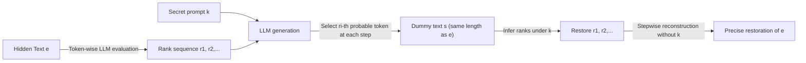

# LLMs Can Hide Text in Other Text of the Same Length

**Conference**: ICLR 2026  
**Code**: https://github.com/noranta4/calgacus  
**Area**: LLM Safety / Generative Steganography  
**Keywords**: Steganography, generative steganography, same-length hiding, LLM alignment, deniability, AI safety  

## TL;DR
A paper proposing "same-length steganography" using LLM token rankings: any piece of meaningful text is encoded into another style-controllable, naturally-reading dummy text of the exact same length. Anyone holding the secret key can precisely reconstruct the original message. This demonstrates the "complete decoupling of text from author intent," sounding an alarm for AI safety.

## Background & Motivation
- **Background**: Steganography aims to hide the "existence of the message itself," distinguishing it from cryptography which only ensures "difficulty in cracking." Generative steganography has emerged alongside generative models, directly generating carrier text from ciphertext rather than modifying existing carriers. Existing LLM-based schemes include Meteor (dynamic bit encoding via entropy), Wu et al. (black-box LLM support), and Zamir (encoding without altering response distributions).
- **Limitations of Prior Work**: Previous LLM steganography schemes face a "trade-off between capacity and imperceptibility"—either the hidden message is much shorter than the generated carrier (low capacity), or naturalness is sacrificed to pack more bits. No solution has achieved carrier text that is **strictly equal in length** to the hidden message.
- **Key Challenge**: When the dummy text and the original text have the **exact same number of tokens**, humans cannot judge which is real based on text length or verbosity. This symmetry makes the determination of whether a hidden message exists nearly impossible.
- **Goal**: To provide a simple, efficient protocol that runs in seconds on a laptop to achieve full-capacity (same-length) text steganography, and to discuss its impact on "text credibility," "whether LLMs truly 'know' something," and "AI alignment."
- **Core Idea**: **[Rank Reuse]** Instead of encoding tokens directly, the protocol encodes the **rank** of each token within the LLM's probability distribution. During decoding, the same LLM and rank sequence are used to reconstruct the original text. **[Same-length Symmetry]** Since the carrier and original text correspond token-for-token, their lengths are naturally identical.

## Method

### Overall Architecture
The Calgacus method is remarkably simple, summarized as "using ranks as a bridge." On the encoding side, the target text $e$ is processed token-by-token using an LLM to record a rank sequence $r_1, r_2, \dots$. Then, a secret prompt $k$ is used to generate text, but at each step, instead of sampling, the LLM is forced to select the $r_i$-th most probable token to form the dummy text $s$. The decoding side takes $s$ and $k$ to reverse the ranks and reconstruct $e$ step-by-step. The process only requires an LLM with accessible logits, the message $e$, and a secret prompt $k$.

### Key Designs

**1. Ranks instead of Probabilities: Translating "Content" into "Position".** The protocol’s pivot is using the rank $r_i$ rather than the token itself to carry information. For the text $e = (e_1, e_2, \dots)$, the rank of $e_i$ is recorded within the distribution given the prefix $e_1, \dots, e_{i-1}$. To generate dummy text, a secret prompt $k$ is used, and the $r_i$-th highest probability token is selected at each step. The intuition is key: if $e$ is fluent, the LLM likely predicts its tokens well, resulting in low ranks (mostly 1, 2, or 3). Consequently, the forced selections for $s$ will also be high-probability tokens, making $s$ naturally fluent. Conversely, if $e$ is unpredictable (e.g., a hash string `1f0ca711...`), ranks will be high, and $s$ will degrade into gibberish. This chain of "$e$ is fluent $\to$ lower ranks $\to$ $s$ is natural" is the foundation of the method's utility.

**2. Same-length Symmetry and Controllability: Locked Length, Adjustable Style.** Because $s$ and $e$ are generated one-to-one per token, they are **strictly equal in length** under the LLM's tokenizer. This is the source of the "same length" in the title and the core of its imperceptibility—placing both texts side-by-side, they are identical in length and both fluent, making it impossible to determine which is real at first glance. Meanwhile, the secret prompt $k$ determines the topic, tone, and style of $s$ (e.g., a tweet praising Caesar vs. a VR game review), achieving "locked content, plastic appearance." The paper also provides an enhanced variant: adding a secret prompt $k'$ before $e$, which can further lower ranks and make $s$ more controllable, at the cost of a longer key and loss of $k'$'s generality for new messages.

**3. Provable Quality Metrics and the "Low Entropy Waste" Phenomenon.** To quantify the quality of dummy text, the paper uses "soundness" (logical arrangement of symbols) as a proxy for meaning, defined as the cumulative probability $p(A) = \prod_{t=1}^{n} p(a_t \mid a_1, \dots, a_{t-1})$. Since this metric is length-sensitive, it is used only for relative comparisons between **equal-length** texts. Experiments revealed a counter-intuitive phenomenon: despite ranks being preserved, the probability of $s$ is systematically slightly lower than the original $e$. This is due to "low entropy token waste"—in the original text, certain positions (e.g., "Gaius Julius __" is almost certainly "Caesar") have rank-1 probabilities as high as 95%. However, whether $s$ hits a rank-1 position depends solely on the rank extracted from $e$ (rank-1 frequency $\approx$ 40%). Thus, many "high-probability" rank-1 opportunities are wasted on high-entropy positions, lowering the overall probability of $s$. This gap is why "LLMs can distinguish real from fake, even if humans cannot."

**4. Security and Deniability: Secret Keys + Relinquishable Coercion.** Security is built on the secrecy of $k$ (and the LLM used). Even if an attacker knows the protocol and the LLM, they must guess $k$, with a brute-force upper bound of $O(d^{|k|})$ ($d \approx$ 100k vocabulary size), which is practically infeasible. While $s$ might leak some clues about $k$ (since $k$ is often a natural language instruction), inserting a small random string into $k$ can block attacks that narrow the search space. More impressively, the paper demonstrates **deniability**: even if an attacker correctly guesses a $k$, they cannot confirm that the resulting $e$ is the true message. Because some prompts generate $s$ with probabilities comparable to real $e$, a sender under pressure can provide a "decoy key" that yields a plausible but irrelevant dummy message, protecting the true secret.

## Key Experimental Results

### Main Results (Is dummy text within the distribution of real text?)
- **Llama 3 8B** was used for probability evaluation; **1000 Reddit** posts/comments served as real text (truncated to exactly 85 tokens, and published after Llama 3's cutoff to ensure they weren't in the training set).
- Three real texts were selected at $\mu$, $\mu-2\sigma$, and $\mu+2\sigma$ of the distribution. For each, **100 dummy texts** were generated using this method with random prompts.

| Text Type | LLM Cumulative Log-Probability Position |
|---|---|
| 1000 Real Reddit Texts | Range of distribution (Baseline) |
| Random ASCII Strings | Outside the range (Obviously unnatural) |
| Random English Word Sequences | Outside the range |
| **Dummy Text $s$ (Ours)** | **Inside the real text distribution** |
| Hidden Original Text $e$ | Systematically slightly higher than $s$ |

### Ablation Study

| Analysis | Data/Phenomenon |
|---|---|
| Cross-model Separability | Evaluated with **Phi-3 3.8B**; real/dummy texts showed similar probability shifts, proving robustness. |
| Rank Frequency Analysis | Analysis of a 1.3k token *Economist* article: ~40% of tokens are rank-1; rank-1 positions account for the bulk of the probability gap. |
| Failure Cases | Hiding a hash string $\to$ $s$ degrades to gibberish (due to high ranks). |
| Efficiency | A message the length of an abstract can be encoded/decoded in **seconds** on a standard laptop; mobile demos are reproducible. |

### Key Findings
- For **humans**, both real and dummy texts appear equally natural and are of identical length, making them indistinguishable.
- For **LLMs**, the real text can often be identified by "choosing the segment with the highest probability," but **not always**—outlier prompts exist where the dummy text's probability rivals the original, forming the basis for deniability.
- Open-source LLMs at the 8B parameter scale are sufficient to produce high-quality results.

## Highlights & Insights
- **"Rank Reuse" is an elegant move**: By shifting information from "which token to choose" to "which rank to choose," the protocol locks length and preserves naturalness in a way simple enough to be a "recipe."
- **Full capacity (same length) is the true novelty**: Unlike previous LLM steganography that compromised on capacity or imperceptibility, same-length symmetry makes the determination of whether a hidden message exists visually impossible.
- **Elevating technology to philosophy and safety**: The paper uses this to propose the "complete decoupling of text from author intent" and presents a chilling application—AI companies could encode **unaligned** model outputs within the compliant responses of **aligned** models, challenging the very effectiveness of "alignment."
- **Robust deniability argument**: The phenomenon where dummy text occasionally matches the probability of real text—previously seen as a flaw—is reframed as a safety feature to protect senders under coercion.

## Limitations & Future Work
- **No Quality Guarantee**: Whether $s$ is fluent/controllable depends on $e$, $k$, and the LLM; unpredictable $e$ (like hashes) yields gibberish.
- **Detectability by LLMs**: In an aggregate sense, original text probability is higher than dummy text; a detector with the same LLM can distinguish them (deniability only holds in outlier cases).
- **Hard Consistency Requirements**: The sender and receiver must run the exact same LLM under identical conditions to get bit-accurate logits; numerical variances across different GPU architectures can lead to decoding failure.
- **Truncation Issues**: $s$ might end abruptly when the message ends, requiring a small amount of padding tokens for a natural conclusion.
- **Lack of Formal Security Guarantees**: The paper explicitly avoids idealized formal steganography models; the security argument is empirical/qualitative. The feasibility of using clues in $s$ to narrow the search space for $k$ remains an open question.

## Related Work & Insights
- **Generative Steganography** (Liu 2018, Wei 2022, Kim 2023, Zhu 2024, Wu 2024, Tang 2025): Generating carriers directly from ciphertext; this work follows this path but is the first to achieve strict equal length.
- **LLM Steganography**: Ziegler 2019 (earliest), Meteor (Kaptchuk 2021, entropy-based bits), Wu 2024 (black-box), Zamir 2024 (distribution-preserving)—this paper’s unique selling point is full capacity.
- **Formal Steganography Models**: Cachin 1998 (hypothesis testing framework) and others are often impractical due to idealized assumptions; this work takes a pragmatic route using LLM probability for "soundness."
- **Deniable Encryption** (Canetti 1997): This paper migrates the concept of deniability to LLM steganography, providing sender security under coercion.
- **Insights**: This work ties together "whether LLMs truly know things," "text credibility," and "whether alignment can be bypassed," presenting new challenges for AI safety detection (how to identify encoded unaligned outputs) and digital content provenance.

## Rating
- Novelty: ⭐⭐⭐⭐⭐ — "Rank reuse" for strict same-length steganography is a simple yet unprecedented idea, pushed to the height of "decoupling text and intent."
- Experimental Thoroughness: ⭐⭐⭐ — Core verifications (distribution, cross-model, rank analysis) are clear, but the scale is small and lacks quantitative benchmarking against other LLM steganography methods.
- Writing Quality: ⭐⭐⭐⭐⭐ — Highly readable, progressing from recipe-like methods to philosophical/safety discussions with vivid examples (Caesar, Roman oratory, wild boar recipes).
- Value: ⭐⭐⭐⭐⭐ — Direct and profound implications for AI safety (unaligned models masquerading as aligned), content credibility, and censorship circumvention.

<!-- RELATED:START -->

## Related Papers

- [\[ICLR 2026\] Secret-Protected Evolution for Differentially Private Synthetic Text Generation](secret-protected_evolution_for_differentially_private_synthetic_text_generation.md)
- [\[ICLR 2026\] From Static Benchmarks to Dynamic Protocol: Agent-Centric Text Anomaly Detection for Evaluating LLM Reasoning](from_static_benchmarks_to_dynamic_protocol_agent-centric_text_anomaly_detection_.md)
- [\[ICLR 2026\] Erase or Hide? Suppressing Spurious Unlearning Neurons for Robust Unlearning](erase_or_hide_suppressing_spurious_unlearning_neurons_for_robust_unlearning.md)
- [\[ICLR 2026\] Strategic Dishonesty Can Undermine AI Safety Evaluations of Frontier LLMs](strategic_dishonesty_can_undermine_ai_safety_evaluations_of_frontier_llms.md)
- [\[ACL 2026\] Subject-level Inference for Realistic Text Anonymization Evaluation](../../ACL2026/llm_safety/subject-level_inference_for_realistic_text_anonymization_evaluation.md)

<!-- RELATED:END -->
