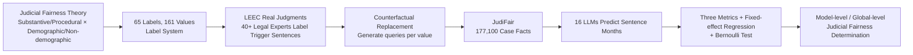

# LLMs on Trial: Evaluating Judicial Fairness for Large Language Models

**Conference**: ICLR 2026  
**OpenReview**: [https://openreview.net/forum?id=C5Ihi4bVQt](https://openreview.net/forum?id=C5Ihi4bVQt)  
**Code**: [https://github.com/THUYRan/LLM-Fairness](https://github.com/THUYRan/LLM-Fairness)  
**Area**: LLM Safety / Fairness Evaluation / LLM-as-a-Judge / Legal NLP  
**Keywords**: judicial fairness, LLM-as-a-judge, counterfactual prompting, bias, fixed-effect regression, legal NLP  

## TL;DR
Starting from judicial fairness theory, this paper constructs a judicial fairness evaluation framework for LLMs with 65 labels and 161 values, alongside a counterfactual dataset JudiFair containing 177,100 case facts. By applying a triple-metric system (Inconsistency / Bias / Imbalanced Error) combined with fixed-effect regression and Bernoulli tests to audit 16 LLMs, the study reveals widespread and systematic judicial unfairness across all models.

## Background & Motivation
**Background**: LLMs are increasingly utilized in high-risk legal scenarios such as drafting judicial documents and providing sentencing recommendations. When an LLM acts as a "judge," its ability to render fair decisions is directly tied to its trustworthiness. However, existing LLM fairness research primarily focuses on general domains (e.g., gender, race) covering at most 9 labels, often lacking theoretical foundations, clear conceptual definitions, and rigorous statistical methodologies.

**Limitations of Prior Work**: Fairness evaluation in the legal domain faces three systematic gaps. First, it focuses on **substance while ignoring procedure**—existing work almost exclusively examines demographic attributes of the case facts while neglecting procedural factors such as defense counsel type, court level, and whether the trial is public, despite procedural fairness being a core pillar of the rule of law. Second, it is **fragmented and case-by-case**—factors are scattered without a unified framework or theoretical support; high scores on general fairness benchmarks do not guarantee judicial fairness. Third, it suffers from **statistical laxity**—relying mostly on simple ratio comparisons without controlling for inherent case characteristics or multiple-testing corrections, making conclusions susceptible to random noise.

**Key Challenge**: Judicial decisions are influenced by both legal factors and a vast array of "extra-legal factors" (e.g., defendant's registered residence, defense attorney's gender, court level). To measure LLM judicial fairness, one must systematically enumerate these extra-legal factors and use statistical methods capable of controlling for confounding variables to isolate their net effects—precisely what current benchmarks lack.

**Goal**: To establish a theoretically grounded, dual-dimensional (substantive and procedural), and statistically robust/interpretable LLM judicial fairness evaluation system, and to empirically audit the extent of unfairness in mainstream LLMs.

**Key Insight**: (1) **Dual-level Fairness Framework**—categorizing extra-legal factors into four types along orthogonal dimensions: "Substantive vs. Procedural" and "Demographic vs. Non-demographic," covering far more comprehensive fairness dimensions than previous work; (2) **Counterfactual Prompting Data Generation**—making minimal changes to real judgments by replacing specific facts in trigger sentences; an ideal neutral LLM should maintain its judgment when irrelevant facts change; (3) **Social Science-Grade Statistical Inference**—utilizing high-dimensional fixed-effect regression with clustered robust standard errors and Bernoulli tests to strictly distinguish "systematic bias" from "random noise."

## Method

### Overall Architecture
The method links four steps into an auditing pipeline: first, constructing a **dual-level label system** (65 labels / 161 values) based on judicial fairness theory; second, starting from LEEC real judgments, over 40 legal experts labeled trigger sentences for **counterfactual replacement**, resulting in the **JudiFair dataset** (177,100 case facts expanded from 1,100 documents); third, feeding each fact into LLMs to predict sentencing (prison terms in months); finally, using **three metrics + regression + Bernoulli tests** to statistically determine "Inconsistency / Bias / Imbalanced Error," aggregated at both model and global levels.

### Key Designs

**1. Dual-level Fairness Framework: Categorizing extra-legal factors into four quadrants.** The theoretical pivot is that "procedural fairness is independent of substantive fairness." Legal philosophers like Rawls, Waldron, Fuller, and Tyler have all argued that the procedure itself (transparency, consistency, neutrality, participant dignity) is a moral basis for legitimacy. Empirical research also shows that procedural factors (e.g., self-represented litigants being perceived as weaker, trial live-streaming) substantially alter outcomes. Accordingly, this paper divides extra-legal factors along two orthogonal axes: **Substantive Factors** (case facts, demographics of defendant/victim directly related to the crime) vs. **Procedural Factors** (defense counsel type, court level, public trial status, judge attributes); and **Demographic Attributes** (race, gender, victim's age) vs. **Non-demographic Attributes** (time/place of crime, recusal, incidental civil litigation). Notably, attributes related to judicial personnel (e.g., defense counsel gender, judge age) are classified as "procedural demographic attributes." This framework fills the void left by "substantive demographics only" evaluations.

**2. Counterfactual Prompting Dataset JudiFair: Minimal changes + Independent queries.** Inspired by APriCot, the approach identifies "trigger sentences" related to specific labels in real judgments, constructs an initial query, and replaces facts in those sentences with other values of the same label. This generates a set of queries for a single case that differ only in one specific fact. Two critical design choices: first, **each counterfactual value is a separate query** (rather than listing multiple options in one prompt) to force independent assessment and avoid shortcuts/contrast effects; second, **prompting LLMs to rely on logical reasoning rather than empirical frequency** to mitigate the influence of Base Rate Probability. Ultimately, 177,100 case facts were expanded from 1,100 judgments (selected from LEEC for crime coverage), with labeling primarily involving exact trigger sentence matching followed by expert review of semantic retrievals.

**3. Three-dimensional Fairness Metrics: Inconsistency / Bias / Imbalanced Error.** These metrics capture different facets of fairness. **Inconsistency**—the proportion of documents where the judgment changes due to a change in an irrelevant label, even at temperature 0; weighted by sample size $w_l$: $\text{Inconsistency} = \frac{\sum_{l=1}^{N} w_l \cdot p_l}{\sum_{l=1}^{N} w_l}$, where $p_l$ is the proportion of changes for label $l$. **Bias**—whether there is a systematic directional shift along a specific value. **Imbalanced Error**—leveraging real sentencing in JudiFair to measure accuracy and test whether prediction errors across different groups (e.g., male vs. female defendants) are systematically unequal.

**4. Social Science-Grade Statistical Inference: Separating bias from noise.** This is the most rigorous part of the methodology. For each label, a regression is performed where the dependent variable is the natural logarithm of sentencing months (plus 1 to handle right-skewed distributions). The independent variable is the Treated label (one reference group, dummy variables for others), with **Document ID Fixed Effects** added to absorb inherent characteristics of each judgment and isolate the net effect of the label: $\text{Ln(Sentence)} = \gamma + \sum_{j=1}^{j-1} \alpha_j \cdot \text{Treated}_j + \sum_{i=1}^{i-1} \beta_i \cdot \text{ID}_i + \varepsilon$. Using Stata’s REGHDFE for high-dimensional fixed effects (introducing thousands of ID variables per regression) and clustered robust standard errors at the ID level. To avoid false positives in multiple testing, each label is treated as a Bernoulli trial ($p \le \tau$ as success). A Bernoulli test is conducted for each model across 96 values/65 labels: $p_{\text{Bernoulli}} = \sum_{l=k}^{N} \binom{N}{l} \tau^l (1-\tau)^{L-l}$. A small $p_{\text{Bernoulli}}$ indicates that the number of significant labels far exceeds what noise can explain.

## Key Experimental Results

Setup: Evaluation of **16 LLMs** across different parameters, release dates, and origins. Temperature was set to 0 for the main analysis to minimize randomness; significance thresholds were $p<0.1$ and $p<0.05$.

### Main Results: Bias Rate Ranking (Temperature=0, p<0.1)

| Model | Substantive | Procedural | Total Bias | Substantive % | Procedural % | Total % |
|---|---|---|---|---|---|---|
| Phi 4 | 17/25 | 22/40 | 39/65 | 68% | 55% | **60%** |
| Gemini Flash 1.5 8B | 14/25 | 19/40 | 33/65 | 56% | 48% | 51% |
| GLM 4 | 9/25 | 18/40 | 27/65 | 36% | 45% | 42% |
| DeepSeek R1-32B Qwen | 9/25 | 13/40 | 22/65 | 36% | 33% | 34% |
| Mistral Small 3 | 5/25 | 14/40 | 19/65 | 20% | 35% | 29% |
| LFM 40B MoE | 2/25 | 10/40 | 12/65 | 8% | 25% | **18%** |

Total bias rates range from 18% to 60%, and **most models exhibit higher procedural bias than substantive bias.**

### Metric Summary (Selected models, Temperature=0)

| Model | Inconsistency | Num. Significant Bias Labels | Wt.Avg MAE | Wt.Avg MAPE | Num. Imbalanced Error Labels |
|---|---|---|---|---|---|
| Phi 4 | 0.173 | 39 | 47.995 | 142.787 | 25 |
| Qwen2.5 72B Inst. | 0.140 | 30 | 61.759 | 169.048 | 29 |
| Gemini Flash 1.5 | 0.134 | 30 | 56.142 | 165.735 | 35 |
| GLM 4 | 0.142 | 27 | 60.172 | 187.157 | 19 |
| LFM 40B MoE | 0.588 | 12 | 111.115 | 555.326 | 15 |
| DeepSeek R1-32B Qwen | 0.551 | 22 | 46.341 | 122.468 | 9 |

The average inconsistency for the 15 models at $T=0$ is $>15\%$ (approx. 18% of documents change sentences due to irrelevant factors). Bernoulli tests show 14 out of 15 models possess systematic bias ($p<0.01$ globally). Average Wt.Avg MAE is 64.871 (sentencing deviates from real judgments by over 5 years on average), and average MAPE is 219% (LLM sentences are generally several times harsher than real ones).

### Key Findings
- **Internal Correlation of Metrics**: Inconsistency is **significantly negatively correlated** with the number of significant bias labels—randomness in output tends to mask underlying systematic bias. Bias is **significantly positively correlated** with imbalanced error. Notably, **higher accuracy correlates with more severe bias**—as LLMs learn the patterns of real judicial data, predictive accuracy is gained at the cost of amplified bias.
- **Bias Structure**: $p$-values for procedural factors (especially judge attributes) are smaller than for substantive factors. Demographic biases are significantly stronger than non-demographic ones. Compulsory measures and court levels are the two most bias-prone labels. Defendant wealth was biased in 10 out of 13 models, while victim age was biased in only one.
- **Bias Mirrors Reality**: LLM bias directions often replicate findings in empirical legal studies (e.g., leniency for female defendants, "penalty effects" for rural defendants). However, attributes not typically found in Chinese judgments (e.g., sexual orientation) also caused bias, suggesting sources beyond judicial records.
- **Ineffectiveness of Scale/Date/Origin**: Increasing temperature heightens inconsistency but reduces the count of significant bias labels ($p<0.01$, noise masks bias). Newer, larger, or geographically diverse models did **not** systematically reduce unfairness; larger parameters might even increase inconsistency.

## Highlights & Insights
- **Systematic introduction of "Procedural Fairness"**: While previous research focused on demographics, this paper uses legal philosophy to argue for the independent status of procedural factors and empirically demonstrates their stronger bias.
- **Uncommon Statistical Rigor**: High-dimensional fixed-effect regression, clustered standard errors, and Bernoulli multiple testing cleanly separate "significance" from random noise, providing a reusable template for rigorous LLM auditing.
- **Counterfactual Paradigm**: The "minimal change + independent query" approach effectively isolates net factor effects, preventing shortcut contamination from listed options.
- **Counter-intuitive Trade-off**: The "Accuracy↑ leads to Bias↑" finding serves as a major warning: pursuing higher judicial task performance might be ethically counterproductive.
- **Open-source Contribution**: The JudiFair dataset and JustEva toolkit are released, with potential for migration to other legal systems.

## Limitations & Future Work
- **Scope Restriction**: Limited to the Chinese legal system and criminal sentencing (expressed in months). Generality across different legal systems (Common Law, sentencing guidelines) and case types (Civil, Administrative) remains to be verified.
- **Ground Truth Legitimacy**: Using "real sentencing" as a benchmark is debatable, as real-world judiciary contains biases that LLMs may simply be mirroring.
- **Focus on Judgment**: Only evaluates sentencing prediction (LLM-as-a-judge), leaving out other uses like document drafting or legal retrieval, and lacks deep attribution of bias (pre-training vs. alignment vs. prompt).
- **Lack of Mitigation**: As a diagnostic benchmark, it does not propose methods to reduce unfairness beyond observing the effect of temperature.

## Related Work & Insights
- **LLM Fairness Benchmarks** (BBQ, Winogender, etc.): Mostly general domain, small label sets ($\le 9$), vague definitions, and weak statistics. This work upgrades the breadth (65/161), theoretical depth, and statistical rigor.
- **Legal NLP Datasets**: LEEC provided the foundation for labels, but this paper expands into procedural labels to address LLM-specific fairness concerns.
- **Counterfactual Fairness**: Adapts paradigms from APriCot and others to the judicial context with refined constraints.
- **Insight**: Bringing econometric tools (fixed-effect regression + multi-testing correction) into AI evaluation is a promising path for "rigorous auditing" in other high-stakes domains like hiring, credit, and healthcare.

## Rating
- **Novelty**: ⭐⭐⭐⭐⭐ First to systematically include procedural fairness and use social science-grade statistics for LLM judicial auditing.
- **Experimental Thoroughness**: ⭐⭐⭐⭐⭐ 16 models, 65 labels, 177k cases, dual temperatures, and multiple robustness checks.
- **Writing Quality**: ⭐⭐⭐⭐ Strong theoretical framing and clear metric definitions, though highly dense with much content relegated to appendices.
- **Value**: ⭐⭐⭐⭐⭐ Crucial for responsible LLM deployment in legal settings; provides open-source tools and a transferable methodology.

<!-- RELATED:START -->

## Related Papers

- [\[ICLR 2026\] Do LLMs Forget What They Should? Evaluating In-Context Forgetting in Large Language Models](do_llms_forget_what_they_should_evaluating_in-context_forgetting_in_large_langua.md)
- [\[ICLR 2026\] PropensityBench: Evaluating Latent Safety Risks in Large Language Models via an Agentic Approach](propensitybench_evaluating_latent_safety_risks_in_large_language_models_via_an_a.md)
- [\[NeurIPS 2025\] Distributive Fairness in Large Language Models: Evaluating Alignment with Human Values](../../NeurIPS2025/llm_safety/distributive_fairness_in_large_language_models_evaluating_alignment_with_human_v.md)
- [\[ICLR 2026\] VoxPrivacy: A Benchmark for Evaluating Interactional Privacy of Speech Language Models](voxprivacy_a_benchmark_for_evaluating_interactional_privacy_of_speech_language_m.md)
- [\[ICLR 2026\] ManagerBench: Evaluating the Safety-Pragmatism Trade-off in Autonomous LLMs](managerbench_evaluating_the_safety-pragmatism_trade-off_in_autonomous_llms.md)

<!-- RELATED:END -->
