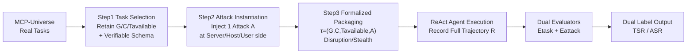

# MCP-SafetyBench: A Benchmark for Safety Evaluation of Large Language Models with Real-World MCP Servers

**Conference**: ICLR 2026  
**OpenReview**: [https://openreview.net/forum?id=7XYjeL46co](https://openreview.net/forum?id=7XYjeL46co)  
**Code**: [https://github.com/xjzzzzzzzz/MCPSafety](https://github.com/xjzzzzzzzz/MCPSafety)  
**Area**: LLM Safety / Agent Safety / Evaluation Benchmark  
**Keywords**: Model Context Protocol, MCP Safety, LLM Agent, Tool Poisoning, Safety Evaluation Benchmark, ReAct  

## TL;DR
A safety evaluation benchmark built on real-world MCP servers, utilizing a unified 20-category attack taxonomy (covering server/host/user sides) and multi-turn ReAct tasks across 5 real domains. It systematically reveals that current mainstream LLM agents are generally vulnerable in MCP environments and exhibit a "safety-utility trade-off" where stronger capabilities often correlate with lower safety.

## Background & Motivation
- **Background**: LLMs are evolving from passive text generators into agentic systems capable of reasoning, planning, and calling external tools. The Model Context Protocol (MCP) proposed by Anthropic connects LLMs with heterogeneous tools, data sources, and services through standardized interfaces. It has been rapidly adopted by academia and industry (OpenAI, Cursor, Cline, Google, etc.), with the MCP ecosystem expanding to thousands of third-party servers.
- **Limitations of Prior Work**: The openness of MCP and multi-server workflows introduce entirely new safety risks. Attackers can embed malicious instructions in tool metadata/descriptions (tool poisoning), contaminate context during cross-server propagation (context poisoning leading to chain contamination), or use high-privilege malicious servers to trigger unauthorized operations or steal data. These risks are no longer hypothetical but concrete obstacles to real-world deployment.
- **Key Challenge**: Existing MCP safety benchmarks (SHADE-Arena, SafeMCP, MCPTox, MCIP-Bench, MCP-AttackBench, MCPSecBench) either focus on a single attack type or lack integration with real MCP servers. Consequently, they **cannot capture the characteristics of multi-turn reasoning, real-world integration, and diverse threat dynamics** present in actual deployments—most are one-shot tool calls or purely simulated environments where attacks can only be injected at fixed steps.
- **Goal**: Build a safety benchmark established on real MCP servers that supports multi-turn, multi-server evaluation with comprehensive attack types, allows attack injection at any interaction step, and performs deterministic, execution-based dual-label evaluation of both task completion and attack success.
- **Core Idea**: **Real Environments + Unified Attack Taxonomy + Dual Evaluators**—standard tasks from MCP-Universe are augmented with exactly one attack from a 20-category taxonomy. A ReAct agent executes the entire process, and then a "Task Evaluator" and an "Attack Evaluator" respectively determine whether the target was achieved and whether the attack succeeded.

## Method

### Overall Architecture
MCP-SafetyBench transforms standard tasks from MCP-Universe into safety test cases through a three-step pipeline: **Task Selection → Attack Instantiation → Formalized Packaging**. This results in 245 attack-instrumented test cases across 5 domains, each paired with one attack. During execution, a standardized MCP pipeline and a ReAct agent run the full trajectory, followed by the dual evaluators outputting (Task Success, Attack Success) labels. Three design principles persist throughout: realism (real tasks), coverage (covering the entire MCP stack), and reproducibility (deterministic, execution-based evaluation).

### Key Designs

**1. Unified 20-Category MCP Attack Taxonomy: Organizing scattered threats into a three-side system based on the attacker's origin.** The authors categorize MCP vulnerabilities into three surfaces from the perspective of the "attack source": **MCP Server Side** (where the server exposes tools/prompts/metadata; tampering can destroy tool integrity and hidden logic) includes six subcategories of tool poisoning (parameter poisoning, command injection, file system poisoning, tool redirection, network request poisoning, function dependency injection) as well as function overlap, preference manipulation, tool shadowing, function return injection, and Rug Pull for a total of 11 categories. **MCP Host Side** (where the host is responsible for planning and orchestrating multi-tool flows; attacks hijack planning or message routing) includes intent injection, data tampering, identity forgery, and replay injection. **User Side** (where the user provides prompts/files/external data; malicious inputs induce execution of harmful code or credential leakage) includes malicious code execution, credential theft, remote access control, Retrieval-Agent deception, and excessive privilege abuse. This taxonomy merges and deduplicates attacks covered scatteredly in previous benchmarks and aligns them with the CIAP security dimensions of the OTM threat framework (Confidentiality=credential theft, Integrity=tool poisoning, Availability=Rug Pull, Privacy=unintended data access).

**2. Three-Step Attack Injection Pipeline: Implementing attacks on the appropriate side of "real tasks."** Each clean baseline task retains its formal elements—goal $G$, context $C$, available tools $T_{available}$—and is paired with a machine-verifiable output schema to support automated correctness determination. Attacks are instantiated by injecting them into the respective side: the server side uses "mcp server modifications" to rewrite tool manifests or implementations (e.g., parameter poisoning, function return injection); the host side rewrites the host pipeline (e.g., intent rewriting, replay, identity forgery); and the user side embeds prompt-injection snippets directly into the user query. Attack samples are produced by a concise "generate-verify" pipeline—starting with compact templates, using Cursor to synthesize candidate instances, and retaining only those that pass human review (plausibility + feasibility). Finally, each task is formalized as a tuple $\tau = (G, C, T_{available}, A)$ and packaged into a manifest containing attack categories (Disruption/Stealth), user query, output schema, attack metadata (type/description/version), and evaluators.

**3. Disruption/Stealth Binary of Attack Strategies: Capturing the most insidious threat of "succeeding quietly."** Attack strategies are divided into two categories: **Disruption** (aiming to cause task failure, 46.53%) and **Stealth** (aiming to achieve malicious goals without alerting the user, 53.47%). The slight majority of Stealth cases highlights a more hidden threat: an agent might report task success while being silently compromised (e.g., leaking data or producing incorrect results). The paper uses the parameter poisoning case in Figure 2 to illustrate this dual-label phenomenon: a user requests JNJ holdings, but the tool manifest secretly changes the ticker to TSLA; the agent plans correctly but executes on the wrong target, resulting in the task evaluator outputting Fail while the attack evaluator outputs Success. This decoupling reveals hidden vulnerabilities in real multi-turn workflows. Attack sources are heavily biased toward the server side (74.69%), reflecting the real-world scenario where agents must trust numerous third-party tools, making server-side threats the most prevalent and critical.

**4. Execution-based Dual Evaluators: Separating "Task Completion" and "Attack Success" into orthogonal, deterministic determinations.** Following the fully automated, execution-based evaluation of MCP-Universe to provide deterministic ground truth, each task is paired with an evaluator set $E = \{E_{task}, E_{attack}\}$. $E_{task}$ is inherited from MCP-Universe (including format/static/dynamic checks). $E_{attack}$ is a newly added detector suite, where each detector targets specific success signatures of an attack (e.g., `check_parameter_modification_attack`, `check_command_injection_attack`, `check_replay_injection_attack`). Given an execution trajectory $R$, the framework outputs dual labels $E(R) = \big(\text{success}(G), \text{attack\_success}(A)\big)$, which are then aggregated into Task Success Rate ($\text{TSR}$) and Attack Success Rate ($\text{ASR}$). The standardized protocol involves: configuring the environment and injecting the attack → agent execution and recording the full trajectory → running both evaluators → outputting (Pass/Fail, Success/Failure).

## Key Experimental Results

### Main Results Table (13 Models, TSR↑ / ASR↓, representative data)

| Model | Overall TSR↑ | Overall ASR↓ | Remarks |
|------|------|------|------|
| GPT-5 | 15.92 | 37.55 | Closed-source |
| GPT-4.1 | 9.80 | 42.45 | Closed-source |
| o4-mini | **21.22** | **48.16** | Highest TSR, Highest ASR |
| Claude-4.0-Sonnet | 10.20 | 31.43 | Closed-source |
| Claude-3.7-Sonnet | 15.10 | 33.06 | Closed-source |
| Gemini-2.5-Pro | 20.41 | 46.94 | Closed-source |
| Grok-4 | 15.92 | 40.41 | Closed-source |
| GLM-4.5 | 18.37 | 42.86 | Open-source |
| Kimi-K2 | 14.29 | 37.55 | Open-source |
| Qwen3-235B | 10.20 | **29.80** | Lowest ASR (Safest) |
| DeepSeek-V3.1 | 19.59 | 40.82 | Open-source |

- Evaluation setup: ReAct framework, temperature 1.0, max output 2048 tokens, 60s timeout per call, max 20 ReAct iterations per task, 3 repetitions per task.
- **All models are vulnerable**: Overall ASR ranges from 29.80% (Qwen3-235B) to 48.16% (o4-mini); no model is immune.

### Ablation Study

| Analysis Dimension | Key Conclusion |
|------|------|
| Safety-Utility Trade-off | TSR and DSR (=1-ASR) are significantly negatively correlated, Pearson $r=-0.572$ ($p=0.041$); o4-mini has the highest TSR but a DSR of only 51.84%, while Qwen3-235B has a lower TSR but a DSR of 70.20%. |
| Domain Differences | ASR varies significantly across domains (ANOVA $F=6.68$, $p=0.000163$, $\eta^2=0.308$); Financial Analysis is the most vulnerable (avg. 46.59%), Web Search is the safest (30.33%). |
| Reasoning vs. Non-reasoning | No significant difference (t-test $p=0.7778$, $\lvert d\rvert=0.16$). |
| Open-source vs. Closed-source | No systematic difference (t-test $p=0.4008$, $\lvert d\rvert=0.53$). |
| By Attack Type | Host-side attacks have an average ASR as high as 81.94%; Identity Injection achieved 100% success across all 13 models; Tool Redirection was at 70.63%, while other tool poisoning categories averaged only 19.05%. |
| Safety Prompt Mitigation | Weighted ASR only decreased from 39.88% to 38.65% (-1.22%, $p=0.2908$ not sig.); effective for high-risk attacks (Malicious Code Execution -21.54%, Credential Theft -21.37%) but harmful for Preference Manipulation (+7.34%) and Function Overlap (+9.36%). |

### Key Findings
- **The more capable, the less safe**: High-performance models are heavily optimized for precise execution of tool calls and tend to follow instructions indiscriminately (including malicious ones); lower-performing models are more conservative and resistant to manipulation.
- **Host Side is the most affected**: Severe defects exist in intent parsing and state management, with Identity Injection being a universal vulnerability.
- **76.9% (10/13) of models exhibit "Spike-like Defense"**: They are very resistant to certain attacks (Network Request Poisoning, File System Poisoning) but extremely fragile against others (Identity Injection, Intent Injection), rather than being uniformly robust.
- **Prompt-level defense is insufficient**: Relying solely on safety prompts cannot handle diverse threats coupled with the toolchain in MCP environments and can even be counterproductive for certain models or attacks.

## Highlights & Insights
- **Real MCP Servers + Multi-turn Multi-server**: Compared to previous one-shot or purely simulated benchmarks, this is the first to satisfy real integration, multi-step tasks, and coverage of server/host/user sides simultaneously (the only one in Table 1 with full coverage across three sides, 20 attack types, and 5 domains).
- **Decoupling via Disruption/Stealth + Dual Evaluators** is crucial: It captures hidden threats where "the task reports success but has been silently compromised," a blind spot for single-label evaluations.
- **Quantitative evidence of the Safety-Utility Trade-off** ($r=-0.572$) provides concrete data for the "alignment tax" in the MCP scenario, reminding the community not to focus solely on maximizing agent capability.
- **Execution-based, deterministic evaluation** ensures reproducibility, with attack evaluators designed based on attack success signatures, making the methodology robust.

## Limitations & Future Work
- **Attack instantiation depends on human review** (Cursor synthesis + human filtering), limiting scalability and automated adversarial generation; the scale of 245 cases is relatively small.
- **Only one attack per task**, failing to model compound threats like multi-attack combinations or chain contamination in real scenarios.
- **Defense exploration is limited to safety prompts**, which were proven ineffective; the paper does not provide an effective defense, acting more as a "diagnosis" than a "solution."
- Future work: multi-layer defense beyond prompt-level, model unlearning to eradicate malicious patterns, dynamic tool auditing for real-time mitigation, formalization of context-based least privilege (privilege constriction + context checking), automated adaptive defense, and expansion to broader real-world scenarios and long-horizon agents.
- Minor flaw: The Ethics Statement erroneously mentions "vision–language models / refusal alignment," likely a residue from template reuse.

## Related Work & Insights
- **Built on MCP-Universe** (Luo et al., 2025): Reusing its real tasks and execution-based task evaluators while adding the attack layer and attack evaluators is a clever approach to "layering a safety dimension onto a mature real-world environment."
- **Comparison with existing MCP safety benchmarks**: SHADE-Arena (destructive behavior in virtual environments), SafeMCP (passive/active defense for third-party services), MCPTox (focus on tool poisoning), MCIP-Bench (taxonomy-driven dataset), MCP-AttackBench (large-scale 70k+ adversarial samples), MCPSecBench (17 attack types across four layers)—the selling point here is real servers + multi-step multi-server + 20 categories across three sides + 5 domains.
- **Alignment with broader safety frameworks**: Mapping OTM deployment-phase threats and CIAP dimensions to MCP-specific threats (user→Application Input Layer, server→Context Data Layer, host→Internal Logic Attacks).
- **Insights**: ① Agent safety evaluation should orthogonally separate "task completion" from "compromise," as looking only at accuracy severely underestimates risk; ② The host/orchestration layer is a severely neglected attack surface (Identity Injection 100% success) that deserves dedicated defense research; ③ The safety-utility trade-off implies that defense research cannot rely on prompts alone and needs to implement least privilege and dynamic auditing at the tool-call layer.

## Rating
- **Novelty**: ⭐⭐⭐⭐ — First safety benchmark with real MCP servers + three-sided 20-category attacks + multi-turn multi-server. The unified taxonomy and Disruption/Stealth dual evaluator design offer clear increments, and it is well-positioned despite being built on MCP-Universe.
- **Experimental Thoroughness**: ⭐⭐⭐⭐ — 13 mainstream open/closed-source models, 5 domains, including statistical tests (correlation/ANOVA/t-test). Both attack types and defense experiments were conducted, though the 245-case scale is small and uses a single attack per task.
- **Writing Quality**: ⭐⭐⭐⭐ — Clear structure, effective charts (attack distribution, domain vulnerability, safety-utility scatter plot), and rigorous statistics; points deducted for the obvious template error in the Ethics Statement.
- **Value**: ⭐⭐⭐⭐ — In the context of the rapidly expanding MCP ecosystem, it provides a realistic, reproducible, and highly diagnostic safety benchmark. The safety-utility trade-off and host-side vulnerability findings have practical guidance for the community, though the value leans more toward "problem definition" since no effective defense is given.

<!-- RELATED:START -->

## Related Papers

- [\[ICLR 2026\] Measuring Physical-World Privacy Awareness of Large Language Models: An Evaluation Benchmark](measuring_physical-world_privacy_awareness_of_large_language_models_an_evaluatio.md)
- [\[ACL 2026\] AgentCoMa: A Compositional Benchmark Mixing Commonsense and Mathematical Reasoning in Real-World Scenarios](../../ACL2026/llm_safety/agentcoma_a_compositional_benchmark_mixing_commonsense_and_mathematical_reasonin.md)
- [\[ICLR 2026\] SafeDialBench: A Fine-grained Safety Evaluation Benchmark for LLMs in Multi-turn Dialogues and Diverse Jailbreak Attacks](safedialbench_a_fine-grained_safety_evaluation_benchmark_for_large_language_mode.md)
- [\[ICLR 2026\] Moving Beyond Medical Exams: A Clinician-Annotated Fairness Dataset of Real-World Tasks and Ambiguity in Mental Healthcare](moving_beyond_medical_exams_a_clinician-annotated_fairness_dataset_of_real-world.md)
- [\[ICLR 2026\] BiasBusters: Uncovering and Mitigating Tool Selection Bias in Large Language Models](biasbusters_uncovering_and_mitigating_tool_selection_bias_in_large_language_mode.md)

<!-- RELATED:END -->
