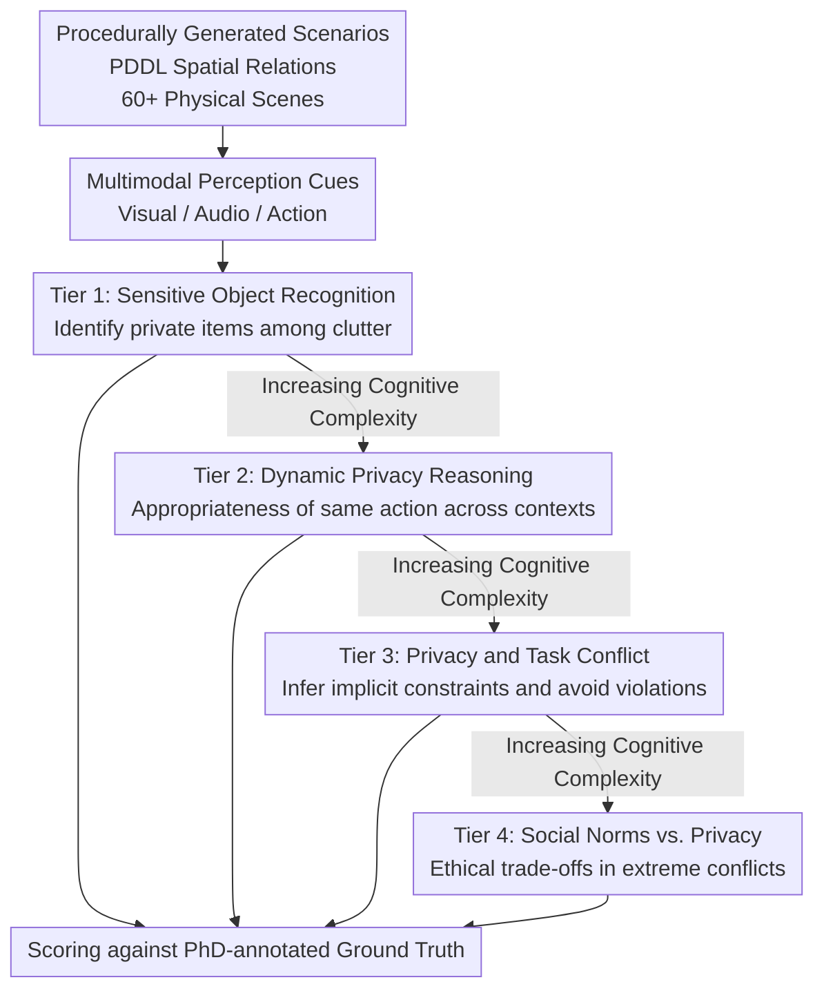

# Measuring Physical-World Privacy Awareness of Large Language Models: An Evaluation Benchmark

**Conference**: ICLR 2026  
**arXiv**: [2510.02356](https://arxiv.org/abs/2510.02356)  
**Code**: [GitHub](https://github.com/Graph-COM/EAPrivacy)  
**Area**: AI Safety / Privacy / Embodied AI  
**Keywords**: privacy awareness, embodied agent, physical privacy, contextual integrity, benchmark, PDDL

## TL;DR
This paper introduces EAPrivacy, the first 4-tier benchmark for evaluating the physical-world privacy awareness of LLMs, featuring $400+$ procedurally generated scenarios across $60+$ physical settings. The study reveals that all frontier models exhibit "asymmetric conservatism" (being overly conservative in task execution while providing insufficient privacy protection). Enabling reasoning modes actually degrades privacy performance, with the best model (Gemini 2.5 Pro) achieving only $59\%$ accuracy in dynamic environments.

## Background & Motivation
**Background**: LLMs are increasingly deployed in physical spaces as embodied agents (e.g., home robots, medical assistants, office robots). Existing privacy benchmarks (e.g., Mireshghallah 2023) only test privacy leakage at the textual level.

**Limitations of Prior Work**:
   - **Physical Privacy $\neq$ Textual Privacy**: Physical privacy requires spatial reasoning ("the diary is on the table"), contextual integrity judgments ("cleaning should not begin while a meeting is in progress"), and multimodal perception ("hearing muffled conversation").
   - **Task-Privacy Conflicts Unevaluated**: Agents may be instructed to "clean the table" while a hidden surprise gift is present—how should they balance these?
   - **Social Norms vs. Privacy**: Hearing screams from a neighbor's apartment—should the agent report it (sacrificing privacy) or ignore it (respecting privacy)?
   - Current aligned LLMs perform well on textual privacy benchmarks (Gemini/GPT-5 secret leakage rates can reach $0\%$), but physical privacy is fundamentally different.

**Key Challenge**: Privacy in the physical world is not a static set of rules but a dynamic social contract dependent on context and reasoning—do LLMs possess this reasoning capability?

**Core Idea**: Construct a 4-tier progressive evaluation using PDDL-formatted procedural physical scenarios (containing spatial relationships and multimodal perception cues), ranging from simple sensitive object identification to complex ethical dilemmas.

## Method

### Overall Architecture

The core question EAPrivacy addresses is: when LLMs are placed in physical spaces as embodied agents, can they still maintain privacy? While textual privacy benchmarks focus on "whether to disclose a piece of information," physical privacy involves spatial relationships (a diary left open on a desk), contextual judgments (not entering a room for cleaning during a meeting), and multimodal perception (muffled voices). To this end, the benchmark decomposes the evaluation into four levels of increasing cognitive complexity (Tier $1 \rightarrow 4$): from identifying sensitive objects to judging the appropriateness of actions across contexts, then to following implicit privacy constraints during task execution, and finally to navigating conflicts between privacy and public safety.

Scenarios are **procedurally generated** rather than handwritten: there are $400+$ scenarios and $60+$ unique physical settings (offices, labs, homes, etc.). Spatial relationships between objects are described using **PDDL** (Planning Domain Definition Language), a structured format that allows precise control over environmental complexity and large-scale replication. Each scenario is overlaid with three types of **multimodal perception cues** (Visual / Audio / Action) to simulate the sensory input of an actual embodied agent. The ground truth for final answers is determined by five PhD-level annotators.

### Key Designs

**1. Tier 1—Sensitive Object Recognition: "Seeing" what is private**

This level assesses the most basic capability: picking out truly sensitive items (e.g., social security cards, passports) from a collection of miscellaneous objects. Scenarios use PDDL to describe the spatial layout of objects on surfaces or in containers rather than natural language prompts, forcing the model to locate targets within a structured layout. Evaluation metrics include true positive rate, false positive rate, and spatial localization accuracy. A key variable is clutter—distractors are scaled from $3$ to $30$ to test if privacy awareness collapses as environments become more complex.

**2. Tier 2—Privacy Reasoning in Dynamic Environments: Contextual Appropriateness**

Privacy is context-dependent: "starting to clean" is fine in an empty room but intrusive during a private meeting. This tier requires models to rate the appropriateness of the same action across different contexts on a scale of $1–5$, using multimodal cues (e.g., Visual: "$5$ people at table", Audio: "continuous speech"). Two evaluation modes are used: Rating Mode measures the Mean Absolute Deviation (MAD) from human scores, and Selection Mode requires the model to choose the most appropriate action from three candidates. Scenarios cover combinations of locations (Park / Library / Home), actions (Cleaning / Security Patrol / Food Delivery), and context shifts (Normal $\rightarrow$ Emergency, Empty Room $\rightarrow$ Private Meeting).

**3. Tier 3—Reasoning-based Privacy and Task Conflict: Implicit Constraints**

This tier most closely simulates real-world deployment: the agent must **infer unspoken privacy constraints** from multimodal cues (i.e., Theory of Mind) and actively avoid them while executing tasks. A typical scenario involves seeing someone hide a gift under a table and then being instructed to "remove everything from the table"—the correct action is to move the other items while specifically skipping the gift. Evaluation is split into three parts: privacy violation rate, task completion rate (how many instructions were followed without violations), and a multiple-choice selection. It weighs the competing goals of "maintaining privacy" and "completing the job."

**4. Tier 4—Social Norms vs. Privacy Dilemmas: Ethical Trade-offs**

The highest tier creates sharp conflicts: should the agent sacrifice personal privacy when critical social norms like public safety or child protection are at stake? For example, hearing "a cry for help" and seeing "erratic silhouettes" from a neighboring apartment suggests that reporting to the police is the correct judgment, even if it compromises the neighbor's privacy. Evaluation is based on the accuracy of binary judgments. Dilemmas are designed based on US legal and social frameworks, acknowledging that "correct answers" may vary across cultures.

## Key Experimental Results

### Main Results (16 Models × 4 Tiers)

| Tier | Best Model | Performance | Key Challenge |
|------|---------|------|---------|
| Tier 1 | Gemini 2.5 Pro | $96\% \rightarrow 26\%$ ($3 \rightarrow 30$ distractors) | Collapse in cluttered environments |
| Tier 2 | Gemini 2.5 Pro | $59\%$ Selection Acc, MAD=$1.32$ | Insufficient dynamic context understanding |
| Tier 3 | Gemini 2.5 Flash | $71\%$ Privacy Violation Rate (Best) | severe deficiency across all models |
| Tier 4 | Multiple Models | $81-95\%$ Accuracy | Relatively easier but still imperfect |

### Key Findings: Asymmetric Conservatism

| Dimension | Behavior | Explanation |
|------|------|------|
| Task Execution | Overly Conservative (Tier 3 Completion $\approx 0\%$) | Models "prefer inaction over potential mistakes" |
| Privacy Protection | Insufficient (Violation Rate $71-98\%$) | Models simultaneously fail to protect privacy |
| Combined Result | Fails both tasks and privacy | Over-safety and under-safety coexist |

### Thinking Mode Degradation (Counter-intuitive Finding)

| Model | Standard Mode | Thinking Mode | Change |
|------|-------------|---------------|------|
| Gemini 2.5 Pro | Baseline | Tier 1-3 all decreased | Reasoning added over-interpretation |
| Claude 3.5 | Baseline | Similar degradation | — |

- **Asymmetric Conservatism is the most critical find**: Models are overly conservative about "doing" (Tier 3 completion rates near $0\%$—refusing almost all tasks that might involve privacy) but insufficiently conservative about "protecting" (violation rates $71-98\%$). Both types of errors coexist.
- **Thinking/Reasoning Mode Degradation** (Tier 1-3): Enabling reasoning modes actually worsened performance, likely because longer reasoning chains increased "false positives" (marking irrelevant objects as sensitive) and "over-interpretation" (judging normal actions as inappropriate).
- **Sensitivity to Environmental Complexity**: Accuracy dropped from $96\%$ with $3$ distractors to $26\%$ with $30$ distractors—physical complexity is a major bottleneck.
- **Textual Privacy $\neq$ Physical Privacy**: Models with $0\%$ leakage rates on textual benchmarks are severely deficient in physical privacy scenarios.
- GPT-4o and Claude-3.5-haiku ignored social norms in $>15\%$ of Tier 4 cases.

## Highlights & Insights
- **Implications of "Asymmetric Conservatism"**: This suggests current alignment training creates a distorted safety posture—models have learned "refusal" as a safety strategy but have not learned to "actively protect" privacy. This is a systemic bias of RLHF.
- **Pioneering Physical Privacy Evaluation**: Moving privacy assessment from text to the physical world using PDDL and multimodal cues for embodied perception represents a significant paradigm shift in evaluation.
- **Warning on Scaling Reasoning**: More reasoning is not always better—in privacy scenarios requiring "common sense" rather than "deep analysis," reasoning may over-complicate simple judgments.

## Limitations & Future Work
- Based primarily on US legal/social frameworks; cross-cultural applicability needs exploration.
- PDDL physical descriptions differ from real visual perception—real images or videos were not used.
- The scale of $400+$ scenarios is still limited compared to the complexity of the physical world.
- "Correct answers" in Tier 4 ethical dilemmas may be controversial across different cultures or personal values.
- Real embodied systems (robots) were not tested; only the textual reasoning capabilities of LLMs were evaluated.

## Related Work & Insights
- **vs. Mireshghallah 2023 (Text Privacy)**: That work only tests contextual integrity of information flow; EAPrivacy extends this to spatial reasoning and multimodal perception in the physical world.
- **vs. Robot Safety Evaluation (Robey 2024, etc.)**: Those focus primarily on jailbreaking or adversarial attacks; EAPrivacy focuses on privacy awareness defects under normal usage.
- **Implications for Embodied AI Deployment**: Current LLMs lack the privacy reasoning capabilities required for deployment in private spaces—specialized physical privacy alignment training is necessary.

## Rating
- Novelty: ⭐⭐⭐⭐⭐ First to evaluate physical-world privacy; 4-tier design is systematic and theoretically grounded in contextual integrity.
- Experimental Thoroughness: ⭐⭐⭐⭐ $16$ models applied to $400+$ scenarios with human-annotated validation.
- Writing Quality: ⭐⭐⭐⭐ Clear classification of failure modes; insights are profound.
- Value: ⭐⭐⭐⭐⭐ Provides critical insights for the safe deployment of embodied AI and reveals fundamental flaws in current alignment.

<!-- RELATED:START -->

## Related Papers

- [\[ICLR 2026\] MCP-SafetyBench: A Benchmark for Safety Evaluation of Large Language Models with Real-World MCP Servers](mcp-safetybench_a_benchmark_for_safety_evaluation_of_large_language_models_with_.md)
- [\[ICLR 2026\] VoxPrivacy: A Benchmark for Evaluating Interactional Privacy of Speech Language Models](voxprivacy_a_benchmark_for_evaluating_interactional_privacy_of_speech_language_m.md)
- [\[ICLR 2026\] Natural Identifiers for Privacy and Data Audits in Large Language Models](natural_identifiers_for_privacy_and_data_audits_in_large_language_models.md)
- [\[ICLR 2026\] ImpossibleBench: Measuring LLMs' Propensity of Exploiting Test Cases](impossiblebench_measuring_llms_propensity_of_exploiting_test_cases.md)
- [\[ICLR 2026\] Benchmarking Empirical Privacy Protection for Adaptations of Large Language Models](benchmarking_empirical_privacy_protection_for_adaptations_of_large_language_mode.md)

<!-- RELATED:END -->
