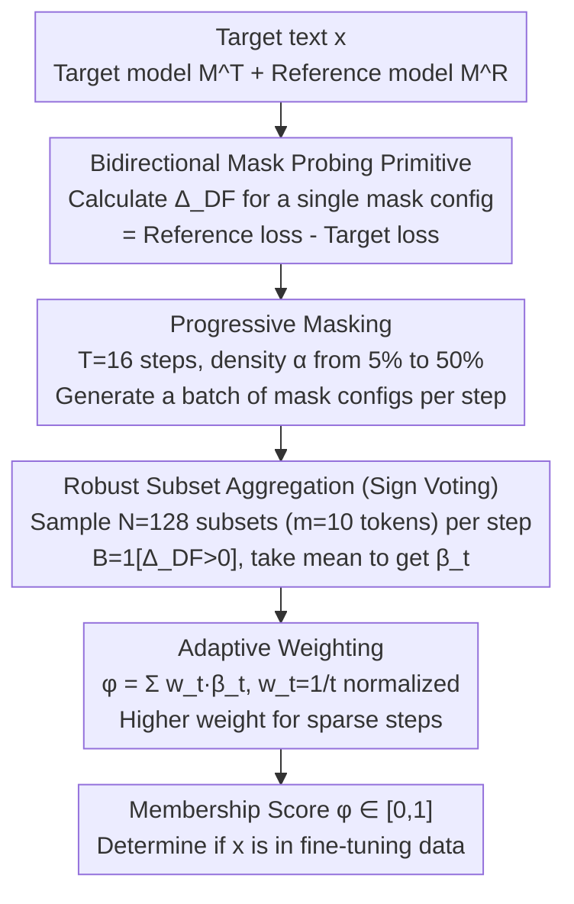

# Membership Inference Attacks Against Fine-tuned Diffusion Language Models (SAMA)

**Conference**: ICLR 2026  
**arXiv**: [2601.20125](https://arxiv.org/abs/2601.20125)  
**Code**: [https://github.com/Stry233/SAMA](https://github.com/Stry233/SAMA)  
**Area**: AI Security / Privacy Attacks  
**Keywords**: Membership Inference Attack, Diffusion Language Models, Privacy Leakage, Robust Subset Aggregation, Progressive Masking

## TL;DR
The first systematic study on membership inference attack (MIA) vulnerabilities in Diffusion Language Models (DLM). Proposes the SAMA method: leveraging DLM’s bidirectional mask structure to create exponential probing opportunities, while processing sparse and heavy-tailed membership signals through progressive masking + sign voting + adaptive weighting. Achieves an AUC of 0.81 across 9 datasets, outperforming the best baseline by 30%.

## Background & Motivation

**Background**: Diffusion Language Models (DLMs, such as LLaDA/Dream) are emerging alternatives to autoregressive models, employing bidirectional mask token prediction. Existing Membership Inference Attack (MIA) methods are designed for autoregressive models, leaving the privacy risks of DLMs entirely unknown.

**Limitations of Prior Work**:
   - Autoregressive MIA methods (Loss/Min-K%/ReCall, etc.) perform near randomly (AUC ≈ 0.5) when directly applied to DLMs.
   - MIA methods for image diffusion models (SecMI/PIA) are also inapplicable (AUC ≤ 0.52).
   - Membership signals in DLMs are configuration-dependent—signals fluctuate drastically under different mask configurations, and within-sample variance ($\sigma \approx 0.10$) is larger than the member/non-member margin ($\delta \approx 0.06$).
   - Domain adaptation effects lead to heavy-tailed noise, causing mean-based aggregation to collapse in the face of extreme values.

**Key Challenge**: The bidirectional structure of DLMs provides exponential probing opportunities, but signals are extremely sparse and accompanied by heavy-tailed noise.

**Key Insight**: Progressive multi-density mask probing + sign voting to remove heavy-tailed noise + adaptive weighting = Robust MIA.

## Method

### Overall Architecture
SAMA (Subset-Aggregated Membership Attack) is a pure inference-time attack: given a fine-tuned Diffusion Language Model (DLM) $\mathcal{M}^T$ and a pre-trained reference model $\mathcal{M}^R$, it determines whether the target text $\mathbf{x}$ appeared in the fine-tuning data. Its starting point is the fundamental difference between DLMs and Autoregressive Models (ARMs)—ARMs have only one fixed left-to-right prediction, allowing only one probe point for a text; in contrast, DLMs can mask any combination of positions, where each mask configuration acts as an independent probe, leading to an attack surface that expands exponentially with text length. SAMA fully exploits this probing surface: first, it defines a basic probing primitive as "the difference in fill-in-the-blank loss between the reference and target models for a single mask configuration"; then, it spreads probe points across multiple densities using progressive masking; within each density, it samples many local subsets and uses sign voting to compress sparse, noisy signals into reliable binary judgments; finally, it applies adaptive weighting across densities to obtain a membership score $\phi \in [0,1]$.

### Key Designs

**1. Bidirectional Mask Probing Primitive: Turning each mask configuration into an independent attack**

ARMs have only one fixed prediction mode, providing a single attack point per text. DLM’s bidirectional masking explodes this into an exponential probing surface—each mask configuration $\mathcal{S}$ can compare the fill-in-the-blank loss difference between the reference and target models:

$$\Delta_{DF}(\mathbf{x};\mathcal{S}) = \ell_{DF}(\mathbf{x};\mathcal{S},\mathcal{M}^R) - \ell_{DF}(\mathbf{x};\mathcal{S},\mathcal{M}^T)$$

Subtracting the reference model loss is a critical calibration step: it isolates specific signals "memorized only during fine-tuning" from the general difficulty of the language itself—this item alone brings a 0.09–0.19 AUC gain in ablations. Because mask positions can be combined arbitrarily, the available probe points grow exponentially with text length; bidirectional context also allows simultaneously masking $x_i$ and $x_j$ to probe memorization of token co-occurrences. The following three designs are built on repeated sampling of this $\Delta_{DF}$.

**2. Progressive Masking: Spreading probe points across multiple densities to balance signal strength and aggregation count**

Relying on a single mask density is risky: membership signals fluctuate wildly across configurations, and within-sample variance ($\sigma \approx 0.10$) can exceed the member/non-member margin ($\delta \approx 0.06$). Fixing a single density makes it easy to encounter "null configurations" where signals are drowned by noise. SAMA linearly increases density over steps to collect evidence across multiple scales:

$$\alpha_t = \alpha_{\min} + \frac{t-1}{T-1}(\alpha_{\max} - \alpha_{\min})$$

Both ends involve trade-offs—sparse masks preserve more context and offer stronger single-point signals but provide fewer sampling points for aggregation; dense masks provide more aggregation points but weaker per-point signals and higher susceptibility to fine-tuning domain adaptation noise. Combining multi-density results captures the benefits of both "clean signals" and "sufficient aggregation." By default, $T=16$ steps are used, with $\alpha$ sweeping from 5% to 50%, contributing about 2–3% to the AUC.

**3. Robust Subset Aggregation (Sign Voting): Compressing sparse, heavy-tailed signals into reliable votes**

This is the most critical contribution of the paper, targeting the issue that "fine-tuning domain adaptation brings heavy-tailed noise, causing mean aggregation to be dominated by extreme values" (where outlier tokens with magnitudes far exceeding real signals appear in noise, usually representing domain terms rather than memorization traces). The method samples $N=128$ local subsets (each $m=10$ tokens) within the current density's mask positions, calculates the subset loss difference $\Delta^n$ for each, and binarizes it into a vote $B^n = \mathbf{1}[\Delta^n > 0]$. Averaging $N$ votes within a step yields $\hat{\beta}_t$. Using signs instead of values is justified by the Hodges-Lehmann theorem, which provides a distribution-free guarantee: for non-member samples, target and reference models behave similarly, making $\Delta^n$ pure zero-mean noise, such that the probability of $B^n=1$ is exactly 0.5—regardless of whether the underlying noise variance is finite or heavy-tailed. Conversely, true member signals consistently push the votes toward 1. This is why the method remains robust under heavy-tailed noise, independently contributing 20–30% to the AUC.

**4. Adaptive Weighting: Biasing toward sparse steps with cleaner signals**

The quality of votes across density steps is not equal—sparse steps have more complete context and higher signal-to-noise ratios, while denser steps become "dirtier." Therefore, the final score aggregates the votes from each step using inverse-step weighting:

$$\phi(\mathbf{x}) = \sum_t w_t \hat{\beta}_t,\qquad w_t = \frac{1/t}{\sum_{i=1}^{T} 1/i}$$

The weights $w_t$ decrease with step $t$ (a normalized form inspired by harmonic means in robust statistics). Early sparse steps receive the maximum weight, while cumulative evidence from dense steps is still incorporated. This item provides final refinement, adding approximately 3–5% to the AUC.

### Implementation & Hyperparameters
- Zero training required—a pure inference-time gray-box attack that only queries target/reference model fill-in-the-blank losses.
- Default: $T=16$ steps, $\alpha$ from 5% to 50%, $N=128$ subsets per step, subset size $m=10$ tokens; scores are averaged over 4 Monte Carlo samples.
- Query budget aligned with baselines (16 model queries per sample); subset sampling is performed offline on cached loss vectors, adding negligible query overhead.

## Key Experimental Results

### Main Results: MIMIR Benchmark (9 Datasets)

| Dataset | SAMA AUC | Best Baseline AUC | TPR@1%FPR(SAMA) | TPR@1%FPR(Baseline) |
|--------|----------|-----------------|-----------------|-------------------|
| ArXiv | **0.850** | 0.597 | **0.178** | 0.023 |
| GitHub | **0.876** | 0.743 | **0.259** | 0.154 |
| HackerNews | **0.657** | 0.575 | **0.027** | 0.013 |
| PubMed | **0.814** | 0.555 | — | — |
| Wikipedia | **0.790** | 0.653 | — | — |
| Average | **~0.81** | ~0.62 | — | — |

### Ablation Study: Component Contributions

| Component | AUC Gain | Description |
|------|---------|------|
| Baseline(Loss) | ~0.50 | Random |
| +Reference Model Calibration | +0.09~0.19 | Isolation of fine-tuning specific memory |
| +Progressive Masking | +2~3% | Multi-scale signals |
| **+Robust Subset Aggregation** | **+20~30%** | **Key: Sign voting handles heavy-tailed noise** |
| +Adaptive Weighting | +3~5% | Final refinement |

### Key Findings
- **Existing ARM MIA methods fail completely on DLMs**: AUC ≈ 0.50, confirming that DLMs require specialized attack methods.
- **Sign voting is the core**: Contributes 20-30% AUC improvement because the Hodges-Lehmann theorem guarantees robustness against heavy-tailed noise.
- **Advantage is more pronounced at low FPR**: TPR@0.1%FPR improves by up to 14x, which is highly significant for actual deployment scenarios.
- **Effective on both LLaDA-8B and Dream-7B**: Demonstrates cross-architecture generalization.

## Highlights & Insights
- **First study on DLM privacy attacks**: Fills a significant gap—as DLMs (LLaDA/Dream) become increasingly popular, their privacy risks require systematic evaluation.
- **Elegant solution for heavy-tailed noise via sign voting**: Converts continuous noisy signals into binary votes, leveraging the distribution-free robustness of sign statistics. This technique is transferable to any heavy-tailed noise scenario.
- **DLM’s bidirectional structure is a double-edged sword**: It offers stronger language modeling capabilities but also creates an exponential attack surface—each mask configuration serves as an independent privacy probing channel.

## Limitations & Future Work
- **Gray-box assumption**: Requires querying target and reference model logits, which is not applicable in black-box scenarios.
- **Query overhead**: 16 queries per sample can be costly for large-scale auditing.
- **Fine-tuning focus only**: Membership inference during the pre-training phase remains unexplored.
- **Defense direction**: One could design "mask configuration randomization" defenses—deliberately injecting configuration noise across different queries.

## Related Work & Insights
- **vs Min-K%/ReCall (ARM MIA)**: These methods rely on a fixed left-to-right prediction pattern, which DLM's bidirectional structure renders ineffective.
- **vs SecMI (Image Diffusion MIA)**: Continuous denoising in image diffusion is fundamentally different from the discrete masking mechanism in text diffusion.
- **vs Purifying LLMs (Same Conference)**: While that paper found that backdoors are redundantly encoded in MLPs, SAMA finds that privacy signals are sparsely distributed across mask configurations—both reveal parameter-level features across different security dimensions.

## Rating
- Novelty: ⭐⭐⭐⭐⭐ First DLM MIA study + innovative combination of sign voting for heavy-tailed noise.
- Experimental Thoroughness: ⭐⭐⭐⭐⭐ 9 datasets × 2 models × 10+ baselines × detailed ablations.
- Writing Quality: ⭐⭐⭐⭐⭐ Extremely clear logical chain from motivation to method to experiments.
- Value: ⭐⭐⭐⭐⭐ Directly instructive for DLM privacy risk assessment and defense design.

<!-- RELATED:START -->

## Related Papers

- [\[ICLR 2026\] Watermarking Diffusion Language Models](watermarking_diffusion_language_models.md)
- [\[ACL 2026\] Membership Inference Attacks on In-Context Learning Recommendation](../../ACL2026/llm_safety/membership_inference_attacks_on_llm-based_recommender_systems.md)
- [\[ICLR 2026\] Information-Theoretic Membership Inference for Granular Quantification of Memorization](information-theoretic_membership_inference_for_granular_quantification_of_memori.md)
- [\[ICLR 2026\] wd1: Weighted Policy Optimization for Reasoning in Diffusion Language Models](wd1_weighted_policy_optimization_for_reasoning_in_diffusion_language_models.md)
- [\[NeurIPS 2025\] Exploring the Limits of Strong Membership Inference Attacks on Large Language Models](../../NeurIPS2025/llm_safety/exploring_the_limits_of_strong_membership_inference_attacks_on_large_language_mo.md)

<!-- RELATED:END -->
