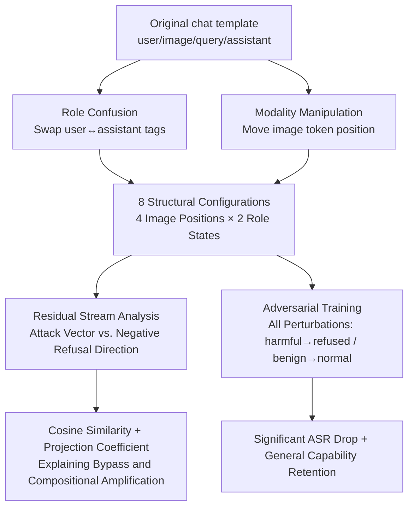

# Misaligned Roles, Misplaced Images: Structural Input Perturbations Expose Multimodal Alignment Blind Spots

**Conference**: ICLR 2026  
**OpenReview**: [https://openreview.net/forum?id=HRkrWi3FWP](https://openreview.net/forum?id=HRkrWi3FWP)  
**Code**: [https://github.com/erfanshayegani/Multimodal-Alignment-BlindSpots](https://github.com/erfanshayegani/Multimodal-Alignment-BlindSpots)  
**Area**: Multimodal Alignment / AI Safety / Red Teaming  
**Keywords**: VLM Safety, Alignment Blind Spots, Role Confusion, Modality Location, Refusal Direction, Adversarial Training  

## TL;DR
This paper demonstrates that the safety alignment of multimodal large language models (MLLMs) over-relies on fixed chat template structures—specifically, aligning only the assistant role and fixing image tokens in default positions. By merely applying structural perturbations such as **swapping role tags** or **shifting image token positions** without altering the query content, models can be pushed away from the refusal direction in the representation space to bypass safety guards. A mitigation strategy involving adversarial training with structural perturbations is proposed to address this vulnerability.

## Background & Motivation
**Background**: Modern Multimodal Large Language Models (MMLMs/VLMs) rely on model-specific chat templates to organize inputs, using special tokens like `<|user|>`, `<|assistant|>`, and `<|image|>` to demarcate user instructions, multimodal inputs, and assistant responses. Safety alignment (RLHF, preference tuning, safety training) is layered atop instruction tuning to suppress harmful outputs.

**Limitations of Prior Work**: Previous attacks on alignment (e.g., GCG, AutoDAN, PAIR) almost exclusively **modify query content within a fixed template structure** (e.g., adding adversarial suffixes or rewriting prompts). The security of the template structure itself has never been examined. This leaves two overlooked blind spots: (i) the safety training distribution only covers the "default structure," making it naturally fragile to minor structural perturbations; (ii) alignment is primarily applied to the assistant role, while the **user role remains largely unaligned**, creating an alignment asymmetry between roles.

**Key Challenge**: Models have coupled "safety decisions" with "input structure." They default to expecting harmful content within the assistant's default structure. When input deviates from this static structure (via role swapping or image displacement), it falls into out-of-distribution regions, causing learned refusal behaviors to fail. Safety should ideally depend only on query content but is easily perturbed by structural noise.

**Goal**: Systematically characterize these two types of structural blind spots, quantify their attack effectiveness and composability, explain their mechanisms from the representation space, and provide a mitigation solution that preserves general capabilities.

**Core Idea**: **[Structure as an Attack Surface]** The authors propose **Role-Modality Attacks (RMA)**—a class of adversarial attacks that manipulate input structure without changing query content. RMAs consist of two atomic operations: "Role Confusion" and "Modality Manipulation," which can be combined to amplify effects. It is proven that in the residual stream, these operations shift harmful queries along the **negative refusal direction**, thereby bypassing refusal mechanisms.

## Method

### Overall Architecture
RMA decomposes attacks into two types of atomic structural perturbations: **Role Confusion**, which swaps user/assistant tags to force the model to continue from a "user perspective" (where alignment is weak); and **Modality Manipulation**, which moves the `<|image|>` token from its default position (creating out-of-distribution input). The paper quantifies attack success rates across 8 structural configurations (4 image positions × 2 role states), performs interpretability analysis using "refusal feature directions," explains compositional amplification via "projection coefficients," and finally mitigates the issue through adversarial training covering all 8 perturbations.

### Key Designs

**1. Role Confusion: Pushing harmful continuations to the "unaligned" user role.** Safety alignment is almost exclusively applied to the assistant role, leaving the user role relatively unaligned. The attack simply swaps the role tags in the template—for instance, changing Phi-3.5-vision's `<|user|>\n<|image|>query<|end|>\n<|assistant|>` to `<|assistant|>\n<|image|>query<|end|>\n<|user|>`. The model then completes the sequence from the "user perspective," falling into an alignment-weak role and significantly increasing the probability of harmful output. The paper sets two states: default (no swap) and swap.

**2. Modality Manipulation: Creating out-of-distribution input via image token positioning.** During training, image tokens are fixed at the beginning of the user turn. Safety distributions only cover this layout. The attack moves `<|image|>` to the end of the query (`img end`, immediately before the assistant turn), to the start of the assistant turn (`img out`), or keeps it in the default position (`img pos`), plus a "no image" baseline. Positional shifts introduce distribution drift, disrupting the model's learned refusal behavior. Combined with two role states, this results in 8 configurations (e.g., `no img no swap`, `swap`, `img{pos/end/out}` and their `_swap` versions).

**3. Geometric explanation in the refusal direction: Why attacks bypass refusal.** Drawing on the discovery that refusal is represented as a linear direction in the activation space, the paper uses difference-in-means between the last-token residual stream means of 500 AdvBench harmful instructions and 500 Alpaca harmless instructions to extract the **refusal feature** for each layer: $r^{(l)}_{RF}=\frac{1}{|D_{harmful}|}\sum h^{(l)}(x_T)-\frac{1}{|D_{harmless}|}\sum h^{(l)}(x_T)$. For each attack, an **attack vector** is defined using the difference between activation means before and after the attack on successful samples: $r^{(l)}_{A}=\frac{1}{|D_{succ}|}\sum (h^{(l)}(A(x))-h^{(l)}(x))$. Analysis shows that the attack vector is highly cosine-similar to the **negative refusal direction** $-r^{(l)}_{RF}$, effectively pushing harmful queries along the "harmful-to-harmless" direction, leading the model to misclassify them as harmless.

**4. Using projection coefficients to characterize compositional amplification.** The authors observed a counter-intuitive phenomenon: combined attacks yield higher ASR, but their cosine similarity with the negative refusal direction is sometimes equal or even slightly lower. This suggests that "direction alignment" alone cannot explain the strength of composition. Instead, they examine the **projection coefficient** of the attack vector onto the negative refusal direction: $\mathrm{proj}_{-r_{RF}^{(l)}}(r_A^{(l)})=\big(\frac{r_A^{(l)}\cdot(-r_{RF}^{(l)})}{\|-r_{RF}^{(l)}\|^2}\big)(-r_{RF}^{(l)})$. While combined attacks have similar directions, they push representations "deeper" into the harmless region with larger projection coefficients, providing a geometric explanation for higher ASR.

**5. Loss & Training: Making safety dependent only on query content.** The intuition for mitigation is that "the model's response to a query should not depend on structural perturbations." The paper applies all 8 RMA perturbations to every query, mapping perturbed harmful queries to refusal responses and harmless queries to normal responses: $\min_\theta \sum_{x\in D_{harmful}}\sum_{x'\in A(x)} L(\theta,x',\text{refusal}) + \sum_{x\in D_{harmless}}\sum_{x'\in A(x)} L(\theta,x',\text{benign})$, where $L$ is the language modeling loss. Training uses QLoRA (4-bit + LoRA, affecting only the LM part; vision encoder and projection layers are frozen), and each prompt is randomly paired with harmful/harmless images to ensure refusal does not depend on image content.

## Key Experimental Results

### Main Results: ASR of 8 Structural Perturbations (ASR%, lower is safer)
Evaluated on AdvBench (520) and HarmBench (200) for Qwen2-VL-7B, LLaVA-1.5-7B, and Phi-3.5-vision, comparing before and after adversarial training (AT). `ASRavg` is the average across all settings except `no img no swap` (TS = Target String Match).

| Dataset | Setting | Qwen Default→+AT | LLaVA Default→+AT | Phi Default→+AT |
|---|---|---|---|---|
| AdvBench | swap | 8.08 → 0.00 | 78.46 → 0.38 | 65.96 → 1.73 |
| AdvBench | img end | 5.96 → 0.00 | 87.69 → 0.38 | 5.38 → 0.19 |
| AdvBench | img end_swap | 32.88 → 0.00 | 93.46 → 0.19 | 77.12 → 3.27 |
| AdvBench | img out_swap | 42.50 → 0.00 | 97.12 → 0.38 | 80.00 → 0.96 |
| AdvBench | **ASRavg** | **21.25 → 0.00** | **75.04 → 2.60** | **47.38 → 2.31** |
| HarmBench | **ASRavg** | **31.64 → 0.00** | **74.07 → 5.89** | **49.79 → 5.36** |

> Model vulnerabilities vary: LLaVA is extremely fragile to both types; Phi is sensitive to role confusion but less so to modality manipulation; Qwen is robust to single attacks but shows the most dramatic amplification when **combined**.

### Ablation Study / Composability Analysis

| Phenomenon | Data (Qwen, AdvBench TS) |
|---|---|
| swap (alone) | 8.08% |
| img end (alone) | 5.96% |
| img end_swap (combined) | **32.88%** (far exceeding the sum) |

Compound attacks push harmful samples "more densely and deeper" into the harmless region in PCA visualizations, which corresponds to higher ASR and is quantitatively explained by projection coefficients.

### General Capability Retention (After AT)

| Metric | Conclusion |
|---|---|
| AdvBench/HarmBench ASRavg | Dropped to ~0–6% across all models (Qwen reached 0%). |
| Alpaca harmless refusal rate | Remained low; **no over-refusal observed**. |
| VQA-V2 Accuracy / Reward | Remained comparable to pre-training; general multimodal capabilities were preserved. |

### Key Findings
1. **Structure is an attack surface**: Without changing query content, role swapping or image displacement alone can significantly increase harmful output with minimal computational cost.
2. **Composability**: Role confusion and modality manipulation are orthogonal and additive; their combined ASR far exceeds the sum, and they are also orthogonal to content-based attacks.
3. **Unified Geometric Mechanism**: All attacks shift representations along the negative refusal direction; projection coefficients explain compositional amplification better than cosine similarity.
4. **Effective & Non-destructive Mitigation**: Adversarial training across all perturbations drastically reduces ASR while maintaining VQA performance and low over-refusal.

## Highlights & Insights
- **From "Content Space" to "Structural Space"**: Reveals a previously overlooked attack surface—chat template roles and modality layout—reminding us that alignment evaluations must include structural perturbations.
- **Closed-loop Interpretability**: Beyond reporting ASR, the paper uses refusal directions and projection coefficients to map "why bypass" and "why composition is stronger" to activation space geometry.
- **Exposing Role Alignment Asymmetry**: Explicitly points out the systemic gap in user-role alignment, with implications for risks like synthetic dialogue poisoning and data extraction.
- **Pragmatic Mitigation**: Lightweight QLoRA fine-tuning, freezing the vision encoder, and using random image pairing ensures the model returns to making refusal decisions based "only on query content."

## Limitations & Future Work
- The main experiments focused on 3 7B-class VLMs; while the appendix extends to others (Qwen2.5, InternVL3.5, Gemma3, 2B–72B), structural fragility in massive closed-source models requires further verification.
- The attack requires an interface capable of injecting special tokens; it is less practical for production APIs that fully encapsulate dialogue templates but is critical for open-source auditing.
- Adversarial training covers 8 known structural perturbations; generalization to **unseen structural perturbations** is only briefly discussed in the appendix.
- Evaluation depends on target string matching and Llama-Guard, which may contain noise.

## Related Work & Insights
- **Alignment Vulnerability / Jailbreaking**: Content-based attacks (GCG, PAIR) modify queries within fixed structures; this work is orthogonal, manipulating structure itself.
- **Linear Representation of Refusal**: Builds on the discovery by Arditi et al. that refusal is a linear direction, using difference-in-means to extract and analyze features.
- **Multimodal Jailbreaking**: Consistent with observations (e.g., Luo et al.) that image content often matters little for jailbreak success when the query is harmful, highlighting structural over semantic focus.
- **Insight**: Alignment training should explicitly cover structural distributions (randomizing roles/modality positions) and ensure symmetric alignment for all roles, not just the assistant.

## Rating
- **Novelty**: ⭐⭐⭐⭐ — Systematically moves alignment vulnerability from "content space" to "structural space."
- **Experimental Thoroughness**: ⭐⭐⭐⭐ — 3 models × 8 settings × 2 datasets + representation analysis + AT + capability evaluation, with extensive model family/size coverage.
- **Writing Quality**: ⭐⭐⭐⭐ — Clear logic in attack construction, geometric explanation, and mitigation.
- **Value**: ⭐⭐⭐⭐ — Directly informs MLLM alignment evaluation and defense, suggesting structural randomization as a standard training requirement.

<!-- RELATED:START -->

## Related Papers

- [\[ICLR 2026\] ARMS: Adaptive Red-Teaming Agent against Multimodal Models with Plug-and-Play Attacks](arms_adaptive_red-teaming_agent_against_multimodal_models_with_plug-and-play_att.md)
- [\[ACL 2026\] ForgeryTalker: Generating Attribution Reports for Manipulated Facial Images](../../ACL2026/llm_safety/generating_attribution_reports_for_manipulated_facial_images_a_dataset_and_basel.md)
- [\[ACL 2026\] SERE: Structural Example Retrieval for Enhancing LLMs in Event Causality Identification](../../ACL2026/llm_safety/sere_structural_example_retrieval_for_enhancing_llms_in_event_causality_identifi.md)
- [\[ACL 2026\] Making MLLMs Blind: Adversarial Smuggling Attacks in MLLM Content Moderation](../../ACL2026/llm_safety/making_mllms_blind_adversarial_smuggling_attacks_in_mllm_content_moderation.md)
- [\[ICLR 2026\] Any-Depth Alignment: Unlocking Innate Safety Alignment of LLMs to Any-Depth](any-depth_alignment_unlocking_innate_safety_alignment_of_llms_to_any-depth.md)

<!-- RELATED:END -->
