# MOAI: Module-Optimizing Architecture for Non-Interactive Secure Transformer Inference

**Conference**: ICLR 2026  
**OpenReview**: [https://openreview.net/forum?id=qJn4HtTzhH](https://openreview.net/forum?id=qJn4HtTzhH)  
**Code**: [https://github.com/dtc2025ag/MOAI](https://github.com/dtc2025ag/MOAI) (CPU) / [https://github.com/dtc2025ag/MOAI_GPU](https://github.com/dtc2025ag/MOAI_GPU) (GPU)  
**Area**: Privacy Computing / HE Inference / Secure Transformer Inference  
**Keywords**: Fully Homomorphic Encryption (FHE), CKKS, Non-interactive Secure Inference, Matrix Packing, rotation-free, BERT  

## TL;DR
MOAI utilizes a "column packing + diagonal packing inter-layer consistency" evaluation flow and rotation-free Softmax/LayerNorm algorithms to minimize expensive HE rotation operations in pure FHE non-interactive Transformer inference. In a BERT-base model, MOAI reduces the total matrix multiplication rotations to 9648 and eliminates Softmax/LayerNorm rotations entirely, achieving a 52.8% end-to-end speedup over the state-of-the-art THOR and an amortized 2.36 minutes per input on a single GPU.

## Background & Motivation
**Background**: Deploying LLMs to Cloud Service Providers (CSPs) introduces privacy risks. Fully Homomorphic Encryption (FHE) allows direct computation on ciphertexts without decryption, providing a natural "non-interactive" privacy-preserving solution—clients upload encrypted data, the server evaluates in the encrypted domain, and returns encrypted results, keeping the server oblivious to inputs and outputs. However, the computational overhead of FHE is extremely high, especially in BERT-based scenarios like document classification requiring batch processing.

**Limitations of Prior Work**: Existing pure FHE works have significant drawbacks. NEXUS (NDSS'25) proposed several FHE-friendly matrix multiplications and activation approximations but only reported microbenchmark data without an end-to-end solution. Crucially, its packing formats are inconsistent across layers, preventing direct concatenation without expensive format conversions. THOR (CCS'25) achieved end-to-end capability (128 tokens, 10 min/input on a single GPU), but its ciphertext-ciphertext matrix multiplications still require format conversions. Another approach (Powerformer, ACL'25) replaces Softmax/LayerNorm with FHE-friendly power/linear functions, but this requires knowledge distillation and retraining, limiting generalizability.

**Key Challenge**: HE rotation (rotation) is one of the slowest operations in FHE, becoming increasingly expensive as the ciphertext modulus grows. Existing solutions either rely on intensive rotations for intra-ciphertext summation or are forced into ciphertext format conversions/transpositions due to inconsistent packing—both consume significant computational power.

**Goal**: Design a **plug-and-play** pure FHE framework that does not modify Transformer components (eliminating the need for retraining/fine-tuning), supports end-to-end usability, and minimizes rotation and format conversion overheads.

**Core Idea**: **[Consistent Packing + Rotation-free Evaluation]** ensures that column packing and diagonal packing transition naturally throughout the evaluation flow, eliminating inter-layer format conversions. By leveraging the insight of "placing elements to be summed into the same slot positions across different ciphertexts," Softmax and LayerNorm are performed without any rotations.

## Method

### Overall Architecture
MOAI is based on the CKKS scheme and decomposes a full BERT layer (Attention + Feed-forward) into several encrypted matrix multiplication and non-linear evaluation modules. By carefully arranging the input/output packing formats of each module, Column packing (Col) and Diagonal packing (Diag) are passed seamlessly between modules without format conversions. Interleaved batching is applied to exploit CKKS SIMD slots for amortizing multiple inputs, and the singular bootstrapping operation is moved before the Softmax division to lower the level (modulus) of subsequent matrix multiplications.

```mermaid
graph LR
    X["Input X<br/>Col packing"] --> QKV["Q/K/V<br/>CPMM Col→Col"]
    QKV --> QK["QKᵀ<br/>CCMM Col→Diag"]
    QK --> SM["Softmax<br/>Diag→Diag (Rotation-free)"]
    SM --> SV["σ(QKᵀ)V<br/>CCMM Diag→Col"]
    SV --> SO["Self-Output<br/>CPMM Col→Col"]
    SO --> LN1["LayerNorm<br/>Col→Col (Rotation-free)"]
    LN1 --> FF["FC1/GELU/FC2<br/>Col→Col"]
    FF --> LN2["LayerNorm<br/>Col→Col"]
    LN2 --> NEXT["Next Layer (Col packing)"]
```

### Key Designs

**1. Inter-layer Consistent Packing Flow: Alignment over Conversion.** The core of MOAI is ensuring each module's output format is exactly the input format required by the next. Inputs and $Q, K, V$ use **column packing** (each column of $X \in \mathbb{R}^{m \times d}$ is encrypted as one ciphertext). When computing $QK^\top$, it utilizes the lemma $\text{Diag}_j(QK^\top) = \sum_{i=0}^{d'-1} q_i \otimes \text{Rot}_j(k_i)$, allowing the multiplication of two column-packed matrices **without transposing K**, directly yielding a **diagonal-packed** result. This matches the Softmax input format. Softmax outputs in diagonal packing, and the subsequent $\text{softmax}(QK^\top/\sqrt{d'})V$ combines the "diagonal-packed attention + column-packed V" to produce **column-packed** output. The feed-forward layer remains column-packed, feeding directly into the next layer.

**2. Rotation-free Softmax / LayerNorm: Summation via Slot Alignment.** HE rotations are expensive because conventional methods use $O(\log N)$ rotations to sum values within a single ciphertext. MOAI's key insight (Lemma 4.1) is: **the column sum of a square matrix equals its diagonal sum**, $\sum_i c_i^\top = \sum_i \text{Diag}_i(C)$. Softmax encrypts each diagonal of $QK^\top$ into separate ciphertexts, approximates exponents using the SIMD polynomial $(1+x/2^r)^{2^r}$, and **directly adds these ciphertexts** to get the denominator $\sum_i \exp(\text{Diag}_i)$. Summation occurs across "the same slots in different ciphertexts" using pure ciphertext addition without any rotations. Similarly for LayerNorm: mean and variance are calculated by adding column-packed ciphertexts followed by a scalar multiplication $1/d$. This reduces Softmax and LayerNorm rotations from 2448 in THOR to zero.

**3. Column-packed De-rotation + Interleaved Batching.** In Ciphertext-Plaintext Matrix Multiplication (CPMM), because weights are plaintext, $XW$ can be interpreted as a concatenation of linear combinations of columns of $X$, requiring no rotations under column packing. For Ciphertext-Ciphertext Matrix Multiplication (CCMM), **interleaved batching** is introduced: $N/(2m)$ vectors of length $m$ are "interleaved" into the $N/2$ slots of a ciphertext (storing the $0$-th element of each vector, then the $1$-st, etc.). By Lemma 3.2, $\text{Rot}_{jN/(2m)}(\tilde{x})$ achieves synchronized rotation of all sub-vectors. While traditional naive batching requires two HE rotations for one "internal rotation," MOAI requires only one. Consequently, BERT-base matrix multiplications require only 9648 rotations, which is $22.9\times$, $2.3\times$, and $1.7\times$ less than NEXUS, THOR, and Powerformer, respectively.

**4. Bootstrapping Position Optimization.** Precise Goldschmidt division in Softmax requires at least 10 iterations (approx. 20 circuit levels). Performing this directly would push the entire attention block to a high level, slowing down preceding matrix multiplications (high level ciphertexts have larger moduli and slower multiplications). MOAI places the single bootstrapping after the Softmax summation but before division, reducing Softmax depth from 20 to 10 levels. This allows previous matrix multiplications to execute at lower levels, significantly reducing overall runtime.

## Key Experimental Results
**Implementation**: CKKS with ring dimension $N=2^{16}$ ($2^{15}$ slots), 1743-bit modulus for 128-bit security. CPU: SEAL (Intel Xeon 8480+, 56 cores). GPU: Phantom library (H200 / A100). Model: BERT-base-uncased (12 layers, 12 heads, 128 tokens) fine-tuned on SST-2/QNLI/RTE.

### Main Results (End-to-end, Amortized for 256 inputs)

| Platform | Amortized Time per Input |
|------|------------------|
| CPU (56 cores) | 9.6 minutes |
| GPU (H200) | 2.36 minutes |

Layer-by-layer Comparison with SOTA (Single A100 GPU, seconds):

| Method | Total Time | MOAI Gain |
|------|--------|-----------|
| THOR (CCS'25) | 602.26 | — |
| **MOAI** | **283.95** | **−52.8%** |
| Powerformer (ACL'25) | (After MOAI applied FHE-friendly mods) | **−55.7%** |

HE Rotations for Matrix Multiplications (BERT-base full):

| Method | MM Rotations | Relative to MOAI |
|------|-------------|-----------|
| NEXUS | >221184 | 22.9× |
| THOR | 22224 | 2.3× |
| Powerformer | 16740 | 1.7× |
| **MOAI** | **9648** | 1× |

### Ablation Study (vs. THOR by module, A100, seconds)

| Module | MOAI | THOR | Saving |
|------|------|------|------|
| Attention layer | 16.54 | 49.77 | 33.23 |
| Softmax | 2.19 | 15.53 | 13.34 |
| Multi-head attention | 0.48 | 27.43 | 26.95 |
| GELU | 3.30 | 29.42 | 26.94 |
| FC2 | 2.88 | 49.19 | 46.31 |
| Bootstrappings | 227.84 | 337.86 | 110.02 |

### Key Findings
- Eliminating rotations in Softmax/LayerNorm is the primary speedup: Softmax achieves up to $22\times$ acceleration and LayerNorm up to $151\times$ in microbenchmarks.
- Bootstrapping remains the major overhead (approx. 80% on A100), but position optimization saves 110s compared to THOR.
- The method is extensible to decoder-only models; the paper validates the evaluation flow on LLaMA-3-8B.

## Highlights & Insights
- **The "Column Sum = Diagonal Sum" Lemma** serves as the fulcrum for the rotation-free design. It transforms intra-ciphertext summation (requiring rotations) into pure cross-ciphertext addition—a simple yet powerful shift.
- **Relay-based Packing Strategy**: Instead of optimizing individual format conversions, MOAI designs the entire pipeline such that each module's output format is naturally the next module's input format, eliminating the need for conversions at the root.
- **Plug-and-play**: By avoiding modifications to Softmax/LayerNorm or retraining, it is more practical and generalizable compared to approaches like Powerformer that require knowledge distillation.

## Limitations & Future Work
- Bootstrapping still accounts for ~80% of end-to-end time; MOAI optimizes its placement but does not reduce its unit cost.
- End-to-end experiments focus on BERT-base (128 tokens). LLaMA-3-8B results are provided in the appendix as an extensibility demo; full performance for long sequences and autoregressive scenarios remains to be evaluated.
- Dependence on polynomial approximations (23rd-order for GELU, $(1+x/2^r)^{2^r}$ for Softmax) requires careful balancing of accuracy and circuit depth for larger input ranges.
- The security model assumes a semi-honest CSP and non-interactive inference, excluding malicious servers or model weight privacy.

## Related Work & Insights
- **Interactive Methods** (Chen 2022, Pang 2024, Iron): High communication overhead due to MPC. MOAI uses pure FHE, eliminating communication rounds.
- **Pure FHE Non-interactive**: NEXUS (First, but microbenchmarks only) → THOR (First end-to-end SOTA) → MOAI (Consistent packing + rotation-free).
- **FHE-friendly Modifications**: PowerSoftmax/Powerformer use non-polynomial operator replacement requiring retraining. MOAI demonstrates its packing/algorithms can further accelerate Powerformer models by 55.7%, suggesting the approaches are complementary.
- **Inspiration for Future FHE Inference**: Minimizing rotations is more effective than optimizing individual rotations. The key to reducing rotations lies in data layout/packing rather than cryptographic primitives.

## Rating
- Novelty: ⭐⭐⭐⭐ The "column sum = diagonal sum" insight and inter-layer consistent packing are clever and provide a significant engineering breakthrough.
- Experimental Thoroughness: ⭐⭐⭐⭐ Includes end-to-end results, module breakdowns, rotation counts, comparisons with two SOTAs, and CPU/GPU platforms. Deducted slightly for focusing mainly on BERT-base length.
- Writing Quality: ⭐⭐⭐⭐ Clear contributions, rigorous lemmas, and comprehensive tables. High FHE entry barrier for non-cryptographic readers.
- Value: ⭐⭐⭐⭐ Reducing amortized latency to 2.36 min/input significantly advances FHE-as-a-Service and enhances engineering feasibility through its plug-and-play nature.

<!-- RELATED:START -->

## Related Papers

- [\[ICLR 2026\] Optimizing Agent Planning for Security and Autonomy](optimizing_agent_planning_for_security_and_autonomy.md)
- [\[ICLR 2026\] ARMOR: Aligning Secure and Safe Large Language Models via Meticulous Reasoning](armor_aligning_secure_and_safe_large_language_models_via_meticulous_reasoning.md)
- [\[AAAI 2026\] Ghost in the Transformer: Detecting Model Reuse with Invariant Spectral Signatures](../../AAAI2026/llm_safety/ghost_in_the_transformer_detecting_model_reuse_with_invariant_spectral_signature.md)
- [\[ICLR 2026\] Information-Theoretic Membership Inference for Granular Quantification of Memorization](information-theoretic_membership_inference_for_granular_quantification_of_memori.md)
- [\[ICLR 2026\] Inference-Time Personalized Safety Control via Paired Difference-in-Means Intervention](inference-time_personalized_safety_control_via_paired_difference-in-means_interv.md)

<!-- RELATED:END -->
