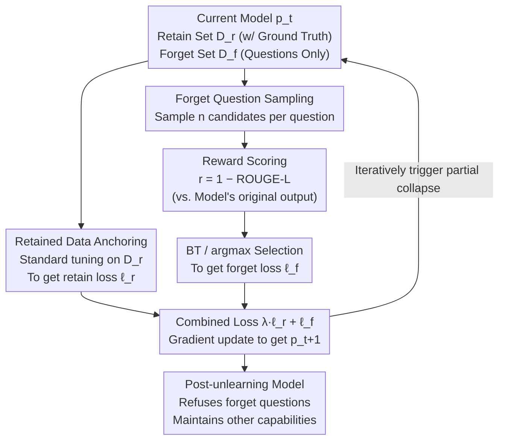

# Model Collapse Is Not a Bug but a Feature in Machine Unlearning for LLMs

**Conference**: ICLR 2026  
**arXiv**: [2507.04219](https://arxiv.org/abs/2507.04219)  
**Code**: [TUM DAML - Partial Model Collapse](https://www.cs.cit.tum.de/daml/partial-model-collapse/)  
**Area**: LLM Security  
**Keywords**: machine unlearning, model collapse, partial model collapse, LLM privacy, iterative relearning

## TL;DR

This work repositions "model collapse," typically viewed as a negative phenomenon, as a tool for machine unlearning. It proposes the PMC method, which achieves targeted information deletion through iterative fine-tuning on retained data and the model’s self-generated data without direct optimization on forget targets, proving its effectiveness both theoretically and experimentally.

## Background & Motivation

Privacy regulations (e.g., GDPR) require the ability to selectively delete the influence of specific data from machine learning models. For LLMs, full retraining is computationally infeasible, necessitating efficient **machine unlearning** techniques.

Existing LLM unlearning methods face a fundamental problem: they **counter-intuitively rely on the data to be deleted itself** for unlearning optimization. For instance, Gradient Ascent (GA) performs reverse training on forget targets, and NPO (Negative Preference Optimization) treats forget targets as negative samples. This approach has two serious issues:

**Violation of minimization principle**: Sensitive data is still used during the unlearning process, increasing the risk of data exposure.

**Unknown side effects**: Adversaries might infer forgotten information through probability probing (information leakage).

The core insight of this paper comes from the **model collapse** phenomenon—where generative models iteratively trained on their own generated data gradually collapse their output distribution, effectively losing information. If this collapse can be triggered **partially and controllably**, unlearning can be achieved without touching sensitive data.

## Method

### Overall Architecture

**Partial Model Collapse (PMC)** reverses the use of "model collapse": instead of using forget data for reverse optimization like GA/NPO, PMC allows the model to "self-forget" within an **iterative self-training loop**. In each round, standard fine-tuning is performed on retained questions with ground-truth answers to "anchor" the distribution. For forget questions, no ground truth is used; the model samples candidate responses, and a Bradley-Terry preference model selects the "most appropriate" one for fine-tuning. Through repeated iterations, original answers to forget questions are gradually and controllably diluted under the anchoring of retained data while maintaining other model capabilities—unlearning becomes a constrained collapse occurring only where intended.

### Key Designs

**1. Using retained data as an anchor to domesticate "total collapse" into "partial collapse"**

Pure iterative self-training (fine-tuning only on self-generated data) pulls the output distribution toward **total collapse**—an absorbing Markov chain driven by statistical approximation errors in MLE under finite samples, where all probability mass eventually collapses into a single category and all information is lost. This cannot be directly used for unlearning. The breakthrough of PMC (Lemma 1) is: combining self-generated data **with retained data $D_C$** during iterative fine-tuning. At this point, collapse is no longer uncontrolled—the probability mass of retained categories is anchored, while only the probability of non-retained (to-be-forgotten) categories is continuously driven to zero, i.e., $\pi_t(i) \xrightarrow{t\to\infty} 0$. In other words, what should stay remains, and what should be forgotten is deleted, while the process **never directly performs reverse optimization on forget targets**, naturally satisfying "minimized use of sensitive data."

**2. Bradley-Terry preference-guided iterative unlearning: Navigating collapse**

Applying the above categorical distribution intuition to real QA presents three challenges: LLMs expose token-level distributions rather than sentence-level ones, unlearning aims for "refusal by question," and target distributions for "unseen answers" cannot be pre-specified. PMC solves this by using preference optimization to "navigate" collapse: for each forget question $q$, it samples $n$ candidate responses and selects one $\hat{x}$ via a generalized Bradley-Terry preference model $\mathcal{BT}_\tau$ to add to training. The iterative process is represented as:

$$\theta_{t+1} = \arg\min_\theta\; \lambda\, \mathbb{E}_{(q,x)\in D_r}[-\log f_\theta(x|q)] \;+\; \mathbb{E}_{q\in D_f,\, \hat{x}\sim \mathcal{BT}_\tau}[-\log f_\theta(\hat{x}|q)]$$

The first term is the anchoring of retain set $D_r$ (utility preservation), and the second term moves probability mass toward "more appropriate" responses (unlearning), with $\lambda$ balancing the two. Crucially, $\hat{x}$ is **sampled from the model's current distribution**—fine-tuning occurs on content the model could already output, causing a "natural drift" rather than forcing it away from a specific target. Theorem 1 guarantees that expected rewards converge to the maximum ($\mathbb{E}[e^{r(x)}]\to e^{r^*}$) and variance tends toward zero, meaning more iterations lead to more stable selection of responses toward the optimal unlearning direction.

**3. Reward function and argmax approximation: Measuring unlearning quality by "deviation from original output"**

The preference model requires a reward signal to define unlearning quality. PMC sets $r(x) = 1 - \text{ROUGE-L}(x, y) \in [0,1]$, where $y$ is the **model's own original response via greedy decoding before unlearning** (not the ground-truth answer). A sampled response that deviates more from the model's original answer receives a higher reward and is considered "cleaner" unlearning. Because the reward compares against the model's original output rather than ground truth, PMC never touches true answers even during scoring. In implementation, full BT random sampling can be replaced by **argmax approximation**—selecting the response with the highest reward. Ablations show optimal unlearning quality when BT temperature $\tau\to 0$ (approaching argmax), validating this approximation.

## Key Experimental Results

Experiments were conducted on the "forget10" split of the TOFU dataset (400 forget samples) using Phi-1.5 and Llama-3.2-3B-Instruct. 500 runs were performed for each method across 100 hyperparameter configurations × 5 random seeds. Core metrics include ROUGE-L recall: Unlearning quality UQ = max score − actual score (higher is better), Utility = total ROUGE-L score across retain set, world knowledge, and real author QA.

### Main Results: Pareto Front

| Method | Unlearning Quality (UQ) | Utility | Pareto Performance |
|------|------------|------|-----------|
| GA/GD/NPO/SimNPO | Low-Medium | Medium-High | NPO is best baseline |
| IDK | Medium | Medium | Simple but effective |
| **PMC (Ours)** | **Highest** | **Highest** | **Significantly extends Pareto front** |

PMC achieved a utility-unlearning quality trade-off that surpassed all baselines on Phi-1.5. On Llama-3.2-3B-Instruct, the post-unlearning model accurately refused only forget questions while maintaining other capabilities.

### Ablation Study

| Configuration | Key Metric | Description |
|------|---------|------|
| Iteration rounds (2→20) | UQ continuously improves, utility remains nearly constant | PMC advantage lies in more rounds without sacrificing utility |
| Sample count (1→20) | More samples = better UQ, no utility impact in first 6 rounds | But large sample size increases variance |
| λ(0.5→1.5) | Large λ improves utility but decreases UQ | Requires careful balancing |
| Temperature (1.0→1.5) | Higher temperature improves UQ | Utility starts to drop after > 1.5 |
| BT temperature τ | Optimal UQ at τ→0 | Validates the argmax approximation |

### Side Effects Analysis

| Side Effect | NPO | PMC |
|--------|-----|-----|
| Token probability shift on irrelevant datasets | Severe left shift (mean -0.12) | Zero-mean Gaussian (unbiased) |
| Accuracy of lowest probability options in MCQs | High accuracy in low quantization bins (leakage) | Random (no leakage) |
| Minimum probability distribution | Clustered near zero | Normal distribution |

### Key Findings

- **PMC not directly optimizing forget targets** is its core advantage: the model generates "I don't know" or harmless related answers rather than simply suppressing correct answer probabilities.
- **Information leakage**: Target-dependent methods like NPO create "signals" for adversaries—knowledge can be recovered by selecting options with the lowest probability.
- **Generation coherence**: NPO significantly reduces generation probabilities of forget tokens in irrelevant datasets (e.g., wikitext), affecting normal text generation; PMC does not suffer from this.
- **Better performance on Llama-3.2**: Instruction-aligned models learn to precisely refuse forget questions while keeping other responses unchanged.

## Highlights & Insights

- **Paradigm Innovation**: Redefines model collapse from a "bug" to a "feature," creating a new unlearning paradigm based on collapse.
- **No contact with sensitive data**: This unlearning approach offers unique advantages in scenarios with strict privacy constraints (e.g., GDPR).
- **Theoretical Completeness**: The logic is clear, moving from partial collapse of discrete categorical distributions (Lemma 1) to reward convergence guarantees for preference-guided iterative processes (Theorem 1), explaining why models can unlearn effectively without touching forget targets.
- **Revealing Hidden Risks**: Probability probing attacks and token probability shifts across contexts are identified as critical yet overlooked evaluation dimensions.

## Limitations & Future Work

- **High Computational Overhead**: Sampling $n$ responses per forget question incurs significant inference costs for large models (avg. ~5 hours/config for Phi-1.5).
- **Reward Function Dependency**: Currently uses ROUGE-L; practical applications may require more sophisticated reward designs.
- **Evaluation Limitations**: Unlearning evaluation remains an open problem; this work focuses on suppressing specific outputs and maintaining utility but does not address robustness against relearning.
- **Need for Forget Question Prompts**: While answers are not used, the model still requires knowledge of which questions to forget.
- **Reliability of GPT-4 Evaluation**: Parts of the evaluation rely on GPT-4 scoring, which may introduce bias.

## Related Work & Insights

Ours cleverly combines two seemingly unrelated fields: **model collapse** research (Shumailov et al. 2023; Bertrand et al. 2024) and **machine unlearning** research (NPO, SimNPO, etc.). The theoretical work by Ferbach et al. (2024) on collapse caused by curated self-generated data provides a key foundation for PMC. Methodologically, using the Bradley-Terry preference model as a "navigation tool" to guide collapse direction forms an interesting contrast with DPO—DPO optimizes preferences to enhance capability, while PMC leverages them for unlearning.

## Rating

- Novelty: ⭐⭐⭐⭐⭐ (Paradigm breakthrough; turns model collapse into an unlearning tool)
- Experimental Thoroughness: ⭐⭐⭐⭐ (500 experiments × 2 models, but only one dataset TOFU)
- Writing Quality: ⭐⭐⭐⭐⭐ (Clear theoretical derivation, strong motivation, impressive side-effect analysis)
- Value: ⭐⭐⭐⭐ (High practical value for privacy compliance, though computational costs need addressing)

<!-- RELATED:START -->

## Related Papers

- [\[ICLR 2026\] Unlearning Isn't Invisible: Detecting Unlearning Traces in LLMs from Model Outputs](unlearning_isnt_invisible_detecting_unlearning_traces_in_llms_from_model_outputs.md)
- [\[ICLR 2026\] OFMU: Optimization-Driven Framework for Machine Unlearning](ofmu_optimization-driven_framework_for_machine_unlearning.md)
- [\[CVPR 2026\] pH-Strips for Selective Forgetting: A Blunt but Fast Diagnostic Baseline for Machine Unlearning](../../CVPR2026/llm_safety/ph-strips_for_selective_forgetting_a_blunt_but_fast_diagnostic_baseline_for_mach.md)
- [\[NeurIPS 2025\] Unlearned but Not Forgotten: Data Extraction after Exact Unlearning in LLM](../../NeurIPS2025/llm_safety/unlearned_but_not_forgotten_data_extraction_after_exact_unlearning_in_llm.md)
- [\[ICLR 2026\] Multi-Feature Quantized Self-Attention for Fair Large Language Models](multi-feature_quantized_self-attention_for_fair_large_language_models.md)

<!-- RELATED:END -->
