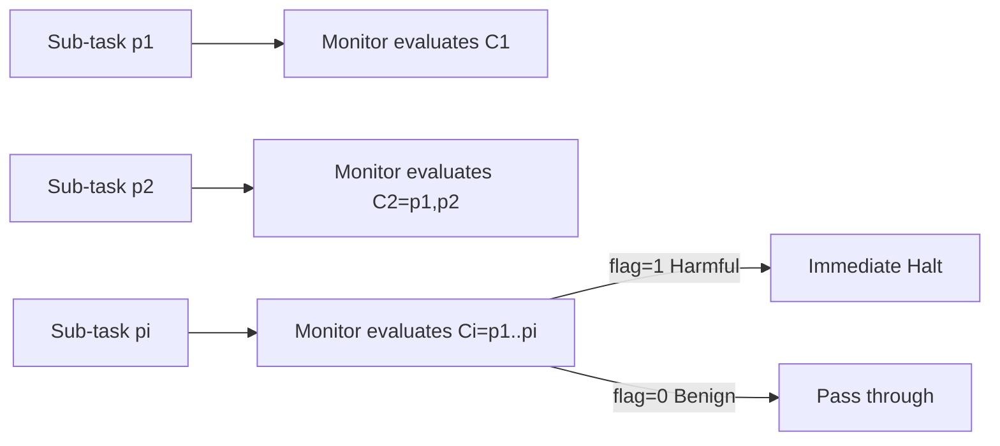

# Monitoring Decomposition Attacks with Lightweight Sequential Monitors

**Conference**: ICLR 2026  
**OpenReview**: [https://openreview.net/forum?id=HQuboWvFA1](https://openreview.net/forum?id=HQuboWvFA1)  
**Code**: [github.com/YuehHanChen/Monitoring-Decomposition-Attack](https://github.com/YuehHanChen/Monitoring-Decomposition-Attack)  
**Area**: LLM Safety / Agent Defense  
**Keywords**: Decomposition Attack, Sequential Monitoring, LLM Agent Safety, Jailbreak Defense, Lightweight Guardrails  

## TL;DR
Addressing decomposition attacks that split harmful goals into sequences of seemingly benign sub-tasks, this work constructs the largest dataset DecomposedHarm (4,634 task pairs) and proposes a **cumulative sequential monitoring framework**. Optimized lightweight models (e.g., GPT-4o-mini) achieve a 93% defense success rate, surpassing Llama-Guard-4 and o3-mini while reducing costs by 90% and latency by 50%.

## Background & Motivation
- **Background**: As LLMs evolve toward agentic behaviors (utilizing tools, multi-turn, stateful), safety alignment has become a prerequisite for deployment. However, mainstream defenses (including guardrails like Llama-Guard) rely on "shallow alignment"—evaluating only whether the current single instruction is explicitly harmful.
- **Limitations of Prior Work**: Attackers can **decompose** a harmful goal into multiple sub-tasks that appear harmless individually (e.g., "draw a group surrounding a car" → "change gesture to raised fists" → "add cracks" → "make characters appear as a specific ethnicity"), gradually inducing the agent to execute malicious intent. GPT-4o's refusal rate drops from 50% for original harmful tasks to 10% for decomposed sub-tasks; in text-to-image scenarios, it plummets from 83.5% to 2.25%. The average Attack Success Rate (ASR) reaches 87%.
- **Key Challenge**: Shallow alignment only considers the immediate step and fails to reason about **long-range intent**. Conversely, strong models capable of identifying long-range intent (o3-mini, GPT-4o) suffer from high cost and latency, making them impractical for real-time monitoring of every prompt.
- **Existing Pain Points**: Previous decomposition attack research has (1) mostly stayed in stateless QA settings, ignoring more dangerous stateful agent scenarios; (2) demonstrated vulnerabilities without releasing actual decomposition prompts; and (3) failed to propose robust defenses.
- **Goal**: To systematically characterize decomposition attacks across three types of real-world agent tasks and provide a **real-time, low-cost, and robust** defense.
- **Core Idea**: **Deploy an external "high-level" sequential monitor**. Instead of inspecting individual prompts, the monitor evaluates the cumulative context step-by-step, halting the process immediately upon detecting malicious intent before reaching the harmful node. This is made efficient through prompt engineering for **lightweight models**.

## Method

### Overall Architecture
The method consists of two parts: first, a semi-automatic generation pipeline constructs the DecomposedHarm evaluation set (using jailbroken LLMs to rewrite harmful prompts into seemingly benign sub-task sequences via few-shot prompting, covering General Agent, Text-to-Image, and QA). Second, a sequential monitor is built and optimized. The core of the monitor is formalizing defense as a **binary sequence labeling task**, making a judgment on the cumulative context at each step.

### Key Designs
**1. Cumulative Sequential Monitoring: Leveraging "step-by-step input" for defense.** Since the essence of the attack is hiding intent across multiple steps, the monitor must be stateful. Upon receiving a new prompt $p_i$ at step $i$, the monitor checks the **cumulative context** $C_i=[p_1,\dots,p_i]$ rather than $p_i$ in isolation, outputting a decision $y_i\in\{0,1\}$ (1=flag and halt, 0=pass). Since every attack contains at least two steps, monitoring starts from step 2. Each task is labeled with a "harmful index"—the step where execution leads to actual harm. Metrics are defined accordingly: correctly flagging at or before the harmful index is a TP; not flagging benign tasks is a TN; flagging after the harmful index or missing it entirely is an FN. This formalization unifies "timely interception" and "avoiding false positives" into F1 and Defense Success Rate (DSR/Recall). Comparative experiments (Table 8) show that the same lightweight models perform significantly better under the sequential framework than in a "single-input independent monitoring" framework.

**2. Prompt Engineering to Boost Lightweight Models: Prompt as a Hyperparameter.** The authors found that the bottleneck for lightweight monitors lies in prompt design rather than model capacity. They conducted a "prompt-as-hyperparameter" sweep on the validation set. Two key decisions: first, letting the model output a **harmful probability** $s_i\in[0,1]$ and applying a threshold for $y_i$ performed better than direct 0/1 output (especially with a tunable threshold); second, systematic comparison of ICL examples, safety guidelines, Chain-of-Thought (CoT), and hypothesis generation revealed that **task-specific ICL examples** and **CoT** were surprisingly effective. To avoid "cheating," the authors restricted ICL examples to a single task type and tested cross-task generalization—Agent task ICL generally performed best, though GPT-4o-mini optimized specifically with QA task ICL.

**3. Affordable yet Effective: Replacing "Expensive and Strong" with "Lightweight and Clever".** Real-time monitoring of every prompt requires models to be fast and cheap, making reasoning-heavy LLMs impractical. The authors identified GPT-4.1-nano, GPT-4o-mini, and Llama-3.1-8B as optimization targets (sub-$0.2/M token range), tuning them to match or even surpass o3-mini, GPT-4o, and GPT-5, thereby providing a practical solution on the "Defense-Cost-Latency" triangle.

## Key Experimental Results

### Main Results (Test Set, Decomposition Attack Monitoring)

| Model | Prompt | F1 ↑ | Cost per Task (USD) ↓ | Avg Latency (s) ↓ |
|---|---|---|---|---|
| Baseline Llama-3.1-8B | Zero-shot | 0.690 | 3.59e-5 | 0.476 |
| Baseline GPT-4.1-nano | Zero-shot | 0.756 | 1.67e-5 | 0.298 |
| Baseline GPT-4o-mini | Zero-shot | 0.785 | 2.51e-5 | 0.398 |
| **Optimized Llama-3.1-8B** | Agent ICL | 0.881 | 2.80e-4 | 0.574 |
| **Optimized GPT-4.1-nano** | CoT | 0.883 | 7.54e-5 | 0.937 |
| **Optimized GPT-4o-mini** | QA ICL | **0.918** | 1.39e-4 | 0.437 |
| Reference o3-mini | Zero-shot | 0.836 | 1.38e-3 | 3.976 |
| Reference GPT-4o | Zero-shot | 0.870 | 4.17e-4 | 0.490 |
| Reference GPT-5 | Zero-shot | 0.887 | 1.01e-2 | 25.49 |

Optimized lightweight GPT-4o-mini outperforms all expensive reference models (including GPT-5) in F1, with costs approximately 1/10 of o3-mini and 1/3 of GPT-4o, along with lower latency.

### Comparison with Strong Guardrail Baselines (F1 per Task)

| Model | Agent | Image | QA | Macro F1 |
|---|---|---|---|---|
| Llama-Guard-4-12B (Sequential) | 0.657 | 0.119 | 0.012 | 0.262 |
| Ours Optimized GPT-4o-mini | 0.894 | 1.000 | 0.883 | **0.926** |
| Gain | +0.237 | +0.881 | +0.871 | +0.664 |

Llama-Guard-4 remains extremely fragile even when wrapped in the same sequential framework, indicating its training paradigm cannot identify intent hidden within benign sub-tasks.

### Key Findings
- **Attacks are universal and effective**: Refusal rates collapse under decomposition (Agent 50%→10%, T2I 83.5%→2.25%, QA→~9%), with an average ASR of 87%.
- **Difficulty varies by task**: QA is the hardest to monitor (strongest Claude-3.7-Sonnet only reaches F1 0.669), while Image tasks are easiest (multiple models reach F1 1.0).
- **Adversarial Robustness**: Faced with random sub-task injection, massive sub-task confusion, and automated red-teaming that iteratively modifies sub-tasks to be more "benign," the F1 curves of optimized monitors remain largely stable. GPT-4o-mini/Llama-3.1-8B maintain DSR at 93%/89%, while unprotected GPT-4o's F1 drops from 0.85 to 0.72 at a 100% injection rate.

## Highlights & Insights
- **Turning the attack's weakness into the defense's leverage**: Since decomposition attacks must expose sub-tasks progressively, cumulative monitoring follows the "bread crumbs." This concept is simple and naturally matches the attack structure.
- **Counter-intuitive "surprisingly easy" conclusion**: While long-range intent recognition seems to require strong models, adding sequential context and correct prompting makes lightweight models sufficient. This is significant for real-world deployments requiring low cost and latency.
- **Solid Dataset Contribution**: 4,634 pairs across three task types with human verification (annotation cost \$2,613). The authors analyzed potential information leakage from the generation pipeline and released the actual decomposition prompts, filling a gap left by previous "demo-only" works.

## Limitations & Future Work
- The monitor is essentially another LLM tuned via prompt engineering, which is model-sensitive (optimal ICL types vary across models). Cross-model transfer and prompt robustness require more systematic methods than manual sweeps.
- Evaluation relies on "harmful index" labels and automated judging like StrongReject. Annotation quality and thresholds (e.g., 0.75 for QA) affect the F1 boundaries.
- While adversarial tests include red-team rewriting, the robustness boundary under long-term arms races—especially if attackers optimize white-box against the monitor's prompts—remains to be observed.
- Data generation heavily relies on jailbroken LLMs, potentially biasing the attack distribution toward "decomposition methods LLMs find easy." The strategy coverage of real-world human attackers remains to be evaluated.

## Related Work & Insights
- **Jailbreaking & Decomposition Attacks**: Compared to Li et al. (2024) and others who mainly demoed vulnerabilities in stateless QA, this work extends to stateful agent scenarios, releases prompts, and provides a defense.
- **Guardrail Models**: Contradicting "single-instruction classification" guardrails like Llama-Guard-4, this work reveals structural blind spots in long-range intent and suggests that guardrail training should incorporate cumulative context and intent reasoning.
- **Agent Safety Benchmarks**: Extending AgentHarm (Andriushchenko et al., 2025) into a General Agent task subset reflects a rigorous "benchmark → attack → defense" research loop.
- **Insight**: For agentic system safety, rather than pursuing larger and more expensive aligned models, it is better to add a low-cost, stateful, and independently upgradable "monitoring bypass" at the system layer. This decouples safety from internal model alignment into an observable and interceptable external mechanism.

## Rating
- **Novelty**: ⭐⭐⭐⭐ — Sequential cumulative monitoring formalization is simple but addresses the core of decomposition attacks. The "lightweight is enough" conclusion is counter-intuitive and practically valuable.
- **Experimental Thoroughness**: ⭐⭐⭐⭐⭐ — Large-scale dataset across three task types, comparison of 10 monitoring models, cost/latency quantification, and four types of adversarial stress tests.
- **Writing Quality**: ⭐⭐⭐⭐ — Clear narrative from motivation to attack, defense, and adversarial testing. Prompt engineering details are extensive but necessary.
- **Value**: ⭐⭐⭐⭐⭐ — Directly addresses safety requirements for LLM agent deployment, providing a cheap, deployable defense and open-sourcing data. High value for both industry and research.

<!-- RELATED:START -->

## Related Papers

- [\[ICLR 2026\] Adaptive Attacks on Trusted Monitors Subvert AI Control Protocols](adaptive_attacks_on_trusted_monitors_subvert_ai_control_protocols.md)
- [\[ICLR 2026\] Reliable Weak-to-Strong Monitoring of LLM Agents](reliable_weak-to-strong_monitoring_of_llm_agents.md)
- [\[ACL 2026\] Learning Uncertainty from Sequential Internal Dispersion in Large Language Models](../../ACL2026/llm_safety/learning_uncertainty_from_sequential_internal_dispersion_in_large_language_model.md)
- [\[ICLR 2026\] Efficient Adversarial Attacks on High-dimensional Offline Bandits](efficient_adversarial_attacks_on_high-dimensional_offline_bandits.md)
- [\[ICLR 2026\] Sampling-aware Adversarial Attacks against Large Language Models](sampling-aware_adversarial_attacks_against_large_language_models.md)

<!-- RELATED:END -->
