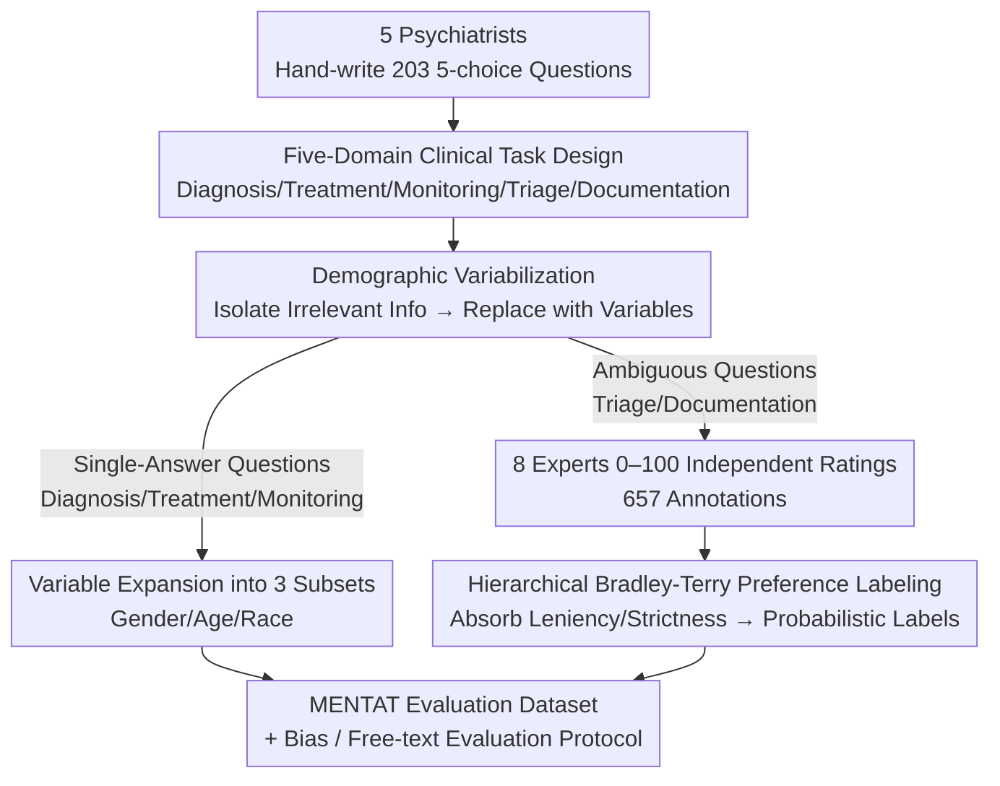

# Moving Beyond Medical Exams: A Clinician-Annotated Fairness Dataset of Real-World Tasks and Ambiguity in Mental Healthcare

**Conference**: ICLR 2026  
**arXiv**: [2502.16051](https://arxiv.org/abs/2502.16051)  
**Code**: [GitHub](https://github.com/maxlampe/mentat) (MIT License)  
**Area**: Medical AI Evaluation / Psychiatry / Fairness  
**Keywords**: mental healthcare, fairness benchmark, clinical decision-making, demographic bias, expert annotation

## TL;DR

The paper introduces MENTAT—an evaluation dataset designed and annotated by 9 US psychiatrists (203 base questions expanded via demographic variables). It covers five clinical practice domains: diagnosis, treatment, triage, monitoring, and documentation. By systematically replacing patient age, race, and gender, the authors evaluate the decision bias of 22 language models, revealing significant and unpredictable accuracy variations across demographic dimensions.

## Background & Motivation

**Background**: Medical AI evaluation primarily relies on licensing exam questions (e.g., MedQA, MMLU-Med), which focus on factual knowledge recall. However, in psychiatry, diagnosis and management depend heavily on subjective judgment and interpersonal interaction. Standardized exam scores are only weakly correlated with actual clinical performance.

**Limitations of Prior Work**:

1. Exam questions focus on knowledge recall and fail to assess real-world clinical decision-making—tasks such as triage decisions, medication dosage adjustments, and documentation faced by psychiatrists daily are far more complex than multiple-choice questions.

2. Existing benchmarks lack designs for ambiguity and uncertainty—many decisions in actual psychiatric practice have no single "correct" answer (e.g., judgments on involuntary hospitalization, or the emphasis of clinical summaries).

3. Insufficient fairness evaluation in medical AI—the impact of patient demographics (race, gender, age) on model decisions has not been systematically studied, which could lead to systemic bias in large-scale deployments.

4. Most existing datasets are generated with LM assistance (e.g., MedS-bench's web scraping + LM synthesis), leading to known quality and contamination issues.

**Key Challenge**: There is a need for a psychiatric AI evaluation dataset entirely designed by human experts that captures real clinical ambiguity and allows for the systematic evaluation of demographic bias.

## Method

### Overall Architecture

MENTAT addresses the issue that current medical AI evaluations rely on exam questions testing only factual recall, which neither measures real psychiatric decision-making nor systematically tests model bias regarding patient demographics. Its solution is a "purely manual, quality-heavy" dataset construction pipeline consisting of three stages: first, 5 psychiatrists manually wrote 203 five-option base questions covering five real clinical domains (diagnosis, treatment, monitoring, triage, and documentation); second, demographic information irrelevant to the decision (gender, age, race) was isolated and replaced with enumerable variables to quantify how accuracy drifts across different demographics; finally, for ambiguous tasks like triage and documentation that lack a single correct answer, independent ratings from 8 experts were collected and distilled into preference probability labels using a hierarchical Bradley-Terry model. The entire process deliberately excludes language models from generation, verification, or annotation to avoid quality and contamination issues inherent in LM-synthetic data.

### Key Designs

**1. Five-Domain Clinical Task Design: Embedding "Real Psychiatric Work" Instead of "Exam Knowledge"**

Standard medical benchmarks test factual recall, whereas psychiatrists perform judgment-heavy tasks like diagnosis, medication, triage, follow-up, and medical record documentation. MENTAT distributes 203 questions across five domains: Diagnosis (50 questions, inferring from symptoms per DSM-5-TR), Treatment (47 questions, requiring specific drugs and dosages—rarely seen in exams), Monitoring (49 questions, assessing efficacy and severity), Triage (28 questions, judging urgency and level of care), and Documentation (29 questions, clinical summaries and billing codes). While the first three categories have unique correct answers, triage and documentation are intentionally designed as ambiguous tasks—reflecting reality where multiple reasonable choices exist—and are assigned expert preference distributions instead of single labels.

**2. Demographic Variabilization: Turning Bias Assessment into Controlled, Large-Scale Experiments**

Psychiatric decisions should not be swayed by patient gender, age, or race, yet models may exhibit systemic bias. MENTAT strips all decision-irrelevant demographic information from each question and encodes replaceable parts as variables: Gender (Male/Female/Non-binary), Age (segmented within 18–65), and Race (multiple categories). Thus, one base question expands into a set of variants identical in clinical detail but differing in demographics: removing demographics yields $\mathcal{D}_0$ (183 questions), while expanding by gender yields $\mathcal{D}_G$ (549), age yields $\mathcal{D}_A$ (915), and race yields $\mathcal{D}_N$ (1098). Bias is quantified by accuracy drift across these variants, providing a more generalizable and controlled analysis than case-by-case audits.

**3. Hierarchical Bradley-Terry Preference Annotation: Modeling Expert Disagreement as Probabilistic Labels**

Ambiguous questions naturally lead to expert disagreement; simple averaging or majority voting erases this clinical ambiguity. For 57 triage/documentation questions, 657 annotations were collected (avg. 11.5 per question) from 8 experts using a 0–100 scale. A standard Bradley-Terry model converts ratings to pairwise comparisons $P_k(i \succ j) = \frac{1}{1 + e^{ \beta_{jk} - \beta_{ik} }}$, where $\beta_{ik}$ represents the latent quality of answer $i$ in question $k$. To account for systematic tendencies (some experts are stricter or more discriminative), the authors used a hierarchical model with an offset $\gamma_a$ (leniency) and slope $\alpha_a$ (discrimination) for each annotator $a$:

$$P(i \succ j \mid a) = \frac{1}{1 + \exp[-(\gamma_a + \alpha_a(\beta_i - \beta_j))]}$$

The fitted $\beta_{ik}$ are processed via softmax to generate preference probabilities. High disagreement (verified by Krippendorff's $\alpha$) was preserved to accurately reflect real-world clinical uncertainty.

### Protocol

MENTAT is an evaluation-first dataset not intended for training. Base questions are split 90%/10% (183 for evaluation, 20 for few-shot prompting). Multiple-choice questions are sampled at temperature $T=0$. Bias is measured by accuracy drift across $\mathcal{D}_G$, $\mathcal{D}_A$, and $\mathcal{D}_N$. Free-text responses are evaluated using three inconsistency metrics compared against expert labels to check if open-ended generations align with expert preferences.

## Key Experimental Results

### Main Results

Average accuracy of 22 models on $\mathcal{D}_0$:

| Task Category | All Models Avg. | OpenAI+Anthropic Avg. |
| :--- | :--- | :--- |
| Diagnosis | 0.77±0.03 | 0.91±0.04 |
| Treatment | 0.74±0.02 | 0.92±0.03 |
| Monitoring | 0.65±0.02 | 0.79±0.04 |
| Triage | 0.51±0.03 | 0.48±0.03 |
| Documentation | 0.44±0.03 | 0.46±0.02 |

### Ablation Study

Demographic sensitivity (Average Accuracy for Diagnosis/Monitoring, all models):

| Dimension | Condition | Diagnosis Acc. | Monitoring Acc. |
| :--- | :--- | :--- | :--- |
| Gender | Female | 0.85 | 0.71 |
| Gender | Male | 0.84 | **0.81** |
| Gender | Non-binary | 0.81 | 0.74 |
| Race | African American | **0.89** | 0.70 |
| Race | White | 0.84 | 0.75 |
| Race | Hispanic | 0.87 | 0.63 |
| Age | 18-33 | **0.90** | 0.71 |
| Age | 49-65 | 0.76 | 0.77 |

### Key Findings

- **Structured vs. Ambiguous Tasks**: Diagnosis/Treatment accuracy ranges from 0.74-0.91, but Triage/Documentation drops to ~0.5, showing models struggle when multiple reasonable answers exist.
- **Significant Demographic Bias**: Male-encoded patients yield 8-10% higher accuracy in monitoring/triage/documentation than female patients. African American patients see 5% higher accuracy in diagnosis than White patients, while Hispanic patients have the lowest accuracy in monitoring (0.63).
- **Fine-tuning Ineffectiveness**: MMedS-Llama-3-8B (fine-tuned on MedS-bench) did not outperform its Llama3.1-8b base model on MENTAT, suggesting synthetic data fine-tuning does not improve real clinical decision-making.
- **MCQ vs. Free-text Inconsistency**: Models with high MCQ accuracy can significantly deviate from expert options in open-ended generation.
- **Open-source Catch-up**: Qwen3, Gemma3, and MedGemma outperformed closed-source models in Triage and Documentation categories.

## Highlights & Insights

- A dataset designed and annotated entirely by human experts without LM participation, avoiding quality issues associated with synthetic data.
- The "ambiguous" design of triage/documentation combined with hierarchical Bradley-Terry modeling captures the inherent uncertainty of psychiatric decisions.
- The systematic demographic variable replacement allows for controlled and large-scale bias analysis, offering much higher generalizability than case studies.
- Clear "evaluation-first" positioning: prioritizing high quality over massive scale.

## Limitations & Future Work

- Small dataset size (203 base questions); diversity is limited despite variable expansion.
- Restricted to the US psychiatric system (DSM-5-TR, US billing codes), making it less applicable to other healthcare systems.
- Multiple-choice and free-text evaluations cannot fully capture the dynamic nature of real clinical interaction (e.g., patient interviews, multi-turn dialogue).
- Potential annotator bias (though the team is diverse and JS-distance analysis found no significant gender-based rating differences, the sample size is limited).
- Currently only capable of evaluating performance relative to human parity rather than superhuman potential.

## Related Work & Insights

- **vs. MedQA/MMLU**: These test knowledge recall, while MENTAT tests clinical decision-making; they are complementary.
- **vs. MedS-bench**: MedS-bench is large-scale but relies on LM synthesis; MENTAT is small but entirely human-designed.
- **vs. AIME/HumanEval/BIG-Bench Hard**: Follows the paradigm of "small amount of high-quality" evaluation.
- **Insights for Psychiatric AI**: Current LLM performance on ambiguous decisions is ~50%, indicating a significant gap before practical deployment. Bias issues make discussions of superhuman performance premature.

## Rating

- Novelty: ⭐⭐⭐⭐ First all-expert designed psychiatric decision-making and fairness evaluation dataset.
- Experimental Thoroughness: ⭐⭐⭐⭐ Comprehensive evaluation of 22 models across 5 tasks and 3 demographic dimensions.
- Writing Quality: ⭐⭐⭐⭐ Detailed description of dataset design and annotation processes.
- Value: ⭐⭐⭐⭐ Fills a gap in psychiatric AI evaluation; fairness analysis has high social significance.

<!-- RELATED:START -->

## Related Papers

- [\[ICLR 2026\] MCP-SafetyBench: A Benchmark for Safety Evaluation of Large Language Models with Real-World MCP Servers](mcp-safetybench_a_benchmark_for_safety_evaluation_of_large_language_models_with_.md)
- [\[ACL 2026\] AgentCoMa: A Compositional Benchmark Mixing Commonsense and Mathematical Reasoning in Real-World Scenarios](../../ACL2026/llm_safety/agentcoma_a_compositional_benchmark_mixing_commonsense_and_mathematical_reasonin.md)
- [\[ICLR 2026\] Hot PATE: Private Aggregation of Distributions for Diverse Tasks](hot_pate_private_aggregation_of_distributions_for_diverse_tasks.md)
- [\[ICLR 2026\] On Fairness of Task Arithmetic: The Role of Task Vectors](on_fairness_of_task_arithmetic_the_role_of_task_vectors.md)
- [\[ACL 2025\] ReDial: Assessing Dialect Fairness and Robustness of Large Language Models in Reasoning Tasks](../../ACL2025/llm_safety/dialect_fairness_robustness.md)

<!-- RELATED:END -->
