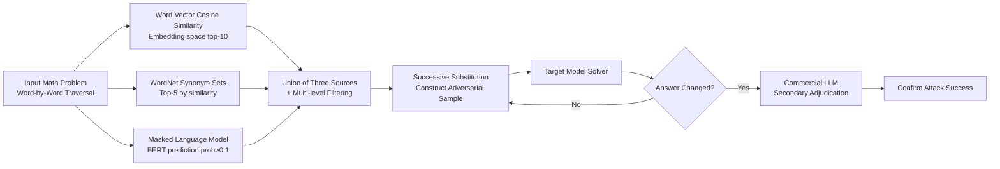

# MSCR: Exploring the Vulnerability of LLMs' Mathematical Reasoning Abilities Using Multi-Source Candidate Replacement

**Conference**: ICLR 2026  
**OpenReview**: [https://openreview.net/forum?id=ijOAhcHI7S](https://openreview.net/forum?id=ijOAhcHI7S)  
**Code**: To be confirmed  
**Area**: LLM Safety / Mathematical Reasoning Robustness / Textual Adversarial Attacks  
**Keywords**: Adversarial Attacks, Mathematical Reasoning, Robustness, Synonym Substitution, WordNet, Masked Language Model, GSM8K, MATH500  

## TL;DR
The authors propose MSCR, an automated adversarial attack method that integrates three information sources—word vector cosine similarity, the WordNet dictionary, and Masked Language Models (MLM)—to generate candidate replacement words. By modifying only a **single word** in a mathematical problem, MSCR significantly reduces the reasoning accuracy of nearly all LLMs (dropping by up to 49.89% on GSM8K), systematically revealing robustness defects and efficiency bottlenecks in current LLM mathematical reasoning.

## Background & Motivation
- **Background**: LLMs have achieved near-perfect scores on mathematical benchmarks like GSM8K and MATH, leading to a general perception of strong mathematical reasoning capabilities. However, whether this ability remains robust under minor input perturbations lacks systematic research.
- **Limitations of Prior Work**: ① Classic textual adversarial attacks (e.g., TextFooler, BERT-ATTACK) are designed for classification models and scale poorly to generative LLMs; ② Jailbreak attacks rely heavily on manual construction and iterative prompt debugging, which is costly and focuses on general tasks rather than mathematical reasoning; ③ Dataset perturbation works (e.g., GSM-Symbolic, GSM-Plus, MATH-Perturb) require manually designed rules and lack automated, scalable attack pipelines.
- **Key Challenge**: Achieving an "automated, scalable, and semantic-preserving" exposure of LLM mathematical reasoning vulnerabilities is difficult. Candidate words generated from a single information source often deviate semantically, have narrow coverage, or lack contextual relevance.
- **Goal**: To construct an automated adversarial attack framework that requires no human intervention, can operate at scale, and maintains high semantic consistency to systematically evaluate LLM mathematical reasoning robustness with minimal perturbation (word substitution).
- **Core Idea**: **Multi-source candidate fusion**—for each word in a problem, three complementary sets of candidates are generated using the model's own embedding space cosine similarity, the WordNet human-curated semantic network, and external MLM contextual predictions. After filtering, candidates are substituted word-by-word, and the target model is queried; an attack is considered successful once the output answer changes.

## Method

### Overall Architecture
MSCR decomposes the adversarial attack into a pipeline consisting of "Candidate Generation → Word-by-Word Substitution → Dual Judgment." First, a high-quality set of candidate replacement words is constructed for each target word in the input problem (via three-source fusion and multi-level filtering). Successive candidates are then substituted into the original problem based on priority to query the target model. Finally, a two-step mechanism—"Answer Comparison + Commercial LLM Secondary Adjudication"—is used to determine attack success. If all candidates for a word are exhausted without success, the process moves to the next word until a model error is triggered or all words fail.

### Key Designs

**1. Word Vector Cosine Similarity Source: Finding the nearest replacement in continuous embedding space.** Since text consists of discrete tokens, it is difficult to apply continuous perturbations as in image processing. MSCR utilizes the model's own embedding matrix to map each word to a dense vector. It first normalizes all word vectors (projecting them onto a unit hypersphere to eliminate bias from vector magnitude) and then calculates the cosine similarity $\mathrm{sim}(v_w, v_i)=\frac{v_w\cdot v_i}{\lVert v_w\rVert\lVert v_i\rVert}$ between the normalized vector $v_w$ of the target word $w$ and all other vectors $v_i$ in the vocabulary. The top 10 most similar words are selected as initial candidates. These undergo multi-level filtering: character-level filtering removes control characters, non-Latin characters, and pure punctuation to ensure structural integrity; substring matching and morphological constraints retain words containing the original stem or minor spelling variations, maintaining semantic consistency within local phrases or technical terms.

**2. WordNet Dictionary Source: Using human-curated semantic networks to compensate for distributed knowledge gaps.** Word vector sources are limited by the model's own internal knowledge and lack semantic generalization. MSCR introduces WordNet, built by human experts, as a second source. For a target word $w$, all synonym sets (synsets) are queried, and lemmas from each synset are traversed to extract words that explicitly form synonymy relations at the dictionary level. After obtaining initial candidates, their cosine similarity with the original word is calculated, and the top 5 are retained. This source provides high-quality synonyms that model embeddings might miss, complementing the first source.

**3. Masked Language Model Source: Letting context determine the most natural replacement.** The first two sources primarily focus on word-to-word similarity and lack sentence-level contextual awareness. The third source in MSCR replaces the target word $w$ with a `[MASK]` token and feeds it into BERT-large to obtain a conditional probability distribution over the vocabulary. Only high-confidence candidates with a prediction probability greater than 0.1 are kept, filtering out grammatical but semantically weak or illogical low-probability noise. By taking the union of candidates from all three sources, internal distributed knowledge and external structured knowledge are combined to cover broader semantic scenarios and generate more natural replacements.

**4. Local/Global Differentiated Substitution + Dual-Step Judgment: Balancing readability and robust evaluation.** Regarding substitution strategy, word vector candidates are used for **local replacement** of the current word, while WordNet and MLM candidates utilize **global replacement** (replacing all identical occurrences of the word in the sentence) to ensure grammatical integrity and readability. For judgment, a two-step mechanism is employed: the first step compares the target model's output with the original answer; if changed, it is marked as an initial success. The second step involves calling a stronger commercial LLM (qwen3-max-preview) for secondary adjudication to confirm that the target model indeed provided an incorrect answer. This step significantly improves the reliability of the "attack success" label by avoiding false positives caused by formatting differences.

## Key Experimental Results

### Main Results: Accuracy Drop of 12 Open-Source LLMs Under Word Perturbation
The temperature was set to 0.6, and each model on each dataset was run 3 times to calculate the average. BERT-large-uncased was used for MLM, and qwen3-max-preview for adjudication.

| Model | GSM8K Original | GSM8K Post-Attack | Drop | MATH500 Original | MATH500 Post-Attack | Drop |
|---|---|---|---|---|---|---|
| DeepSeek-R1-Distill-Qwen-32B | 94.39 | 75.59 | 18.80↓ | 93.00 | 79.20 | 13.80↓ |
| DeepSeek-R1-Distill-Qwen-7B | 93.71 | 68.16 | 25.55↓ | 92.80 | 78.60 | 14.20↓ |
| DeepSeek-R1-Distill-Qwen-1.5B | 83.09 | 57.54 | 25.55↓ | 81.20 | 63.20 | 18.00↓ |
| Qwen2.5-Math-7B-Instruct | 94.09 | 54.81 | 39.28↓ | 83.20 | 61.60 | 21.60↓ |
| Qwen2.5-Math-1.5B-Instruct | 85.90 | 36.01 | **49.89↓** | 76.20 | 49.80 | 26.40↓ |
| Meta-Llama-3-70B-Instruct | 93.86 | 65.43 | 28.43↓ | 57.60 | 45.00 | 12.60↓ |
| Meta-Llama-3-8B-Instruct | 83.02 | 47.69 | 35.33↓ | 30.60 | 6.60 | 24.00↓ |
| gemma-3-27b-it | 98.10 | 77.79 | 20.31↓ | 92.00 | 75.00 | 17.00↓ |
| gemma-3-12b-it | 97.73 | 75.51 | 22.22↓ | 89.80 | 70.40 | 19.40↓ |
| gemma-3-4b-it | 94.54 | 63.84 | 30.70↓ | 81.40 | 56.20 | 25.20↓ |
| gemma-2-27b-it | 92.65 | 59.74 | 32.91↓ | 68.30 | 39.00 | 29.30↓ |
| gemma-2-9b-it | 90.75 | 53.07 | 37.68↓ | 47.00 | 11.60 | **35.40↓** |

On GSM8K, all models except DeepSeek-R1-Distill-Qwen-32B saw drops exceeding 20%, with half exceeding 30%. On MATH500, all models dropped by over 10%, with half dropping by over 20% (gemma-2-9b-it decreased by 75.32% relatively, and Llama-3-8B by 78.43% relatively). Larger models within the same family with higher baselines were relatively more robust but still generally suffered drops of 20%+ on GSM8K and 10%+ on MATH500.

### Transfer Experiments: Cross-Model Attacks on Commercial LLMs
Adversarial samples generated for gemma-3-27b-it were transferred to commercial models:

| Model | GSM8K Original | GSM8K Post-Attack | Drop | MATH500 Original | MATH500 Post-Attack | Drop |
|---|---|---|---|---|---|---|
| OpenAI-o3 | 97.41 | 81.53 | 15.88↓ | 98.20 | 91.40 | 6.80↓ |
| GPT-4o | 96.28 | 79.07 | 17.21↓ | 76.00 | 68.20 | 7.80↓ |

Both commercial models showed significant degradation, proving that adversarial samples generated by MSCR possess strong cross-model transferability.

### Response Length Collapse: Lengthened Reasoning Paths After Attack

| Model | GSM8K Original | GSM8K Post-Attack | Multiplier | MATH500 Original | MATH500 Post-Attack | Multiplier |
|---|---|---|---|---|---|---|
| DeepSeek-R1-Distill-Qwen-7B | 1204.5 | 2190.2 | 1.82× | 2204.7 | 3081.9 | 1.40× |
| Qwen2.5-Math-1.5B-Instruct | 306.8 | 555.9 | 1.81× | 579.0 | 745.9 | 1.29× |
| gemma-3-4b-it | 411.8 | 881.7 | **2.14×** | 926.3 | 1308.3 | 1.41× |
| gemma-2-9b-it | 174.6 | 190.0 | 1.09× | 396.8 | 413.8 | 1.04× |

### Key Findings
- **Single-word perturbation is sufficient**: Replacing just one word causes significant performance drops in nearly all models, suggesting that LLM mathematical reasoning relies heavily on surface pattern matching rather than deep logic, indicating a systematic lack of robustness.
- **Stronger models are steadier but still fragile**: Larger models within a family are relatively more robust, but even the strongest models are not immune; the cost of perturbation is extremely low while the destructive power is high.
- **Response Length Collapse**: Average response lengths generally increased after attacks, by up to 2.14x. In some cases, reasoning models even exceeded 10x the original length—perturbations not only cause incorrect outputs but also trigger redundant reasoning paths, increasing computational costs and reducing overall efficiency.
- **Varied reactions between strong and weak models**: Weaker models like the gemma-2 series showed almost no change in response length. The authors hypothesize that their problem-solving is closer to keyword matching based on memory/templates; thus, no extra reasoning is generated under perturbation, resulting in minimal length change.

## Highlights & Insights
- **Clever three-source complementary design**: Model embeddings (distributed knowledge), WordNet (human structured knowledge), and MLM (contextual awareness) cover the blind spots of each other, ensuring candidates are both semantically similar and contextually natural.
- **Fully automated and scalable**: No need for manual perturbation rules or prompt tuning. Compared to works like GSM-Symbolic/GSM-Plus, which require manual construction, the attack process is more scalable.
- **Two-step adjudication increases credibility**: Using a stronger commercial model for secondary confirmation mitigates noise from "answer format differences misjudged as reasoning errors," making the "attack success rate" more reliable.
- **First systematic reveal of efficiency vulnerability**: By quantifying "Response Length Collapse" as a standalone phenomenon, the study points out that robustness issues also drive up inference costs, providing a more comprehensive view than accuracy alone.

## Limitations & Future Work
- **Lack of formal ablation**: The paper does not provide an ablation table for the contributions of the three sources or the sensitivity of filtering thresholds (top-10 / top-5 / prob>0.1), making it difficult to judge the marginal value of each component.
- **Weak quantification of semantic consistency**: While claiming "high semantic consistency," the text lacks independent semantic similarity evaluation tables (e.g., BERTScore or human evaluation) to support this.
- **Unreported attack cost and query budget**: Sequential word substitution requires numerous target model queries, but the average number of queries or time overhead is not summarized.
- **Limited to English and two benchmarks**: The study does not cover multilingual settings, code reasoning, or longer context tasks; the generalization boundaries of the conclusions are unclear.
- **Absence of defense strategies**: As an attack/analysis work, it identifies vulnerabilities but provides no preliminary verification of mitigation solutions like adversarial training or robust decoding.

## Related Work & Insights
- **Taxonomy of Textual Adversarial Attacks**: Evolution from HotFlip (gradient char replacement) and TextFooler (embeddings + greedy) to BERT-ATTACK/BAE (MLM candidates) and GBDA (Gumbel-softmax continuous optimization); MSCR differs by targeting generative LLMs, fusing three sources, and using answer changes as a black-box judgment.
- **Jailbreak Attacks**: GCG (discrete optimization suffixes), AutoDAN (hierarchical genetic algorithms), and PAIR (dual-model query) focus on bypassing safety alignment; MSCR adopts automated logic but targets mathematical correctness rather than harmful content.
- **Mathematical Reasoning Robustness Benchmarks**: GSM-Symbolic, GSM-Plus, MATH-Perturb, and numerical perturbation works reveal LLM reliance on surface patterns; MSCR upgrades the "perturbed dataset" to an "automated adversarial attack algorithm," enabling online generation of samples rather than offline construction of fixed variants.
- **Insights**: ① Three-source candidate fusion can be extended to evaluate robustness in other structured tasks like code or logic; ② "Response Length Collapse" suggests that defense research should monitor reasoning budgets alongside accuracy; ③ Black-box answer comparison + strong model adjudication is a reusable paradigm for assessing attack success on generative models.

## Rating
- **Novelty**: ⭐⭐⭐⭐ The combination of three-source candidate fusion and automated word-level attacks for generative LLM math reasoning is novel and fills the gap of "automated scalable adversarial attacks for math reasoning," though individual components are derived from existing techniques.
- **Experimental Thoroughness**: ⭐⭐⭐ Covers 12 open-source and 2 commercial models across two benchmarks with 3-run averages; the main experiments are solid, but it lacks source ablation, threshold sensitivity, semantic quantification, and query cost statistics.
- **Writing Quality**: ⭐⭐⭐⭐ The motivation-method-experiment flow is clear, examples in Figures 1 and 3 are intuitive, and table information density is high; some English phrasing is slightly unrefined.
- **Value**: ⭐⭐⭐⭐ Systematically exposes twin defects in robustness and efficiency of mainstream LLMs (including o3/GPT-4o) using low-cost perturbations, providing a reusable automated attack benchmark and important warnings for future defense and robust decoding research.

<!-- RELATED:START -->

## Related Papers

- [\[ICLR 2026\] SlotGCG: Exploiting the Positional Vulnerability in LLMs for Jailbreak Attacks](slotgcg_exploiting_the_positional_vulnerability_in_llms_for_jailbreak_attacks.md)
- [\[ACL 2026\] AgentCoMa: A Compositional Benchmark Mixing Commonsense and Mathematical Reasoning in Real-World Scenarios](../../ACL2026/llm_safety/agentcoma_a_compositional_benchmark_mixing_commonsense_and_mathematical_reasonin.md)
- [\[ICLR 2026\] When Priors Backfire: On the Vulnerability of Unlearnable Examples to Pretraining](when_priors_backfire_on_the_vulnerability_of_unlearnable_examples_to_pretraining.md)
- [\[ICLR 2026\] Doxing via the Lens: Revealing Location-related Privacy Leakage on Multi-modal Large Reasoning Models](doxing_via_the_lens_revealing_location-related_privacy_leakage_in_vlms.md)
- [\[ICLR 2026\] Be Careful When Fine-tuning On Open-Source LLMs: Your Fine-tuning Data Could Be Secretly Stolen!](be_careful_when_fine-tuning_on_open-source_llms_your_fine-tuning_data_could_be_s.md)

<!-- RELATED:END -->
