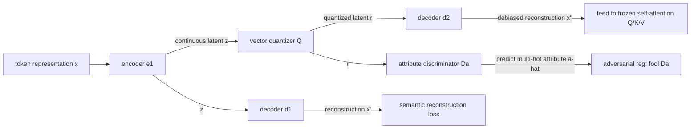

# Multi-Feature Quantized Self-Attention for Fair Large Language Models

**Conference**: ICLR 2026  
**OpenReview**: [https://openreview.net/forum?id=0UvgQxsi7S](https://openreview.net/forum?id=0UvgQxsi7S)  
**Code**: To be confirmed  
**Area**: LLM Safety / Fairness De-biasing  
**Keywords**: Fairness, De-biasing, Self-Attention, Vector Quantization, Adversarial Autoencoder, Multi-attribute Bias  

## TL;DR
The authors propose MQAR: a lightweight plugin using "Vector Quantization + Adversarial Autoencoder" inserted before **frozen** LLM self-attention layers. Without modifying the backbone or accessing pre-training data, it filters sensitive attribute information (e.g., gender, race) from attention representations while keeping downstream accuracy loss below 0.4%.

## Background & Motivation
- **Background**: LLMs absorb social biases (gender, race, religion) from pre-training corpora, which remain measurable even after instruction tuning and alignment. Existing de-biasing methods fall into three categories: embedding-level projection (INLP, SentDebias, OSCaR), model-level fair training (ADELE, FaRM, FineDeb), and inference-time intervention (CRISPR, RB).
- **Limitations of Prior Work**: Embedding-level projections can over-compress the latent space and damage task expressiveness; model-level methods require access to training data and expensive fine-tuning of the backbone, making them hard to transfer to proprietary/black-box models; inference-time methods, while model-agnostic and parameter-free, only modify inputs or decoding and **completely ignore the internal representations of attention layers**, leaving attention-level biases untouched.
- **Key Challenge**: Bias is amplified by the self-attention structure—attention entangles sensitive attribute signals with semantic content (demonstrated in the paper via attention heatmaps of gender-swapped sentence pairs). However, existing methods either avoid this layer or require retraining to modify it. Identifying how to **target attention representations without retraining the backbone** remains an open problem.
- **Goal**: Develop a model-agnostic, lightweight, fine-tuning-free de-biasing module that directly addresses representation-level bias and can **simultaneously handle multiple, overlapping protected attributes and their intersections**, rather than traditional single-attribute settings.
- **Core Idea**: **[Quantization Bottleneck + Adversarial Disentanglement]** A structured vector quantizer is inserted at the input of the frozen self-attention. Quantization creates an information bottleneck that forces the representation to discard attribute details. An adversarial autoencoder, guided by a discriminator, reconstructs semantics while adversarially erasing information identifiable as "sensitive attributes." The training follows the Information Bottleneck objective—**maximizing mutual information between the representation and the input while minimizing it between the representation and sensitive attributes.**

## Method

### Overall Architecture
MQAR (Multi-feature Quantized Attention Regularization) is a layer-wise regularization module $\mathrm{QR}_{i-1}$ inserted at the "input side" of self-attention layers. The original hidden state $X_{i-1}$ is transformed into a de-biased representation $\tilde{X}_{i-1}=\mathrm{QR}_{i-1}(X_{i-1})$ before being fed to the frozen attention to calculate $Q/K/V$. Internally, the module combines an autoencoder, a vector quantizer, and an attribute discriminator. The encoder compresses token representations into latent vectors, the quantizer discretizes them into bottleneck representations, two decoders reconstruct semantics, and the discriminator attempts to predict sensitive attributes while the encoder is trained to deceive it. Training occurs in two stages: first, training the quantized autoencoder and discriminator together; second, freezing the discriminator and using randomized attribute labels as adversarial regularization. The backbone remains frozen throughout.

### Key Designs

**1. Attention Input Regularization: Modifying representations rather than weights in frozen layers.** MQAR does not fine-tune any $W^Q/W^K/W^V$. Instead, it inserts a transformation **before** each attention calculation, replacing $X_{i-1}$ with the de-biased $\tilde{X}_{i-1}$. Thus, attention becomes $X_i=\mathrm{softmax}\!\big(\tilde{X}_{i-1}W^Q_i(\tilde{X}_{i-1}W^K_i)^\top/\sqrt{d_k}\big)\tilde{X}_{i-1}W^V_i$. This ensures sensitive information is filtered before entering attention, preserving contextual modeling capabilities. Since it doesn't touch backbone parameters, it is plug-and-play for architectures like BERT, T5, GPT-Neo, Mixtral, and LLaMA.

**2. Quantization Bottleneck: Forced "Information Loss" via discrete codebooks.** Encoder $e_1$ maps $x_{(l,i)}$ to continuous latent vector $z$, and quantizer $Q$ discretizes it into $r=Q(z)$ using nearest neighbor search with codebook size $K$. Discretization serves as an inherent information bottleneck. Training utilizes two losses: quantization loss $L_{\text{quantize}}=\lVert \mathrm{sg}(z)-\hat a\rVert_2^2$ pulls the codebook toward encoder outputs, and commitment loss $L_{\text{commit}}=\lVert z-\mathrm{sg}(\hat a)\rVert_2^2$ stabilizes the encoder (where $\mathrm{sg}$ is stop-gradient). The paper uses **scalar quantization** (independent discretization per dimension) instead of high-dimensional vector quantization, mitigating codebook collapse. The regularization is denoted as $\mathrm{QR}_i(\cdot)=d_2\big(Q(e_1(\cdot))\big)$.

**3. Discriminator-Guided Adversarial Autoencoding + Dual Decoders.** Each token carries a **multi-hot** attribute label $a\in\{0,1\}^M$ ($M$ attributes like gender/race/religion labeled simultaneously). Discriminator $D_a$ predicts $\hat a=D_a(r)$ from the quantized latent $r$. In stage one, the discriminator learns to classify attributes and the autoencoder learns reconstruction. In stage two, the **discriminator is frozen and attribute labels are randomized** to $a^r$, forcing the encoder-quantizer to produce representations that confuse $D_a$. Multi-hot supervision is crucial as it prevents the model from collapsing multiple attributes into a shared subspace, allowing for **joint** erasure. Meanwhile, dual decoders $d_1, d_2$ perform reconstruction ($x'\approx x$, $x''\approx x$) to ensure semantics are preserved.

**4. Information Bottleneck Objective and Dual Upper Bound.** The formal objective is $\max\, I(R;X)-\beta I(R;A)$: retaining mutual information between representation $R$ and input $X$ while minimizing it between $R$ and attributes $A$. Using variational bounds and Monte Carlo gradient estimation, $I(R;X)$ is lower-bounded by $\mathcal{L}_r=\mathbb{E}[\log D_2(x''|r)]$ (decoder log-likelihood). $I(R;A)$ is upper-bounded by $C_1, C_2$. The paper proves that under the distribution space, this constrained optimization satisfies strong duality (Theorem 4). Additionally, the discriminator uses weak supervision only on samples with clear attribute clues (e.g., pronouns), avoiding noise from neutral samples.

## Key Experimental Results

### Main Results
Evaluation on five backbones (BERT, T5, GPT-Neo, Mixtral, LLaMA 3.2) across three benchmarks (WinoBias, StereoSet, CrowS-Pairs). Table shows LLaMA 3.2 on StereoSet and CrowS-Pairs (LMS: Language Modeling Score ↑; SS: Stereotype Score, closer to 50 is better; ICAT ↑; CrowS closer to 50 is better):

| Method | StereoSet-Gender SS | ICAT | StereoSet-Race SS | ICAT | CrowS-All |
|------|------|------|------|------|------|
| LLaMA 3.2 | 59.7 | 72.5 | 62.1 | 68.3 | 61.9 |
| +INLP | 58.3 | 75.6 | 64.0 | 65.0 | 48.2 |
| +SentDebias | 60.2 | 72.8 | 56.3 | 79.4 | 51.3 |
| +CRISPR | 60.3 | 72.4 | 53.2 | 81.5 | 50.8 |
| +RB | 54.1 | 76.7 | 54.7 | 82.8 | 49.7 |
| **+MQAR (Ours)** | **53.1** | **86.0** | **54.0** | **84.0** | **48.1** |

MQAR achieves near-optimal performance in SS, ICAT, and CrowS-All across most metrics.

### Ablation Study
BERT on abusive speech detection (Founta), examining the removal of decoders (a) and discriminator (b):

| Data | Metric | Full | (a) w/o Decoders | (b) w/o Discriminator |
|------|------|------|------|------|
| Original | AUC | 93.9 | 50.3 | 93.9 |
| Original | FPED | 1.84 | 20.2 | 2.50 |
| Original | FNED | 3.46 | 18.3 | 3.46 |
| Generated | FPED | 0.065 | 22.1 | 0.392 |

Removing decoders → semantic destruction and bias explosion; removing discriminator → semantics preserved but bias remains. Both are essential.

### Key Findings
- **Minimal Accuracy Loss**: Across all downstream tasks, the average accuracy drop is at most 0.4 percentage points compared to non-debiased baselines.
- **Efficiency over Fine-tuning**: On LLaMA 3.2, MQAR increases parameters by 48.1% and FLOPs by 87.0%. Inference latency is 132.7ms, 43% faster than the full-model fine-tuning approach FineDeb (189.8ms).
- **Effective Multi-attribute & Intersectional De-biasing**: A single MQAR module jointly reduces bias for multiple attributes using multi-hot supervision.

## Highlights & Insights
- **Clever Intervention Point**: Shifting de-biasing from "input/decoding" to "attention input representations" strikes the exact location where bias is amplified while avoiding backbone retraining.
- **Quantization as a Bottleneck**: Using the discretization of Vector Quantization as an inherent information bottleneck is an elegant adaptation of latent quantization for fairness.
- **Multi-hot Supervision for Intersectionality**: Incorporating a multi-hot label into the adversarial objective directly prevents attributes from sharing subspaces, making it more robust for intersectional bias than sequential projections.
- **Theoretical Grounding**: The use of Information Bottleneck, variational bounds, and strong duality proofs elevates the adversarial regularization beyond simple engineering tricks.

## Limitations & Future Work
- **Overhead**: While faster than full fine-tuning, +48% parameters and +87% FLOPs remain significant for very large models.
- **Dependency on Weak Supervision**: The discriminator relies on pronouns/occupational words for supervision, which may be less effective for implicit biases or low-resource languages.
- **Pre-defined Attributes**: Multi-hot labels require a priori knowledge and labeling of protected attributes, making it difficult to cover unknown bias dimensions.
- **Evaluation Scope**: Results primarily focus on English static benchmarks; multi-lingual and instruction-tuned model effects are left for future work.

## Related Work & Insights
- **Embedding Projection** (INLP / SentDebias): MQAR replaces hard projection with "quantization bottleneck + reconstruction" to avoid damaging task semantics.
- **Model-level Fair Training** (ADELE / FineDeb): MQAR achieves representation-level intervention without requiring access to pre-training data or modifying backbone weights.
- **Inference-time De-biasing** (CRISPR / RB): MQAR fills the gap by intervening at the internal representation layer rather than just the output.

## Rating
- **Novelty**: ⭐⭐⭐⭐ — Inserting VQ bottlenecks and adversarial autoencoders into frozen attention layers is a novel application of existing building blocks.
- **Experimental Thoroughness**: ⭐⭐⭐⭐ — Comprehensive testing across multiple backbones and benchmarks, though multi-lingual results are absent.
- **Writing Quality**: ⭐⭐⭐⭐ — Clear motivation and methodology; the Information Bottleneck section is mathematically dense.
- **Value**: ⭐⭐⭐⭐ — Highly practical for deploying fair black-box/proprietary LLMs where retraining is impossible.

<!-- RELATED:START -->

## Related Papers

- [\[ICLR 2026\] Self-Destructive Language Models](self-destructive_language_models.md)
- [\[ICLR 2026\] Self-Destructive Language Model](self-destructive_language_model.md)
- [\[ICLR 2026\] Fair in Mind, Fair in Action? A Synchronous Benchmark for Understanding and Generation in UMLLMs](fair_in_mind_fair_in_action_a_synchronous_benchmark_for_understanding_and_genera.md)
- [\[ICLR 2026\] Unmasking Backdoors: An Explainable Defense via Gradient-Attention Anomaly Scoring for Pre-trained Language Models](unmasking_backdoors_an_explainable_defense_via_gradient-attention_anomaly_scorin.md)
- [\[ACL 2026\] Multi-component Causal Tracing in Large Language Models](../../ACL2026/llm_safety/multi-component_causal_tracing_in_large_language_models.md)

<!-- RELATED:END -->
