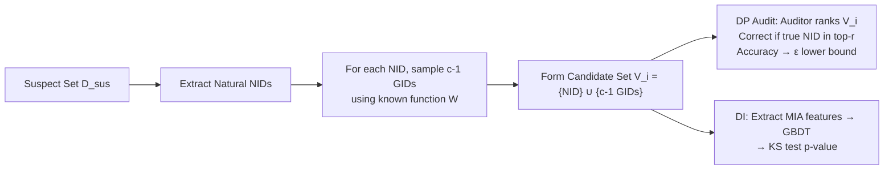

# Natural Identifiers for Privacy and Data Audits in Large Language Models

**Conference**: ICLR 2026  
**OpenReview**: [https://openreview.net/forum?id=doaAUf9Pi7](https://openreview.net/forum?id=doaAUf9Pi7)  
**Code**: TBD  
**Area**: LLM Privacy Auditing / Differential Privacy / Membership Inference  
**Keywords**: Natural Identifiers, Post-hoc DP Auditing, Dataset Inference, Membership Inference, Held-out Data  

## TL;DR
This paper discovers that naturally occurring structured random strings in training corpora (such as hashes, short links, and cryptocurrency addresses, termed **Natural Identifiers / NIDs**) have known generation functions. This allows for the infinite generation of IID "held-out data," enabling post-hoc differential privacy (DP) auditing and dataset inference (DI) on trained LLMs without **retraining models** or requiring **private IID validation sets**.

## Background & Motivation
**Background**: Assessing whether LLMs leak training data involves two main auditing methods: formal DP auditing (verifying if the $(\varepsilon,\delta)$-DP guarantee claimed during training is true) and Dataset Inference (DI) (determining if a suspect subset of data was used for training). Both rely internally on Membership Inference Attacks (MIA).

**Limitations of Prior Work**:
- **DP auditing requires canary insertion and retraining**: Conventional formal auditing (Steinke et al. 2023 is the current state-of-the-art "single-shot" scheme) requires inserting carefully constructed canaries before training and retraining to observe leaks. For trillion-parameter LLMs, the cost of retraining is prohibitive, making these methods **unusable for already trained pre-trained models**.
- **DI requires private IID held-out sets**: For MIA to succeed, non-member data must be **strictly independently and identically distributed (IID)** relative to member data. In reality, such held-out sets are extremely difficult to construct—currently, almost only the validation sets provided by Pile/Dolma are available. Once the distribution is biased (e.g., temporal splits causing phrasing/format drift), Maini et al. 2024 proved that most MIAs degrade to near-random guessing.

**Key Challenge**: Scalable, post-hoc privacy auditing is blocked by the twin barriers of "mandatory retraining" and "mandatory IID held-out sets."

**Goal**: To perform formal DP auditing and DI on any suspect set containing NIDs without changing the training process, retraining, or relying on external private validation sets.

**Key Insight**: **Natural Identifiers (NIDs) serve as natural canaries and IID held-out generators**. NIDs are structured random strings ($v=W(z)$) generated from a random source $z$ via a known function $W$; they exist abundantly in training corpora like GitHub and StackExchange (Pile contains 30,637 types, Dolma contains 23,571). The key insight is that since the generation function is known, one can sample new random sources $z'$ to generate infinite IID **Generated Identifiers (GIDs)**. Due to the vast identifier space (e.g., Ethereum addresses $2^{160} \approx 1.46 \times 10^{48}$), a new GID is almost certain not to collide with an existing NID—making GIDs perfect non-member held-out data.

## Method

### Overall Architecture
The method consists of two independent audit tracks sharing the NID/GID mechanism: (1) **Post-hoc DP Auditing**—treating naturally occurring NIDs in the corpus as "inserted canaries," generating a set of GIDs for each NID as "uninserted alternatives," and allowing an auditor to infer which is the true NID via ranking, from which the $\varepsilon$ lower bound is derived; (2) **Dataset Inference (DI)**—treating NIDs in the suspect set as members and generated GIDs as held-out data, using various MIAs to extract features, train classifiers, and perform statistical tests to judge if the suspect set was used in training. Neither track requires retraining or external validation sets.

### Key Designs

**1. NID/GID Formalization: Turning "natural random strings" into sampleable IID held-out sources.** An identifier is obtained by applying a known generator to a random source $v=W(z)$, where the set of all possible values is $V=\{W(z):z\in Z\}$. **NID** refers to the $v$ that actually appears in the data, while re-sampling $z'$ for the same type yields a **GID**. During auditing, for each NID $\hat v_i$ detected in the suspect set, $c-1$ new GIDs are sampled to form a candidate set $V_i=\{\hat v_i\}\cup\{c-1\ \text{GIDs}\}$ ($|V_i|=c$). The elegance of this formalization is that, a priori, each element in $V_i$ has an equal probability of being generated and published (depending only on the random source). Thus, "which one is the true NID" is uniformly random without looking at the model—precisely the null hypothesis required to construct audits/tests.

**2. Post-hoc DP Auditing: Using ranking instead of binary choice to infer $\varepsilon$ lower bound without retraining.** This work modifies the single-shot audit by Steinke et al. (2023). The original method relies on a coin flip to decide if each canary enters the training set, essentially a binary "add/remove one sample" choice that necessitates retraining. This paper treats natural NIDs as "inserted canaries" and GIDs as "multiple uninserted alternatives." The auditor's task is then to rank samples in $V_i$ from "most like training data" to "least like." A correct identification is recorded if the true NID falls within the top-$r_i$. The core theorem states that if the mechanism satisfies $\varepsilon$-DP, the top-$r$ hit count is upper-bounded by a Bernoulli distribution:
$$P\Big[\sum_{i=1}^{m}\mathbb{1}[\mathrm{rank}(t_i,S_i)\le r_i]\ge v\ \big|\ T=t\Big]\le P_{\hat S\sim\mathrm{Bernoulli}\left(\frac{r_i e^\varepsilon}{|V_i|-1+e^\varepsilon}\right)}[\hat S\ge v]$$
Based on this, a confidence lower bound for $\varepsilon$ is constructed via hypothesis testing. Compared to the original method where $c=2$, higher candidate cardinality $c$ (more GIDs) significantly tightens the lower bound and reduces the required sample size under high privacy budgets ($\varepsilon \ge 8$, common for LLM DP training). However, as $c$ increases, ranking becomes harder, making smaller cardinalities more advantageous for small $\varepsilon$.

**3. Dataset Inference: NIDs as natural canaries, GIDs completing the IID held-out.** DI has been hindered by the lack of "private IID held-out sets." This paper fills this gap with GIDs: for a suspect set $D_{sus}$, all NIDs are extracted into a subset $D'_{sus}$, and 127 GIDs of the same type are generated for each true NID as held-out data. Following the DI protocol of Maini et al. (2024), features are extracted using multiple MIAs (Loss, Min-K%, Min-K%++, ReCaLL, Hinge), and a Gradient Boosting Tree is trained to distinguish NIDs from GIDs (using K-Fold while ensuring derived samples stay in the same fold to avoid leakage). The null hypothesis is that "NIDs were not used for training," in which case the rank of each NID relative to its GIDs should follow a uniform distribution. Deviations are judged using the **Kolmogorov-Smirnov test**: $p < 0.01$ results in rejecting the null hypothesis and determining the suspect set was trained.

**4. Task-Specific NIDs: "Creating" identifiers for datasets lacking standard random strings.** Some small task datasets (e.g., math problems like GSM8K) naturally lack hashes or short links. This paper treats each problem as a "numeric template." For example, in "Natalia sold 48/2=24...", the number 48 and all its dependent quantities (24, 72) are replaced with variables and re-sampled consistently to produce new problems. The original becomes the NID, and the new ones become GIDs. Since numerical values are changed while maintaining the structure, GIDs are IID with NIDs, extending the DI framework to domains without standard NIDs.

## Key Experimental Results

### Main Results: DP Auditing and DI
- **DP Auditing (Pythia-70m/160m/410m/1b, DP-SGD fine-tuning)**: Using $m=197$ NIDs from the GitHub Pile test, $\delta=10^{-4}$, and Min-K%/Loss for ranking. Across $\varepsilon \in \{5, 10, 100, \infty\}$, higher cardinality $c \in \{8, 32\}$ consistently outperforms the $c=2$ baseline by Steinke et al. under fixed-length settings, providing tighter $\varepsilon$ lower bounds.

**DI on Pile (100 suspect samples, p < 0.01 threshold, ✓ indicates correct judgment)**:

| Model | GitHub | StackExch | HackerNews | Pile-CC | ArXiv | PubMed | UbuntuIRC | GH(Test) | Full(Test) |
|------|--------|-----------|------------|---------|-------|--------|-----------|----------|------------|
| Pythia-12B | 0.0031 ✓ | 0.0001 ✓ | 0.0001 ✓ | 0.0001 ✓ | 0.0001 ✓ | 0.0001 ✓ | 0.0001 ✓ | 0.8182 ✓ | 0.2847 ✓ |
| Pythia-6.9B | 0.0001 ✓ | 0.0001 ✓ | 0.0001 ✓ | 0.0002 ✓ | 0.0001 ✓ | 0.0001 ✓ | 0.0001 ✓ | 0.6139 ✓ | 0.0811 ✓ |
| Pythia-2.8B | 0.0001 ✓ | 0.0001 ✓ | 0.0001 ✓ | 0.0001 ✓ | 0.0001 ✓ | 0.0001 ✓ | 0.0001 ✓ | 0.9632 ✓ | 0.0660 ✓ |

**DI on Dolma (OLMo-7B, 100 samples)**: Subsets including OpenWebMath, PeS2o, RefinedWeb, AlgebraicStack, MegaWika, ArXiv, and C4 were all correctly rejected with $p \le 0.0003$. The held-out Proof Pile 2 yielded $0.8961$, correctly not rejected. **True positives for all training subsets, true negatives for all test sets, zero false positives.**

### Ablation Study
- **NID vs Injected Canary**: NIDs achieve DI p-values comparable to artificially injected canaries (even though injected canaries are not within the post-hoc threat model).
- **Importance of GID IID**: Deliberately causing GIDs to deviate from the NID distribution (e.g., casing changes) provides strong signals for both members/non-members, leading to false positives—validating the need for "strictly IID generation."
- **Stronger MIA**: DI consistently improves with the addition of CAMIA and SURP, indicating the framework can leverage advancements in MIA.
- **Identifier Structure**: Longer/structured formats like SHA-512 and Java serialization strings provide the strongest signals, but formats as short as MD5 remain highly significant.
- **NID Quantity**: As the number of NIDs in the suspect set increases, the DI p-value monotonically decreases (statistical power improves).

**Task-Specific NID (GSM8K, Pythia-1b fine-tuned with 100 NIDs)**:

| NID Count | 50 | 60 | 70 | 80 | 90 | 100 |
|----------|-----|-----|-----|-----|-----|-----|
| P-Value | 8.43e-4 | 9.56e-5 | 3.35e-4 | 1.63e-5 | 2.12e-6 | — |

### Key Findings
- MIA AUC on test sets is near 0.5 (random), confirming NID and GID are truly IID (on Pythia-12b, GitHub train AUC reached 71.8, while test was ~51).
- Even after aggressive regex cleaning, URL normalization, PII filtering, and multi-stage deduplication, Dolma still retains tens of thousands of NIDs—auditors only need to identify a **small amount** of NIDs in a suspect set to audit, making the method robust against strict data cleaning pipelines.

## Highlights & Insights
- **"Natural Canary" is a true paradigm shift**: Previous auditing either required active canary injection (needing retraining) or finding held-out sets (needing private data). The insight of this paper is that the combination of "known generation function + massive identifier space" provides infinite IID non-members for free, shifting "insertion" to "discovery."
- **Ranking generalization is more flexible than binary determination**: Extending top-1 binary choice to top-$r$ of $c$ options allows auditors to express uncertainty through ranking and provides an adjustable statistical power knob (cardinality $c$).
- **Zero false positives + True zero training rounds**: Achieves zero false positives on open-source models with known ground truth. Unlike Steinke's "single training round," this is a true "zero training round" post-hoc audit, offering direct value for real-world legal scenarios (e.g., copyright data forensics).
- **Asymmetry in removal difficulty**: It is extremely difficult for LLM vendors to filter all natural NIDs (as new types emerge and quantities are vast), while auditors only need to find a very small number, making the method effective in the long term.

## Limitations & Future Work
- **Threat model limited to open-source known training data**: To verify correctness, experiments were conducted only on open-source models (Pythia/OLMo) where ground truth is checkable; for true closed-source proprietary models, DI conclusions cannot be independently verified.
- **DP auditing still requires micro-finetuning with DP injection**: Due to the lack of open-source "privately pre-trained LLMs," the DP auditing part was demonstrated by fine-tuning Pythia with DP-SGD rather than auditing a third-party model claiming DP.
- **Reliance on NIDs in suspected sets**: If a suspect set lacks standard NIDs and it's difficult to construct task-specific NIDs (e.g., pure free text without parametrizable structure), the method's applicability is limited.
- **GID generation must be precisely IID**: Ablations show any distributional deviation introduces false positives; in practice, generators for each NID type must be implemented carefully.

## Related Work & Insights
- **DP Auditing**: Built upon Steinke et al. (2023) single-shot auditing. It is more flexible than Panda et al. (2025) (enhancing signal with random token wrapping) and Mahloujifar et al. (2025) (top-1 identification) and removes retraining requirements. Unlike Kazmi et al. (2024), it does not require training generative models.
- **DI and MIA**: Follows the DI protocol of Maini et al. (2024) but solves the core flaw of "requiring private held-out sets." It differs from Zhang et al. (2024a) (injecting random canaries, easily filtered by crawlers and invalid for existing models) and Zhao et al. (2025) (training suffix generators for synthetic held-out, which is computationally expensive and has residual distribution drift).
- **Insight**: When a data type possesses a "known generation process + massive value space," it can serve as a natural privacy auditing probe—an idea generalizes to membership/data auditing for other generative models like diffusion and image autoregressive models.

## Rating
- **Novelty**: ⭐⭐⭐⭐⭐ The transition to "infinite IID held-out via known generation functions of natural identifiers" is a simple yet profound conceptual shift that solves both post-hoc DP auditing and DI.
- **Experimental Thoroughness**: ⭐⭐⭐⭐ Covers the full Pythia family + OLMo, Pile + Dolma subsets, with extensive ablations (canary comparison, IID sensitivity, MIA strength, identifier structure, NID count, task-specific NIDs), though limited by open checkable models.
- **Writing Quality**: ⭐⭐⭐⭐ Logic from motivation to insight to method to verification is clear. Theorems and intuitions (randomized response analogy) are well-integrated, though some algorithmic details are in the appendix.
- **Value**: ⭐⭐⭐⭐⭐ Makes "post-hoc privacy/copyright auditing for trained LLMs" feasible, with direct practical implications for regulation, litigation forensics, and responsible deployment.

<!-- RELATED:START -->

## Related Papers

- [\[ICLR 2026\] Benchmarking Empirical Privacy Protection for Adaptations of Large Language Models](benchmarking_empirical_privacy_protection_for_adaptations_of_large_language_mode.md)
- [\[ICLR 2026\] Measuring Physical-World Privacy Awareness of Large Language Models: An Evaluation Benchmark](measuring_physical-world_privacy_awareness_of_large_language_models_an_evaluatio.md)
- [\[ICLR 2026\] SecP-Tuning: Efficient Privacy-Preserving Prompt Tuning for Large Language Models via MPC](secp-tuning_efficient_privacy-preserving_prompt_tuning_for_large_language_mode.md)
- [\[ICLR 2026\] Operationalizing Data Minimization for Privacy-Preserving LLM Prompting](operationalizing_data_minimization_for_privacy-preserving_llm_prompting.md)
- [\[AAAI 2026\] SafeNlidb: A Privacy-Preserving Safety Alignment Framework for LLM-based Natural Language Database Interfaces](../../AAAI2026/llm_safety/safenlidb_a_privacy-preserving_safety_alignment_framework_for_llm-based_natural_.md)

<!-- RELATED:END -->
