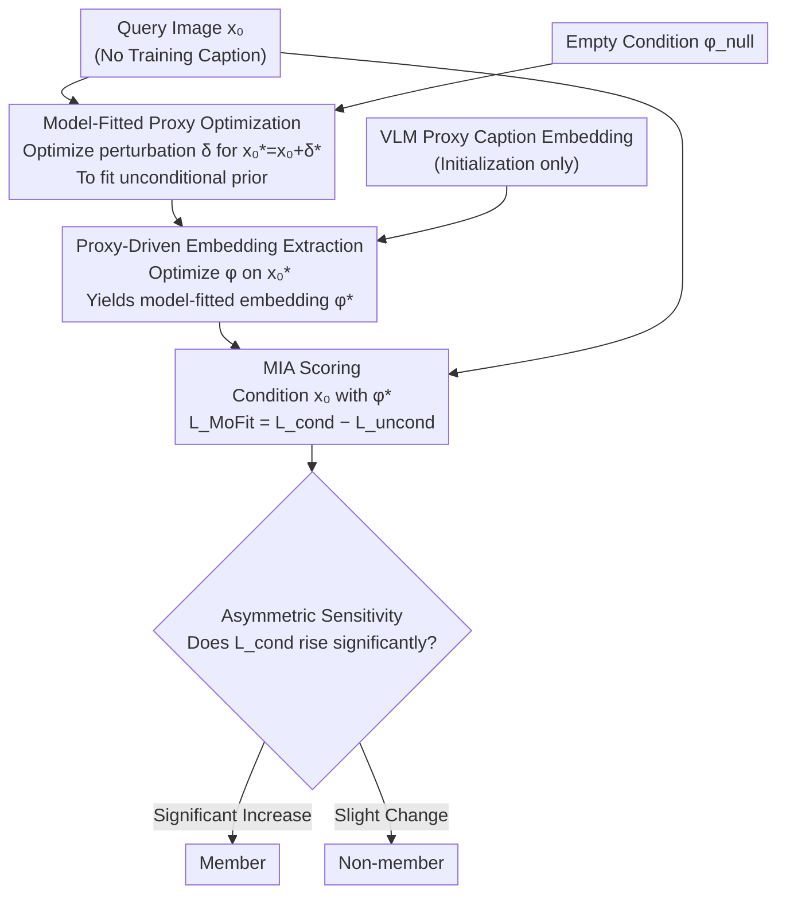

# No Caption, No Problem: Caption-Free Membership Inference via Model-Fitted Embeddings

**Conference**: ICLR 2026  
**arXiv**: [2602.22689](https://arxiv.org/abs/2602.22689)  
**Code**: [GitHub](https://github.com/JoonsungJeon/MoFit)  
**Area**: AI Safety / Privacy Attacks  
**Keywords**: Membership Inference Attack, Diffusion Models, Caption-free setting, Model-fitted embeddings, Privacy auditing

## TL;DR

The authors propose MoFit, the first caption-free Membership Inference Attack (MIA) framework for diffusion models. By constructing surrogate images and conditional embeddings overfitted to the target model, MoFit leverages the asymmetric sensitivity of member samples to conditional mismatch to achieve effective inference.

## Background & Motivation

- The tendency of diffusion models to memorize training data during high-fidelity generation raises privacy and intellectual property concerns.
- Membership Inference Attack (MIA) is a standard method for auditing memorization.
- **Limitations of Prior Work**: Existing MIAs assume the attacker possesses ground-truth captions, which is often unrealistic because:
    - Artists suspecting their work has been copied typically lack access to the training captions.
    - Public generative AI platforms do not disclose their training set sources.
- Prior SOTA methods suffer significant performance degradation when ground-truth captions are replaced with alternative captions generated by Vision-Language Models (VLMs).

## Method

### Overall Architecture

MoFit transforms the lack of ground-truth captions into an optimization problem tailored to the target model. It first generates a surrogate image in the pixel space that overfits the target model's unconditional prior. Subsequently, a conditional embedding $\phi^*$ "recognized" by the target model is back-extracted from this surrogate image. Finally, this $\phi^*$ is used to condition the original query image, and membership is determined by how much the conditional denoising loss decreases relative to the unconditional loss. The entire process requires no training captions or additional models, only accessing the target model's denoising network.

### Key Designs

**1. Asymmetric Sensitivity Observation: Identifying Signal in Caption-Free Settings**

The foundation of MoFit is an empirical observation: member and non-member samples react with a systematic difference in sensitivity to "condition mismatch." When conditioned on a proxy caption (instead of the ground truth), the conditional denoising loss $\mathcal{L}_{\text{cond}}$ of member samples increases significantly, whereas non-member samples exhibit much smaller changes. Meanwhile, the unconditional loss $\mathcal{L}_{\text{uncond}}$ remains stable for both groups. Intuitively, the target model fits a sharp conditional distribution for seen samples; once the condition deviates from the "correct" direction, it is penalized more heavily. This asymmetry implies that even without ground-truth captions, constructing a condition that fits the target model's geometry can amplify the loss discrepancy into a discriminative signal.

**2. Model-Fitted Proxy Optimization: Creating an "Overfitted" Image**

Directly extracting embeddings from the original image $x_0$ is hindered by the image's own content, making it difficult to approximate the model's conditional geometry. MoFit instead optimizes a pixel perturbation $\delta$ to obtain a surrogate image $x_0^* = x_0 + \delta^*$ that is maximally "accepted" by the target model under its unconditional prior:

$$\delta^* = \arg\min_\delta \mathbb{E}_{z_0', t, \hat{\epsilon}} [\|\hat{\epsilon} - \epsilon_\theta(z_t', t, \phi_{\text{null}})\|^2]$$

Using the empty condition $\phi_{\text{null}}$ ensures the surrogate carries only the target model's unconditional preferences. In practice, the perturbation direction is stabilized by fixing a single sample $\hat{\epsilon}$ and timestep $t=140$. Updates are iterated via gradient descent to push the surrogate image into high-density regions of the target model's unconditional distribution. Ablations show this step is critical; using the original image or random noise leads to a significant drop in ASR.

**3. Proxy-Driven Embedding Extraction: Back-inferring "Recognized" Conditions**

Given the overfitted surrogate $x_0^*$, the second stage optimizes the conditional embedding $\phi$ to minimize the conditional denoising loss:

$$\phi^* = \arg\min_\phi \mathbb{E}_{z_0^*, t, \hat{\epsilon}} [\|\hat{\epsilon} - \epsilon_\theta(z_t^*, t, \phi)\|^2]$$

The optimization is initialized with a VLM-generated caption embedding and then "pulled" toward the target model's preferred conditional direction by the surrogate image. The resulting $\phi^*$ is not a semantic caption but a vector fitted to the target model's conditional geometry. The surrogate image and embedding form a "model-fitted pair" where the surrogate anchors the unconditional prior and the embedding aligns with the conditional direction.

**4. MIA Scoring: Amplifying Asymmetric Loss Differences via $\phi^*$**

Finally, returning to the original query $x_0$, the model-fitted $\phi^*$ is used for conditioning. The score is calculated by subtracting the unconditional loss baseline:

$$\mathcal{L}_{\text{MoFit}} = \mathbb{E}[\|\hat{\epsilon} - \epsilon_\theta(z_t, t, \phi^*)\|^2] - \mathbb{E}[\|\hat{\epsilon} - \epsilon_\theta(z_t, t, \phi_{\text{null}})\|^2]$$

Subtracting $\mathcal{L}_{\text{uncond}}$ removes bias stemming from image complexity, leaving only the discrepancy caused by condition mismatch—the amplified signal for member samples. The final decision combines the MoFit score with an auxiliary loss ($\mathcal{L}_{\text{uncond}}$ or VLM caption loss $\mathcal{L}_{\text{VLM}}$) for robustness. Timestep is fixed at $t=140$.

## Key Experimental Results

### MIA Performance Comparison in Caption-Free Setting

| Method | Condition | Pokemon ASR | Pokemon TPR@1%FPR | MS-COCO ASR | MS-COCO TPR@1%FPR |
|------|------|------------|-------------------|-------------|-------------------|
| CLiD | GT | 96.52 | 90.14 | 86.50 | 68.80 |
| CLiD | VLM | 77.55 | 19.23 | 80.90 | 50.80 |
| PFAMI | VLM | 74.43 | 6.01 | 80.40 | 29.40 |
| SecMI | VLM | 78.51 | 6.97 | 57.30 | 4.20 |
| **MoFit** | **$\phi^*$** | **94.48** | **50.48** | **88.00** | **47.00** |

### Ablation Study: Surrogate Image Variants

| Input | Condition | Pokemon ASR | MS-COCO ASR | MS-COCO TPR@1%FPR |
|------|------|------------|-------------|-------------------|
| $x_0$ (Original) | $\phi$ | 75.63 | 78.00 | 31.00 |
| $x_0 + \delta$ (Random Noise) | $\phi$ | 93.99 | 81.70 | 29.20 |
| $x_0 + \delta_{\text{MAX}}$ (Reverse Opt) | $\phi$ | 75.87 | 78.00 | 34.00 |
| **MoFit** ($x_0 + \delta^*$) | **$\phi^*$** | **94.48** | **88.00** | **47.00** |

### Key Findings

1. MoFit significantly outperforms VLM-conditioned baselines in caption-free settings (up to +25% ASR gain and +30-47% TPR@1%FPR gain).
2. On MS-COCO, MoFit even exceeds CLiD using ground-truth captions (ASR: 88.00 vs. 86.50).
3. Proxy optimization is essential: using original images or random noise for embedding optimization yields markedly worse results.
4. Effectiveness on SD v1.5 pre-trained models (ASR: 77.61) demonstrates the method's generalizability.

## Highlights & Insights

1. **Practical Problem Definition**: The caption-free MIA scenario aligns more closely with real-world auditing needs.
2. **Deep Theoretical Insight**: The asymmetric sensitivity of member samples to condition mismatch provides a new exploitable signal.
3. **Clever Two-Stage Design**: Constructing an overfitted surrogate before extracting embeddings creates a tightly coupled model-fitted pair.
4. **Self-Contained**: Requires no external data or models, relying only on inference access to the target model.

## Limitations

- Requires access to the target model's denoising network parameters (gray-box assumption).
- Proxy optimization and embedding extraction increase computational overhead.
- Step $t=140$ is a fixed hyperparameter that may require tuning for different models.
- Reduced effectiveness on LAION-scale pre-trained models (where all current methods struggle).

## Related Work

- **Diffusion Model MIA**: SecMI, PIA, PFAMI, CLiD
- **LLM MIA**: Shokri et al. (2017)
- **Caption-Free Generation**: Classifier-free guidance (Ho & Salimans, 2022)

## Rating

- Novelty: ⭐⭐⭐⭐⭐ — First diffusion MIA framework specifically for caption-free scenarios.
- Technical Depth: ⭐⭐⭐⭐ — Profound core observations and sound two-stage optimization design.
- Experimental Thoroughness: ⭐⭐⭐⭐ — Multiple datasets, models, and extensive ablations.
- Value: ⭐⭐⭐⭐ — Provides a practical tool for data privacy auditing.

<!-- RELATED:START -->

## Related Papers

- [\[ACL 2026\] Do Multimodal RAG Systems Leak Data? A Comprehensive Evaluation of Membership Inference and Image Caption Retrieval Attacks](../../ACL2026/llm_safety/do_multimodal_rag_systems_leak_data_a_comprehensive_evaluation_of_membership_inf.md)
- [\[ICLR 2026\] Information-Theoretic Membership Inference for Granular Quantification of Memorization](information-theoretic_membership_inference_for_granular_quantification_of_memori.md)
- [\[ICLR 2026\] Membership Inference Attacks Against Fine-tuned Diffusion Language Models (SAMA)](membership_inference_attacks_against_fine-tuned_diffusion_language_models.md)
- [\[ICLR 2026\] All Code, No Thought: Language Models Struggle to Reason in Ciphered Language](all_code_no_thought_language_models_struggle_to_reason_in_ciphered_language.md)
- [\[ACL 2026\] Membership Inference Attacks on In-Context Learning Recommendation](../../ACL2026/llm_safety/membership_inference_attacks_on_llm-based_recommender_systems.md)

<!-- RELATED:END -->
