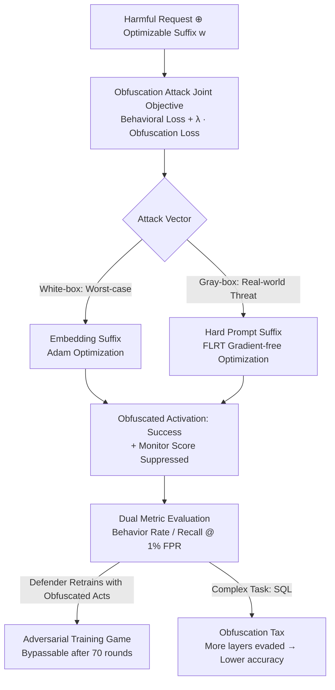

# Obfuscated Activations Bypass LLM Latent-Space Defenses

**Conference**: ICLR 2026  
**OpenReview**: [https://openreview.net/forum?id=ktGmDGoWnB](https://openreview.net/forum?id=ktGmDGoWnB)  
**Code**: https://github.com/LukeBailey181/obfuscated-activations  
**Area**: AI Safety / Adversarial Attacks / Interpretability  
**Keywords**: Latent-space Monitoring, Activation Probes, Jailbreak Attacks, Obfuscated Activations, OOD Detection

## TL;DR
This paper proposes "obfuscation attacks"—adding a loss term to "deceive latent-space monitors" in addition to behavioral goals like jailbreaking or SQL generation. By jointly optimizing adversarial suffixes, the authors reduce the recall of various activation probes (Linear/MLP/OOD) from 100% to 0% while maintaining a 90% jailbreak success rate. This proves that white-box latent-space monitoring is not robust against worst-case attacks, though it identifies an "obfuscation tax": evading probes in complex tasks like SQL generation degrades the model's inherent performance.

## Background & Motivation
**Background**: To counter attacks like jailbreaking and data poisoning, the community has recently focused on "latent-space defenses." Instead of monitoring output text, these defenses scan intermediate activations using linear probes, MLP probes, Sparse Autoencoders (SAEs), or OOD detectors to determine the presence of harmful concepts. The intuition is that activations precede outputs causally, and intercepting them at the root should be effective.

**Limitations of Prior Work**: The effectiveness of these defenses relies on an unverified assumption: "harmful behavior necessarily corresponds to identifiable harmful activations." If a model can express the same harmful concept through many different activation patterns, the specific "harmful directions" used to train monitors may only represent the tip of the iceberg, allowing attackers to bypass them.

**Key Challenge**: An attacker faces a seemingly contradictory dual objective: inducing activations that produce harmful behavior while ensuring those activations appear "harmless" to the monitor. If only one "harmful direction" exists in latent space, these goals cannot be satisfied simultaneously. However, if harmful behavior can be generated from diverse latent regions, monitors will inevitably fail. The problem reduces to whether "obfuscated activations" are rare exceptions or widespread.

**Goal**: (1) Investigate if standard jailbreak attacks accidentally produce obfuscated activations; (2) Determine if obfuscated activations can be actively constructed to bypass monitors; (3) Assess if adversarial training can make monitors robust.

**Key Insight**: The authors explicitly include "deceiving the monitor" in the optimization objective. By adding an "obfuscation loss" to the behavioral loss, they can quantitatively explore the prevalence of obfuscated activations in latent space.

**Core Idea**: Use a joint loss $L_{beh} + \lambda_{obf}L_{obf}$ to tie "achieving target behavior" and "lowering monitor scores" together when optimizing adversarial suffixes, systematically inducing "obfuscated activations" that jailbreak successfully while deceiving latent monitors.

## Method

### Overall Architecture
The method adds an anti-monitoring penalty to standard adversarial suffix attacks. Given a harmful request, the attacker appends an optimizable suffix $w$ (tokens or an embedding matrix). They jointly minimize two losses: the behavioral loss $L_{beh}$ (cross-entropy to induce the target harmful response) and the obfuscation loss $L_{obf}$ (the score assigned by the monitor $D(R(\cdot))$). Once optimized, the suffix is appended to test requests, causing the model to output harmful content while its intermediate activations remain in regions rated as "harmless" by monitoring probes or OOD detectors.

The pipeline forms a loop of "Attack → Dual Metric Evaluation → (Optional) Defense Adversarial Retraining → Re-attack." Success is measured by behavior achievement (StrongREJECT or SQLEval) and activation obfuscation (Recall at 1% FPR).

### Key Designs

**1. Joint Optimization: Including "Deceiving Monitor" in Loss**
Latent defenses have been assumed robust because no one specifically optimized attacks against them. Standard jailbreak attacks target only the output, leaving activations recognizable by probes (Recall ~90%). This paper turns the monitor into a differentiable target. For a harmful request $inp$ and target output $out$, the suffix $w$ minimizes:

$$L(w) = \frac{1}{|D|}\sum_{inp,out\in D}\big[\underbrace{\text{CrossEntropy}(M(inp\oplus w),\, out)}_{\text{Behavioral Loss}} + \underbrace{D(R(inp\oplus w\oplus out))}_{\text{Obfuscation Loss}}\big]$$

where $D(R(\cdot))$ is the monitor's harmfulness score. $\lambda_{obf}$ is tuned in $[0.1, 10]$. This objective forces the optimizer toward directions in activation space that the monitor cannot perceive. Results show embedding attacks can reduce monitor recall to 0% while maintaining a 90% jailbreak rate.

**2. Two Attack Vectors: White-box Embedding vs. Gray-box Hard Prompt**
The authors use two threat models to bound the results. **Hard Prompt Suffixes** represent real-world threats: the attacker uses actual tokens and only has access to logits and monitor scores (gray-box). They use a modified FLRT optimizer for gradient-free token manipulation. **Embedding Suffixes** represent the worst-case: the attacker has white-box access to optimize a length-16 embedding matrix. Results show that while embedding attacks break everything, **generative MLP probes** are significantly more robust against hard prompt attacks, suggesting a shift away from simple linear probes.

**3. Adversarial Training Game: 70 Rounds Cannot Close the Gap**
If obfuscated activations were rare, defenders could retrain monitors on them to achieve robustness. The authors conduct an iterative game: at each epoch, the attacker generates suffixes to bypass the current monitor, and the defender retrains the monitor on all current and historical obfuscated activations. Even after 70 rounds, the attacker consistently finds new suffixes that bypass the updated probes while maintaining high jailbreak rates. This indicates that **no simple "harmful direction" exists** in latent space; obfuscated activations are abundant.

**4. Obfuscation Tax: Capability Trade-offs in Complex Tasks**
While simple harmful tasks are easily obfuscated, the authors found a "tax" in complex tasks like SQL generation. When forcing the model to hide SQL-related concepts across an increasing number of layers ($n$), the accuracy of the generated SQL (measured by SQLEval) consistently drops. This suggests an incompatibility between executing complex tasks and obfuscating the corresponding latent representations—the model can express concepts in different ways, but not all patterns preserve full reasoning capability.

### Loss & Training
The joint loss uses teacher-forced cross-entropy for behavior and the direct monitor score for obfuscation. Embedding attacks utilize Adam on a white-box setup, while hard prompt attacks use the gradient-free FLRT algorithm. LLM parameters are frozen; only the suffix is optimized.

## Key Experimental Results

### Main Results
Tested on Llama-3-8B-Instruct (Toxicity) and Gemma-2-2b (SQL).

| Setup | Attack Vector | Recall @ 1% FPR (Baseline) | Recall @ 1% FPR (Obfuscated) | Success Rate |
| :--- | :--- | :--- | :--- | :--- |
| Toxicity Probes (Linear/MLP/OOD) | Embedding (Worst-case) | ~100% | ↓ to 0% | ~90% Jailbreak |
| Toxicity Probes | Hard prompt (Real-world) | High | Significant drop | Partial Jailbreak |
| SQL Probes (LogReg/MLP/SAE) | Embedding (Worst-case) | High | ~0% | SQL Generated |

**Key Finding**: Obfuscation attacks are highly transferable between supervised probes but do not transfer easily to OOD detectors, suggesting that an ensemble of supervised probes and OOD detectors is a viable defense strategy.

### Ablation Study

| Configuration | Key Phenomenon | Description |
| :--- | :--- | :--- |
| Standard Jailbreak (No Obf. Loss) | Recall ~90% | Normal attacks do not spontaneously obfuscate. |
| + Obfuscation Loss (Embedding) | Recall ↓ 0% | Joint objective is the key variable for bypass. |
| Hard Prompt (Gray-box) | Partial Recall drop | Generative MLP probes are most robust here. |
| Adversarial Training (70 rounds) | New attacks still bypass | High density of obfuscated activations. |
| SQL Evading 0→26 layers | Accuracy 34.8% → Downward trend| Obfuscation Tax: Complex tasks have costs. |

## Highlights & Insights
- **Differentiable Defense Targets**: Treating the monitor score as a loss term provides a universal attack paradigm against any latent monitoring method.
- **Obfuscation Tax as a Silver Lining**: The discovery that hiding activations degrades performance in complex tasks offers hope for defense, showing that attackers cannot always have both success and stealth.
- **Latent Geometry Insights**: The failure of adversarial training provides evidence that "harmful concepts" are not isolated to a single direction but are distributed across a vast, plastic activation space.
- **Practical Recommendations**: Use non-linear generative probes and combine supervised probes with OOD detectors.

## Limitations & Future Work
- Adversarial training might eventually scale to robustness beyond 70 rounds with more compute.
- Embedding attacks represent a white-box worst-case that may not be feasible in many real-world API-based scenarios.
- The "Obfuscation Tax" was primarily explored via SQL; its universality across other complex reasoning tasks remains to be proven.
- Future work could focus on predicting which tasks have high obfuscation taxes to design more "un-obfuscatable" monitors.

## Related Work & Insights
- **vs. Standard Jailbreaks (GCG/FLRT)**: These only optimize output, leaving activations exposed. Ours adds the obfuscation loss to bypass the "root" of the defense.
- **vs. Image Domain Latent Defense Bypassing**: Extends C&W-style attacks to the LLM latent space across multiple monitor types.
- **vs. Interpretability Research (SAE/Probing)**: Complements work on jailbreak latent states by showing these states can be actively manipulated into "benign" regions.

## Rating
- Novelty: ⭐⭐⭐⭐⭐ 
- Experimental Thoroughness: ⭐⭐⭐⭐⭐ 
- Writing Quality: ⭐⭐⭐⭐⭐ 
- Value: ⭐⭐⭐⭐⭐

<!-- RELATED:START -->

## Related Papers

- [\[ICLR 2026\] Dual-Space Smoothness for Robust and Balanced LLM Unlearning](dual-space_smoothness_for_robust_and_balanced_llm_unlearning.md)
- [\[ACL 2026\] SLIM: Stealthy Low-Coverage Black-Box Watermarking via Latent-Space Confusion Zones](../../ACL2026/llm_safety/slim_stealthy_low-coverage_black-box_watermarking_via_latent-space_confusion_zon.md)
- [\[ICLR 2026\] PropensityBench: Evaluating Latent Safety Risks in Large Language Models via an Agentic Approach](propensitybench_evaluating_latent_safety_risks_in_large_language_models_via_an_a.md)
- [\[ICLR 2026\] Constitutional Classifiers++: Efficient Production-Grade Defenses against Universal Jailbreaks](constitutional_classifiers_efficient_production-grade_defenses_against_universal.md)
- [\[ICLR 2026\] A Guardrail for Safety Preservation: When Safety-Sensitive Subspace Meets Harmful-Resistant Null-Space](a_guardrail_for_safety_preservation_when_safety-sensitive_subspace_meets_harmful.md)

<!-- RELATED:END -->
## Related Papers

- [\[ICLR 2026\] Dual-Space Smoothness for Robust and Balanced LLM Unlearning](dual-space_smoothness_for_robust_and_balanced_llm_unlearning.md)
- [\[ACL 2026\] SLIM: Stealthy Low-Coverage Black-Box Watermarking via Latent-Space Confusion Zones](../../ACL2026/llm_safety/slim_stealthy_low-coverage_black-box_watermarking_via_latent-space_confusion_zon.md)
- [\[ICLR 2026\] PropensityBench: Evaluating Latent Safety Risks in Large Language Models via an Agentic Approach](propensitybench_evaluating_latent_safety_risks_in_large_language_models_via_an_a.md)
- [\[ICLR 2026\] A Guardrail for Safety Preservation: When Safety-Sensitive Subspace Meets Harmful-Resistant Null-Space](a_guardrail_for_safety_preservation_when_safety-sensitive_subspace_meets_harmful.md)
- [\[ICLR 2026\] LLM Unlearning with LLM Beliefs](llm_unlearning_with_llm_beliefs.md)

<!-- RELATED:END -->
