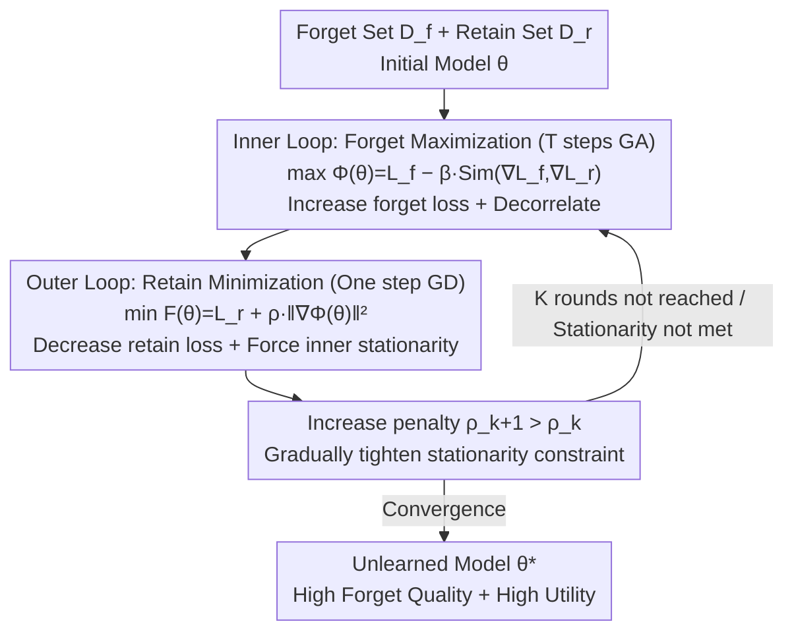

# OFMU: Optimization-Driven Framework for Machine Unlearning

**Conference**: ICLR 2026  
**arXiv**: [2509.22483](https://arxiv.org/abs/2509.22483)  
**Code**: None  
**Area**: AI Safety / Machine Unlearning  
**Keywords**: Machine Unlearning, Bi-level Optimization, Gradient Decorrelation, Forget-Retain Trade-off, LLM Privacy

## TL;DR
Machine unlearning is modeled as a bi-level optimization problem: the inner layer maximizes forget loss while employing gradient decorrelation to prevent retention set damage, and the outer layer minimizes retain loss with a penalty term to enforce inner-layer stationarity. On the TOFU benchmark, it simultaneously achieves high forget quality and model utility, surpassing existing GA/GradDiff/NPO/RMU methods in balancing trade-offs.

## Background & Motivation

**Background**: LLMs must forget specific knowledge on demand (GDPR compliance, copyright, outdated information), but retraining from scratch is impractical. Existing strategies include input-level (refusal policies), data-level (auxiliary data construction), and model-level (parameter modification).

**Limitations of Prior Work**:
   - Input-level methods are fragile; adversarial prompts can bypass refusal.
   - Model-level methods use static weights to balance forget/retain objectives, failing to adapt dynamically.
   - GradAscent/GradDiff are highly destructive on hard-to-forget samples—sample difficulty is strongly coupled with utility loss.

**Key Challenge**: When forget gradients and retain gradients are correlated, enhancing forgetting destroys retention.

**Core Idea**: Bi-level optimization + gradient decorrelation = forgetting without harming retention.

## Method

### Overall Architecture
OFMU explicitly deconstructs the conflicting goals of "forgetting specific knowledge" and "maintaining remaining capabilities" into a nested bi-level optimization. The **inner layer** focuses on forgetting—using gradient ascent to increase forget loss while applying a similarity penalty to decorrelate the forget gradient from the retain gradient, preventing "knowledge erasure" updates from damaging the retention set. The **outer layer** focuses on retention—minimizing retain loss while requiring the resulting parameters to be a stationary point of the inner objective. Since solving such a bi-level structure directly is computationally expensive (requiring the inner layer to reach convergence for every outer step), the key insight of OFMU is to treat "inner stationarity" as a penalty term and **reformulate the bi-level problem into a single-level objective** $F(\theta)=\mathcal{L}_r(\theta)+\rho\|\nabla_\theta\Phi(\theta)\|^2$. It then employs a **two-loop algorithm** that alternates between "inner-loop forgetting + outer-loop retention," accompanied by a penalty coefficient that increases with iterations and a proof of convergence.

### Key Designs

**1. Bi-level Modeling + Similarity Decorrelation Penalty: Separate management of forget/retain and prevention of gradient erosion**

Most existing model-level methods formulate forgetting and retention as a linearly weighted single objective (scalarized using $\lambda$). Once fixed, these weights cannot adapt to sample difficulty; strong forget signals on difficult samples can erode the retention set along the coupled gradient direction. OFMU adopts a hierarchical approach: the inner layer handles only forgetting with the objective $\Phi(\theta) = \mathcal{L}_f(\theta) - \beta \cdot \text{Sim}(\nabla\mathcal{L}_f, \nabla\mathcal{L}_r)$. The first term increases forget loss, while the $\text{Sim}$ term represents the **cosine similarity** between the forget and retain gradients (evaluating direction while removing magnitude variance). Penalizing this term forces the forget updates toward a direction orthogonal to the retain gradient, geometrically removing components that damage retention. The outer layer handles only retention by minimizing $\mathcal{L}_r$ while constraining the final parameters $\theta^*$ to be a stationary point ($\nabla_\theta\Phi(\theta^*)=0$).

**2. Penalty-based Single-level Reformulation: Transforming the stationarity constraint into a soft penalty to bypass nested solving**

Strictly solving a bi-level problem is computationally infeasible for LLMs, as the inner maximization must converge for every outer update. Instead, OFMU treats the inner stationarity condition $\nabla_\theta\Phi(\theta)=0$ as a **soft constraint** within the outer objective, yielding a single-level unconstrained objective:

$$F(\theta) = \mathcal{L}_r(\theta) + \rho\,\|\nabla_\theta\Phi(\theta)\|^2$$

The first term minimizes retain loss, while $\rho\|\nabla_\theta\Phi\|^2$ penalizes the residual norm of the inner gradient. As $\rho \to \infty$, any local minimum of $F$ satisfies the original bi-level constraint $\nabla_\theta\Phi=0$. This step compresses the nested optimization into a direct optimization objective while preserving the hierarchical "forget then retain" structure.

**3. Two-loop Algorithm + Convergence Guarantee: Alternating forget/retain cycles with provable convergence rates**

The landscape of $F$ is highly non-convex. OFMU uses a two-loop strategy for stability. The **inner loop** fixes outer parameters and runs $T$ steps of gradient ascent $\theta'^{(t+1)} = \theta'^{(t)} + \eta_{\text{in}}\nabla\Phi(\theta'^{(t)})$ to incorporate forgetting and decorrelation. The **outer loop** then performs a retention update $\theta^{(k+1)} = \theta^{(k)} - \eta_{\text{out}}(\nabla\mathcal{L}_r + 2\rho_k\nabla^2\Phi\cdot\nabla\Phi)$, where the Hessian term $\nabla^2\Phi\cdot\nabla\Phi$ is computed via **Hessian-vector products** to avoid explicit Hessian construction. The authors provide convergence rates: $O(1/K)+O(K/T^2)$ for convex settings and convergence to a stationary point in non-convex settings.

## Key Experimental Results

### Main Results: TOFU Benchmark (LLaMA-2-7B)

| Method | FQ (forget01) | MU | FTR | Notes |
|------|-------------|----|----|------|
| Retrain | 1.00 | 0.63 | 0.68 | Ideal upper bound |
| GradAscent | 1.88e-4 | 0.55 | 0.36 | Weak forget + Poor retain |
| GradDiff | 3.02e-3 | 0.57 | 0.41 | Slightly better |
| NPO | 0.40 | 0.58 | 0.65 | Moderate |
| RMU | 0.40 | 0.62 | 0.64 | Moderate |
| **OFMU** | **0.42** | **0.63** | **0.68** | **Close to Retrain** |

### Ablation Study

| Configuration | Key Findings |
|------|--------|
| w/o Gradient Decorrelation | Forget quality improves but retention is severely damaged |
| w/o Bi-level structure (Linear weighting) | $\lambda$ trade-off is unstable and difficult to fine-tune |
| Full OFMU | Optimal balance |

### Key Findings
- **OFMU approaches the Retrain bound**: MU=0.63 and FTR=0.68 are both equal to the Retrain baseline.
- **GA/GradDiff collapse on forget05/10**: FQ drops to e-119 ~ e-239, indicating total failure in large-scale unlearning.
- **Gradient decorrelation decouples the issues** associated with hard-to-forget samples.

## Highlights & Insights
- **Redefining Unlearning via Bi-level Optimization**: Unlearning is not just multi-objective linear weighting; it is better modeled as an outer optimization constrained by inner gradient stationarity.
- **Gradient Decorrelation Design**: Using cosine similarity penalty to ensure orthogonality between forget and retain gradients geometrically eliminates conflict—similar in philosophy to NSPO's null-space projection but applied to unlearning.

## Limitations & Future Work
- High computational overhead for Hessian-vector products.
- Not tested on models >70B or multimodal scenarios.
- Continual unlearning (multiple sequential forget requests) remains unexplored.

## Related Work & Insights
- **vs GradAscent/GradDiff**: Simple GA collapses during large-scale unlearning; OFMU maintains stability through its bi-level structure.
- **vs NPO/RMU**: While these use heuristic weight balancing, OFMU provides a rigorous bi-level framework with stronger theoretical guarantees.
- **vs NSPO (same conference)**: Both utilize gradient orthogonality/decorrelation strategies, but NSPO Target's safety alignment while OFMU targets machine unlearning.

## Rating
- Novelty: ⭐⭐⭐⭐ Combination of bi-level optimization and gradient decorrelation is novel.
- Experimental Thoroughness: ⭐⭐⭐⭐ TOFU and CIFAR scenarios included, though very large-scale LLM experiments are missing.
- Writing Quality: ⭐⭐⭐⭐ Rigorous theoretical derivation.
- Value: ⭐⭐⭐⭐ Provides a theoretically grounded optimization framework for machine unlearning.

<!-- RELATED:START -->

## Related Papers

- [\[ICLR 2026\] PURGE: Reinforcement Unlearning via Group Relative Policy Optimization](reinforcement_unlearning_via_group_relative_policy_optimization.md)
- [\[CVPR 2026\] Machine Unlearning via Adaptive Gradient Reweighting and Multi-stage Objective Optimization](../../CVPR2026/llm_safety/machine_unlearning_via_adaptive_gradient_reweighting_and_multi-stage_objective_o.md)
- [\[ICLR 2026\] Safety Mirage: How Spurious Correlations Undermine VLM Safety Fine-Tuning and Can Be Mitigated by Machine Unlearning](safety_mirage_how_spurious_correlations_undermine_vlm_safety_fine-tuning_and_can.md)
- [\[NeurIPS 2025\] A Reliable Cryptographic Framework for Empirical Machine Unlearning Evaluation](../../NeurIPS2025/llm_safety/a_reliable_cryptographic_framework_for_empirical_machine_unl.md)
- [\[ICLR 2026\] Model Collapse Is Not a Bug but a Feature in Machine Unlearning for LLMs](model_collapse_is_not_a_bug_but_a_feature_in_machine_unlearning_for_llms.md)

<!-- RELATED:END -->
