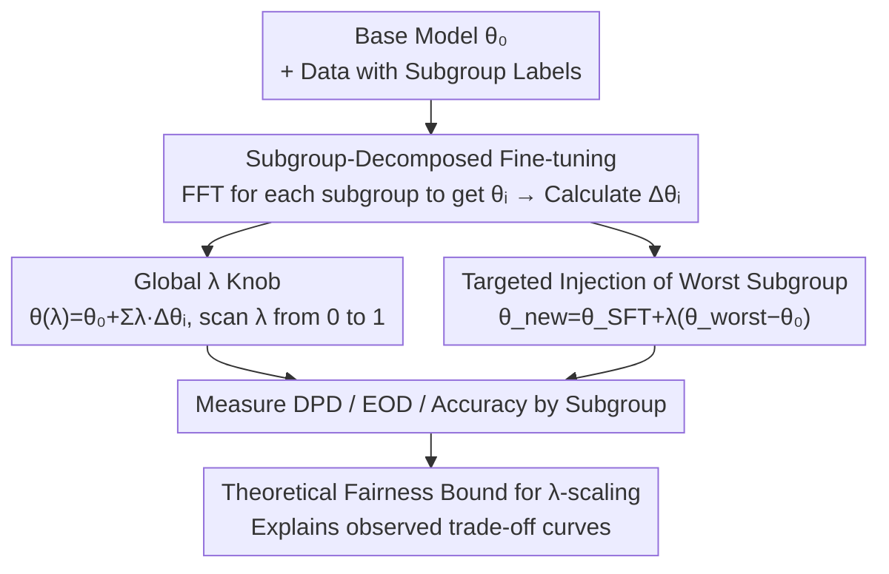

# On Fairness of Task Arithmetic: The Role of Task Vectors

**Conference**: ICLR 2026  
**OpenReview**: [https://openreview.net/forum?id=B19MBDrvlM](https://openreview.net/forum?id=B19MBDrvlM)  
**Code**: https://github.com/LauraGomezjurado/fairness_task_vector_deploy  
**Area**: Alignment & Fairness / Model Editing / Task Vectors  
**Keywords**: Task Arithmetic, Task Vectors, Group Fairness, Model Merging, Fairness-Accuracy Trade-off

## TL;DR
This is the first systematic work investigating the impact of task arithmetic on group fairness: the authors merge task vectors, obtained by fine-tuning on demographic subgroups, using a global scalar $\lambda$. They find that tuning a single $\lambda$ significantly reduces Demographic Parity Difference (DPD) and Equalized Odds Difference (EOD) while maintaining accuracy, providing a theoretical upper bound linking $\lambda$ scaling to fairness metrics.

## Background & Motivation
**Background**: The mainstream approach for adapting large models to specific tasks is Full Fine-Tuning (FFT) or Parameter-Efficient Fine-Tuning (PEFT, e.g., LoRA). Recently, a lighter route has emerged—**Task Arithmetic / Task Vectors**: defining the difference between fine-tuned and base weights as a task vector $\Delta\theta = \theta_{task} - \theta_{base}$, representing a direction in weight space toward "task proficiency." Model behavior can be edited post-hoc by adding, subtracting, or scaling these vectors without further training.

**Limitations of Prior Work**: While the computational efficiency and interpretability of task vectors are attractive, their impact on **fairness** is under-researched. In high-risk scenarios with naturally imbalanced data, such as hate speech detection or toxic comment filtering, PEFT can amplify existing biases. Furthermore, merging vectors from multiple subgroups involves **composing** behaviors, and fairness guarantees are typically **non-composable**—a model might be fair on each subgroup individually but fail when merged.

**Key Challenge**: Enhancing the performance of one demographic subgroup often unintentionally degrades another ("negative transfer"). Merging on highly imbalanced data systematically biases the model toward the majority. Consequently, there are unpredictable trade-offs between fairness and accuracy, as well as across different subgroups.

**Goal**: (1) Systematically quantify the impact of task arithmetic on DPD/EOD compared to FFT and LoRA. (2) Explore whether simple post-hoc operations, such as $\lambda$ scaling or injecting specific subgroup vectors, can "tune" fairness without retraining. (3) Provide a theoretical explanation for these empirical phenomena.

**Key Insight**: The authors move away from complex methods like Bayesian optimization or multi-objective searches for subgroup coefficients. Instead, they adopt a minimalist parameterization using a **single global scalar $\lambda$**. This is the standard "knob" exposed to users in task arithmetic tools, providing a 1D, interpretable control point to track the fairness-utility frontier.

**Core Idea**: Treat "subgroup-specific fine-tuning followed by task vector merging" as a fairness-aware model editing mechanism. A global $\lambda$ acts as a knob to slide along the fairness-accuracy frontier. It is proved that deviating from the "balance point" amplifies unfairness proportionally to the norm of the subgroup vectors.

## Method

### Overall Architecture
The paper investigates how task vector operations influence group fairness via a reproducible editing pipeline combined with two fairness control mechanisms. First, training data is **partitioned into subgroups based on sensitive attributes** (e.g., gender, race). FFT is performed on each subgroup to obtain $\theta_i$, and subgroup task vectors are calculated as $\Delta\theta_i = \theta_i - \theta_0$. These vectors are merged using a unified coefficient: $\theta(\lambda) = \theta_0 + \sum_i \lambda_i \Delta\theta_i$. Performance is then measured via accuracy, DPD, and EOD for each subgroup. Along this pipeline, two complementary "knobs" are provided: **Global $\lambda$ Scanning** (shared scalar for all subgroups) and **Targeted Injection** (adding vectors from the worst-performing subgroups to an FFT model). A theoretical upper bound connects the $\lambda$ deviation to the degradation in fairness metrics.

### Key Designs

**1. Subgroup-Decomposed Fine-tuning + Task Vector Merging: Explicitly encoding demographic structure into weight directions**
In this work, task arithmetic is repurposed to carry **demographic subgroup structures** rather than multi-task capabilities. The training set is split by sensitive attributes (e.g., Women, Men, Non-binary under gender). Each subgroup is fine-tuned individually to obtain $\theta_i$, from which the direction relative to the base model $\Delta\theta_i = \theta_i - \theta_0$ is derived. Merging follows the linear combination $\theta_{merged} = \theta_0 + \sum_{i=1}^{K} \lambda_i \Delta\theta_i$. Each $\Delta\theta_i$ represents an interpretable direction toward better performance for a specific subgroup, allowing model behavior to be decomposed at the subgroup level.

**2. Global Scalar λ: A 1D, interpretable fairness-accuracy knob**
To avoid the high cost and stochasticity of learning individual subgroup coefficients, the authors simplify merging by using a shared scalar: $\theta(\lambda) = \theta_0 + \lambda\,\Delta\theta$. This $\lambda$ acts as a uniform hyperparameter across all inputs and subgroups. Grid search is performed on a validation set for the joint objective of "accuracy + group fairness." Experiments reveal that $\lambda \approx 0.2$ maximizes accuracy but also DPD/EOD (most unfair), while for $\lambda \gtrsim 0.3$, accuracy remains comparable to FFT/LoRA but DPD and EOD decrease monotonically, often staying below FFT/LoRA baselines.

**3. Targeted Injection of Worst-performing Subgroups: Precise intervention with trade-offs**
A subgroup-level knob is also introduced. The "worst-performing" subgroup is identified based on the mean of DPD and EOD under FFT. That subgroup's specific vector is then injected into a pre-fine-tuned model: $\theta_{new} = \theta_{SFT} + \lambda(\theta_{worst} - \theta_0)$. Results show structural, subgroup-dependent shifts: injecting certain vectors (e.g., Men, Asian) pushes the model to a superior fairness-accuracy frontier, while others (e.g., Native American) worsen DPD/EOD even if accuracy is stable. This highlights that task vectors provide powerful but sensitive subgroup-specific controls.

**4. Theoretical Upper Bound for λ-scaling: Fundamental explanation of empirical curves**
To explain the observed curves, the authors derive an upper bound linking $\lambda$ scaling directly to fairness metrics. Let the subgroup coefficients be $\lambda = (\lambda_g)_{g=1}^{G}$, with a balanced reference point $\lambda_g = 1$ (where the merged model $\bar\theta = \theta_0 + \frac{1}{G}\sum_g \Delta\theta_g$ is assumed to satisfy $\mathrm{DPD}(\bar\theta)=0$). Under mild assumptions (Lipschitz prediction scores, subgroup calibration, and bounded class-conditional density near the threshold), the theorem states:

$$\mathrm{DPD}(\theta(\lambda)) \le U(\lambda) = 2L\sum_g \left|\lambda_g - 1\right|\,\|\Delta\theta_g\|_2,$$

$$\mathrm{EOD}(\theta(\lambda)) \le \mathrm{EOD}(\bar\theta) + 4\sqrt{(B_0 + B_1)\,U(\lambda)},$$

where $L$ is the Lipschitz constant, and $B_0, B_1$ are density constants. Both metrics share the $U(\lambda)$ term. As $\lambda_g \to 1$, $U(\lambda) \to 0$, driving DPD to 0 and EOD toward the balanced point. The intuition is that **deviating from the balance point scales unfairness proportionally to the subgroup task vector norm $\|\Delta\theta_g\|_2$**, explaining why subgroups with larger vector norms are more sensitive to $\lambda$ changes.

## Key Experimental Results

### Main Results
Evaluations cover NLP and CV domains across four architectures: Hate speech detection (LLaMA2-7B on Berkeley D-Lab), toxicity detection (DistilBERT and Qwen2.5-0.5B on Civil Comments), and age classification (ViT-Base/16 on UTKFace). LoRA rank is fixed at 8. Metrics include accuracy and macro-averaged/worst-group versions of DPD and EOD.

| Setting | Method | Accuracy | DPD (Lower is Fairer) | EOD (Lower is Fairer) |
|------|------|------|------|------|
| Gender (λ=0.8) | FFT / LoRA | High/Comparable | Baseline | Baseline |
| Gender (λ=0.8) | Task Addition | Comparable to FFT/LoRA | 5/7 better than FFT | Lower for most subgroups |
| Race (λ=0.5) | Task Addition | Comparable to FFT/LoRA | 3/8 better than FFT | No single winner |
| Civil Comments | Task Addition | Competitive with baselines | Overall Decrease | Overall Decrease |

**Core Conclusion**: There is no evidence that task addition systematically harms group fairness. Instead, in the $\lambda \gtrsim 0.3$ range, it suppresses DPD/EOD below FFT/LoRA baselines while maintaining accuracy.

### Ablation Study (λ Scanning & Targeted Injection)

| Configuration | Key Phenomena | Description |
|------|---------|------|
| $\lambda \approx 0.2$ | Peak Accuracy, Highest DPD/EOD | Furthest from balance point; least fair. |
| $\lambda \gtrsim 0.3$ | Competitive Accuracy, Decreasing DPD/EOD | Smooth fairness-utility frontier. |
| Inject Men / Asian | Movement to superior frontier | Subgroup vectors can improve fairness. |
| Inject Native Am. | Stable Acc, Worsened DPD/EOD | Negative transfer due to norm/direction. |
| Inject Women | Trans Women Acc ↑, Men Fairness ↓ | Subgroup dependency; requires caution. |

### Key Findings
- **Global Knob Effectiveness**: Tuning a single $\lambda$ allows smooth navigation of the fairness-accuracy frontier, with a "sweet spot" at $\lambda \gtrsim 0.3$.
- **Subgroup Dependency**: Impacts of injecting subgroup vectors vary; sensitivity correlates with vector norm $\|\Delta\theta_g\|_2$, as predicted by theory.
- **Cross-Domain Consistency**: Findings hold across 7B decoders, 0.5B encoders, and ViT models.

## Highlights & Insights
- **Repurposing Task Vectors**: Reinterpreting task arithmetic operations (addition/scaling) for **demographic subgroup regulation** creates a post-hoc fairness editor that is training-free and interpretable.
- **Closing the Theory-Empirical Loop**: The bound $U(\lambda) = 2L\sum_g|\lambda_g-1|\|\Delta\theta_g\|_2$ successfully predicts which subgroups are most sensitive to $\lambda$, elevating an engineering knob to a principled tool.
- **Minimalist Parameterization**: Intentionally using a single global scalar instead of learning many coefficients provides a 1D interpretable control point, a design choice applicable to other model merging scenarios.

## Limitations & Future Work
- **Binary Scope**: Evaluation is limited to binary classification (hate/toxic/age). While group structures are multi-class, common metrics like DPD/EOD for generative or multi-label tasks are less standardized.
- **Targeted Injection Risks**: Subgroup injection is a double-edged sword; some vectors degrade fairness for others. A mechanism to automatically identify "safe" vectors for injection is needed.
- **Theoretical Assumptions**: The bound assumes $\mathrm{DPD}=0$ at the balance point, which is an idealization that may not perfectly hold on real-world imbalanced data.
- **Global vs. Local $\lambda$**: A global $\lambda$ treats all subgroups equally; exploring per-subgroup optimization ($\lambda_g$) is a natural extension.

## Related Work & Insights
- **vs. FFT / LoRA**: These require retraining and do not naturally expose fairness knobs. Ours demonstrates that task arithmetic provides post-hoc control (global $\lambda$ + subgroup vectors) that often exceeds the fairness performance of standard fine-tuning.
- **vs. FairLoRA / Multi-objective PEFT**: These methods involve custom objectives during training. Ours follows a "post-hoc editing" route, recovering fairer behavior via simple arithmetic at a much lower cost.
- **vs. Negative Transfer in Merging**: This work goes beyond observing negative transfer by providing a quantitative explanation via $\|\Delta\theta_g\|_2$, transforming a merging problem into a controllable fairness knob.

## Rating
- Novelty: ⭐⭐⭐⭐ First systematic study of task arithmetic fairness with a theoretical bound.
- Experimental Thoroughness: ⭐⭐⭐⭐ High architecture and domain coverage, though limited to binary tasks.
- Writing Quality: ⭐⭐⭐⭐ Clear logic with a closed loop between theory and empirical data.
- Value: ⭐⭐⭐⭐ Provides a low-cost, interpretable fairness regulation method for model editing.

<!-- RELATED:START -->

## Related Papers

- [\[ACL 2025\] ZJUKLAB at SemEval-2025 Task 4: Unlearning via Model Merging](../../ACL2025/llm_safety/zjuklab_at_semeval-2025_task_4_unlearning_via_model_merging.md)
- [\[ACL 2026\] Modeling LLM Unlearning as an Asymmetric Two-Task Learning Problem](../../ACL2026/llm_safety/modeling_llm_unlearning_as_an_asymmetric_two-task_learning_problem.md)
- [\[ACL 2026\] SafeConstellations: Mitigating Over-Refusals in LLMs Through Task-Aware Representation Steering](../../ACL2026/llm_safety/safeconstellations_mitigating_over-refusals_in_llms_through_task-aware_represent.md)
- [\[ICLR 2026\] RepIt: Steering Language Models with Concept-Specific Refusal Vectors](repit_steering_language_models_with_concept-specific_refusal_vectors.md)
- [\[ACL 2025\] TIP of the Iceberg: Task-in-Prompt Adversarial Attacks on LLMs](../../ACL2025/llm_safety/tip_iceberg_adversarial_attacks.md)

<!-- RELATED:END -->
